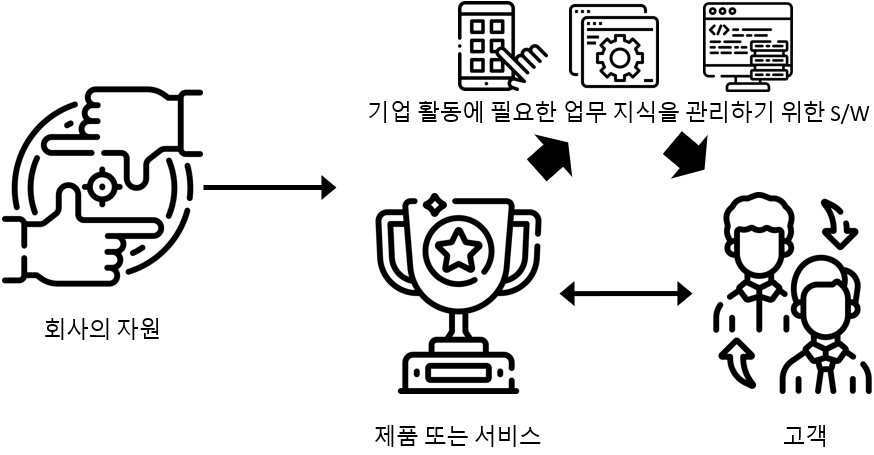

---
slug: HandStack을-사용-해야-하는-이유
title: HandStack을 사용 해야 하는 이유
authors: [handstack77]
tags: [handstack, why]
---

## HandStack 의 목표는 개발자가 좋아하고 기업이 신뢰하는 비즈니스 앱 개발 플랫폼을 구축하는 것입니다.

- 적은 인원으로 풀스택 개발부터 운영을 위한 DevOps를 지향합니다.
- 개인 PC부터 클라우드까지 Self-Hosting 이 가능해서 TCO 절감과 경제성이 좋습니다.
- 인프라부터 프레임워크, 앱까지 완전히 제어하며 비즈니스 데이터 소유권을 확보합니다.

## 비즈니스 앱은 무엇인가요?

이익을 얻거나 비용을 절감하는 기업 활동에 필요한 업무 지식을 관리하는 소프트웨어를 의미합니다.

디지털 전환 이슈가 확대되며 기업의 비즈니스 모델을 통합 관리를 하기 위해 전략, 프로세스, 시스템, 조직 문화에도 변화가 다가오고 있습니다. 개발 지식이 없더라도 업무 담당자가 앱을 개발 할 수 있는 솔루션이 2022년 SW산업 10대 이슈 전망에 포함 되었습니다.

이것은 프로그램, 앱 개발이 보편화되는 사회적인 효과와 SW 전공자 및 비전공자간의 전문성 격차가 줄어드는 계기로 작용 예상됩니다. 하지만 그 기능 기업에 고유 업무에 통합하기 위한 적합한 개발 및 운영 솔루션이 추가적으로 필요합니다.

문제는 시스템 구축에 필요한 기술과 지식이 너무 많아지고, 복잡하며, 이에 따라 설계/구현/운영에 필요한 비용이 증가하고 있어 대부분의 기업에서 고객 요청과 업무에 필요한 대응을 적절하게 못하고 있는 것이 현실입니다.

이제 기업 조직 내 비즈니스 모델에 대응하는 효과적인 개발 및 운영 역량을 내재화 하는 것이 기업 활동 경쟁력을 갖추기 위한 기준이 되고 있습니다. 

> HandStack은 디지털 전환의 핵심인 기업의 고유 개발 프로세스와 비용을 효과적으로 절감 할 수 있는 솔루션과 방안을 제공하는 것입니다.

## 개발 프로세스 개선 및 유지보수 비용 절감 방안

기업의 업무 프로젝트들은 논리적으로 보면 어플리케이션에서 이뤄지는 거래(요청/응답) 과정이 데이터베이스 CRUD(입력, 조회, 수정, 삭제)가 전체 거래의 90%를 차지하는 경우가 대부분이며, 다양한 고객 요구사항과 유지보수가 많은 소프트웨어 아키텍처의 비즈니스 로직이 거의 비슷하게 구성되면서 SQL에 매개변수를 전달하는 부분을 다르게 처리하는 걸 반복적으로 개발됩니다.

HandStack은 업계 표준 기술을 기반으로 기업의 비즈니스 앱 개발 및 운영 환경을 단순화, 표준화 하여 최소한의 학습비용으로 업무분석가, 개발자, 운영자 3명으로 지속가능한 서비스를 할 수 있도록 다음과 같은 주요 솔루션을 제공합니다.

### 개발 및 배포 프로세스 개선

|AS-IS|TO-BE|
|---|---|
|화면 개발|화면 개발|
|업무 개발 (인터페이스, 데이터 변환)|쿼리 개발|
|쿼리 개발|언제든 즉시 배포|
|컴파일 & 빌드|업무 담당자 즉시 확인|
|사용자가 적은 시간대 정기 배포||
|프로그램 다운 타임후 서비스 실행||
|배포 다음날 업무 담당자 확인||

### 비즈니스 로직 추가 및 변경
* 계약 중심 설정 및 개발
* 데이터베이스 CRUD 요청에 대한 SQL을 작성하면 API 서비스로 제공
* Serverless Function(Node.js, C#)을 작성하여 API 서비스로 제공
* Forbes 확장 모듈로 기능 제공
* 빠른 장애 원인 확인 

HandStack은 기업의 비즈니스 모델을 통합 하기 위해 검증된 개발 프로세스, 도구, 문서, 교육을 단순화하여 초급 개발자가 1주 안에 기업의 앱의 기본적인 유지 보수 개발 및 운영을 시작 할 수 있도록 설계, 개발, 테스트, 배포, 운영 업무가 가능한 단일 솔루션을 상업적으로 사용 가능한 제한이 없는 오픈 소스로 공개함으로서 기업의 비즈니스 서비스와 제품에 필요한 앱을 만들기 위한 IT 도입 비용을 낮출 수 있다고 생각합니다.

HandStack에 대한 자세한 내용은 아래의 프레젠테이션 슬라이드를 통해 확인하실 수 있습니다.

<iframe src="/slides/000 HandStack 소개 자료.html" width="100%" height="414" style={{ border: '1px solid #ccc', borderRadius: '8px' }} title="HandStack 소개 슬라이드" allow="fullscreen">
  죄송합니다. 이 브라우저는 iframe을 지원하지 않습니다.
  <a href="/slides/000 HandStack 소개 자료.html" target="_blank" rel="noopener noreferrer">
    여기에서 슬라이드를 직접 확인하세요.
  </a>
</iframe>