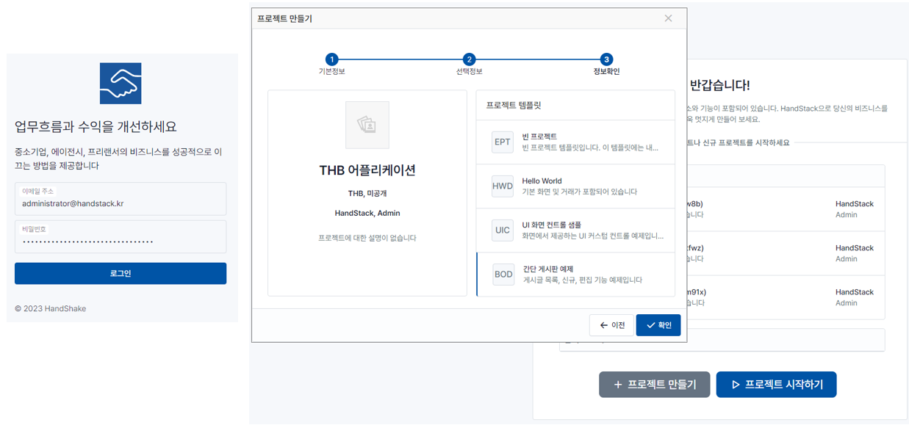
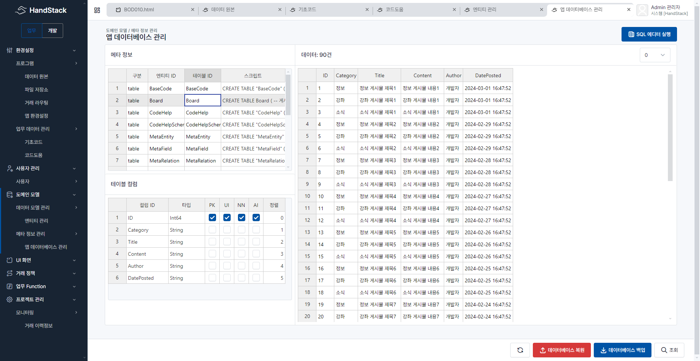
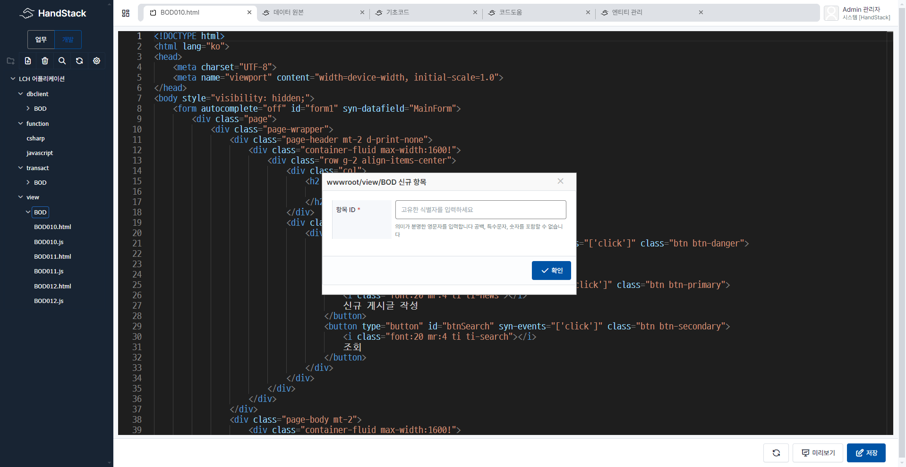
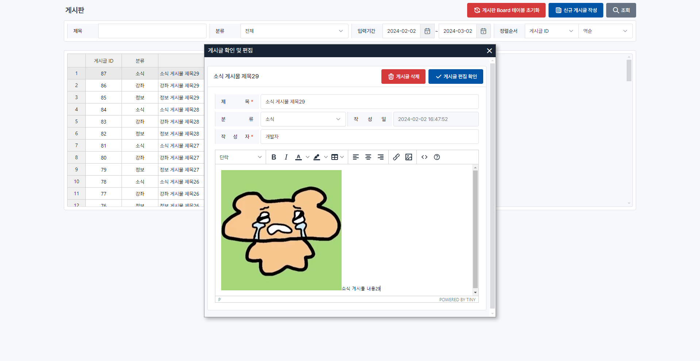

HandStack 에서 태넌트 앱을 개발 및 운영하기 위해 checkup 모듈을 개발중입니다. 태넌트 앱은 기업의 비즈니스 앱을 구축하기 위해 고객과 개발자가 원하는 것을 충족시킬 수 있는 방법입니다.

왜냐하면 기업에서 자사 비즈니스 앱을 구축하기 위해 일반적으로 다음과 같은 과정을 진행합니다.

프로젝트 계획 및 목표 설정 > 팀 구성 > 요구사항 분석 및 설계 > 개발 > 테스트 및 배포 > 운영 및 유지보수

그외에도 보안 및 규정 준수나 비즈니스 지원 등의 단계는 개발 단계 이후에도 계속됩니다. 이러한 과정을 거쳐 웹 서비스를 개발하고 운영하는 것은 다양한 기술과 지식이 필요합니다.

다행히도, 클라우드 컴퓨팅과 소프트웨어 개발 기술의 발전으로, 이러한 과정을 보다 쉽게 진행할 수 있는 방법이 많이 개발되었습니다. 그러나, 여전히 개발자와 고객 모두에게 다음과 같은 핵심 문제가 존재합니다.

* 현실적인 문제 == 비용
* 고객이 원하는 것은 무엇인가?
* 개발자가 원하는 것은 무엇인가?

## 태넌트 앱으로 대안을	찾았습니다

클라우드 컴퓨팅 및 소프트웨어 개발에서 주로 사용되는 "태넌트"라는 용어가 있습니다.

"테넌트(Tenant)"는 일반적으로 독립적인 사용자 그룹 또는 조직을 나타냅니다. 프로그램 관점에서는 동일한 애플리케이션, 하드웨어, 또는 데이터베이스를 공유하지만, 고유한 업무 기능과 데이터는 서로 격리되어 있습니다.

예를 들어, 클라우드 기반 서비스에서는 여러 테넌트가 동일한 서비스를 사용할 수 있지만, 각 테넌트의 데이터는 서로 독립적입니다. 이는 각 테넌트가 자신의 데이터를 안전하게 보호하면서도, 동일한 리소스를 공유함으로써 관리 비용 효율성과 유연성을 높일 수 있게 합니다.

태넌트라는 용어는 인증, 데이터베이스, 보안, 사용자 인터페이스, 비즈니스 로직, 사용자 지원 등과 같은 여러 측면에서 적용될 수 있습니다. 이러한 면에서 태넌트는 독립적인 사용자 그룹 또는 조직을 나타내는 것으로 이해할 수 있습니다.

> 이러한 태넌트 개념을 기반으로, 별도의 가상화 기술을 사용하지 않고도 여러 사용자 그룹이 동일한 애플리케이션을 공유하면서, 각 사용자 그룹의 고유한 업무 기능과 데이터를 격리하여 사용할 수 있는 애플리케이션을 "태넌트 앱(Tenant App)"이라고 부릅니다.

## 비용을 절감하고 효율성을 높이는 방법

태넌트 앱은 다음과 같은 디렉토리로 소스를 관리합니다.

```bash
tenent-app
├─.managed
│  ├─sqlite
│  └─storage
├─dbclient
│  └─PJT
├─function
│  ├─csharp
│  └─javascript
├─transact
│  └─PJT
└─wwwroot
    ├─assets
    └─view
        └─PJT
```

이번에 배포한 handstack 1.0.0.beta2 에는 태넌트 앱을 개발하기 위한 기초 코드와 화면을 추가하였습니다. 실행 방법과 이번에 개발된 주요 정보들은 차주에 문서로 정리하여 공개 하겠습니다.

### 스크린 샷


그림) 사용자 로그인 및 프로젝트 선택 화면


그림) 프로젝트 정보 관리 화면


그림) 프로젝트 소스 관리 화면


그림) 프로젝트 미리보기 화면

## 한 주간의 여정 (2024-02-26 ~ 2024-03-01)

* handstack 1.0.0.beta2 출시
* dbclient 태넌트 쿼리 요청 처리 기능 개선
* 태넌트 앱용 기초코드, 코드도움 화면 개발
* 파일 추가시 코드도움 데이터 정보 조회 개선
* $grid checkEmptyValueCol 함수 버그 수정
* repository MediatR Event 요청 처리 기능 개발
* repository 태넌트 앱 파일 저장 기능 개선
* transact MediatR Event 요청 처리 기능 개발
* transact BearerToken 정보 무결성 확인 개선
* 데이터 모델 관리 화면 버그 수정
* board, empty, helloworld, uicontrols forbes 추가 및 개선
* 태넌트 앱 추가시 메타 데이터 복사 기능 개선
* 태넌트 앱 인증 기능 개선
* wwwroot 모듈에 ID, GUID, ClientIP, SHA256Hash 조회 api 추가
* transact 모듈 Route 환경 변수 로드 기능 개선
* meta.xml 생성 API 추가
* handstack CLI 기본값 적용 기능 개선
* 태넌트 앱 기본 테이블 생성 추가
* checkup 모듈 로그인 기능 개발
* HandStack publish 기능 개선
* 태넌트 앱별 거래 로그 관리 기능 개선
* 태넌트 앱 삭제 기능 추가
* 서버 함수 처리 중 HttpContext 접근 버그 수정
* 태넌트 앱 추가시 메타 정보 복사 기능 개선
* checkup 모듈 개발
* checkup 업무 데이터베이스 ERD 초안 설계
* 운영체제에 따라 배치 스크립트 파일 경로 치환 개선
* ubuntu-22.04 설치 참조 스크립트
* handsup 운영 서버 테스트
* handstack CLI 프로그램 개선
* 프록시 서버 Forwarded Headers 개선
* apiService load 기능 개선
* 서버 배포 bundling CLI 프로그램 view 화면 압축 자동화 적용
* handsup 운영 서버 테스트

https://github.com/handstack77/handstack