최근 프롬프트 엔지니어링에 대한 관심이 생겨 마이크로소프트의 Semantic Kernel(시맨틱 커널)을 사용해서 HandStack 프로그램에서 생산성에 도움이 될 만한 다양한 문법을 테스트 해보고 있었습니다.

이를 통해 HandStack 프로그램에 적용할 수 있는 방법을 고민해보았고, 이에 대한 경험을 공유하는 게 의미가 있을 것 같아 이 글을 작성하게 되었습니다. 시맨틱 커널로 닷넷 기반 프로그램에 프롬프트 엔지니어링을 도입하는 방법을 고민하시는 분들에게 도움이 되었으면 합니다.

시맨틱 커널은 LLM 기반의 생성형 AI 기능을 프로그램에 적용하기 위한 C#, Java, Python 언어를 지원하는 프레임워크로, 특정 업무에 대한 프롬프트를 사전에 템플릿화 하여 실행하는 데 사용됩니다. 이를 통해 사용자의 요청에 대한 응답을 생성하거나, 또 다른 프롬프트를 실행하는 데 사용됩니다. 아마 Python, Typescript 등의 언어로 개발된 프로그램에서는 LangChain(랭체인)을 많이 사용하실 거라 생각합니다. 간단하게 시맨틱 커널은 C#, 랭체인은 Python 기반의 프로그램에 사용되는 프롬프트 엔지니어링 프레임워크입니다.

C# 기반의 프로그램에서 시맨틱 커널을 사용하는 방법에 대한 정보는 랭체인에 비해 상대적으로 부족한 편입니다. LLM 분야가 워낙 빠르게 발전하고 있는데다, 시맨틱 커널의 릴리즈가 거의 1주일에 한 번씩 이루어지다보니 구글 검색이나 ChatGPT 에 물어보는 정보는 대부분 호환성이 없는 불 필요한 정보들 뿐입니다.

이해가 되는 부분인 것이 LLM 분야는 춘추삼국시대와 같이 오픈 AI GPT, 메타 라마, 구글 제미나이를 중심으로 혼란스러운 시기에 있으면서 학술적으로도 많은 연구가 이루어지고 있습니다. 핵심 기능 자체가 외부 종속성을 기본적으로 가지고 있는 특징을 가지다보니 시맨틱 커널을 사용하는 방법에 대한 최신 정보가 부족한 것이 당연한 것이라 생각합니다.

> LLM 분야는 미국에서 정부, 민간 차원에서 하드웨어, 소프트웨어, 학술적으로 주도하고 있기 때문에, 한국에서는 이에 대응하여 더 많은 정보를 얻을 수 있는 특화된 분야의 연구가 이루어지고 있습니다.

## 시맨틱 커널 시작하기

시맨틱 커널을 사용하기 위해서는 먼저 [공식 문서](https://learn.microsoft.com/en-us/semantic-kernel/overview/?tabs=Csharp)를 참고하는 것이 가장 좋습니다.

LLM 분야가 빠르게 발전하는 중이어서 영어로만 공식 문서를 제공하고 있으니, 문서를 읽는 것이 부담스러우시다면, [DeepL](https://www.deepl.com/ko/app)를 설치하여 번역을 참고하시면 됩니다.

공식 문서의 내용은 큰 그림이나 개념을 설명하는 데 중점을 두고 있어, C# 개발 언어에 익숙하지 않더라도 LLM 기능을 프로그램에 적용하기 위한 개념을 학습하는데 도움이 됩니다. (랭체인의 문서를 보는데도 도움이 됩니다.)

하지만 실제로 프로그램에 적용하기 위해서는 공식 문서보다도 Github의 예제 코드를 직접 참고하는 것이 더 도움이 됩니다.

시맨틱 커널의 C# 소스 코드는 거의 매일 업데이트 되고 있으며, 이에 대한 예제 또한 같이 업데이트가 되고 있어서 로컬에 git clone을 통해 소스 코드를 다운로드 받아서 사용하는 것이 좋습니다.

```bash
# git clone을 통해 소스 코드를 다운로드 받을 수 있습니다.
git clone microsoft/semantic-kernel

# git pull을 통해 최신 소스 코드를 받아올 수 있습니다.
git pull

# samples 해당 디렉토리로 이동하여 예제 코드를 확인할 수 있습니다.
cd \microsoft.semantic-kernel\dotnet\samples
```

개인적으로 Visual Studio 2022 통합 개발 도구를 설치해서 SK-dotnet.sln 실행하여 소스 코드를 확인하고, 예제를 확인 하는 것이 가장 편리하다고 생각합니다. 그 이유는 다음과 같습니다.

- 주요 기능에 대한 단위 테스트가 포함되어 있어서, 소스 코드를 수정하거나, 새로운 기능을 추가할 때 테스트를 통해 검증할 수 있습니다.
- 공식 문서에는 언급되지 않는 추가적인 내용이 많아서, 소스 코드를 확인하는 것이 더 도움이 됩니다.
- 공식적으로 Open AI, Azure Open AI를 지원하지만 내부적으로 Google, HuggingFace, MistralAI, Onnx 등의 다양한 API를 사용 할 수 있도록 개발되고 있는 것을 알 수 있습니다.
- 빠르게 변경되는 소스 코드에 대한 안정적인/실험적인 기능을 확인 할 수 있습니다. 실험적인 기능들은 다음 버전에 사라질 수 있으니 사용에 주의해야 합니다.

> 시맨틱 커널에 대한 문서는 많이 부족하지만, 소스 코드를 통해 확인하면서 이해하는 것이 가장 빠르게 프로그램에 적용하는 방법이라고 마이크로소프트 시맨틱 커널 개발팀이 말하고 있는듯 합니다.

## 프롬프트 엔지니어링

시맨틱 커널을 학습 하기 전에는 개인적으로 프롬프트를 작성하여 Copilot 이나 ChatGPT 에게 어떻게 하면 효과적인 질문을 할 수 있을지 고민하고 있었습니다.

그러나 개인(사람)이 아닌 프로그램에서 프롬프트를 작성하고, 더 효과적인 질문을 할 수 있게 하는것은 개인보다 더 상호 보완적인 관계를 가지고 있습니다.

프롬프트 엔지니어링은 사용자의 요청에 대한 응답을 생성하는 데 사용되는 기술로, 크게 다음과 같이 분류할 수 있습니다.

- 사전 정의 프롬프트 템플릿
- RAG (Retrieval Augmented Generation) 기반 프롬프트
- Memory (Storage & Indexing) 기반 프롬프트

시맨틱 커널을 학습 하면서 느낀것은 RAG와 Memory는 의도적으로 안정화 되기 전까지 도입하기 힘들겠다는 것이었습니다. 그 이유는 RAG와 Memory는 LLM AI와 VectorDB 핵심 기능에서 주요 변경 사항이 있거나 새로운 기능을 추가할 때 시맨틱 커널에서 영향을 받을 경우 변경 가능성이 높은 기능들이기 때문입니다.

RAG를 지원하기 위해서는 적어도 로컬 또는 원격에서 오피스 문서, PDF 와 같은 파일들을 읽어와 임베딩을 생성하는 기능이 필요하고, Memory를 지원하기 위해서는 VectorDB 기반의 임베딩된 데이터를 인덱싱, 검색 기능이 필요합니다. 이러한 기능들은 시맨틱 커널에서 지원하는 기능이 아니라 별도의 라이브러리를 사용해야 하기 때문에 시맨틱 커널을 사용할 때 당분간은 프롬프트 템플릿을 활용하는 방법에 집중하는 것이 좋다고 생각합니다.

> 시맨틱 커널 소스에 RAG, Memory 기능을 사용하는 예제 코드가 있지만, 아직 실험적인 기능이 많기 때문에 안정화 되기 전까지는 사용에 주의해야 합니다.

### 사전 정의 프롬프트 템플릿

사전 정의 프롬프트 템플릿은 미리 정의한 문장에 사용자의 요청을 더해 응답을 생성하는 데 사용되는 기법으로, 특화된 업무에 따라 사용자의 요청에 대한 응답을 생성하는 데 사용됩니다.

예를 들면 "건강을 위해 칼로리 맞춤 요리 추천"을 위해 다음과 같은 프롬프트 템플릿을 사용할 수 있습니다.

```plaintext
너는 맛있는 음식을 쉽게 만들어 먹을 수 있는 레시피를 개발하는 요리 연구가야.
나는 1,800 칼로리 수준에서 맛있는 음식을 만들어 먹고 싶어.
매일 만들어 먹을 수 있는 5가지 초보 요리사를 위한 요리 레시피를 참고해서 제안해줘.

${UserMessage}
```

여기 ${UserMessage} 부분에 사용자의 질문을 더해 응답을 생성하는 데 사용됩니다. 예를 들어 사용자가 이렇게 질문을 요청합니다.

- 나는 30대 남자이고 조금 살쪘어 어떤 요리가 좋을까?
- 다이어트를 하는중인데, 여성을 위한 칼로리가 적은 음식을 추천해줘

어떠한 질문이든 사용자의 질문을 기반으로 맛있고 건강한 성인 남자 기준 하루 권장량인 1,800 칼로리 이내의 요리 레시피를 제안해 줍니다.

프롬프트 텍스트를 작성하는 기법은 다양하게 있습니다만 기본적으로 원칙을 준수하는 게 필요합니다. LLM 을 데이터베이스라고 생각하고 프롬프트 기법을 SQL 문법이라고 생각하는게 좋습니다.

> 구체적 지시 > 명확한 단어 > 맥락을 제공 > 응답 구조를 정의 > 일관성 유지

예시로 제공된 "건강을 위해 칼로리 맞춤 요리 추천" 텍스트는 제로샷(Zero Shot) 기법이고, 개인적으로 선호하는 방법은 다음과 같습니다.

- Few Shot: 기본적이고 핵심적인 내용에 대한 예시를 제공하는 방법
- 역할 지정: AI 모델에 특정한 역할을 부여하는 방법
- 마크다운 활용: 텍스트를 구조화하여 질문을 생성하는 방법
- 단락 구분 기법: 요청, 제약, 입력, 출력 등등 단락을 구분하여 질문을 생성하는 방법
- 변수 활용: 프롬프트를 변수를 활용하여 동적으로 질문을 생성하는 방법
- Q&A 기법: AI 모델이 질문에 대한 답변을 유도하여 생성하는 방법
- 응답 형식 지정: 자연어 응답이 아닌 Json, Xml, Csv, Markdown 등등 특정 형식으로 템플릿 기반 응답을 생성하는 방법

구글 검색으로 각각의 키워드에 대해 알아보시면 다양한 정보를 확인할 수 있을겁니다. 다만 프롬프트에 대한 기법은 정답이 없습니다. 동일한 질문에 대해 GPT-3, GPT-4 모델과 매개변수 (TopP, Temperature, PresencePenalty, FrequencyPenalty) 설정에 따라 다른 결과를 생성할 수 있습니다. 이에 대한 것은 본인의 경험을 통해 효과적인 프롬프트를 작성하는 방법을 찾아보시길 권장합니다.

프롬프트 템플릿은 영어로 작성하는 게 더 좋은 결과를 만들어냅니다. 그 이유는 영어의 기본 흐름인 대화의 5형식을 기반으로 학습 데이터들이 제공되었기도 하지만 한국어만의 맛깔스러운(?) 뉘앙스를 영어로 번역하는 데 한계가 있어 다양한 질문을 번역되는 와중에 요청 의도와는 다른 응답을 생성하는 데 사용될 수 있기 때문입니다.

> 프롬프트 템플릿은 영어로 작성하고 질의는 한국어로 해도 어느정도 만족스러운 결과를 만들어냅니다. 그러나 한국어로 작성한 프롬프트 템플릿은 한국어로 질의하는 경우에만 사용하는 것이 좋습니다.

### 예제로 만든 프롬프트 템플릿

HandStack 프로그램에서 생산성에 도움이 될 만한 예제로 만든 프롬프트 템플릿은 **gpt-3.5-turbo** 를 기반으로 작성되었습니다. 프롬프트 템플릿 작성 참고용으로 봐주시면 좋을듯합니다. 여기에 있는 템플릿은 단일 대화 기능입니다.

- [CLS010: 문장 대화의 의도를 파악](https://github.com/handstack77/handstack/blob/master/2.Modules/prompter/Contracts/prompter/HDS/LLM/CLS010.xml)
- [CLS020: IT 시스템 장애 등급 수준을 파악](https://github.com/handstack77/handstack/blob/master/2.Modules/prompter/Contracts/prompter/HDS/LLM/CLS020.xml)
- [GRD010: 지정된 주제와 관련된 엔티티를 추출](https://github.com/handstack77/handstack/blob/master/2.Modules/prompter/Contracts/prompter/HDS/LLM/GRD010.xml)
- [GEN010: 제로샷 프롬프트 확인](https://github.com/handstack77/handstack/blob/master/2.Modules/prompter/Contracts/prompter/HDS/LLM/GEN010.xml)
- [GEN020: 국가 언어 번역기](https://github.com/handstack77/handstack/blob/master/2.Modules/prompter/Contracts/prompter/HDS/LLM/GEN020.xml)
- [GEN030: 회의 전 스몰 토크 주제 생성](https://github.com/handstack77/handstack/blob/master/2.Modules/prompter/Contracts/prompter/HDS/LLM/GEN030.xml)
- [COD010: 소스 코드 버그 수정 및 개선](https://github.com/handstack77/handstack/blob/master/2.Modules/prompter/Contracts/prompter/HDS/LLM/COD010.xml)
- [COD020: 소스 코드 주석 추가](https://github.com/handstack77/handstack/blob/master/2.Modules/prompter/Contracts/prompter/HDS/LLM/COD020.xml)
- [COD030: 데이터베이스 SQL 생성](https://github.com/handstack77/handstack/blob/master/2.Modules/prompter/Contracts/prompter/HDS/LLM/COD030.xml)
- [SMZ010: 회의록 요약 정리](https://github.com/handstack77/handstack/blob/master/2.Modules/prompter/Contracts/prompter/HDS/LLM/SMZ010.xml)
- [WTR010: 당신의 명언 또는 인용구](https://github.com/handstack77/handstack/blob/master/2.Modules/prompter/Contracts/prompter/HDS/LLM/WTR010.xml)
- [WTR020: 프롬프트 엔지니어링을 위한 한국어 문장 영어 번역](https://github.com/handstack77/handstack/blob/master/2.Modules/prompter/Contracts/prompter/HDS/LLM/WTR020.xml)

> 프롬프트 엔지니어링에서 좀 더 실용적인 기능을 구현하기 위해서는 프롬프트를 실행하기 전에 도메인 데이터를 활용하여 동적으로 Few Shot을 구성하는 것과 이전 대화의 이력을 유지하는 것이 중요합니다. 이에 대한 예제는 다음에 작성하도록 하겠습니다.

## prompter 모듈 시작하기

### appsettings.json LoadModules 설정에 prompter 추가

dbclient, function 과 같이 이번에 추가된 prompter 모듈은 시맨틱 커널 기반으로 Open AI와 같은 LLM AI 연동 기능을 위해 프롬프트 템플릿 문법을 그대로 사용할 수 있도록 설계되었습니다. 이를 통해 다음과 같은 장점을 가집니다.

* 클라이언트 요청에 전달되는 값은 프롬프트 템플릿내의 값 치환과 매개 변수로 매핑 둘다 가능합니다. 
* Open AI, Azure Open AI 등등 서비스를 지원합니다.
* FewShow, History 기능을 지원합니다.
* 프롬프트 템플릿을 동적으로 구성 가능하도록 설계되었습니다.

prompter 모듈을 활성화하기 위해 ack 서버 프로그램이 있는 디렉토리에 있는 appsettings.json 파일을 열고 LoadModules 설정에 prompter 추가합니다.

```json
{
    "AppSettings": {
        ......
        "LoadModules": [
            "wwwroot",
            "transact",
            "dbclient",
            "function",
            "repository",
            "logger",
            "checkup",
            "prompter" <-- ack 서버 프로그램 실행시 로드할 모듈 추가
        ],
        ......
    }
}
```

### prompter module.json LLMSource 설정에 OpenAI ApiKey 추가

prompter 모듈내 Open AI을 API를 사용하기 위해 modules/prompter 디렉토리에 있는 module.json 파일을 열고 LoadModules 설정에 prompter 추가합니다.

```json
{
    "ModuleConfig": {
        ......
        "LLMSource": [
            {
                "ApplicationID": "HDS",
                "ProjectID": "*",
                "DataSourceID": "LLM1",
                "LLMProvider": "OpenAI",
                "ApiKey": "[sk-proj-API...키]", <-- Open AI에서 발급한 API Key 추가
                "ModelID": "gpt-3.5-turbo",
                "IsEncryption": "N",
                "Comment": "OpenAI 프롬프트 API"
            }
        ]
        ......
    }
}
```

업무 프로그램에 필요한 프롬프트 템플릿에 대한 분류는 다음과 같이 정리했습니다.

- **Classification (CLS)**: 사용자의 의도를 분류하고 파악하는 역할을 합니다. 질문이나 요청을 적절한 카테고리로 분류하여 적절한 응답을 생성하는 데 도움을 줍니다.
- **Grounding (GRD)**: 질문의 맥락을 이해하고, 그에 따라 엔터티를 추론하는 역할을 합니다. 이를 통해 대화가 자연스럽고 일관성 있게 이어질 수 있습니다.
- **Generater (GEN)**: 새로운 계획, 아이디어, 변환 등을 생성하는 역할을 합니다. 사용자의 요청에 따라 창의적인 아이디어를 제시하거나, 특정 문제에 대한 해결책을 제안하는 데 사용됩니다.
- **Coding (COD)**: 개발 관련 질문에 대한 예제나 소스 코드를 생성하는 역할을 합니다. 사용자가 요청하는 코드를 작성하거나, 특정 코드에 대한 품질을 올리는 데 사용됩니다.
- **Summarize (SMZ)**: 회의록, 요약, 대화 주제 등을 생성하는 역할을 합니다. 긴 대화나 문서를 요약하여 핵심 내용을 간략하게 전달하는 데 사용됩니다.
- **Writer (WTR)**: 보고서, 문서 등을 생성하는 역할을 합니다. 사용자의 요청에 따라 특정 주제에 대한 보고서나 문서를 작성하는 데 사용됩니다.

프롬프트 템플릿은 서로 다른 역할을 가지고 있지만, 함께 작동하여 사용자의 다양한 요청에 대응하고, 효과적인 대화를 위해 필요한 기능들을 제공합니다.

## prompter 모듈 데모

prompter에 등록된 XXXXXX.xml 파일은 화면 및 모듈에서 사용됩니다. 다음은 화면에서 prompter 모듈을 사용하는 데모입니다. 화면 소스는 다음과 같습니다.

- [LLM010.html](https://github.com/handstack77/handstack/blob/master/2.Modules/prompter/wwwroot/prompter/view/LLM/LLM010.html)
- [LLM010.js](https://github.com/handstack77/handstack/blob/master/2.Modules/prompter/wwwroot/prompter/view/LLM/LLM010.js)

### CLS010: 문장 대화의 의도를 파악
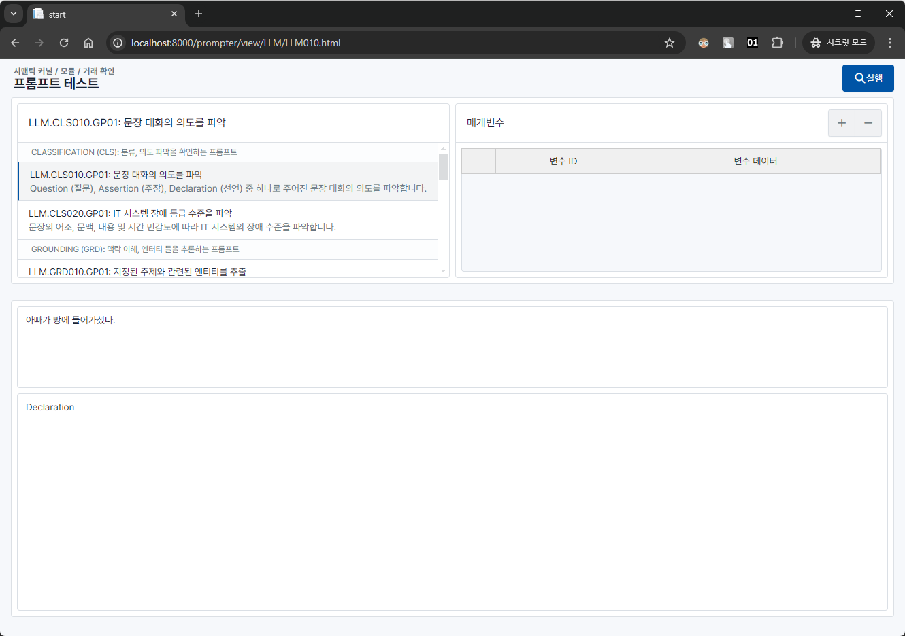

### CLS020: IT 시스템 장애 등급 수준을 파악
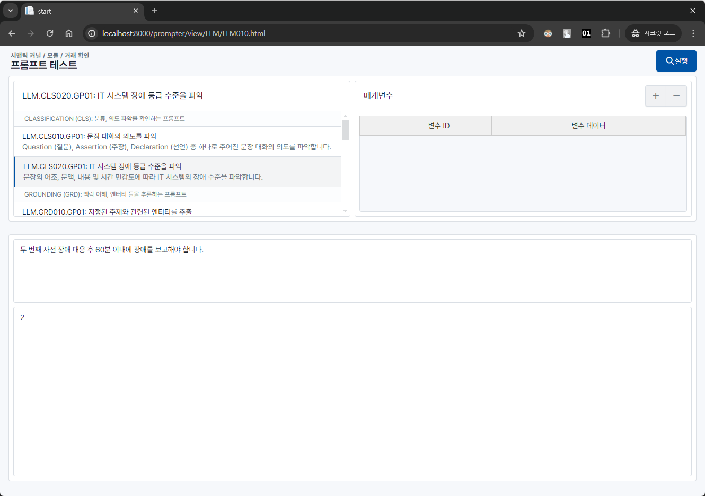

### GRD010: 지정된 주제와 관련된 엔티티를 추출
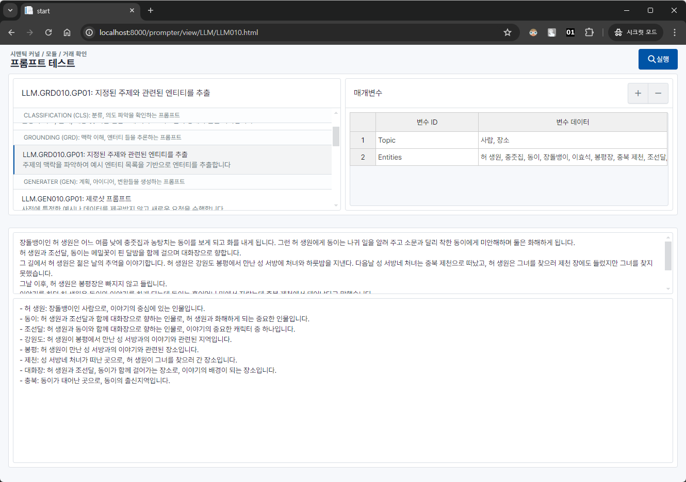

### GEN010: 제로샷 프롬프트 확인
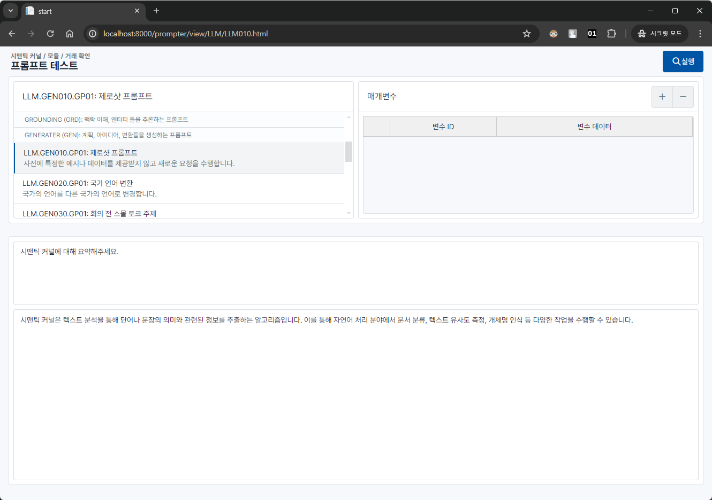

### GEN020: 국가 언어 번역기
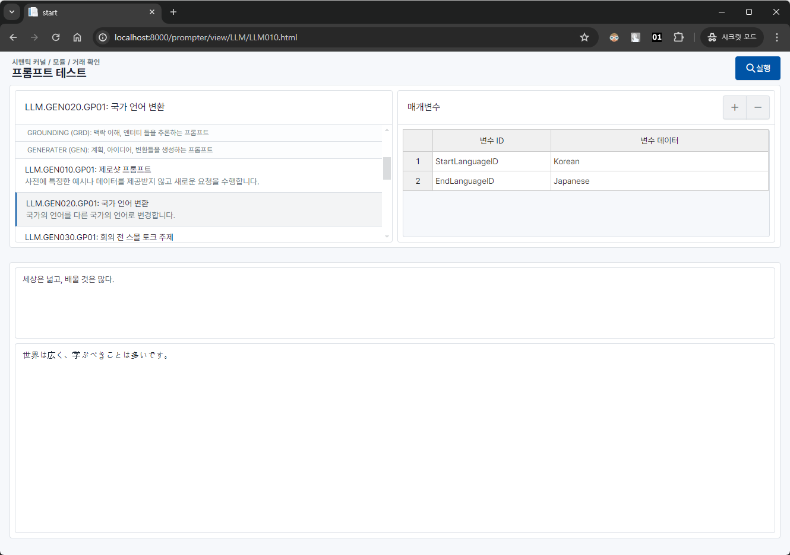

### GEN030: 회의 전 스몰 토크 주제 생성
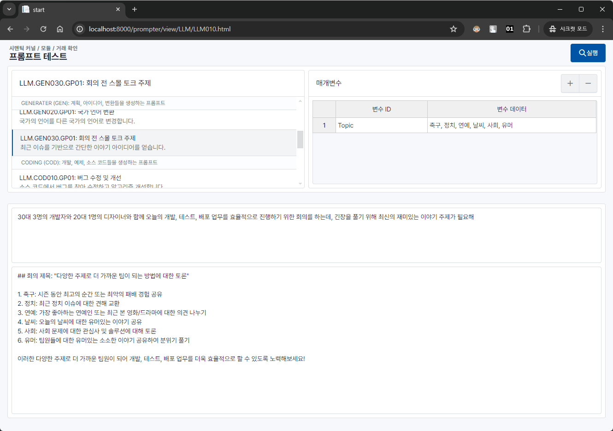

### COD010: 소스 코드 버그 수정 및 개선
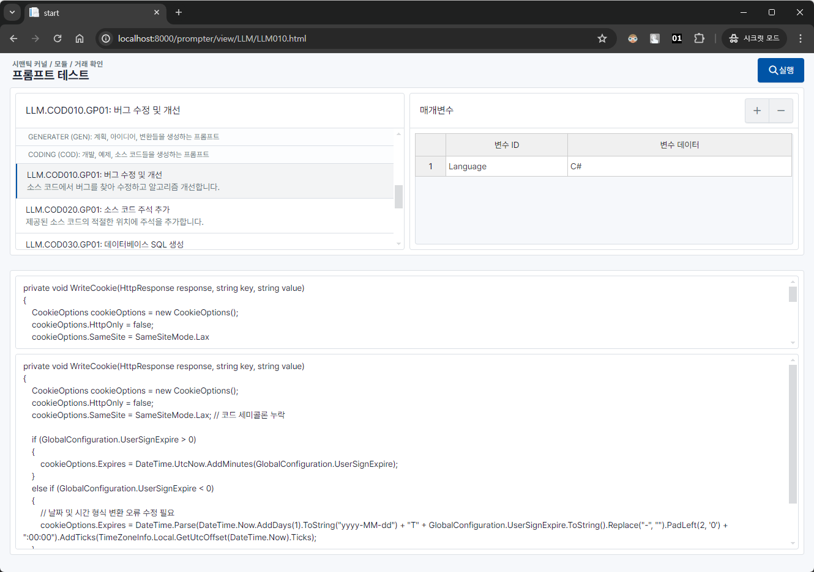

### COD020: 소스 코드 주석 추가
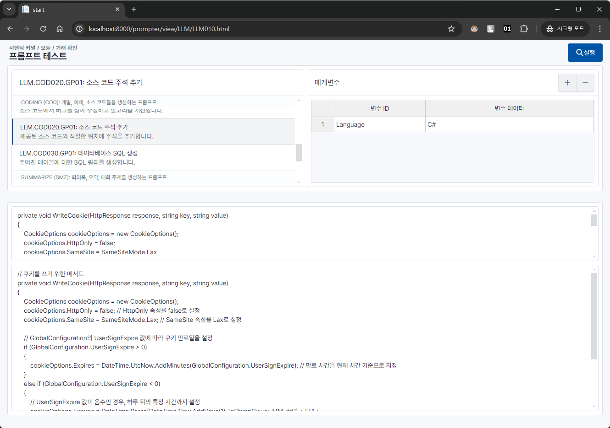

### COD030: 데이터베이스 SQL 생성
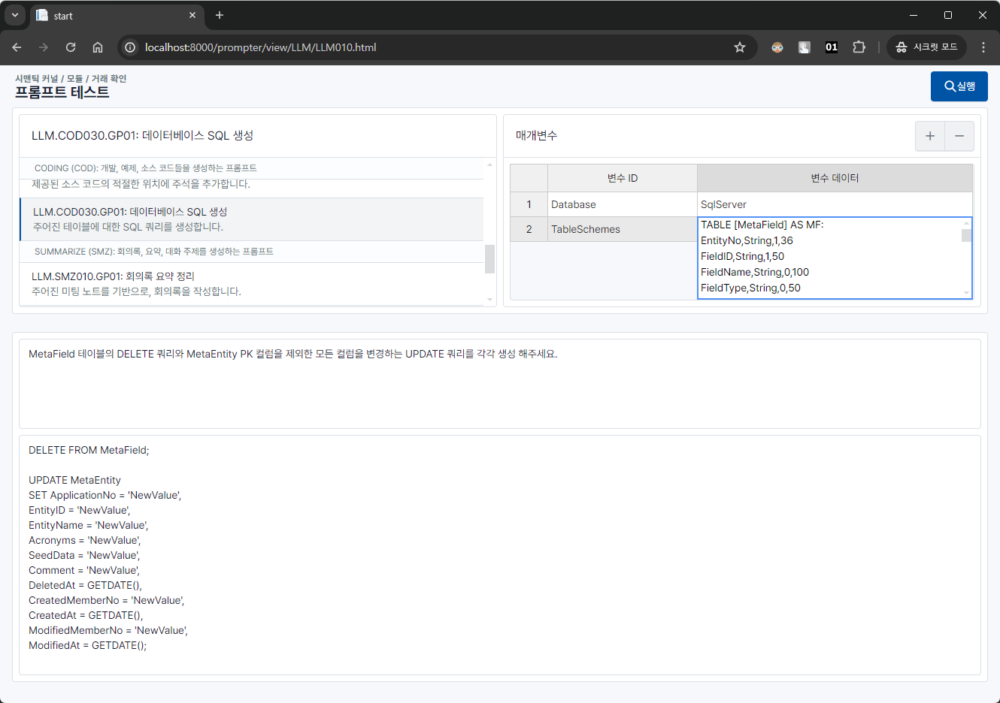

### SMZ010: 회의록 요약 정리
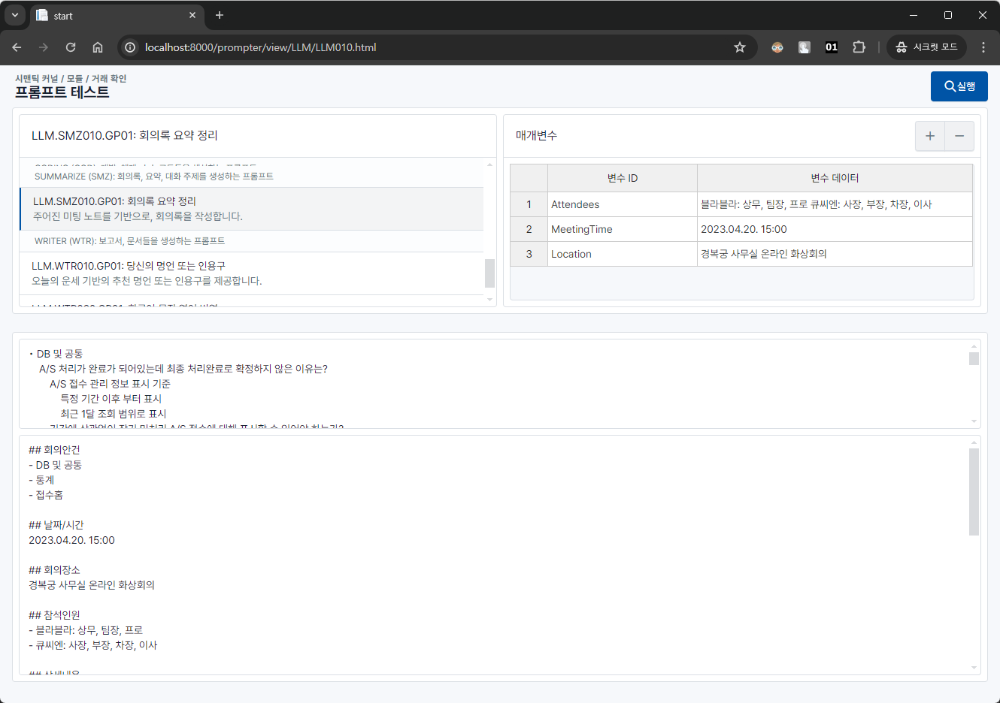

### WTR010: 당신의 명언 또는 인용구
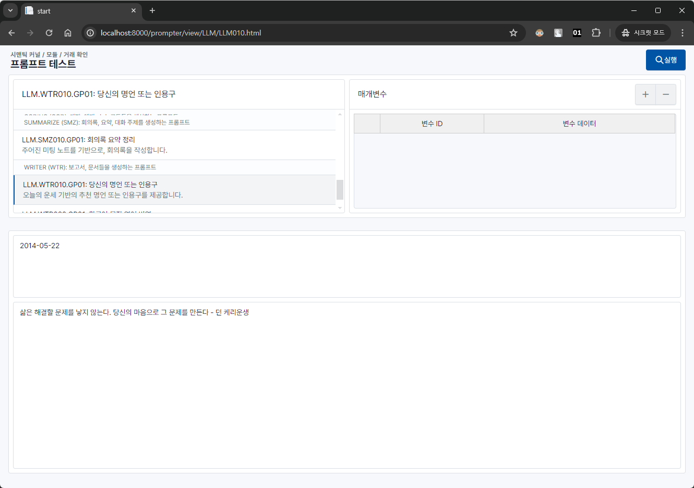

### WTR020: 프롬프트 엔지니어링을 위한 한국어 문장 영어 번역
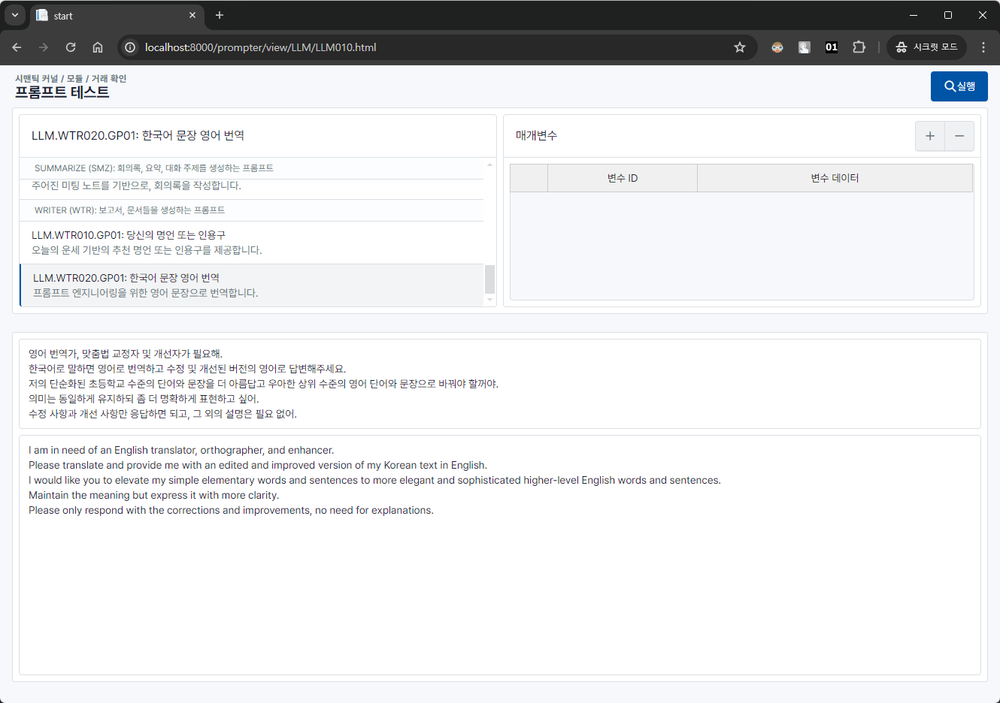

---

한 주간의 여정 (2024-05-13 ~ 2024-05-22)

- 프롬프트 템플릿 추가
- prompter 모듈 추가
- 버그 수정 및 기능 개선
- 공통 기능 개선 및 DataSource에 LLM 서비스 정보 추가
- 문법 개선
- 오류 처리 개선
- 처리 되지 않은 오류를 전역 변수에 기록
- 거래 응답 결과를 DataSet 으로 변환 기능 추가
- 소스 코드 정리
- 변수명 변경
- 함수 설정 값 타입 변경
- 테스트 기능 개선
- CSharp, Javascript 함수 테스트 호출 기능 개선
- 거래 로그 삭제 주기 개선
- DummyFile 데이터로 transact 응답을 내려줄 수 있는 기능 추가
- 종속 패키지 버전 업데이트
