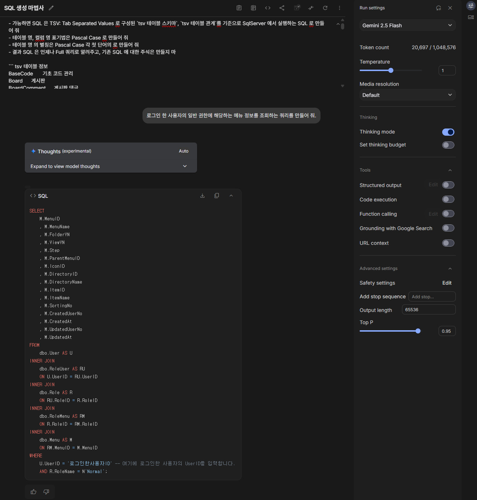
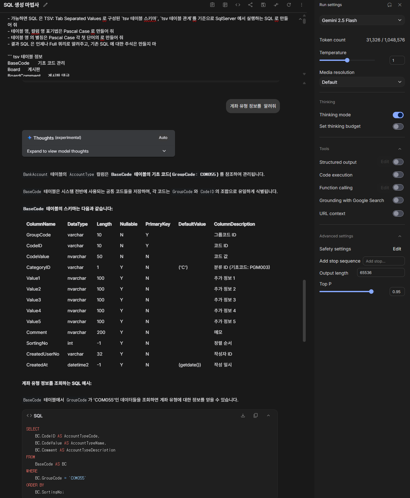

최근 진행하고 있는 HandStack 기반의 고객사의 업무 관리에 필요한 프로젝트에 AI 를 활용하는 개발 방법을 찾아가며 적용하는데 재미를 붙이고 있는데요. 개인적인 입장에서 AI 로 가능한 것과 불가능 하거나 어려운 일이 무엇인지 알아두면, 장점과 단점이 있지만 여러 모로 좋은 도구인 것은 맞는 듯합니다.

사용 중인 AI 서비스는 OpenAI ChatGPT 5, Claude Sonnet4, Google Gemini 2.5 를 대화 모드로 사용하기 위해, 아직은 불 안정하지만 Visual Studio 2022 도구에서 에이전트 모드로 사용하기 위해 GitHub Copilot 을 유료로 사용 중입니다. 가성비 측면에서 이보다 좋을 수 없더군요. (대인배 마이크로소프트 ^^)

그동안 개발에 필요한 검색을 하기 위해 구글을 주로 이용 하던 것을 Perplexity 로 유료로 사용 중이며, 응답 품질과 성능은 낮더라도 보안에 민감한 정보를 AI 로 처리하기 위해 로컬 PC 로 Ollama 를 이용한 gemma3:27b, gpt-oss:20b, qwen3-coder:30b 를 주로 사용 중입니다.

> 로컬 PC 사양은 데스크 탑에 14700K CPU, DDR5 64GB RAM, RTX 3090 24GB GPU, NVME PCIE 4 3TB 정도의 환경입니다.

LLM 성능을 끌어올리는 프롬프트 엔지니어링을 하려면 `적절한 질문을 하기 전에` 사전에 준비 해야 할 2 단계가 중요합니다. 잊지마세요. 이것은 AI 를 대화 모드나 에이전트 모드를 사용할 때 공통적으로 적용됩니다.

1. 도메인 업무 지침
2. 업무 데이터 정보
3. 적절한 질문

그래서 `도메인 업무 지침`, `업무 데이터 정보` 를 도메인의 최신 데이터로 자동으로 생성하기 위한 개발 도구를 자체 제작하는 데 노력을 해두면 좋습니다. 거창하게 말고 Node.js, Python, C# 등 업무 조건에 따라 CLI 로 반복 작업을 어느정도 자동화 하게 동작하도록 만들어 두면 향후 MCP 를 개발할 때도 적은 비용으로 전환이 가능합니다.

---

실무적인 SQL 을 생성하기 위해 간단한 업무를 예로 들어 보겠습니다.

일반적으로 여러 사용자가 로그인 해야 하는 프로그램의 경우 사용자 별로 메뉴 정보가 관리 되어야 합니다. 데이터베이스 테이블을 다음과 같이 염두해 두고 실무 SQL 생성 팁을 SQL Server 를 기준으로 공유 하겠습니다. 물론 약간의 응용을 하게 되면 Oracle, PostgreSQL, MySQL 등 다른 관계형 데이터베이스나 NoSQL 에서도 적용할 수 있습니다.

- User
- Menu
- Role
- RoleUser
- RoleMenu

테이블 들의 스키마는 특정 데이터베이스가 아닌 범용적으로 표현하면 다음과 같습니다.


### Menu
|컬럼 ID|데이터 타입|설명|
|---|---|---|
|MenuID|TEXT|메뉴 ID|
|MenuName|TEXT|메뉴 명|
|FolderYN|TEXT|디렉토리 여부|
|ViewYN|TEXT|표시 여부|
|Step|INTEGER|단계|
|ParentMenuID|TEXT|상위 메뉴 ID|
|IconID|TEXT|아이콘 ID|
|DirectoryID|TEXT|디렉토리 ID|
|DirectoryName|TEXT|디렉토리 명|
|ItemID|TEXT|파일 항목 ID|
|ItemName|TEXT|파일 항목명|
|SortingNo|INTEGER|정렬 순서|
|CreatedUserNo|TEXT|작성자 ID|
|CreatedAt|TEXT|작성 일시|

### Role
|컬럼 ID|데이터 타입|설명|
|---|---|---|
|RoleID|TEXT|권한 ID|
|RoleName|TEXT|권한 명|
|Comment|TEXT|메모|
|CreatedUserNo|TEXT|작성자 ID|
|CreatedAt|TEXT|작성 일시|

### RoleMenu
|컬럼 ID|데이터 타입|설명|
|---|---|---|
|RoleID|TEXT|권한 ID|
|MenuID|TEXT|메뉴 ID|
|FnSearch|TEXT|조회 기능|
|FnSave|TEXT|저장 기능|
|FnDelete|TEXT|삭제 기능|
|FnPrint|TEXT|인쇄 기능|
|FnExport|TEXT|내보내기 기능|
|Comment|TEXT|메모|
|CreatedUserNo|TEXT|작성자 ID|
|CreatedAt|TEXT|작성 일시|

### RoleUser
|컬럼 ID|데이터 타입|설명|
|---|---|---|
|UserID|TEXT|사용자 ID|
|RoleID|TEXT|권한 ID|
|CreatedUserNo|TEXT|작성자 ID|
|CreatedAt|TEXT|작성 일시|

### User
|컬럼 ID|데이터 타입|설명|
|---|---|---|
|UserID|TEXT|사용자 ID|
|PasswordHash|TEXT|비밀번호|
|UserName|TEXT|사용자 명|
|ProfilePictureUrl|TEXT|프로필 사진 URL|
|ThemeName|TEXT|화면 테마 명|
|Roles|TEXT|권한 정보|
|IsActive|TEXT|계정 활성 여부|
|LoginedAt|TEXT|마지막 접속 시간|
|CreatedUserNo|TEXT|작성자 ID|
|CreatedAt|TEXT|작성 일시|

---

## 도메인 업무 지침

SQL Server 기반의 SQL 을 AI 가 생성하기 전에 도메인의 개발 가이드 라인을 참고하거나 일관된 결과 품질을 위해 `도메인 업무 지침` 을 만듭니다. 대략 다음과 같은 항목을 확인하고 설정합니다.

- SQL Server 데이터베이스 버전
- 테이블/컬럼 명명 규칙
- 테이블 PK, FK 키 관리 방법
- 문자, 숫자, 불린, 날짜 등등 데이터 타입 관리 방법
- 컬럼 길이를 고정, 가변, 유니코드에 따라 자리 수 관리 방법
- 컬럼 기본값 적용 기준
- 컬럼 ID에 대한 설명 작성 규칙
- 자동 순번 정보에 대한 관리 방안
- 중요 데이터(개인정보 등) 암호화 또는 마스킹 방법

프롬프트는 가능하면 필요한 조건을 구체적으로 작성하는 것이 좋습니다만, 너무 연연하지 않으셔도 됩니다. 어차피 동일한 프롬프트를 OpenAI ChatGPT 5, Claude Sonnet4, Google Gemini 2.5 에 돌려보면 제 각각인 결과를 응답하기 때문인데요.

그래서 좋은 응답 결과를 얻기 위한 프롬프트를 만드는 데 시간을 들이는 것 보다 좋은 맥락과 정보를 얻기 위한 느슨한 프롬프트를 만드는 게 앞으로 AI 버전이 올라 가더라도 더 유연하게 재 활용 가능하게 만들 수 있을 거라 생각합니다. 

즉. 중요한 것은 프롬프트 가 아니라 이러한 구성을 만들기 위한 맥락과 정의를 설정하는 경험입니다. 저의 경우 다음과 같이 해도 충분한 결과를 알려주는 간단한 지침을 만듭니다.

```md
- SQL Server 2016 이상에서 실행하는 SQL 을 만들어 줘
- 가능하면 SQL 은 CSV: Comma Separated Values 로 구성된 `csv 테이블 목록`, `csv 테이블 스키마`, `csv 테이블 관계`를 기준으로 SQL 을 만들어 줘
- 테이블 명, 컬럼 명 표기법은 Pascal Case 로 만들어 줘
- 테이블 명 의 별칭은 Pascal Case 각 첫 단어의 조합으로 만들어 줘
- 결과 SQL 은 언제나 Full 쿼리로 알려주고, 예제로 제공되는 SQL 에 대한 주석은 만들지 마
```

## 업무 데이터 정보

 사용자 별로 메뉴 정보 관리해야 하는 범용적인 테이블 스키마를 기반으로 SQL Server 로 AI 가 필요한 정보를 AI 가 요청 정보를 잘 인식 할 수 있는 테이블 과 테이블의 스키마 `컬럼 ID, 데이터 타입,길이, NULL 여부, PK 여부, 기본값, 컬럼 설명` 데이터로 CSV 문법으로 정리하면 다음과 같습니다.

### 테이블 목록

```csv 테이블 목록
TableName,TableDescription
Role,역할 기준정보
User,프로그램 사용자 정보
Menu,화면 메뉴 기준정보
RoleMenu,역할별 메뉴 및 권한
RoleUser,역할별 사용자
```

### 테이블 스키마

```csv 테이블 스키마
TableName,ColumnName,DataType,Length,Nullable,PrimaryKey,DefaultValue,ColumnDescription
Menu,MenuID,varchar,32,N,Y,,메뉴 ID
Menu,MenuName,nvarchar,50,N,N,,메뉴 명
Menu,FolderYN,char,1,Y,N,,디렉토리 여부
Menu,ViewYN,char,1,Y,N,,표시 여부
Menu,Step,int,-1,Y,N,,단계
Menu,ParentMenuID,varchar,32,Y,N,,상위 메뉴 ID
Menu,IconID,varchar,50,Y,N,,아이콘 ID
Menu,DirectoryID,varchar,3,Y,N,,디렉토리 ID
Menu,DirectoryName,varchar,50,Y,N,,디렉토리 명
Menu,ItemID,varchar,6,Y,N,,파일 항목 ID
Menu,ItemName,varchar,50,Y,N,,파일 항목명
Menu,SortingNo,int,-1,Y,N,,정렬 순서
Menu,CreatedUserNo,varchar,32,Y,N,,작성자 ID
Menu,CreatedAt,datetime2,-1,Y,N,,작성 일시
Role,RoleID,varchar,10,N,Y,,권한 ID
Role,RoleName,nvarchar,50,Y,N,,권한 명
Role,Comment,nvarchar,100,Y,N,,메모
Role,CreatedUserNo,varchar,32,Y,N,,작성자 ID
Role,CreatedAt,datetime2,-1,Y,N,,작성 일시
RoleMenu,RoleID,varchar,10,N,Y,,권한 ID
RoleMenu,MenuID,varchar,32,N,Y,,메뉴 ID
RoleMenu,FnSearch,varchar,1,Y,N,('N'),조회 기능
RoleMenu,FnSave,varchar,1,Y,N,('N'),저장 기능
RoleMenu,FnDelete,varchar,1,Y,N,('N'),삭제 기능
RoleMenu,FnPrint,varchar,1,Y,N,('N'),인쇄 기능
RoleMenu,FnExport,varchar,1,Y,N,('N'),내보내기 기능
RoleMenu,Comment,nvarchar,100,Y,N,,메모
RoleMenu,CreatedUserNo,varchar,32,Y,N,,작성자 ID
RoleMenu,CreatedAt,datetime2,-1,Y,N,,작성 일시
RoleUser,UserID,varchar,255,N,Y,,사용자 ID
RoleUser,RoleID,varchar,10,N,Y,,권한 ID
RoleUser,CreatedUserNo,varchar,32,Y,N,,작성자 ID
RoleUser,CreatedAt,datetime2,-1,Y,N,,작성 일시
User,UserID,varchar,255,N,Y,(newid()),사용자 ID
User,PasswordHash,varchar,64,N,N,,비밀번호
User,UserName,nvarchar,50,N,N,,사용자 명
User,ProfilePictureUrl,nvarchar,500,Y,N,,프로필 사진 URL
User,ThemeName,varchar,50,Y,N,((0)),화면 테마 명
User,Roles,varchar,3,Y,N,,권한 정보
User,IsActive,varchar,1,Y,N,('Y'),계정 활성 여부
User,LoginedAt,datetime2,-1,Y,N,,마지막 접속 시간
User,CreatedUserNo,varchar,32,Y,N,,작성자 ID
User,CreatedAt,datetime2,-1,Y,N,(getdate()),작성 일시
```

### 테이블 관계

그리고 AI 가 주어진 테이블 간의 관계를 이해하기 위해 PlantUML 의 표기 법을 준수하여 다음과 같이 관계 정보를 CSV 로 만듭니다.

```csv 테이블 관계
ModelGroupID,DepartureTableID,DepartureFieldID,DepartureFlowSymbol,FlowLineType,ArrivalFlowSymbol,ArrivalTableID,ArrivalFieldID
User_RoleUser,User,UserID,||,--,|{,RoleUser,UserID
Role_RoleMenu,Role,RoleID,||,--,|{,RoleMenu,RoleID
Role_RoleUser,Role,RoleID,||,--,|{,RoleUser,RoleID
```

PlantUML 의 테이블 관계 정보는 다음과 같습니다.

- ||: 정확히 1(기본값)
- o|: 0 또는 1
- o{: 0 또는 N
- |{: 1 또는 N
- |o: 1 또는 1
- {o: N 또는 0
- {|: N 또는 0

참고: [PlantUML Information Engineering Relations](https://plantuml.com/ko/ie-diagram)

---

## 적절한 질문

어떠신가요? AI 를 활용하여 SQL 을 생성하기 위해 위와 같은 프롬프트를 작성하기 전에 위의 방식으로 만들어 낸 `도메인 업무 지침`, `업무 데이터 정보` 를 AI 서비스의 `시스템 지침` 으로 먼저 작성하고 활용 해보는 것을 권장합니다.

예제와는 다르게 실무에서는 프로젝트에 따라서 100 개 이상의 테이블을 다루게 되는 데 이때 시스템 지침과 함께 프롬프트로 사용할 만한 AI 서비스로 Google Gemini 가 적당합니다.

위와 같은 방법을 응용하면 PlantUML 기반의 ERD 를 생성할 수 도 있고, 복잡한 쿼리를 만들 때 도메인 업무에 맥락을 이해하는 실질적인 도움을 받습니다. 다음은 제가 최근에 활용한 예시 이미지를 올립니다.

### Gemini AI를 활용한 사용자 메뉴 정보 조회 SQL 생성 예시


### Gemini AI를 활용한 SQL 생성 예시



## 중요한 점

`도메인 업무 지침`, `업무 데이터 정보` 를 도메인의 최신 데이터로 자동으로 생성하기 위한 개발 도구를 자체 제작 해보세요. 재미 있는 것은 AI 자동화를 위한 개발 코드도 AI 에게 작성하라고 지시합니다.

저의 경우 위의 `시스템 지침`을 생성하는 SQL Server 스토어드 프로시저를 Claude Sonnet4 AI 를 이용해 작성했습니다. 물론 약간의 수정을 거쳤지만 제가 필요한 90% 부분을 알려 주더군요.

```sql
CREATE PROCEDURE [dbo].[ExportSchemaInstruction]
AS
BEGIN
    SET NOCOUNT ON

    DECLARE @SQL NVARCHAR(MAX) = ''
    DECLARE @Content NVARCHAR(MAX) = ''

    -- 헤더 정보 추가
    SET @Content = @Content + '- SQL Server 2016 이상에서 실행하는 SQL 을 만들어 줘' + CHAR(13) + CHAR(10)
    SET @Content = @Content + '- 가능하면 SQL 은 TSV: Tab Separated Values 로 구성된 `tsv 테이블 스키마`, `tsv 테이블 관계`를 기준으로 SqlServer 에서 실행하는 SQL 로 만들어 줘' + CHAR(13) + CHAR(10)
    SET @Content = @Content + '- 테이블 명, 컬럼 명 표기법은 Pascal Case 로 만들어 줘' + CHAR(13) + CHAR(10)
    SET @Content = @Content + '- 테이블 명 의 별칭은 Pascal Case 각 첫 단어의 조합으로 만들어 줘' + CHAR(13) + CHAR(10)
    SET @Content = @Content + '- 결과 SQL 은 언제나 Full 쿼리로 알려주고, 예제로 제공되는 SQL 에 대한 주석은 만들지 마' + CHAR(13) + CHAR(10) + CHAR(13) + CHAR(10)
    
    -- 테이블 정보 섹션
    SET @Content = @Content + '``` tsv 테이블 정보' + CHAR(13) + CHAR(10)
    
    DECLARE @TableData NVARCHAR(MAX) = ''
    SELECT @TableData = (
        SELECT 
            CAST(t.name AS VARCHAR(256)) + CHAR(9) +
            ISNULL(CAST(ep.value AS NVARCHAR(4000)), '') + CHAR(9) +
            CHAR(13) + CHAR(10)
        FROM 
            sys.tables t
            LEFT JOIN sys.extended_properties ep 
                ON ep.major_id = t.object_id 
                AND ep.minor_id = 0 
                AND ep.name = 'MS_Description'
        ORDER BY 
            t.name
        FOR XML PATH(''), TYPE
    ).value('.', 'NVARCHAR(MAX)')

    SET @Content = @Content + @TableData + '```' + CHAR(13) + CHAR(10) + CHAR(13) + CHAR(10)

    -- 테이블 스키마 섹션
    SET @Content = @Content + '``` tsv 테이블 스키마' + CHAR(13) + CHAR(10)
    SET @Content = @Content + 'TableName' + CHAR(9) + 'ColumnName' + CHAR(9) + 'DataType' + CHAR(9) + 'Length' + CHAR(9) + 'Nullable' + CHAR(9) + 'PrimaryKey' + CHAR(9) + 'DefaultValue' + CHAR(9) + 'ColumnDescription' + CHAR(13) + CHAR(10)
    SET @Content = @Content + '---' + CHAR(9) + '---' + CHAR(9) + '---' + CHAR(9) + '---' + CHAR(9) + '---' + CHAR(9) + '---' + CHAR(9) + '---' + CHAR(9) + '---' + CHAR(13) + CHAR(10)
    
    DECLARE @SchemaData NVARCHAR(MAX) = ''
    SELECT @SchemaData = (
        SELECT 
            C.TABLE_NAME + CHAR(9) +
            C.COLUMN_NAME + CHAR(9) +
            C.DATA_TYPE + CHAR(9) +
            ISNULL(CAST(C.CHARACTER_MAXIMUM_LENGTH AS VARCHAR(10)), '-1') + CHAR(9) +
            LEFT(C.IS_NULLABLE, 1) + CHAR(9) +
            CASE 
                WHEN KCU.COLUMN_NAME IS NOT NULL THEN 'Y'
                ELSE 'N'
            END + CHAR(9) +
            ISNULL(DC.definition, '') + CHAR(9) +
            ISNULL(CAST(EP.value AS NVARCHAR(MAX)), '') + 
            CHAR(13) + CHAR(10)
        FROM 
            INFORMATION_SCHEMA.COLUMNS AS C
            LEFT JOIN sys.extended_properties AS EP 
                ON EP.major_id = OBJECT_ID(QUOTENAME(C.TABLE_SCHEMA) + '.' + QUOTENAME(C.TABLE_NAME))
                AND EP.minor_id = (
                    SELECT column_id 
                    FROM sys.columns 
                    WHERE object_id = OBJECT_ID(QUOTENAME(C.TABLE_SCHEMA) + '.' + QUOTENAME(C.TABLE_NAME))
                        AND name = C.COLUMN_NAME
                )
                AND EP.name = 'MS_Description'
            LEFT JOIN INFORMATION_SCHEMA.KEY_COLUMN_USAGE AS KCU
                ON C.TABLE_NAME = KCU.TABLE_NAME 
                AND C.COLUMN_NAME = KCU.COLUMN_NAME
                AND C.TABLE_SCHEMA = KCU.TABLE_SCHEMA
                AND KCU.CONSTRAINT_NAME IN (
                    SELECT CONSTRAINT_NAME 
                    FROM INFORMATION_SCHEMA.TABLE_CONSTRAINTS 
                    WHERE CONSTRAINT_TYPE = 'PRIMARY KEY'
                )
            LEFT JOIN sys.default_constraints AS DC
                ON DC.parent_object_id = OBJECT_ID(QUOTENAME(C.TABLE_SCHEMA) + '.' + QUOTENAME(C.TABLE_NAME))
                AND DC.parent_column_id = (
                    SELECT column_id 
                    FROM sys.columns 
                    WHERE object_id = OBJECT_ID(QUOTENAME(C.TABLE_SCHEMA) + '.' + QUOTENAME(C.TABLE_NAME))
                        AND name = C.COLUMN_NAME
                )
        ORDER BY 
            C.TABLE_NAME,
            C.ORDINAL_POSITION
        FOR XML PATH(''), TYPE
    ).value('.', 'NVARCHAR(MAX)');
    
    SET @Content = @Content + @SchemaData + '```' + CHAR(13) + CHAR(10) + CHAR(13) + CHAR(10)
    
    -- 테이블 관계 섹션
    SET @Content = @Content + '``` tsv 테이블 관계' + CHAR(13) + CHAR(10)
    
    DECLARE @RelationData NVARCHAR(MAX) = ''
    SELECT @RelationData = @RelationData + 
        CAST(ModelGroupID AS NVARCHAR(50)) + CHAR(9) +
        CAST(DepartureTableID AS VARCHAR(50)) + CHAR(9) +
        CAST(DepartureFieldID AS VARCHAR(50)) + CHAR(9) +
        CAST(DepartureFlowSymbol AS VARCHAR(50)) + CHAR(9) +
        CAST(FlowLineType AS VARCHAR(50)) + CHAR(9) +
        CAST(ArrivalFlowSymbol AS VARCHAR(50)) + CHAR(9) +
        CAST(ArrivalTableID AS VARCHAR(50)) + CHAR(9) +
        CAST(ArrivalFieldID AS VARCHAR(50)) + CHAR(9) +
        CHAR(13) + CHAR(10)
    FROM ModelRelation 
    ORDER BY ModelGroupID
    
    SET @Content = @Content + @RelationData + '```' + CHAR(13) + CHAR(10) + CHAR(13) + CHAR(10)
    
    -- 기초코드 목록 섹션
    SET @Content = @Content + '``` tsv 기초코드 목록' + CHAR(13) + CHAR(10)
    SET @Content = @Content + 'BaseCodeID' + CHAR(9) + 'BaseCodeText' + CHAR(13) + CHAR(10)
    SET @Content = @Content + '---' + CHAR(9) + '---' + CHAR(13) + CHAR(10)
    
    DECLARE @BaseCodeData NVARCHAR(MAX) = ''
    SELECT @BaseCodeData = (
        SELECT 
            CAST(CodeID AS VARCHAR(50)) + CHAR(9) +
            CAST(CodeValue AS NVARCHAR(MAX)) + 
            CHAR(13) + CHAR(10)
        FROM BaseCode 
        WHERE GroupCode = 'SYS000'
        ORDER BY CodeID
        FOR XML PATH(''), TYPE
    ).value('.', 'NVARCHAR(MAX)')
    
    SET @Content = @Content + @BaseCodeData + '```' + CHAR(13) + CHAR(10)
    
    SELECT @Content AS TextContent
END
```

그 다음 위의 스토어드 프로시저의 결과를 .txt 파일로 생성하는 Node.js CLI 코드도 마찬가지로 자동으로 생성하도록 지시합니다.

```json
{
    "name": "schema-instruction",
    "version": "1.0.0",
    "main": "schema-instruction.js",
    "scripts": {
        "start": "node schema-instruction.js"
    },
    "dependencies": {
        "mssql": "^10.0.1"
    }
}
```

```js
const sql = require('mssql');
const fs = require('fs').promises;
const path = require('path');

const config = {
    user: 'handstack',
    password: 'password',
    server: 'localhost',
    port: 1433,
    database: 'DB01',
    options: {
        encrypt: true,
        trustServerCertificate: true
    }
};

async function exportSchemaToFile(outputPath) {
    let pool;

    try {
        pool = await sql.connect(config);
        const result = await pool.request()
            .execute('dbo.ExportSchemaInstruction');

        if (result.recordset && result.recordset.length > 0) {
            const textContent = result.recordset[0].TextContent;

            let filePath;
            if (outputPath) {
                if (path.extname(outputPath) === '') {
                    const now = new Date();
                    const timestamp = now.toISOString().replace(/[:.]/g, '-').slice(0, -5);
                    const fileName = `export-instruction_${timestamp}.txt`;
                    filePath = path.join(outputPath, fileName);
                } else {
                    filePath = path.resolve(outputPath);
                }

                const dir = path.dirname(filePath);
                await fs.mkdir(dir, { recursive: true });
            } else {
                const now = new Date();
                const timestamp = now.toISOString().replace(/[:.]/g, '-').slice(0, -5);
                const fileName = `export-instruction_${timestamp}.txt`;
                filePath = path.join(__dirname, fileName);
            }

            await fs.writeFile(filePath, textContent, 'utf8');

            return {
                success: true,
                filePath: filePath,
                fileName: path.basename(filePath)
            };
        } else {
            throw new Error('결과 없음');
        }

    } catch (error) {
        console.error('오류:', error.message);
        return {
            success: false,
            error: error.message
        };
    } finally {
        if (pool) {
            await pool.close();
        }
    }
}

// node schema-instruction.js "C:/tmp/export-instruction.txt"
async function main() {
    const args = process.argv.slice(2);
    const outputPath = args[0];

    const result = await exportSchemaToFile(outputPath);

    if (result.success) {
        console.log('완료:', `notepad ${result.filePath}`);
    } else {
        console.log('실패:', result.error);
    }
}

if (require.main === module) {
    main().catch(console.error);
}

module.exports = { exportSchemaToFile };
```

최근 AI 가 만들어 주는 코드의 품질이 많이 좋아져서 개발 업무에 꽤 도움이 됩니다. 그래도 좋은 점만 있는게 아닙니다. 가뜩이나 얼마 전에 개발한 것도 가물가물한데, 바이브 코딩의 부작용과 특정 도구에 의존하게 되는 실수를 하지 않도록 밸런스를 유지하는 게 중요 하겠더군요.