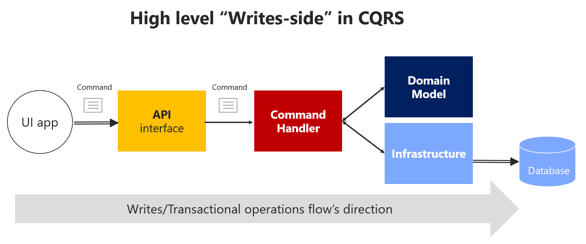
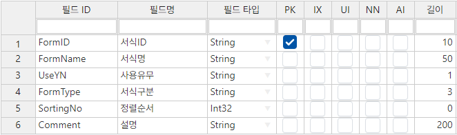
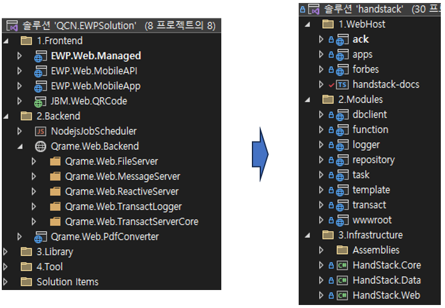
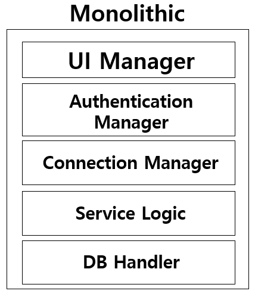
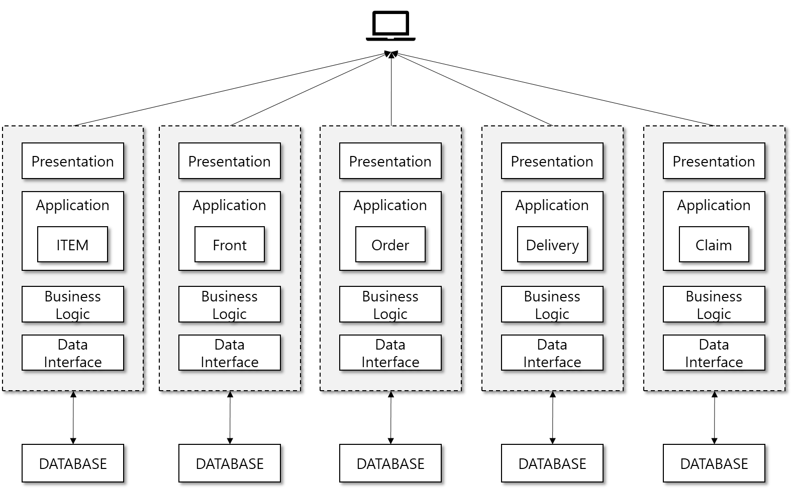
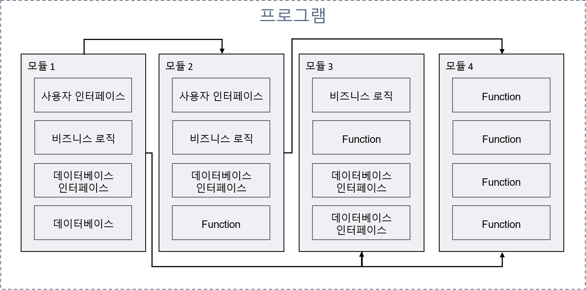
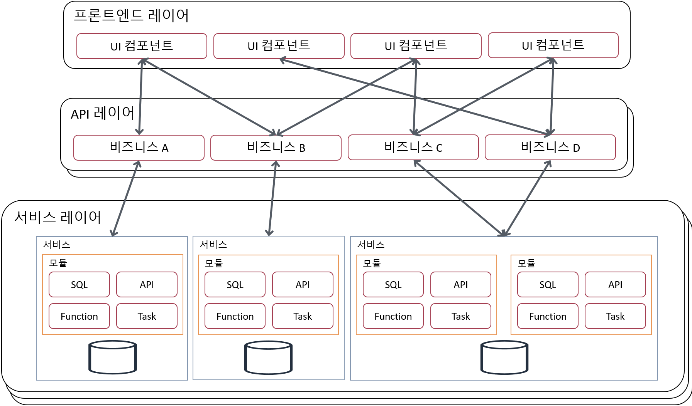

# 작업이력

### 2023-11-22 : 문서 작업
### 2023-11-17 : v1 문서 목차 정리

```txt
시작하기: startup
	개요: overview
	빠른 시작: quickstart
	자습서: learning
	따라하기: handsonlab
참고하기: reference
	개념: concept
	참조: api
추가정보: information
	다운로드: releases
	변경이력: versions
	확장: forbes
	리소스: resource
커뮤니티: cummunity
	라이센스: license
	프로젝트 개발 및 지원 정책: terms
	컨설팅 및 PoC 지원: poc
	개발, 운영 교육 및 기술 지원: support
블로그: blog
도입사례: showcase

docs
	시작하기
		개요
			HandStack을 사용 해야 하는 이유
				HandStack은 표준 기술 스택을 준수합니다
					HandStack은 HTML5, ASP.NET Core, Node.js, Docker 기반 표준 기술 스택으로 개발합니다
					Windows, Linux, Mac 실행 환경
				메모장으로 풀 스택 개발 및 운영 가능
				기업 내 비즈니스 앱을 만들기 위해 IT 인프라 구축 시 TCO 절감
					개발 과정 단순 표준화 방안
					운영 방법 단순 표준화 방안
					적은 학습 곡선, 개발 인원 비용 절감
				최신 표준 기술 사용 및 오픈소스와 상용 라이브러리 도입 가능
				프로젝트 개발 및 지원 공인 파트너
					컨설팅 및 PoC 지원
					개발, 운영 교육 및 기술 지원
		빠른 시작
			사전 프로그램 설치
			개발 도구 프로그램 설치
			Hello World 화면 만들기
		자습서 (튜토리얼)
			기본 HTML, CSS, Javascript 알아두기
			syn.js 가이드 및 샘플
			syn.controls.js 가이드 및 샘플
			데이터베이스 CRUD 시작하기
			ack 프로그램 가이드 및 샘플
			HandStack 모듈 가이드 및 샘플
				dbclient
				function
				logger
				repository
				transact
				wwwroot
		방법 (핸즈온)
			.NET 8 설치
			Node.js 16.x 이상 설치
			나만의 프로젝트 약어 만들기
			참조 항목을 기준으로 따라 할 수 있는 HandsOnLab
	참고하기
		개념
			프로그램 다운타임 최소화 아이디어 (서버 다운타임 검색)
			데이터 게더링과 바인딩
			계약 중심 거래 (GraphQL 컨셉)
			모듈러 모놀리식 아키텍처
			In-process / Out-process 메시징
			데이터베이스 연동 (SQL Server, Oracle, MySQL & MariaDB, PostgreSQL, SQLite)
			서버리스 Function
		참조
			syn.js 라이브러리
			syn.controls.js 라이브러리
			ack 프로그램
			HandStack 모듈
				dbclient
				function
				logger
				repository
				transact
				wwwroot
			HandStack .NET Core 라이브러리
	추가정보
		확장 (Forbes): 개요, 빠른 시작, 자습서, 방법, 개념, 참조 제공
			apps
			modules
			uicontrol
			library
			connector
		리소스
			상용 라이브러리
			클라이언트 오픈소스
			서버 오픈소스
			개발 도구
				Visual Studio 2022
				Visual Studio Code
				Notepad++
				Kate 에디터
				DB Browsers for SQLite
				DBeaver
		커뮤니티
		도입사례
pages
	HandStack 다운로드 (React 페이지)
	github에 releases 다운로드 파일 링크
blog
	HandStack 공지
	릴리스 정보
	버전 로드맵
	게시글

```

### 2023-11-15 : docusaurus 문서화 솔루션 기능 분석
### 2023-11-14 : 문서화 도구 솔루션 리서치
### 2023-11-13 : 호스트 앱 담당자 관리 기능
### 2023-11-13 : 호스트 앱 담당자 관리 기능
### 2023-11-12 : 호스트 앱 생성 기능 개발
### 2023-11-09 : 프로필, 단일, 멀티 파일 업로드 기능 개발
### 2023-11-08 : 매개변수 오류 수정
### 2023-11-08 : 호스트 앱 Cors 정책은 응답 검증에서 호스트 앱 허용 경로를 평가하여 허용 및 차단을 결정
### 2023-11-08 : 모듈 데이터베이스 거래 실패시 오류 처리 및 글로벌 ID 재시도 제한 기능 추가
### 2023-11-07 : expected-app 디렉토리 생성 기능 및 버그 수정
### 2023-11-05 : 기본 포트를 5000 > 8080 으로 변경 및 호스트 앱 생성 부트스트랩
### 2023-11-03 : 버그 수정 및 화면 퍼블리싱
### 2023-11-03 : 공통 기능 버그 수정
### 2023-11-02 : 비동기 이벤트 오류 수정 및 개선
### 2023-11-01 : 그리드 개선, 버그 수정 및 업무 문서 화면 개발
### 2023-10-31 : 문서 기능 개발
### 2023-10-30 : 경영지원 화면 및 공통 퍼블리싱 개선
### 2023-10-28 : 호스트 앱 환경설정 간소화 및 공통 기능 개선
### 2023-10-26 : 업무 서식 퍼블리싱
### 2023-10-24 : 업무 문서 파일 추가
### 2023-10-24 : 결과 보고서 화면 개발
### 2023-10-22 : 버그 수정 및 개선
### 2023-10-22 : 마스터, 그리드 코드헬프 기능 개발
### 2023-10-21 : 호스트 앱 Environment 적용하기
### 2023-10-20 : 소스 코드 정리 및 코드헬프, 파일 업로드 기능 개발
### 2023-10-18 : 호스트 앱내 요청시 거래 오류를 내지 않도록 개선
### 2023-10-17 : tabler 프레임워크 버전 업 및 샘플앱 퍼블리싱
### 2023-10-16 : 스타트업 업무 문서 양식 앱 개발 시작
### 2023-10-13 : 호스트 앱을 위한 토큰 발급, 갱신, 폐기 기능 개발
### 2023-10-12 : 호스트 앱 로그인 기능 개발
### 2023-10-12 : 공통 쿠키 기능 정리
### 2023-10-11 : JWT 토큰 인증 기능 개발 및 동적 거래로그 추가
### 2023-10-06 : 인증 정보 관리 개선
```txt
사용자 로그인시 보안 개선을 위한 1회성 주소 만료기간과 단축 URL 관리에 대한 항목
인증 URL 정보
    loginID: 로그인 ID
    userName: 사용자명
    issuedID: 발급 시간 번호
    validID: 발급 시간 암호화
    signID: URL 해싱 ID

URL 압축 테이블: Shortner
    ShortnerID: 시간 ID
    DisposableYN: 일회용여부
    UriAbsolute: 전체 URL 문자열
    SignID: URL 해싱 ID
    CreatedAt: 생성일시

인증 확인 테이블: Certly
    CertlyID: 시간 ID
    UserID: 로그인 ID
    CertifiedTarget: 인증대상 (로그인[URL 해싱 ID], 이메일, 핸드폰번호)
    CertifiedYN: 인증여부
    CertifiedAt: 인증일시
    CertifiedValue: 인증값
    CreatedAt: 생성일시
```
### 2023-10-05 : Circuit Break 기준을 Http 응답 200 ~ 299 가 아닐 경우로 변경
### 2023-10-04 : JWT 토큰 인증 기능 개발 및 버그 수정
### 2023-10-01 : 사용자 권한 및 접근 제어 Privillege Types 정리
```txt
HandStack에서 거래 수행시 사용자의 인증 정보로 다음과 같은 명령 진행 여부를 처리 필요
DML
    Select
    Delete
    Insert
    Update
    Merge
    
DCL
    Grant
    Revoke
    Commit
    Rollback

DDL
    Drop
    Alter
    Create
    Rename
    Truncate
    
Etc
    Begin
    Execute
    Trace
    
Function
    Export
    Import
```
### 2023-09-27 : 대시보드 화면 개발
### 2023-09-26 : 탭 화면 출력시 height 계산 개선
### 2023-09-25 : 거래 이력 관리 기능 개발 및 GlobalID 정책 개선
### 2023-09-20 : 패키지 업데이트
### 2023-09-20 : Server.MapPath 기능 추가
### 2023-09-20 : 거래 이력정보 화면 개발
### 2023-09-20 : 거래 로그 입력 확인
### 2023-09-19 : logger 모듈 기능 개발
### 2023-09-17 : 에디터 설정 기능 개발
### 2023-09-15 : 버그 수정
### 2023-09-15 : 소스 코드 정리
### 2023-09-14 : 앱 데이터베이스 테이블 추가 관리 화면 개발

테이블
* Aggregate: 거래량 수집
* ErrorDetail: 거래오류 ID 정보
* MetaEntity: 엔티티 메타 정보
* MetaField: 엔티티 필드 정보
* MetaFieldExtend: 엔티티 필드 추가정보
* MetaRelation: 엔티티 관계 정보
* ApplicationUser: 어플리케이션 사용자
* RefreshToken: 호스트 앱 토큰 갱신 정보
* Certify: 2FA 인증정보
* Package: 배포 패키지
* PackageItem: 패키지 파일 정보
* Publish: 배포 이력
* SeedData: 테이블 초기 데이터
* SeedGroup: 테이블 그룹

### 2023-09-12 : 파일 저장시 캐시 데이터 동기화 기능 개선
### 2023-09-12 : 거래 오류시 팝업 메시지로 표시
### 2023-09-12 : setting.json 동작 기능 개선
### 2023-09-11 : 소스 코드 정리
### 2023-09-11 : 앱 환경설정 settings.json 관리 항목 통합
### 2023-09-08 : 패키지 파일 정리
### 2023-09-08 : dotnet tool cli 등록
### 2023-09-08 : LoggerFactory loggerFactory 오류 수정
### 2023-09-07 : 프로그램 시작 기능 개선
### 2023-09-06 : Referer 설정 화면 개발
### 2023-09-05 : 패키지 게시하기 화면 개발
### 2023-09-02 : 배포 패키지 파일 다운로드 기능 개발
### 2023-09-01 : 배포 패키지 관리 화면 개발
### 2023-08-29 : 배포 게시/수신 설정 화면 개발
### 2023-08-29 : 프로젝트/항목 잠금 기능 추가
### 2023-08-28 : UI 프로젝트 파일 관리 화면 개발
### 2023-08-25 : 공개 거래 설정 기능 개발
### 2023-08-24 : dotnet pack 기능 적용
### 2023-08-24 : npm, nuget 라이브러리 목록 조회 화면 개발
### 2023-08-24 : UI 라이브러리, 앱 Assets 관리 화면 개발
### 2023-08-22 : 화면 템플릿 추가 기능 개발
### 2023-08-22 : function Javascript 기능 개발
### 2023-08-20 : Function 기능 추가 개발
### 2023-08-20 : 거래 항목 추가 기능 개발
### 2023-08-19 : DbClient 기능 추가 개발
### 2023-08-17 : 계약 파일 갱신 기능 개선
### 2023-08-17 : 계약 파일 갱신 기능 개선
### 2023-08-16 : 호스트 앱 디렉토리/파일 추가 기능 개발
### 2023-08-11 : 소스 코드 거래, 조회 및 저장 기능 개발
### 2023-08-11 : 호스트 앱 소스코드 개발 메뉴 구성 및 조회 기능 개발
### 2023-08-10 : 의존 패키지 버전 최신화

클라이언트 라이브러리
* aimarajs-1.0.0/
* autocomplete-1.0.4/
* bootstrap@5.2.2/
* chartjs-4.3.0/
* chrome-tabs-1.0.0/
* clipboard-2.0.4/
* codemirror-5.50.2/
* color-picker-1.0.0/
* contextmenu-2.9.2/
* crownixviewer-8.0.2.55/
* css-checkbox-1.0.0/
* darkreader-4.9.58/
* datatable-1.10.21/
* download/
* download-4.21/
* draggabilly-3.0.0/
* fancytree-2.38.0/
* filedrop/
* filedrop-1.0.0/
* flatpickr-4.6.3/
* fullcalendar-5.11.3/
* fuse-6.4.6/
* handsontable-12.2.0/
* handsontable-13.1.0/
* handsontable-7.4.2/
* highlight.js@11.6.0/
* html2canvas-1.0.0/
* iframe-resizer-4.2.6/
* intro.js-6.0.0/
* ispin-2.0.1/
* jquery/
* jquery-3.3.1/
* jquery-3.6.0/
* jquery-ui-contextmenu-1.18.1/
* jquery-wm-0.0.5/
* jquery@3.6.0/
* jquery_plantuml/
* jschannel-1.0.0/
* jsoneditor-8.6.1/
* jsoneditor-9.10.0/
* master@1.37.8/
* md4-2.1/
* moment-2.24.0/
* monaco-editor-0.39.0/
* msgpack/
* mustache-4.2.0/
* nanobar-0.4.2/
* notifier-1.0.0/
* numbro-2.1.1/
* orgchart-3.1.1/
* papaparse-5.3.0/
* pdfjs-2.8.335/
* pdfobject-2.2.5/
* pikaday-1.8.0/
* popperjs-2.11.6/
* printjs-1.6.0/
* qaf-css-1.0/
* sha256-0.9.0/
* sheetjs-0.16.8/
* showdownjs@2.1.0/
* signalr-7.0.5/
* smartmenus-1.1.0/
* snow-1.0.0/
* sql-formatter-12.2.4/
* squel-5.13.0/
* superplaceholder-1.0.0/
* tabler-icons@1.103.0/
* tabler@1.0.0-beta16/
* tabler@1.0.0-beta20/
* tail.select-0.5.15/
* tingle-0.15.2/
* tinymce-5.4.1/
* tinymce-5.6.0/
* tippy.js-6.3.7/
* vanilla-masker-1.1.1/
* winbox-0.2.82/
* x2js-1.2.0/
* jquery-3.3.1.js
* jquery.alertmodal.js
* jquery.maskedinput-1.3.js
* jquery.simplemodal.js
* jquery.WM.js
* Notifier.js

서버 라이브러리
* AspNetCoreRateLimit:5.0.0
* Azure.Storage.Blobs:12.17.0
* CacheManager.Core:1.2.0
* ChoETL.JSON.NETStandard:1.2.1.62
* Dapper:2.0.143
* HtmlAgilityPack:1.11.53
* Jering.Javascript.NodeJS:6.3.1
* MediatR:12.1.1
* Microsoft.AspNetCore.Mvc.NewtonsoftJson:7.0.10
* Microsoft.CodeAnalysis.Compilers:4.6.0
* Microsoft.CodeAnalysis.CSharp:4.6.0
* Microsoft.EntityFrameworkCore:7.0.10
* Microsoft.EntityFrameworkCore.Relational:7.0.10
* Microsoft.EntityFrameworkCore.Sqlite.Core:7.0.10
* Microsoft.EntityFrameworkCore.SqlServer:7.0.10
* Microsoft.Extensions.Caching.SqlServer:7.0.10
* Microsoft.Extensions.Hosting.Systemd:7.0.0
* Microsoft.Extensions.Hosting.WindowsServices:7.0.1
* MySql.Data:8.1.0
* MySql.EntityFrameworkCore:7.0.5
* Newtonsoft.Json:13.0.3
* Npgsql:7.0.4
* Npgsql.EntityFrameworkCore.PostgreSQL:7.0.4
* Oracle.EntityFrameworkCore:7.21.11
* Oracle.ManagedDataAccess.Core:3.21.110
* Polly:7.2.4
* Pomelo.EntityFrameworkCore.MySql:7.0.0
* Pomelo.Extensions.Caching.MySql:2.1.4
* RestSharp:110.2.0
* Serilog:3.0.1
* Serilog.AspNetCore:7.0.0
* Serilog.Extensions.Hosting:7.0.0
* Serilog.Extensions.Logging:7.0.0
* Serilog.Sinks.Console:4.1.0
* Serilog.Sinks.File:5.0.0
* Swashbuckle.AspNetCore:6.5.0
* System.Data.SqlClient:4.8.5
* System.Data.SQLite.Core:1.0.118
* System.Linq.Dynamic.Core:1.3.4


### 2023-08-09 : ERD 관리 화면 개발
### 2023-08-07 : 데이터베이스 DDL 생성하기
### 2023-08-04 : 데이터 모델 관리 화면 개발
### 2023-08-01 : 프로젝트 담당자 화면 개발
### 2023-07-30 : datepicker 컨트롤 tabler 디자인 적용
### 2023-07-30 : 윈도우 팝업 닫기 아이콘 변경
### 2023-07-30 : 거래 프록시 화면 개발
### 2023-07-29 : CORS 설정 기능 및 개선
### 2023-07-26 : 예외 처리 기능 및 코드 개선
### 2023-07-26 : 호스트 앱의 CORS 설정 기능 추가
### 2023-07-25 : 파일 저장소 관리화면 개발
### 2023-07-24 : 초기 데이터 생성 기능 및 TreeView POC
### 2023-07-20 : PlantUML, Monaco 에디터 기능 POC
### 2023-07-18 : 화면 퍼블리싱 추가
### 2023-07-17 : 데이터 원본 화면 개발
### 2023-07-16 : notify, alert, window 매니저 기능 추가
### 2023-07-13 : C# Function 소스 동적 업데이트 기능
### 2023-07-12 : Function 기반 데이터 조회, 저장 기능 개선
### 2023-07-10 : 레이아웃 기능 개선
### 2023-07-06 : 화면 버튼 기능 추가
### 2023-07-05 : start.html 멀티 탭 기능 개발
### 2023-07-03 : main.html 오류 수정
### 2023-07-03 : repository 모듈 개발
### 2023-06-30 : apphost 실행 기능 개발
### 2023-06-30 : 회원가입 signup 만들기
### 2023-06-27 : 로그인 인증 기능 개발 적용
### 2023-06-25 : wwwroot 모듈 파일 정리
### 2023-06-24 : EventAction, SubscribeAction 으로 모듈간 이벤트 호출 기능 추가

In-process / Out-process 메시징



```txt
"HDS|ZZW|D|T": "http://localhost:8000/dbclient/api/query",
"HDS|ZZW|D|D": "event://dbclient.Events.DbClientRequest",
"HDS|ZZW|F|D": "http://localhost:8000/function/api/execution",
"HDS|ZZW|R|D": "http://localhost:8000/repository/api/request",
"HDS|ZZD|D|T": "http://localhost:8000/dbclient/api/query",
"HDS|ZZD|D|D": "event://dbclient.Events.DbClientRequest",
```

```json
"ModuleConfig": {
    "EventAction": [
        "ncloudsender.Events.PublishSMSText",
        "ncloudsender.Events.PublishHtmlMail",
        "ncloudsender.Events.PublishTemplateMail",
        "ncloudsender.Events.PublishAlarmTalk",
        "ncloudsender.Events.SendMediator"
    ],
    "SubscribeAction": [
        "ncloudsender.Events.PublishSMSText",
        "ncloudsender.Events.PublishHtmlMail",
        "ncloudsender.Events.PublishTemplateMail",
        "ncloudsender.Events.PublishAlarmTalk",
        "ncloudsender.Events.SendMediator"
    ]
}
```

### 2023-06-23 : NCloud 이메일, 알림톡, 문자 발송 기능을 모듈로 개선 및 Mediator 기능 적용
### 2023-06-21 : dbclient, transact, function 모듈 계약 파일 다중 디렉토리에서 인식하도록 개선

여러 Contract 디렉토리 경로를 적용 할 수 있도록 개선

dbclient 모듈 계약
```json
"ContractBasePath": [
    "C:/home/ack/modules/dbclient/Contracts/dbclient",
    "C:/projects/handstack.modules/handsup/Contracts/dbclient",
    "C:/projects/handstack/2.Modules/repository/Contracts/dbclient",
    "C:/projects/handstack/2.Modules/wwwroot/Contracts/dbclient"
],
```

transact 모듈 계약
```json
"ContractBasePath": [
    "C:/home/ack/modules/transact/Contracts/transact",
    "C:/projects/handstack.modules/handsup/Contracts/transact",
    "C:/projects/handstack/2.Modules/repository/Contracts/transact",
    "C:/projects/handstack/2.Modules/wwwroot/Contracts/transact"
],
```

function 모듈 계약
```json
"ContractBasePath": [
    "C:/home/ack/modules/function/Contracts/function",
    "C:/projects/handstack.modules/handsup/Contracts/function"
],
```

### 2023-06-16 : 도메인 메타 데이터 기반 MSSQL, ORACLE, MySQL, PostgreSQL, SQLite 테이블 생성 기능 개발 및 웹 사이트 테이블 설계

테이블
* Application: 어플리케이션 정보
* ApplicationMember: 어플리케이션 참여 회원
* BaseCode: 기준코드
* CodeHelp: 코드도움
* CodeHelpScheme: 코드도움 스키마
* IdentityNo: 고유 No 정보
* Member: 회원정보
* MemberClaims: 회원 클레임
* MemberLicense: 회원 라이센스
* Menu: 메뉴
* OAuthProvider: 구글, 마이크로소프트 OAuth 사용자 인증 정보
* Person: 사용자 정보
* PersonSignIn: 사용자 로그인 이력
* ProgramMenu: 화면 메뉴 정보
* ProjectItem: 소스 디렉토리 정보
* Repository: 파일 저장소 정보
* RepositoryFile: 업로드 파일 정보
* ShortenerUrl: 단축 URL 정보
* TransactLog: 거래 이력
* UserAccount: 사용자 계정
* WordReference: 약어 참조정보

### 2023-06-14 : UIControl 예제 개발 업데이트 및 거래 테스트

HandStack에서 제공하는 공식 화면 개발 라이브러리

```bash
UIControls
├─Chart
│      Chart.css
│      Chart.js
│      ChartJS.css
│      ChartJS.js
│
├─CheckBox
│      CheckBox.css
│      CheckBox.js
│
├─CodePicker
│      CodePicker.css
│      CodePicker.js
│
├─ColorPicker
│      ColorPicker.css
│      ColorPicker.js
│
├─ContextMenu
│      ContextMenu.css
│      ContextMenu.js
│
├─DataSource
│      DataSource.css
│      DataSource.js
│
├─DatePicker
│      DatePicker.css
│      DatePicker.js
│
├─DropDownCheckList
│      DropDownCheckList.css
│      DropDownCheckList.js
│
├─DropDownList
│      DropDownList.css
│      DropDownList.js
│
├─FileClient
│      FileClient.css
│      FileClient.js
│
├─GridList
│      GridList.css
│      GridList.js
│
├─HtmlEditor
│      HtmlEditor.css
│      HtmlEditor.js
│
├─JsonEditor
│      JsonEditor.css
│      JsonEditor.js
│
├─OrganizationView
│      OrganizationView.css
│      OrganizationView.js
│
├─RadioButton
│      RadioButton.css
│      RadioButton.js
│
├─SourceEditor
│      SourceEditor.css
│      SourceEditor.js
│
├─TextArea
│      TextArea.css
│      TextArea.js
│
├─TextBox
│      TextBox.css
│      TextBox.js
│
├─TreeView
│      TreeView.css
│      TreeView.js
│
└─WebGrid
        jqGrid.css
        jqGrid.js
        jqGrid.txt
        WebGrid.css
        WebGrid.js
```
### 2023-06-13 : 모듈 초기화 기능 개선
### 2023-06-12 : 디자인 시스템 정리

디자인 시스템은 무엇인가?
* UI, UX 디자인 원칙, 규격
* 재사용 가능한 UI 컴포넌트
* PC, 모바일등 다양한 제품에 대응
	
왜 디자인 시스템인가?
* 효율성 확보
* 일관성 있는 개발/사용자 경험

디자인 시스템 기반 환경
* bootstrap 5
* Tabler
* Tabler Icons
* master ui
* Chrome 기반 PC, 모바일 브라우저

bootstrap 5 기본 샘플: http://localhost:7000/sample/bs5/bs5_1_basic.html
tabler 기본 샘플: http://localhost:7000/sample/tabler/tr1_1_basic.html
컴포넌트 예제 샘플: http://localhost:7000/sample/examples/album/index.html

Bootstrap Snippet
* https://bootsnipp.com/
* https://www.bootdey.com/bootstrap-snippets
* https://bootstrapious.com/snippets
* https://www.tutorialrepublic.com/snippets/gallery.php

레이아웃
* position, float - https://www.w3docs.com/learn-html/html-layout-templates.html
* grid - https://www.quackit.com/html/templates/css_grid_templates.cfm
* flex - https://www.quackit.com/html/templates/css_flexbox_templates.cfm

컴포넌트
* https://getbootstrap.com/docs/5.2/components/
* https://getbootstrap.com/docs/5.2/examples/
* https://preview.tabler.io/form-elements.html
* https://tailwindui.com/components

레이아웃 디자인 도구: http://localhost:7000/layout/index.html

### 2023-06-08 : 제품 및 모듈 라이센스 키 관리 기능 추가 POC

고유 키로 개인 키, 공개 키 만들기

```csharp
string passPhrase = "6mML7vhZGiOv2$cGriVB^YBwEWG6aSmOzyko41Zet*GVqL%zqN";
var keyGenerator = HandStack.Core.Licensing.Security.Cryptography.KeyGenerator.Create();
var keyPair = keyGenerator.GenerateKeyPair();
var privateKey = keyPair.ToEncryptedPrivateKeyString(passPhrase);
var publicKey = keyPair.ToPublicKeyString();
```

라이센스 키 만들기
```csharp
DateTime expiryDate = DateTime.UtcNow.Date.AddDays(30);
string machineName = Environment.MachineName;
string customerName = "HandStack";
string hostName = "localhost";

License newLicense = License.New()
    .WithUniqueIdentifier(Guid.NewGuid())
    .ExpiresAt(expiryDate)
    .WithAdditionalAttributes(new Dictionary<string, string>
    {
        { "MachineName", machineName },
        { "HostName", hostName },
    })
    .LicensedTo((c) => c.Name = customerName)
    .CreateAndSignWithPrivateKey(privateKey, passPhrase);

string licenseXml = newLicense.ToString();
using (var xmlWriter = new XmlTextWriter("license.xml", Encoding.UTF8))
{
    newLicense.Save(xmlWriter);
}
```

키 수급 및 검증
```csharp
License license = License.Load(licenseXml);
using (var xmlReader = new XmlTextReader("license.xml"))
{
    license = License.Load(xmlReader);
}

string currentMachineName = Environment.MachineName;

var validationFailure = license.Validate()
    .ExpirationDate()
    .And()
    .Signature(publicKey)
    .And()
    .AssertThat(lic =>
        {
            return lic.AdditionalAttributes.Get("MachineName") == currentMachineName;
        }
        , new GeneralValidationFailure()
        {
            Message = "유효하지 않는 호스트 명입니다",
            HowToResolve = "새 라이선스 키를 받으려면 공급업체에 문의하세요"
        }
    )
    .AssertValidLicense();

if (validationFailure != null)
{
    throw new UnauthorizedAccessException($"{validationFailure.Message}, {validationFailure.HowToResolve}");
}
```

### 2023-05-04 : 매개변수 처리시 타입 유추 기능 개선

데이터 타입에 따라 업무 로직 처리를 개선하기 위해 클라이언트/서버 기능 개선

'문자, 숫자, 날짜, 예/아니오'에 대한 데이터 타입을 처리하는 기준 수립

```javascript
toNumber(val) {
    var result = 0;
    try {
        result = parseFloat(($object.isNullOrUndefined(val) == true ? 0 : val) === 0 || val === '' ? '0' : val.toString().replace(/,/g, ''));
    } catch (error) {
        console.log(error);
    }

    return result;
},

toBoolean(val) {
    return (val === 'true' || val === 'True' || val === 'TRUE' || val === 'Y' || val == '1');
},

toDynamic(val, emptyIsNull) {
    var result;
    if (emptyIsNull == undefined) {
        emptyIsNull = false;
    }

    if (emptyIsNull == true && val === '') {
        result = null;
    }
    else {
        if (val === 'true' || val === 'True' || val === 'TRUE') {
            result = true;
        }
        else if (val === 'false' || val === 'False' || val === 'FALSE') {
            result = false;
        }
        else if ($validation.regexs.float.test(val)) {
            result = $string.toNumber(val);
        }
        else if ($validation.regexs.isoDate.test(val)) {
            result = new Date(val);
        }
        else {
            result = val;
        }
    }

    return result;
},

toParseType(val, metaType, emptyIsNull) {
    var result;

    if (emptyIsNull == undefined) {
        emptyIsNull = false;
    }

    if (emptyIsNull == true && val === '') {
        result = null;
    }
    else {
        switch (metaType) {
            case 'string':
                result = val;
                break;
            case 'bool':
                result = $string.toBoolean(val);
                break;
            case 'number':
            case 'int':
                result = $object.isNullOrUndefined(val) == true ? null : $string.isNumber(val) == true ? $string.toNumber(val) : null;
                break;
            case 'date':
                if ($validation.regexs.isoDate.test(val)) {
                    result = new Date(val);
                }
                break;
            default:
                result = val;
                break;
        }
    }

    return result;
},
```

### 2023-05-03 : cors 기본 정책 설정 개선

```csharp
services.AddCors(options =>
{
    options.AddDefaultPolicy(
    builder => builder
        .AllowAnyHeader()
        .AllowAnyMethod()
        .WithOrigins(GlobalConfiguration.WithOrigins.ToArray())
        .SetIsOriginAllowedToAllowWildcardSubdomains()
        .SetPreflightMaxAge(TimeSpan.FromSeconds(86400))
        .WithHeaders(HeaderNames.CacheControl)
    );

    options.AddPolicy("PublicCorsPolicy",
    builder => builder
        .AllowAnyHeader()
        .AllowAnyMethod()
        .AllowAnyOrigin()
        .SetIsOriginAllowedToAllowWildcardSubdomains()
        .SetPreflightMaxAge(TimeSpan.FromSeconds(86400))
        .WithHeaders(HeaderNames.CacheControl)
    );
});

var policy = corsPolicyProvider.GetPolicyAsync(httpContext.Context, null)
.ConfigureAwait(false)
.GetAwaiter().GetResult();

if (policy != null)
{
    try
    {
        var corsResult = corsService.EvaluatePolicy(httpContext.Context, policy);
        corsService.ApplyResult(corsResult, httpContext.Context.Response);
    }
    catch
    {
        Log.Logger.Warning("[{LogCategory}] " + $"WWWRootBasePath corsService.ApplyResult 확인 필요 {httpContext.Context.Request.Path}", $"{ModuleConfiguration.ModuleID} ModuleInitializer/Configure");
    }
}
```

* cors에 영향을 받을 수 있는 부분에 syn.$w.baseURI(url) 적용
* cors 대응을 위한 baseURI 함수 추가

### 2023-04-28 : 테스트 변수값 변경
### 2023-04-28 : 메타 시드 데이터 입력 기능 추가 및 개선

```sql
--MSSQL
CREATE TABLE [BusinessFormType] (
    [FormID] nvarchar(10) NOT NULL,
    [FormName] nvarchar(50) NULL,
    [UseYN] nvarchar(1) NULL,
    [FormType] nvarchar(3) NULL,
    [SortingNo] int NULL,
    [Comment] nvarchar(200) NULL,
    CONSTRAINT [PK_BusinessFormType] PRIMARY KEY ([FormID])
);
DECLARE @defaultSchema AS sysname;
SET @defaultSchema = SCHEMA_NAME();
DECLARE @description AS sql_variant;
SET @description = N'서식ID';
EXEC sp_addextendedproperty 'MS_Description', @description, 'SCHEMA', @defaultSchema, 'TABLE', N'BusinessFormType', 'COLUMN', N'FormID';
SET @description = N'서식명';
EXEC sp_addextendedproperty 'MS_Description', @description, 'SCHEMA', @defaultSchema, 'TABLE', N'BusinessFormType', 'COLUMN', N'FormName';
SET @description = N'사용유무';
EXEC sp_addextendedproperty 'MS_Description', @description, 'SCHEMA', @defaultSchema, 'TABLE', N'BusinessFormType', 'COLUMN', N'UseYN';
SET @description = N'서식구분';
EXEC sp_addextendedproperty 'MS_Description', @description, 'SCHEMA', @defaultSchema, 'TABLE', N'BusinessFormType', 'COLUMN', N'FormType';
SET @description = N'정렬순서';
EXEC sp_addextendedproperty 'MS_Description', @description, 'SCHEMA', @defaultSchema, 'TABLE', N'BusinessFormType', 'COLUMN', N'SortingNo';
SET @description = N'설명';
EXEC sp_addextendedproperty 'MS_Description', @description, 'SCHEMA', @defaultSchema, 'TABLE', N'BusinessFormType', 'COLUMN', N'Comment';
GO


IF EXISTS (SELECT * FROM [sys].[identity_columns] WHERE [name] IN (N'FormID', N'Comment', N'FormName', N'FormType', N'SortingNo', N'UseYN') AND [object_id] = OBJECT_ID(N'[BusinessFormType]'))
    SET IDENTITY_INSERT [BusinessFormType] ON;
INSERT INTO [BusinessFormType] ([FormID], [Comment], [FormName], [FormType], [SortingNo], [UseYN])
VALUES (N'A01', NULL, N'주간 일정표', N'경영지원', 101, N'Y'),
(N'A02', NULL, N'주간 업무 보고', N'경영지원', 102, N'Y'),
(N'A03', NULL, N'월간 업무 보고', N'경영지원', 103, N'Y'),
(N'B01', NULL, N'거래명세서', N'매입매출', 201, N'Y'),
(N'B02', NULL, N'정산내역서', N'매입매출', 202, N'Y'),
(N'B03', NULL, N'실적보고서', N'매입매출', 203, N'Y'),
(N'B04', NULL, N'목표기술서', N'매입매출', 204, N'Y'),
(N'B05', NULL, N'납품확인서', N'매입매출', 205, N'Y'),
(N'B06', NULL, N'구매품의서', N'매입매출', 206, N'Y'),
(N'B07', NULL, N'매입보고서', N'매입매출', 207, N'Y'),
(N'B08', NULL, N'견적서', N'매입매출', 208, N'Y'),
(N'B09', NULL, N'거래처원장', N'매입매출', 209, N'Y'),
(N'B10', NULL, N'거래처관리', N'매입매출', 210, N'Y'),
(N'C01', NULL, N'재직증명서', N'인사관리', 301, N'Y'),
(N'C02', NULL, N'직원정보', N'인사관리', 302, N'Y'),
(N'C03', NULL, N'업무명세서', N'인사관리', 303, N'Y'),
(N'C04', NULL, N'업무분담표', N'인사관리', 304, N'Y'),
(N'C05', NULL, N'업무기준서', N'인사관리', 305, N'Y'),
(N'C06', NULL, N'휴가신청서', N'인사관리', 306, N'Y'),
(N'C07', NULL, N'인사발령서', N'인사관리', 307, N'Y'),
(N'C08', NULL, N'성과평가표', N'인사관리', 308, N'Y'),
(N'C09', NULL, N'일용노무비 지급명세서', N'인사관리', 309, N'Y'),
(N'C10', NULL, N'업무계약서', N'인사관리', 310, N'Y'),
(N'C11', NULL, N'퇴직증명서', N'인사관리', 311, N'Y'),
(N'C12', NULL, N'보안서약서', N'인사관리', 312, N'Y'),
(N'C13', NULL, N'지각사유서', N'인사관리', 313, N'Y'),
(N'D01', NULL, N'출장비내역서', N'자금회계', 401, N'Y'),
(N'D02', NULL, N'지출내역서', N'자금회계', 402, N'Y'),
(N'D03', NULL, N'지급내역서', N'자금회계', 403, N'Y'),
(N'E01', NULL, N'기안서', N'일반업무', 501, N'Y'),
(N'E02', NULL, N'제안서', N'일반업무', 502, N'Y'),
(N'E03', NULL, N'사업계획서', N'일반업무', 503, N'Y'),
(N'E04', NULL, N'회의록', N'일반업무', 504, N'Y'),
(N'E05', NULL, N'결과보고서', N'일반업무', 505, N'Y'),
(N'E06', NULL, N'주간 업무 보고', N'일반업무', 506, N'Y'),
(N'E07', NULL, N'월간 업무 보고', N'일반업무', 507, N'Y'),
(N'F01', NULL, N'투자의향서', N'투자유치', 601, N'Y'),
(N'F02', NULL, N'투자제안서', N'투자유치', 602, N'Y'),
(N'F03', NULL, N'투자예산서', N'투자유치', 603, N'Y'),
(N'F04', NULL, N'투자약정서', N'투자유치', 604, N'Y'),
(N'F05', NULL, N'투자내역서', N'투자유치', 605, N'Y'),
(N'F06', NULL, N'투자계약서', N'투자유치', 606, N'Y');
INSERT INTO [BusinessFormType] ([FormID], [Comment], [FormName], [FormType], [SortingNo], [UseYN])
VALUES (N'F07', NULL, N'투자개요서', N'투자유치', 607, N'Y'),
(N'F08', NULL, N'투자확약서', N'투자유치', 608, N'Y'),
(N'F09', NULL, N'투자확인서', N'투자유치', 609, N'Y'),
(N'F10', NULL, N'등재확인서', N'투자유치', 610, N'Y');
IF EXISTS (SELECT * FROM [sys].[identity_columns] WHERE [name] IN (N'FormID', N'Comment', N'FormName', N'FormType', N'SortingNo', N'UseYN') AND [object_id] = OBJECT_ID(N'[BusinessFormType]'))
    SET IDENTITY_INSERT [BusinessFormType] OFF;
GO
```

### 2023-04-17 : 테이블 생성 쿼리 기능 개선
### 2023-04-17 : 테이블 생성 스크립트 기능 개선
### 2023-04-16 : Entity Framework을 활용한 테이블 CREATE SQL 생성 배치 프로그램 추가

MSSQL, ORACLE, SQLite 기반 CREATE SQL 생성 자동화 배치 프로그램



```sql
-- MSSQL
CREATE TABLE [BusinessFormType] (
    [FormID] nvarchar(10) NOT NULL,
    [FormName] nvarchar(50) NULL,
    [UseYN] nvarchar(1) NULL,
    [FormType] nvarchar(3) NULL,
    [SortingNo] int NULL,
    [Comment] nvarchar(200) NULL,
    CONSTRAINT [PK_BusinessFormType] PRIMARY KEY ([FormID])
);

-- ORACLE
BEGIN 
EXECUTE IMMEDIATE 'CREATE TABLE 
"BusinessFormType" (
    "FormID" NVARCHAR2(10) NOT NULL,
    "FormName" NVARCHAR2(50),
    "UseYN" NVARCHAR2(1),
    "FormType" NVARCHAR2(3),
    "SortingNo" NUMBER(0,0),
    "Comment" NVARCHAR2(200),
    CONSTRAINT "PK_BusinessFormType" PRIMARY KEY ("FormID")
)';
END;/

-- SQLite
CREATE TABLE "BusinessFormType" (
    "FormID" TEXT NOT NULL CONSTRAINT "PK_BusinessFormType" PRIMARY KEY,
    "FormName" TEXT NULL,
    "UseYN" TEXT NULL,
    "FormType" TEXT NULL,
    "SortingNo" INTEGER NULL,
    "Comment" TEXT NULL
);
```

### 2023-04-15 : Contract 계약 파일 동기화 기능 개선 및 멀티태넌시 데이터베이스 기능 개선

거래 요청에 따라 벡엔드에서 설정에 의해 다양한 데이터베이스에 접근할 수 있도록 개선

### 2023-04-11 : 파일 동기화 기능 개선
### 2023-04-06 : 프레임워크 기능 개선 및 디렉토리 동기화 콘솔 프로그램 추가
### 2023-04-02 : CSharpScript를 컴파일에 포함되지 않도록 구성 추가
### 2023-04-02 : pm2 기반 시작 스크립트 start-ack.bat 추가
### 2023-04-02 : 빌드 후 복사 경로 오류 수정
### 2023-04-02 : 솔루션, 프로젝트 빌드 구성 개선
### 2023-04-02 : starter_uidesign 모듈 분리
### 2023-04-02 : syn.js를 독립적으로 사용가능하도록 개선
### 2023-04-01 : 기능 추가 및 개선
### 2023-04-01 : starter_design 모듈 추가 및 기능 개선
### 2023-03-04 : 데이터베이스 연결 해제시 트랜잭션 처리 기능 개선

하나의 거래에 여러 트랜잭션 잠금 기반 여러 데이터베이스 요청 처리시 각각의 Commit과 Rollback을 수행하도록 개선

### 2023-03-20 : 클라이언트 라이브러리 의존성 정리 및 기능 개선
```json
"Definition": {
    "Styles": [
        "/lib/tabler@1.0.0-beta20/css/tabler.syn.css",
        "/lib/handsontable-13.1.0/dist/handsontable.full.css",
        "/lib/tail.select-0.5.15/css/default/tail.select-light.css",
        "/lib/ispin-2.0.1/ispin.css",
        "/lib/css-checkbox-1.0.0/checkboxes.css",
        "/lib/color-picker-1.0.0/color-picker.css",
        "/lib/codemirror-5.50.2/codemirror.css",
        "/lib/notifier-1.0.0/notifier.css",

        "/css/layouts/Dialogs.css",
        "/css/layouts/LoadingPage.css",
        "/css/layouts/ProgressBar.css",
        "/css/layouts/Tooltips.css",
        "/css/layouts/WindowManager.css",
        "/css/uicontrols/Control.css",

        "/uicontrols/CheckBox/CheckBox.css",
        "/uicontrols/ColorPicker/ColorPicker.css",
        "/uicontrols/ContextMenu/ContextMenu.css",
        "/uicontrols/DataSource/DataSource.css",
        "/uicontrols/DatePicker/DatePicker.css",
        "/uicontrols/DropDownCheckList/DropDownCheckList.css",
        "/uicontrols/DropDownList/DropDownList.css",
        "/uicontrols/FileClient/FileClient.css",
        "/uicontrols/RadioButton/RadioButton.css",
        "/uicontrols/TextArea/TextArea.css",
        "/uicontrols/TextBox/TextBox.css",
        "/uicontrols/HtmlEditor/HtmlEditor.css",
        "/uicontrols/TreeView/TreeView.css",
        "/uicontrols/WebGrid/WebGrid.css",

        "/css/base.css",
        "/css/tabler-icons.css"
    ],
    "Scripts": [
        "/lib/tabler@1.0.0-beta20/js/tabler.min.js",
        "/lib/jquery-3.6.0/jquery-3.6.0.js",
        "/lib/jquery.alertmodal.js",
        "/lib/jquery.simplemodal.js",
        "/lib/jquery.maskedinput-1.3.js",
        "/lib/jquery.WM.js",
        "/lib/papaparse-5.3.0/papaparse.js",
        "/lib/sheetjs-0.16.8/xlsx.core.min.js",
        "/lib/handsontable-13.1.0/dist/handsontable.full.js",
        "/lib/handsontable-13.1.0/languages/ko-KR.js",
        "/lib/clipboard-2.0.4/clipboard.js",
        "/lib/color-picker-1.0.0/color-picker.js",
        "/lib/ispin-2.0.1/ispin.js",
        "/lib/pikaday-1.8.0/pikaday.js",
        "/lib/superplaceholder-1.0.0/superplaceholder.js",
        "/lib/tail.select-0.5.15/js/tail.select.js",
        "/lib/vanilla-masker-1.1.1/vanilla-masker.js",
        "/lib/codemirror-5.50.2/codemirror.js",
        "/lib/download-4.21/download.js",
        "/lib/mustache-4.2.0/mustache.js",
        "/lib/printjs-1.6.0/print.min.js",
        "/lib/notifier-1.0.0/notifier.js",
        "/lib/master@1.37.8/master-css.min.js",
        "/js/syn.js"
    ],
    "Controls": [
        "/uicontrols/CheckBox/CheckBox.js",
        "/uicontrols/CodePicker/CodePicker.js",
        "/uicontrols/ColorPicker/ColorPicker.js",
        "/uicontrols/ContextMenu/ContextMenu.js",
        "/uicontrols/DataSource/DataSource.js",
        "/uicontrols/DatePicker/DatePicker.js",
        "/uicontrols/DropDownCheckList/DropDownCheckList.js",
        "/uicontrols/DropDownList/DropDownList.js",
        "/uicontrols/FileClient/FileClient.js",
        "/uicontrols/RadioButton/RadioButton.js",
        "/uicontrols/TextArea/TextArea.js",
        "/uicontrols/TextBox/TextBox.js",
        "/uicontrols/SourceEditor/SourceEditor.js",
        "/uicontrols/HtmlEditor/HtmlEditor.js",
        "/uicontrols/TreeView/TreeView.js",
        "/uicontrols/WebGrid/WebGrid.js"
    ]
}
```
### 2023-03-05 : 기능 개선 및 버그 수정
### 2023-02-30 : 공통 기능 개선 및 버그 수정
### 2023-02-24 : 기능 개선 및 간격 추가
### 2023-02-23 : syn.network 기능 개선
### 2023-02-23 : 문법 오류 개선
### 2023-02-23 : syn.browser 예제 개선
### 2023-02-23 : extendLoad 호출 버그 수정
### 2023-02-21 : syn.$b 예제 추가
### 2023-02-19 : 코드 정리 및 syn 도움말 기능 추가

```bash
syn
│  syn.browser.js
│  syn.network.js
│  syn.core.js
│  syn.crytography.js
│  syn.dimension.js
│  syn.exports.js
│  syn.extension.js
│  syn.keyboard.js
│  syn.library.js
│  syn.manipulation.js
│  syn.request.js
│  syn.resource.js
│  syn.stringbuilder.js
│  syn.system.js
│  syn.templete.js
│  syn.vaildation.js
│  syn.webform.js
│
├─externel
│      emile.js
│      html5.js
│      JSLINQ.js
│      json2.js
│      papaparse.js
│      sizzle.js
│      XMLObjectifier.js
│
└─lang
        syn.resource.en-US.js
        syn.resource.ja-JP.js
        syn.resource.ko-KR.js
        syn.resource.zh-CN.js
```

### 2023-02-17 : task 모듈 프로젝트 추가

대부분의 클라이언트 요청은 백엔드에서 빠른 응답을 처리하기 위한 단발성 거래

이러한 거래는 데이터베이스 CRUD 요청이거나 C#, Node.js 함수 기반 업무 로직 처리

때로는 클라이언트에는 백엔드에 실행 이벤트만 요청하고 백엔드에서는 언제 끝나는 지 알 수 없는 장기적인 프로그램 처리가 필요

* 정기적인 대량 데이터 백업
* 운영 인프라 개선을 위한 CI/CD 작업

### 2023-01-17 : 불 필요한 파일 삭제
### 2023-01-15 : 라이브러리 참조 방법 개선

표준 웹 기술 스펙인 (ECMAScript) ES2017(ES8) async/await를 활용한 Javascript 초기 로드 성능 개선

일관성 있는 화면 개발이 가능하도록 업무 로직을 함수 선언 방식에서 모듈 방식으로 강제 방안 적용

```javascript
// 화면 업무 로직 모듈
var mod = context[syn.$w.pageScript] || new syn.module();

// 환경설정
mod.config = {
    programID: syn.Config.ApplicationID,
    businessID: syn.$w.pageProject || syn.Config.ProjectID,
    systemID: syn.Config.SystemID,
    transactionID: syn.$w.pageScript.replace('$', ''),
    transactions: [],
    dataSource: {},
    actionButtons: []
};

// 전역변수
mod.prop = {};

// 데이터 정의
mod.model = {};

// 프로그램 이벤트
mod.hook = {};

// 사용자 이벤트
mod.event = {};

// 거래 정의
mod.transaction = {};

// 기능 함수
mod.method = {};

// 데이터 소스
mod.store = {};

// 공유 정보
mod.context = {};
```

### 2023-01-13 : POC 테스트 프로젝트 삭제

프로젝트 주요 속성을 다음과 같이 가능여부 확인
* 프로그램: Project Sdk="Microsoft.NET.Sdk.Web"
* 모듈: Project Sdk="Microsoft.NET.Sdk.Razor"
* 라이브러리: Project Sdk="Microsoft.NET.Sdk"

ASP.NET Core의 모든 기능을 사용 가능한가? 필요한 모듈을 선택적으로 로드 가능한가?

### 2023-01-12 : 프로젝트 참조 변경 및 암시적 선언 삭제

HandStack 프로젝트의 기본 5개의 프로그램으로 구성해야 하는 구성을 규모에 따라 단일 프로그램 또는 N개의 프로그램으로 운영 가능하도록 개선



### 2023-01-01 : 모듈러 모놀리식 S/W 아키텍쳐 적용

전통적인 S/W 개발 방법인 모놀리식 아키텍처는 개발 초기에는 단순한 아키텍처 구조와 개발의 용이함이 장점이지만 규모가 커짐에 따라 관리가 어려워진다.



마이크로서비스 아키텍처는 각각의 서비스를 완전히 독립적이며 고유한 종속성과 로직이 있도록 분리를 하는데 각 서비스는 서로 다른 데이터베이스와 다른 프로그래밍 언어와 기술을 사용할 수 있기 때문에 확장성에 유연한 대처가 가능하지만 개인이 알아야 할 항목이 많아져 초기 도입 및 네트워크 관리가 복잡해진다



HandStack은 대안으로 제안되는 모듈식 모놀리식 아키텍처를 적용한다. 업무 로직을 모듈로 나누는 방식으로 구성되며, 각 모듈은 독립적이고 격리된다. 각 모듈에는 고유한 비즈니스 로직이 있어야 한다. 이렇게 다른 모듈에는 최대한 영향을 주지 않고 레이어를 만들고 수정할 수 있어야 한다.



왜냐하면 규모에 따른 어플리케이션의 구성이 쉽기 때문에 모놀리식과 마이크로서비스의 장점만을 활용할 수 있다

