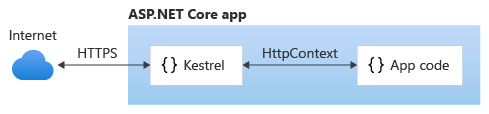
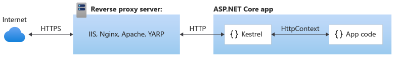

# ack 프로그램

ack 프로그램은 ASP.NET Core 앱의 In-Process HTTP 서버 구현을 사용하여 실행되는 Kestrel 이라는 이름의 웹 서버 프로그램입니다. ack 프로그램은 다음과 같은 기능을 제공합니다.

* 멀티 플랫폼: Windows, Linux 및 macOS에서 실행되는 플랫폼 간 웹 서버입니다.
* 고성능: 많은 수의 동시 연결을 효율적으로 처리하도록 최적화되어 있습니다.
* 경량: 컨테이너 및 에지 디바이스와 같이 리소스가 제한된 환경에서 실행되도록 최적화되었습니다.
* 보안 강화: HTTPS를 지원하고 웹 서버 취약성에 대해 강화됩니다.
* 광범위한 프로토콜 지원: HTTP/1.1, HTTP/2 및 HTTP/3, WebSocket 등등 일반적이면서도 최신 웹 프로토콜을 지원합니다.
* 확장성: 사용자 지정 모듈 운영이 가능한 구성, 미들웨어 기능을 제공합니다.
* 성능 진단: 로깅 및 메트릭과 같은 기본 성능 진단 기능을 제공합니다.

HandStack 에서 제공되는 dbclient, function, logger, repository, transact, wwwroot, checkup 과 같은 모듈은 ack 프로그램 위에서 동작합니다. 이러한 모듈은 각각의 기능을 제공하며, 이러한 모듈을 조합하여 최적의 화면과 기능을 구성합니다.

Kestrel 서버 프로그램은 크게 2가지로 웹 서비스를 호스팅 합니다.

## 네트워크의 요청을 직접 처리하는 에지 서버로 단독 사용



## IIS(인터넷 정보 서비스), Nginx 또는 Apache 같은 역방향 프록시 서버와 함께 사용



## appsettings.json 파일 내용

```json
{
    "AppSettings": {
        "HostAccessID": "HANDSTACK_HOSTACCESSID",
        "SystemID": "HANDSTACK",
        "ApplicationID": "HDS",
        "ProgramName": "ack",
        "HostName": "HOSTNAME",
        "InstallType": "L",
        "BusinessServerUrl": "http://localhost:8421/transact/api/transaction/execute",
        "FindGlobalIDServer": "",
        "DomainAPIServer": {
            "ServerID": "SERVERD01",
            "ServerType": "D",
            "Protocol": "http",
            "IP": "localhost",
            "Port": "8421",
            "Path": "/transact/api/transaction/execute",
            "ClientIP": "127.0.0.1"
        },
        "ForwardProxyIP": [],
        "IsTenantFunction": true,
        "IsExceptionDetailText": true,
        "TenantAppRequestPath": "app",
        "ContractRequestPath": "view",
        "TenantAppBasePath": "../tenants",
        "BatchProgramBasePath": "../batchs",
        "CreateAppTempPath": "../tmp/create_apps",
        "ForbesBasePath": "../forbes",
        "LoadModuleBasePath": "../modules",
        "LoadModules": [
            "wwwroot",
            "transact",
            "dbclient",
            "function",
            "repository",
            "logger",
            "checkup"
        ],
        "ModuleConfigurationUrl": [
        ],
        "RunningEnvironment": "D",
        "UseResponseComression": false,
        "UseForwardProxy": false,
        "UseSameIPProxy": false,
        "WithOrigins": [
            "http://127.0.0.1",
            "http://127.0.0.1:8421",
            "http://localhost",
            "http://localhost:8421"
        ],
        "SessionState": {
            "IsSession": true,
            "SessionCookieName": "HandStack.Session",
            "CacheType": "Memory",
            "MySqlConnectionString": "Server=127.0.0.1;Port=3306;Database=HandStack_Cache;Uid=handstack;Pwd=handstack~!@34;PersistSecurityInfo=True;SslMode=none;Charset=utf8;Allow User Variables=True;",
            "MySqlSchemaName": "HandStack_Cache",
            "MySqlTableName": "SessionData",
            "SqlServerConnectionString": "Data Source=127.0.0.1;Initial Catalog=HandStack_Cache;User ID=handstack;Password=handstack~!@34;Connection Timeout=0;",
            "SqlServerSchemaName": "dbo",
            "SqlServerTableName": "SessionData"
        },
        "CookiePrefixName": "HandStack",
        "UserSignExpire": -1
    },
    "Serilog": {
        "Enrich": [ "FromLogContext", "WithMachineName" ],
        "MinimumLevel": {
            "Default": "Debug",
            "Override": {
                "Microsoft": "Error",
                "System": "Error"
            }
        },
        "Using": [ "Serilog.Sinks.File", "Serilog.Sinks.Console" ],
        "WriteTo": [
            {
                "Name": "Console",
                "Args": {
                    "outputTemplate": "[{Timestamp:HH:mm:ss.fff} {Level:u3}] {Message:lj}{NewLine}{Exception}",
                    "theme": "Serilog.Sinks.SystemConsole.Themes.AnsiConsoleTheme::Code, Serilog.Sinks.Console"
                }
            },
            {
                "Name": "File",
                "Args": {
                    "fileSizeLimitBytes": 104857600,
                    "flushToDiskInterval": 3,
                    "outputTemplate": "[{Timestamp:HH:mm:ss.fff} {Level:u3}] {Message:lj}{NewLine}{Exception}",
                    "path": "../log/app.log",
                    "rollingInterval": "Day",
                    "rollOnFileSizeLimit": true,
                    "shared": true
                }
            }
        ]
    },
    "IpRateLimiting": {
        "EnableEndpointRateLimiting": false,
        "StackBlockedRequests": true,
        "RealIpHeader": "X-Real-IP",
        "ClientIdHeader": "X-ClientId",
        "HttpStatusCode": 429,
        "IpWhitelist": [ "127.0.0.1", "::1/10" ],
        "EndpointWhitelist": [ "get:/diagnostics", "get:/checkip" ],
        "ClientWhitelist": [ "handstack-id-1", "handstack-id-2", "handstack-id-3" ],
        "GeneralRules": [
            {
                "Endpoint": "*",
                "Period": "1s",
                "Limit": 200
            }
        ],
        "QuotaExceededResponse": {
            "Content": "The response was restricted by the server's policies.",
            "ContentType": "text/html",
            "StatusCode": 429
        }
    },
    "Kestrel": {
        "DisableStringReuse": true,
        "Limits": {
            "MaxConcurrentConnections": 100,
            "MaxConcurrentUpgradedConnections": 100,
            "MaxRequestBodySize": 30000000
        }
    }
}
```

## Serilog 파일 로그 설정

Serilog에 대한 자세한 정보는 다음 웹사이트에서 확인하실 수 있습니다:

### Serilog.Settings.Configuration

Serilog 설정을 Microsoft.Extensions.Configuration에서 읽는 방법에 대해 설명하고 있습니다. 기본적으로, 설정은 Serilog 섹션에서 읽습니다. https://github.com/serilog/serilog-settings-configuration

### AppSettings · serilog/serilog Wiki

App.config 및 Web.config 파일에서 appSettings 기반 구성 구문을 사용하여 최소 수준을 설정하고, 추가 속성으로 이벤트를 풍부하게 하며, 로그 출력을 제어하는 방법에 대해 설명하고 있습니다. https://github.com/serilog/serilog/wiki/AppSettings

### Serilog 공식 문서

Serilog에 대한 설치, 기본 구성, 로그 이벤트 작성, 구조화된 데이터, 제공된 싱크, 디버깅 및 진단에 대한 정보와 조언을 제공합니다. https://serilog.net/

## IpRateLimit 파일 로그 설정

IpRateLimitMiddleware - GitHub: 이 페이지는 IpRateLimitMiddleware에 대한 설명과 사용 방법을 제공합니다. 또한, appsettings.json에서 일반 구성과 IP 규칙을 로드하는 방법에 대해 설명하고 있습니다.

https://github.com/stefanprodan/AspNetCoreRateLimit/wiki/IpRateLimitMiddleware

## Kestrel 서버 설정

Kestrel에 대한 자세한 정보는 다음 웹사이트에서 확인하실 수 있습니다:

Kestrel 웹 서버의 엔드포인트를 구성하는 방법에 대해 설명하고 있습니다. 주소와 프로토콜의 조합으로 엔드포인트를 정의하며, 이를 통해 들어오는 요청을 적절한 미들웨어로 라우팅합니다.

https://learn.microsoft.com/ko-kr/aspnet/core/fundamentals/servers/kestrel/endpoints?view=aspnetcore-8.0

Kestrel 웹 서버의 옵션을 구성하는 방법에 대해 설명하고 있습니다. 일반적인 제한, HTTP/2 제한, 기타 옵션 등에 대한 정보를 제공합니다.

https://learn.microsoft.com/ko-kr/aspnet/core/fundamentals/servers/kestrel/options?view=aspnetcore-8.0

Kestrel이 실행 시간에 구성 변경을 감지하는 방법에 대해 설명하고 있습니다.

https://learn.microsoft.com/ko-kr/aspnet/core/fundamentals/servers/kestrel?view=aspnetcore-8.0

Kestrel 웹 서버에 대한 전반적인 정보를 제공합니다.

https://learn.microsoft.com/ko-kr/dotnet/core/compatibility/aspnet-core/5.0/kestrel-configuration-changes-at-run-time-detected-by-default
