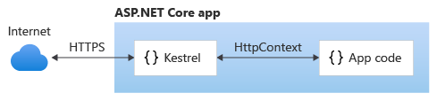
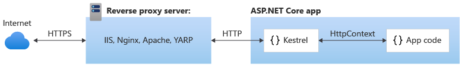

# ack 프로그램

ack 프로그램은 ASP.NET Core 앱의 In-Process HTTP 서버 구현을 사용하여 실행되는 Kestrel 이라는 이름의 웹 서버 프로그램입니다. ack 프로그램은 다음과 같은 기능을 제공합니다.

* 멀티 플랫폼: Windows, Linux 및 macOS에서 실행되는 플랫폼 간 웹 서버입니다.
* 고성능: 많은 수의 동시 연결을 효율적으로 처리하도록 최적화되어 있습니다.
* 경량: 컨테이너 및 에지 디바이스와 같이 리소스가 제한된 환경에서 실행되도록 최적화되었습니다.
* 보안 강화: HTTPS를 지원하고 웹 서버 취약성에 대해 강화됩니다.
* 광범위한 프로토콜 지원: HTTP/1.1, HTTP/2 및 HTTP/3, WebSocket 등등 일반적이면서도 최신 웹 프로토콜을 지원합니다.
* 확장성: 사용자 지정 모듈 운영이 가능한 구성, 미들웨어 기능을 제공합니다.
* 성능 진단: 로깅 및 메트릭과 같은 기본 성능 진단 기능을 제공합니다.

HandStack 에서 제공되는 dbclient, function, logger, repository, transact, wwwroot, checkup 과 같은 모듈은 ack 프로그램 위에서 동작합니다. 이러한 모듈은 각각의 기능을 제공하며, 이러한 모듈을 조합하여 최적의 화면과 기능을 구성합니다.

Kestrel 서버 프로그램은 크게 2가지로 웹 서비스를 호스팅 합니다.

## 네트워크의 요청을 직접 처리하는 에지 서버로 단독 사용



## IIS(인터넷 정보 서비스), Nginx 또는 Apache 같은 역방향 프록시 서버와 함께 사용



## 모듈 DLL 로딩

`ack`는 `AppSettings:LoadModules` 또는 `--modules`로 선택한 모듈의 의존성 탐색 경로를 등록한 후, 각 모듈의 `<ModuleID>.dll`을 먼저 로드합니다. `IsBundledWithHost=true`인 모듈은 호스트 실행 디렉터리의 DLL을 사용합니다.

의존 관리 DLL은 실제 참조 또는 `Assembly.Load` 요청 시 로드합니다. .NET의 기본 호스트·프레임워크 탐색이 먼저 동작하고, 해결되지 않은 요청은 선택된 모듈의 루트에서 찾습니다. 위성 리소스는 문화권 하위 폴더를 확인합니다. 그래도 찾지 못하면 모듈별로 한 번 파일 경로 색인을 생성하여 기존 하위 폴더 배치를 지원합니다. 색인에 있는 DLL 전체를 미리 로드하지는 않습니다.

`LoadPassAssemblyPath`의 개별 파일 및 `/**` 제외 규칙과 `runtimes` 디렉터리의 관리 DLL 탐색 제외를 유지하며, 호환 색인을 만들 때 디렉터리 링크·정션은 따라가지 않습니다. 네이티브 DLL은 이 관리 DLL 로더가 직접 로드하지 않습니다. 모듈들은 `AssemblyLoadContext.Default`를 공유하므로 동일한 이름의 의존 라이브러리는 호환 가능한 버전으로 배포해야 합니다.

DLL 추가·교체 및 로딩 설정 변경에는 프로세스 재시작이 필요합니다. 지연 로딩되는 의존 DLL의 누락은 해당 기능을 처음 실행할 때 발견될 수 있으므로 `/checkip`와 함께 실제 사용하는 모듈 API 및 동적 C# 함수를 검증합니다. 이 최적화는 `ack`에 적용되며 `rdy`의 로딩 방식은 별도로 유지됩니다.

사용자 정의 모듈이 `AppDomain.CurrentDomain.GetAssemblies()` 또는 `Reflector.GetTypeFromName()`으로 참조되지 않은 DLL의 타입을 찾는다면, 먼저 `Assembly.Load("어셈블리이름")`으로 해당 DLL을 명시적으로 로드합니다. 모듈 폴더에 배치한 모든 DLL이 자동으로 선행 로드되지는 않습니다.

## 정적 파일 경로 캐시

`ack`와 `rdy`의 호스트 정적 루트 및 `wwwroot` 모듈의 `WWWRootBasePath`는 공통 미들웨어로 마지막 파일명 또는 마지막 디렉터리명의 대소문자를 보정합니다. 상위 디렉터리의 대소문자는 파일 시스템 규칙을 따르며, 확장자 없는 정적 파일도 지원합니다.

- GET/HEAD 요청에 적용합니다. `/api/` 세그먼트가 있거나 `/api`로 끝나는 경로, 이미 선택된 동적 엔드포인트, `/`로 끝나는 경로는 디렉터리를 탐색하지 않습니다. API 경로 비교는 대소문자를 구분하지 않습니다.
- 실제 경로 매핑과 미존재 결과를 인스턴스당 최대 4,096개, 항목당 최대 10분간 저장합니다.
- 파일 생성·수정·삭제·이름 변경을 감지하면 해당 정적 루트의 캐시를 무효화합니다. 변경 알림이 누락돼도 만료 후 다음 요청에서 다시 조회합니다.
- 파일 내용, HTTP 캐시 헤더와 IP 접근 제어는 기존 정적 파일 파이프라인에서 처리하며, 호스트 종료 시 경로 캐시와 감시 리소스를 해제합니다.

네트워크 공유나 컨테이너에서 파일 변경 알림이 불안정하면 `DOTNET_USE_POLLING_FILE_WATCHER=1`을 설정하고 재시작할 수 있습니다. 폴링에는 반영 지연이 있으므로 운영 파일 시스템에서 확인합니다. [파일 변경 감시 설명](https://learn.microsoft.com/aspnet/core/fundamentals/file-providers?view=aspnetcore-10.0#watch-for-changes)

## appsettings.json 파일 내용

```json
{
    "AppSettings": {
        "HostAccessID": "HANDSTACK_HOSTACCESSID",
        "SystemID": "HANDSTACK",
        "ApplicationID": "HDS",
        "ProgramName": "ack",
        "HostName": "HOSTNAME",
        "InstallType": "L",
        "BusinessServerUrl": "http://localhost:8421/transact/api/transaction/execute",
        "FindGlobalIDServer": "",
        "DomainAPIServer": {
            "ServerID": "SERVERD01",
            "ServerType": "D",
            "Protocol": "http",
            "IP": "localhost",
            "Port": "8421",
            "Path": "/transact/api/transaction/execute",
            "ClientIP": "127.0.0.1"
        },
        "ForwardProxyIP": [],
        "IsAutoUpdate": false,
        "IsConfigurationWatching": false,
        "IsTenantFunction": true,
        "IsExceptionDetailText": true,
        "IsEnabledDevAutoSignIn": false,
        "ContractRequestPath": "view",
        "TenantAppRequestPath": "app",
        "TenantAppBasePath": "../tenants",
        "BatchProgramBasePath": "../batchs",
        "CreateAppTempPath": "../tmp/create_apps",
        "ForbesBasePath": "../forbes",
        "IsModulePurgeContract": true,
        "IsEnabledCSP": false,
        "LoadModuleBasePath": "../modules",
        "LoadModules": [
            "wwwroot",
            "transact",
            "dbclient",
            "graphclient",
            "function",
            "command",
            "prompter",
            "repository",
            "logger",
            "checkup",
            "forwarder"
        ],
        "ModuleConfigurationUrl": [
        ],
        "RunningEnvironment": "D",
        "UseResponseComression": false,
        "UseForwardProxy": false,
        "UseSameIPProxy": false,
        "Security": {
            "EnableSecurityHeaders": true,
            "EnablePublicCorsPolicy": true,
            "ExposeSecretValues": false,
            "WarnOnWildcardAllowClientIP": true,
            "MaxContractSyncFileBytes": 10485760
        },
        "WithOrigins": [
            "http://127.0.0.1",
            "http://127.0.0.1:8421",
            "http://localhost",
            "http://localhost:8421"
        ],
        "WithOnlyIPs": [],
        "SessionState": {
            "IsSession": true,
            "SessionCookieName": "HandStack.Session",
            "CacheType": "Memory",
            "MySqlConnectionString": "Server=127.0.0.1;Port=3306;Database=HandStack_Cache;Uid=handstack;Pwd=handstack~!@34;PersistSecurityInfo=True;SslMode=none;Charset=utf8;Allow User Variables=True;",
            "MySqlSchemaName": "HandStack_Cache",
            "MySqlTableName": "SessionData",
            "SqlServerConnectionString": "Data Source=127.0.0.1;TrustServerCertificate=True;Initial Catalog=HandStack_Cache;User ID=handstack;Password=handstack~!@34;Connection Timeout=0;",
            "SqlServerSchemaName": "dbo",
            "SqlServerTableName": "SessionData"
        },
        "CookiePrefixName": "HandStack",
        "UserSignExpire": -1
    },
    "Serilog": {
        "Using": [ "Serilog.Sinks.File", "Serilog.Sinks.Console" ],
        "MinimumLevel": {
            "Default": "Information",
            "Override": {
                "Microsoft": "Error",
                "System": "Error"
            }
        },
        "Enrich": [ "FromLogContext" ],
        "WriteTo": [
            {
                "Name": "Console",
                "Args": {
                    "outputTemplate": "[{Timestamp:HH:mm:ss} {Level:u3}] {Message:lj}{NewLine}{Exception}"
                }
            },
            {
                "Name": "File",
                "Args": {
                    "path": "../log/app.log",
                    "rollingInterval": "Day",
                    "rollOnFileSizeLimit": true,
                    "buffered": true,
                    "fileSizeLimitBytes": 104857600,
                    "flushToDiskInterval": "00:00:05",
                    "outputTemplate": "[{Timestamp:HH:mm:ss} {Level:u3}] {Message:lj}{NewLine}{Exception}"
                }
            }
        ]
    },
    "Kestrel": {
        "DisableStringReuse": true,
        "Limits": {
            "MaxConcurrentConnections": null,
            "MaxConcurrentUpgradedConnections": null,
            "MaxRequestBodySize": 104857600,
            "KeepAliveTimeout": "00:02:00"
        }
    }
}
```

## 계약 파일 동기화

`AppSettings:UseContractSync`를 `true`로 설정하면 `ack`와 `rdy`의 `POST /contractsync`에서 `handsonapp`이 전송한 계약 및 화면 파일을 동기화할 수 있습니다. 요청은 `hostAccessID` 헤더와 `moduleID`, `contractType`, `destFilePath`, `changeType`, `file` 폼 필드를 사용합니다. 삭제 요청은 `file`을 생략합니다.

허용되는 `contractType`은 `dbclient`, `graphclient`, `function`, `transact`, `command`, `prompter`, `repository`, `wwwroot`입니다. 계약 파일은 `%HANDSTACK_HOME%/modules/<moduleID>/Contracts/<contractType>`와 `%HANDSTACK_HOME%/contracts/<contractType>`에 반영되며, `wwwroot`는 `%HANDSTACK_HOME%/modules/<moduleID>/wwwroot/<moduleID>`에 반영됩니다.

## 개발용 테스트 계정 자동 로그인

`AppSettings:IsEnabledDevAutoSignIn`(기본값 `false`)을 `true`로 설정하고 `RunningEnvironment`가 `D`(개발)인 경우에만, `wwwroot` 모듈의 `GET /wwwroot/api/dev-account/sign-in`이 `module.json`의 `ModuleConfig.DevAutoSignIn`(`UserNo`/`UserID`/`UserName`/`Email`/`Roles`)에 지정한 고정 계정으로 이메일 서명 검증 없이 로그인 쿠키를 발급합니다. 두 조건 중 하나라도 충족하지 않으면 `404 Not Found`를 반환하므로, 운영·스테이징 설정에서는 `IsEnabledDevAutoSignIn`을 켜지 않아야 합니다.

## Serilog 파일 로그 설정

Serilog에 대한 자세한 정보는 다음 웹사이트에서 확인하실 수 있습니다:

### Serilog.Settings.Configuration

Serilog 설정을 Microsoft.Extensions.Configuration에서 읽는 방법에 대해 설명하고 있습니다. 기본적으로, 설정은 Serilog 섹션에서 읽습니다. https://github.com/serilog/serilog-settings-configuration

### AppSettings · serilog/serilog Wiki

App.config 및 Web.config 파일에서 appSettings 기반 구성 구문을 사용하여 최소 수준을 설정하고, 추가 속성으로 이벤트를 풍부하게 하며, 로그 출력을 제어하는 방법에 대해 설명하고 있습니다. https://github.com/serilog/serilog/wiki/AppSettings

### Serilog 공식 문서

Serilog에 대한 설치, 기본 구성, 로그 이벤트 작성, 구조화된 데이터, 제공된 싱크, 디버깅 및 진단에 대한 정보와 조언을 제공합니다. https://serilog.net/

## IpRateLimit 파일 로그 설정

IpRateLimitMiddleware - GitHub: 이 페이지는 IpRateLimitMiddleware에 대한 설명과 사용 방법을 제공합니다. 또한, appsettings.json에서 일반 구성과 IP 규칙을 로드하는 방법에 대해 설명하고 있습니다.

https://github.com/stefanprodan/AspNetCoreRateLimit/wiki/IpRateLimitMiddleware

## Kestrel 서버 설정

Kestrel에 대한 자세한 정보는 다음 웹사이트에서 확인하실 수 있습니다:

Kestrel 웹 서버의 엔드포인트를 구성하는 방법에 대해 설명하고 있습니다. 주소와 프로토콜의 조합으로 엔드포인트를 정의하며, 이를 통해 들어오는 요청을 적절한 미들웨어로 라우팅합니다.

https://learn.microsoft.com/ko-kr/aspnet/core/fundamentals/servers/kestrel/endpoints?view=aspnetcore-10.0

Kestrel 웹 서버의 옵션을 구성하는 방법에 대해 설명하고 있습니다. 일반적인 제한, HTTP/2 제한, 기타 옵션 등에 대한 정보를 제공합니다.

https://learn.microsoft.com/ko-kr/aspnet/core/fundamentals/servers/kestrel/options?view=aspnetcore-10.0

Kestrel이 실행 시간에 구성 변경을 감지하는 방법에 대해 설명하고 있습니다.

https://learn.microsoft.com/ko-kr/aspnet/core/fundamentals/servers/kestrel?view=aspnetcore-10.0

Kestrel 웹 서버에 대한 전반적인 정보를 제공합니다.

https://learn.microsoft.com/ko-kr/dotnet/core/compatibility/aspnet-core/5.0/kestrel-configuration-changes-at-run-time-detected-by-default
