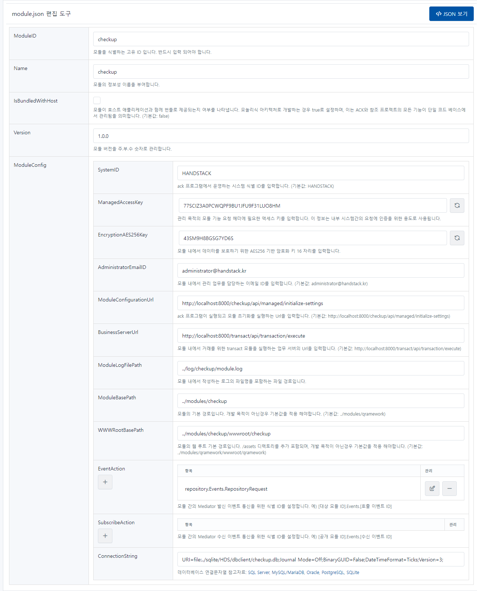

# checkup

태넌트 앱을 관리하기 위한 관리 화면과 기능을 제공하는 모듈입니다.

```json
{
    "ModuleID": "checkup",
    "Name": "checkup",
    "IsBundledWithHost": false,
    "Version": "1.0.0",
    "ModuleConfig": {
        "SystemID": "HANDSTACK",
        "ManagedAccessKey": "6eac215f2f5e495cad4f2abfdcad7644",
        "EncryptionAES256Key": "1234567890123456",
        "AdministratorEmailID": "administrator@handstack.kr",
        "ModuleConfigurationUrl": "http://localhost:8000/checkup/api/managed/initialize-settings",
        "BusinessServerUrl": "http://localhost:8000/transact/api/transaction/execute",
        "ModuleLogFilePath": "../log/checkup/module.log",
        "ModuleBasePath": "../modules/checkup",
        "WWWRootBasePath": "../modules/checkup/wwwroot/checkup",
        "EventAction": [
            "repository.Events.RepositoryRequest"
        ],
        "SubscribeAction": [],
        "ConnectionString": "URI=file:../sqlite/HDS/dbclient/checkup.db;Journal Mode=Off;BinaryGUID=False;DateTimeFormat=Ticks;Version=3;"
    }
}
```
소스) checkup 환경설정 예제

## 옵션 설명

### ModuleID

checkup 모듈을 식별하는 고유 ID 입니다. 반드시 입력 되어야 합니다.

### Name

checkup 모듈의 정보성 이름을 부여합니다.

### IsBundledWithHost

모듈이 호스트 애플리케이션과 함께 번들로 제공되는지 여부를 나타냅니다. 모놀리식 아키텍처로 개발하는 경우 true로 설정하며, 이는 ACK와 참조 프로젝트의 모든 기능이 단일 코드 베이스에서 관리됨을 의미합니다. (기본값: false)

### Version

모듈 버전을 주.부.수 숫자로 관리합니다.

### ModuleConfig

#### SystemID

ack 프로그램에서 운영하는 시스템 식별 ID를 입력합니다. (기본값: HANDSTACK)

#### ManagedAccessKey

관리 목적의 모듈 기능 요청 헤더에 필요한 액세스 키를 입력합니다. 이 정보는 내부 시스템간의 요청에 인증을 위한 용도로 사용됩니다.

#### EncryptionAES256Key

모듈 내에서 데이터를 보호하기 위한 AES256 기반 암호화 키 16 자리를 입력합니다.

#### AdministratorEmailID

모듈 내에서 관리 업무를 담당하는 이메일 ID를 입력합니다. (기본값: administrator@handstack.kr)

#### ModuleConfigurationUrl

ack 프로그램이 실행되고 모듈 초기화를 실행하는 Url을 입력합니다. (기본값: http://localhost:8000/checkup/api/managed/initialize-settings)

#### BusinessServerUrl

모듈 내에서 거래를 위한 transact 모듈을 실행하는 업무 서버의 Url을 입력합니다. (기본값: http://localhost:8000/transact/api/transaction/execute)

#### ModuleLogFilePath

모듈 내에서 작성하는 로그의 파일명을 포함하는 파일 경로입니다.

#### ModuleBasePath
모듈의
기본 경로입니다. 개발 목적이 아닌경우 기본값을 적용해야합니다. (기본값: ../modules/qramework)

#### WWWRootBasePath
../modules/checkup/wwwroot/checkup
모듈의 웹 루트 기본 경로입니다. /assets 디렉토리를 추가 포함되며, 개발 목적이 아닌경우 기본값을 적용해야합니다. (기본값: ../modules/qramework/wwwroot/qramework)

#### EventAction

모듈 간의 Mediator 발신 이벤트 통신을 위한 식별 ID를 설정합니다. 예) [대상 모듈 ID].Events.[호출 이벤트 ID]

#### SubscribeAction

모듈 간의 Mediator 수신 이벤트 통신을 위한 식별 ID를 설정합니다. 예) [공개 모듈 ID].Events.[수신 이벤트 ID]

#### ConnectionString

SQLite 데이터베이스의 연결 문자열을 설정합니다.

> URI=file:../sqlite/HDS/dbclient/checkup.db;Journal Mode=Off;BinaryGUID=False;DateTimeFormat=Ticks;Version=3;

데이터베이스 연결문자열 참고자료:
- [SQLite](https://www.connectionstrings.com/sqlite)

## 설정 정보 관리 화면

프로그램 실행 후, 자세한 내용은 웹 브라우저에서 다음 URL을 통해 확인할 수 있습니다. 또한, 편집한 환경설정을 가져오기 및 내보내기 기능도 제공합니다.

> http://localhost:8000/checkup/module-settings.html

