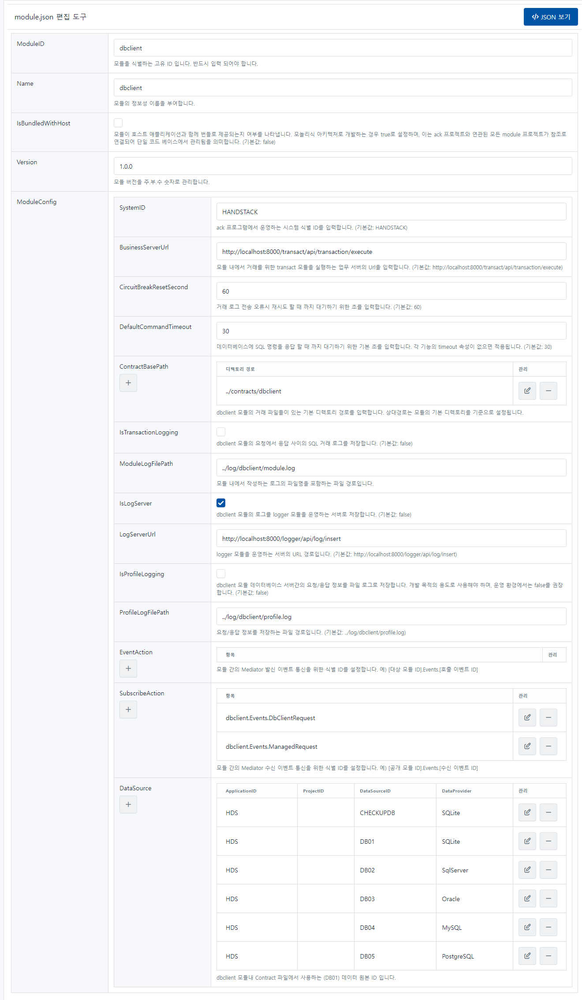

# dbclient

SQL Server, Oracle, MySQL & MariaDB, PostgreSQL, SQLite 데이터베이스 연동을 관리하기 위한 거래 기능을 제공하는 모듈입니다.

기본적으로 각 데이터베이스 예제 연결문자열을 제공하며, 업무에 맞게 데이터베이스 연결 문자열을 설정해야 합니다.

예제로 제공된 연결문자열에 대한 환경설정은 [docker 기반 개발용 데이터베이스 설치하기](/docs/startup/handsonlab/docker-기반-개발용-데이터베이스-설치하기) 문서를 참고하세요

```json
{
    "ModuleID": "dbclient",
    "Name": "dbclient",
    "IsBundledWithHost": false,
    "Version": "1.0.0",
    "ModuleConfig": {
        "SystemID": "HANDSTACK",
        "BusinessServerUrl": "http://localhost:8000/transact/api/transaction/execute",
        "CircuitBreakResetSecond": 60,
        "DefaultCommandTimeout": 30,
        "ContractBasePath": [
            "../contracts/dbclient"
        ],
        "IsTransactionLogging": false,
        "ModuleLogFilePath": "../log/dbclient/module.log",
        "IsLogServer": true,
        "LogServerUrl": "http://localhost:8000/logger/api/log/insert",
        "IsProfileLogging": false,
        "ProfileLogFilePath": "../log/dbclient/profile.log",
        "EventAction": [],
        "SubscribeAction": [
            "dbclient.Events.DbClientRequest",
            "dbclient.Events.ManagedRequest"
        ],
        "DataSource": [
            {
                "ApplicationID": "HDS",
                "ProjectID": "*",
                "DataSourceID": "CHECKUPDB",
                "DataProvider": "SQLite",
                "ConnectionString": "URI=file:../sqlite/HDS/dbclient/checkup.db;Journal Mode=Off;BinaryGUID=False;DateTimeFormat=Ticks;Version=3;",
                "IsEncryption": "N",
                "Comment": "SQLite 기본 데이터베이스"
            },
            {
                "ApplicationID": "HDS",
                "ProjectID": "*",
                "DataSourceID": "DB01",
                "DataProvider": "SQLite",
                "ConnectionString": "URI=file:../sqlite/HDS/dbclient/HDS.db;Journal Mode=Off;BinaryGUID=False;DateTimeFormat=Ticks;Version=3;",
                "IsEncryption": "N",
                "Comment": "SQLite 기본 데이터베이스"
            },
            {
                "ApplicationID": "HDS",
                "ProjectID": "*",
                "DataSourceID": "DB02",
                "DataProvider": "SqlServer",
                "ConnectionString": "Data Source=localhost;Initial Catalog=master;User ID=sa;Password=Strong@Passw0rd;",
                "IsEncryption": "N",
                "Comment": "SqlServer 기본 데이터베이스"
            },
            {
                "ApplicationID": "HDS",
                "ProjectID": "*",
                "DataSourceID": "DB03",
                "DataProvider": "Oracle",
                "ConnectionString": "Data Source=(DESCRIPTION=(ADDRESS=(PROTOCOL=TCP)(HOST=localhost)(PORT=1521))(CONNECT_DATA=(SID=ORCL)));User Id=system;Password=Strong@Passw0rd;",
                "IsEncryption": "N",
                "Comment": "Oracle 기본 데이터베이스"
            },
            {
                "ApplicationID": "HDS",
                "ProjectID": "*",
                "DataSourceID": "DB04",
                "DataProvider": "MySQL",
                "ConnectionString": "Server=localhost;Port=3306;Uid=root;Pwd=Strong@Passw0rd;PersistSecurityInfo=True;SslMode=none;Charset=utf8;Allow User Variables=True;",
                "IsEncryption": "N",
                "Comment": "MySQL 기본 데이터베이스"
            },
            {
                "ApplicationID": "HDS",
                "ProjectID": "*",
                "DataSourceID": "DB05",
                "DataProvider": "PostgreSQL",
                "ConnectionString": "Host=localhost;Port=5432;Database=postgres;User ID=postgres;Password=Strong@Passw0rd;",
                "IsEncryption": "N",
                "Comment": "PostgreSQL 기본 데이터베이스"
            }
        ]
    }
}
```
소스) dbclient 환경설정 예제

## 옵션 설명

### SystemID

### ModuleID

dbclient 모듈을 식별하는 고유 ID 입니다. 반드시 입력 되어야 합니다.

### Name

dbclient 모듈의 정보성 이름을 부여합니다.

### IsBundledWithHost

모듈이 호스트 애플리케이션과 함께 번들로 제공되는지 여부를 나타냅니다. 모놀리식 아키텍처로 개발하는 경우 true로 설정하며, 이는 ack 프로젝트와 연관된 모든 module 프로젝트가 참조로 연결되어 단일 코드 베이스에서 관리됨을 의미합니다. (기본값: false)

### Version

모듈 버전을 주.부.수 숫자로 관리합니다.

### ModuleConfig

#### SystemID

ack 프로그램에서 운영하는 시스템 식별 ID를 입력합니다. (기본값: HANDSTACK)

#### BusinessServerUrl

모듈 내에서 거래를 위한 transact 모듈을 실행하는 업무 서버의 Url을 입력합니다. (기본값: http://localhost:8000/transact/api/transaction/execute)

#### CircuitBreakResetSecond

거래 로그 전송 오류시 재시도 할 때 까지 대기하기 위한 초를 입력합니다. (기본값: 60)

#### DefaultCommandTimeout

데이터베이스에 SQL 명령을 응답 할 때 까지 대기하기 위한 기본 초를 입력합니다. 각 기능의 timeout 속성이 없으면 적용됩니다. (기본값: 30)

#### ContractBasePath

dbclient 모듈의 거래 파일들이 있는 기본 디렉토리 경로를 입력합니다. 상대경로는 모듈의 기본 디렉토리를 기준으로 설정됩니다.

#### IsTransactionLogging

dbclient 모듈의 요청에서 응답 사이의 SQL 거래 로그를 저장합니다. (기본값: false)

#### ModuleLogFilePath

모듈 내에서 작성하는 로그의 파일명을 포함하는 파일 경로입니다.

#### IsLogServer

dbclient 모듈의 로그를 logger 모듈을 운영하는 서버로 저장합니다. (기본값: false)

#### LogServerUrl

logger 모듈을 운영하는 서버의 URL 경로입니다. (기본값: http://localhost:8000/logger/api/log/insert)

#### IsProfileLogging

dbclient 모듈 데이터베이스 서버간의 요청/응답 정보를 파일 로그로 저장합니다. 개발 목적의 용도로 사용해야 하며, 운영 환경에서는 false를 권장합니다. (기본값: false)

#### ProfileLogFilePath

요청/응답 정보를 저장하는 파일 경로입니다. (기본값: ../log/dbclient/profile.log)

#### EventAction

모듈 간의 Mediator 발신 이벤트 통신을 위한 식별 ID를 설정합니다. 예) [대상 모듈 ID].Events.[호출 이벤트 ID]

#### SubscribeAction

모듈 간의 Mediator 수신 이벤트 통신을 위한 식별 ID를 설정합니다. 예) [공개 모듈 ID].Events.[수신 이벤트 ID]

#### DataSource

dbclient 모듈내 Contract 파일에서 사용하는 (DB01) 데이터 원본 ID 입니다.

## 설정 정보 관리 화면

프로그램 실행 후, 자세한 내용은 웹 브라우저에서 다음 URL을 통해 확인할 수 있습니다. 또한, 편집한 환경설정을 가져오기 및 내보내기 기능도 제공합니다.

> http://localhost:8000/dbclient/module-settings.html

