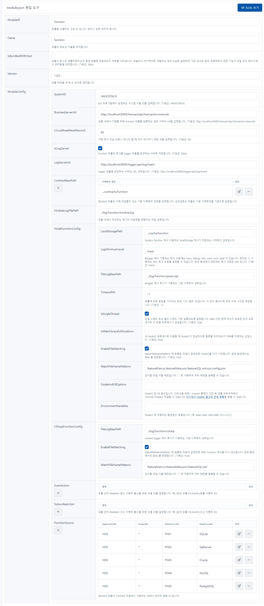

# function

.NET Core 및 함수를 호스팅하고 관리하는 모듈입니다.

```json
{
    "ModuleID": "function",
    "Name": "function",
    "IsBundledWithHost": false,
    "Version": "1.0.0",
    "ModuleConfig": {
        "SystemID": "HANDSTACK",
        "BusinessServerUrl": "http://localhost:8000/transact/api/transaction/execute",
        "CircuitBreakResetSecond": 60,
        "IsLogServer": true,
        "LogServerUrl": "http://localhost:8000/logger/api/log/insert",
        "ContractBasePath": [
            "../contracts/function"
        ],
        "ModuleLogFilePath": "../log/function/module.log",
        "NodeFunctionConfig": {
            "LocalStoragePath": "../cache/function",
            "LogMinimumLevel": "trace",
            "FileLogBasePath": "../log/function/javascript",
            "TimeoutMS": -1,
            "IsSingleThread": true,
            "WatchGracefulShutdown": true,
            "EnableFileWatching": true,
            "WatchFileNamePatterns": [ "featureMain.js", "featureMeta.json", "featureSQL.xml", "syn.config.json" ],
            "NodeAndV8Options": "",
            "EnvironmentVariables": ""
        },
        "CSharpFunctionConfig": {
            "EnableFileWatching": true,
            "FileLogBasePath": "../log/function/csharp",
            "WatchFileNamePatterns": [ "featureMain.cs", "featureMeta.json", "featureSQL.xml" ]
        },
        "EventAction": [],
        "SubscribeAction": [],
        "FunctionSource": [
            {
                "ApplicationID": "HDS",
                "ProjectID": "*",
                "DataSourceID": "FN01",
                "DataProvider": "SQLite",
                "ConnectionString": "URI=file:../sqlite/HDS/dbclient/HDS.db;Journal Mode=Off;BinaryGUID=False;DateTimeFormat=Ticks;Version=3;",
                "IsEncryption": "N",
                "WorkingDirectoryPath": "../tmp/HDS/function/HDS_FN01",
                "Comment": "SQLite 기본 거래"
            },
            {
                "ApplicationID": "HDS",
                "ProjectID": "*",
                "DataSourceID": "FN02",
                "DataProvider": "SqlServer",
                "ConnectionString": "Data Source=localhost;Initial Catalog=master;User ID=sa;Password=Strong@Passw0rd;",
                "IsEncryption": "N",
                "WorkingDirectoryPath": "../tmp/HDS/function/HDS_FN02",
                "Comment": "SqlServer 기본 거래"
            },
            {
                "ApplicationID": "HDS",
                "ProjectID": "*",
                "DataSourceID": "FN03",
                "DataProvider": "Oracle",
                "ConnectionString": "Data Source=(DESCRIPTION=(ADDRESS=(PROTOCOL=TCP)(HOST=localhost)(PORT=1521))(CONNECT_DATA=(SID=ORCL)));User Id=system;Password=Strong@Passw0rd;",
                "IsEncryption": "N",
                "WorkingDirectoryPath": "../tmp/HDS/function/HDS_FN03",
                "Comment": "Oracle 기본 거래"
            },
            {
                "ApplicationID": "HDS",
                "ProjectID": "*",
                "DataSourceID": "FN04",
                "DataProvider": "MySQL",
                "ConnectionString": "Server=localhost;Port=3306;Uid=root;Pwd=Strong@Passw0rd;PersistSecurityInfo=True;SslMode=none;Charset=utf8;Allow User Variables=True;",
                "IsEncryption": "N",
                "WorkingDirectoryPath": "../tmp/HDS/function/HDS_FN04",
                "Comment": "MySQL 기본 거래"
            },
            {
                "ApplicationID": "HDS",
                "ProjectID": "*",
                "DataSourceID": "FN05",
                "DataProvider": "PostgreSQL",
                "ConnectionString": "Host=localhost;Port=5432;Database=postgres;User ID=postgres;Password=Strong@Passw0rd;",
                "IsEncryption": "N",
                "WorkingDirectoryPath": "../tmp/HDS/function/HDS_FN05",
                "Comment": "PostgreSQL 기본 거래"
            }
        ]
    }
}
```
소스) function 환경설정 예제

## 옵션 설명

### ModuleID

모듈을 식별하는 고유 ID 입니다. 반드시 입력 되어야 합니다.

### Name

모듈의 정보성 이름을 부여합니다.

### IsBundledWithHost

모듈이 호스트 애플리케이션과 함께 번들로 제공되는지 여부를 나타냅니다. 모놀리식 아키텍처로 개발하는 경우 true로 설정하며, 이는 ACK와 참조 프로젝트의 모든 기능이 단일 코드 베이스에서 관리됨을 의미합니다. (기본값: false)

Version

모듈 버전을 주.부.수 숫자로 관리합니다.

### ModuleConfig

#### SystemID

ack 프로그램에서 운영하는 시스템 식별 ID를 입력합니다. (기본값: HANDSTACK)

#### BusinessServerUrl

모듈 내에서 거래를 위한 transact 모듈을 실행하는 업무 서버의 Url을 입력합니다. (기본값: http://localhost:8000/transact/api/transaction/execute)

#### CircuitBreakResetSecond

거래 로그 전송 오류시 재시도 할 때 까지 대기하기 위한 초를 입력합니다. (기본값: 60)

#### IsLogServer

function 모듈의 로그를 logger 모듈을 운영하는 서버로 저장합니다. (기본값: false)

#### LogServerUrl

logger 모듈을 운영하는 서버의 URL 경로입니다. (기본값: http://localhost:8000/logger/api/log/insert)

#### ContractBasePath

function 모듈의 거래 파일들이 있는 기본 디렉토리 경로를 입력합니다. 상대경로는 모듈의 기본 디렉토리를 기준으로 설정됩니다.

#### ModuleLogFilePath

모듈 내에서 작성하는 로그의 파일명을 포함하는 파일 경로입니다.

#### NodeFunctionConfig

##### LocalStoragePath

Node.js function 에서 사용하는 localStorage 캐시가 저장되는 디렉토리 경로입니다.

##### LogMinimumLevel

$logger 에서 기록되는 로그 수준에는 trace, debug, info, warn, error, fatal 이 있습니다. 런타임 시 기록되는 최소 로그 수준을 설정할 수 있습니다. 운영 환경에서 권장되는 로그 수준은 info 입니다. (기본값: trace)

##### FileLogBasePath

$logger 에서 로그가 기록되는 기본 디렉토리 경로입니다.

##### TimeoutMS

호출에 대한 응답을 기다리는 최대 기간 (밀리 초)입니다. 이 값이 음수이면 최대 지속 시간은 무한합니다. (기본값: -1)

##### IsSingleThread

단일 스레드 또는 멀티 스레드 기반 실행되도록 설정합니다. false 이면 현재 머신이 보유한 논리 프로세서의 수 만큼 프로세스가 생성됩니다. (기본값: true)

##### IsWatchGracefulShutdown

새 NodeJS 프로세스로 이동할 때 NodeJS가 정상적으로 종료를 처리하는지 여부를 지정하는 값입니다. (기본값: true)

##### EnableFileWatching

WatchFileNamePatterns 에 등록된 파일이 변경되면 NodeJS를 다시 시작합니다. 운영 환경에서는 false 를 권장합니다. (기본값: true)

##### WatchFileNamePatterns

감시할 파일 이름 패턴입니다. "," 로 구분하여 여러 패턴을 등록할 수 있습니다.

##### NodeAndV8Options

NodeJS 및 V8 옵션입니다. 디버깅을 위해 --inspect 플래그 선언 후 크롬 브라우저에서 chrome://inspect 연결할 수 있습니다. 여기에서 NodeJS 옵션의 전체 목록을 찾을 수 있습니다.

##### EnvironmentVariables

NodeJS 에 적용하는 환경변수 목록입니다. (예: AAA=AAA; BBB=BBB; CCC=CCC;)

#### CSharpFunctionConfig

##### FileLogBasePath

context logger 에서 로그가 기록되는 기본 디렉토리 경로입니다.

##### EnableFileWatching

WatchFileNamePatterns 에 등록된 파일이 변경되면 해당 Function 캐시를 다시 갱신합니다. 운영 환경에서는 false 를 권장합니다. (기본값: true)

##### WatchFileNamePatterns

감시할 파일 이름 패턴입니다. "," 로 구분하여 여러 패턴을 등록할 수 있습니다.

#### EventAction

모듈 간의 Mediator 발신 이벤트 통신을 위한 식별 ID를 설정합니다. 예) [대상 모듈 ID].Events.[호출 이벤트 ID]

#### SubscribeAction

모듈 간의 Mediator 수신 이벤트 통신을 위한 식별 ID를 설정합니다. 예) [공개 모듈 ID].Events.[수신 이벤트 ID]

#### FunctionSource

function 모듈내 Contract 파일에서 사용하는 (DB01) 데이터 원본 ID 입니다.

함수에서 접근 가능한 데이터베이스 소스를 설정합니다. 함수 설정에서 DataSourceID를 사용하여 연동 할 수 있는 데이터베이스 소스를 지정할 수 있습니다.

- ApplicationID: 어플리케이션의 ID를 설정합니다.
- ProjectID: 프로젝트의 ID를 설정합니다.
- DataSourceID: 데이터 소스의 ID를 설정합니다.
- DataProvider: 데이터 제공자를 설정합니다.
- ConnectionString: 데이터 소스의 연결 문자열을 설정합니다.
- IsEncryption: 암호화를 사용할지 여부를 설정합니다.
- WorkingDirectoryPath: 작업 디렉토리의 경로를 설정합니다.
- Comment: 주석을 설정합니다.

## 설정 정보 관리 화면

프로그램 실행 후, 자세한 내용은 웹 브라우저에서 다음 URL을 통해 확인할 수 있습니다. 또한, 편집한 환경설정을 가져오기 및 내보내기 기능도 제공합니다.

> http://localhost:8000/function/module-settings.html

