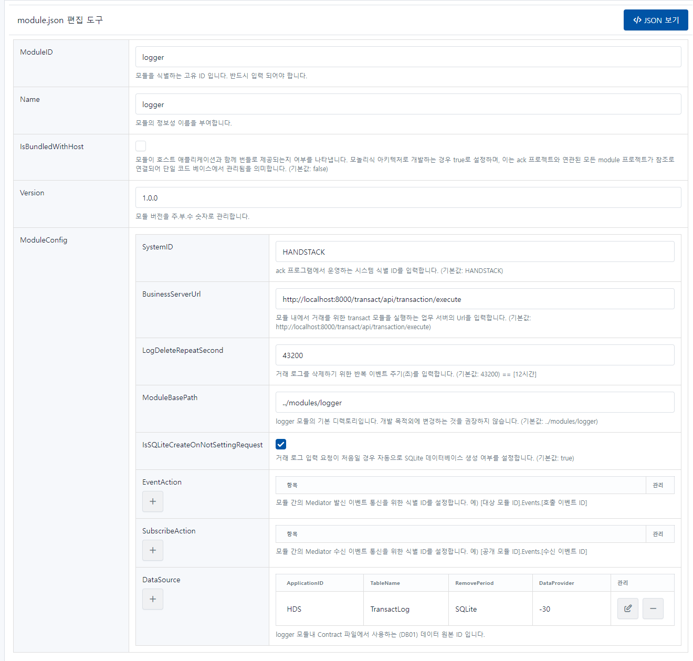

# logger

프로그램내에서 발생하는 이벤트 로그를 기록하는 모듈입니다.

```json
{
    "ModuleID": "logger",
    "Name": "logger",
    "IsBundledWithHost": false,
    "Version": "1.0.0",
    "ModuleConfig": {
        "SystemID": "HANDSTACK",
        "IsSQLiteCreateOnNotSettingRequest": true,
        "LogDeleteRepeatSecond": 43200,
        "ModuleBasePath": "../modules/logger",
        "BusinessServerUrl": "http://localhost:8000/transact/api/transaction/execute",
        "EventAction": [],
        "SubscribeAction": [],
        "DataSource": [
            {
                "ApplicationID": "HDS",
                "TableName": "TransactLog",
                "DataProvider": "SQLite",
                "RemovePeriod": -30,
                "ConnectionString": "URI=file:../sqlite/HDS/logger/transact.db;Journal Mode=Off;BinaryGUID=False;DateTimeFormat=Ticks;Version=3;",
                "IsEncryption": "N"
            }
        ]
    }
}
```
소스) logger 환경설정 예제

## 옵션 설명

### ModuleID

모듈을 식별하는 고유 ID 입니다. 반드시 입력 되어야 합니다.

### Name

모듈의 정보성 이름을 부여합니다.

### IsBundledWithHost

모듈이 호스트 애플리케이션과 함께 번들로 제공되는지 여부를 나타냅니다. 모놀리식 아키텍처로 개발하는 경우 true로 설정하며, 이는 ack 프로젝트와 연관된 모든 module 프로젝트가 참조로 연결되어 단일 코드 베이스에서 관리됨을 의미합니다. (기본값: false)

### Version

모듈 버전을 주.부.수 숫자로 관리합니다.

### ModuleConfig

#### SystemID

ack 프로그램에서 운영하는 시스템 식별 ID를 입력합니다. (기본값: HANDSTACK)

#### BusinessServerUrl

모듈 내에서 거래를 위한 transact 모듈을 실행하는 업무 서버의 Url을 입력합니다. (기본값: http://localhost:8000/transact/api/transaction/execute)

#### LogDeleteRepeatSecond

거래 로그를 삭제하기 위한 반복 이벤트 주기(초)를 입력합니다. (기본값: 43200) == [12시간]

#### ModuleBasePath

logger 모듈의 기본 디렉토리입니다. 개발 목적외에 변경하는 것을 권장하지 않습니다. (기본값: ../modules/logger)

#### IsSQLiteCreateOnNotSettingRequest

거래 로그 입력 요청이 처음일 경우 자동으로 SQLite 데이터베이스 생성 여부를 설정합니다. (기본값: true)

#### EventAction

모듈 간의 Mediator 발신 이벤트 통신을 위한 식별 ID를 설정합니다. 예) [대상 모듈 ID].Events.[호출 이벤트 ID]

#### SubscribeAction

모듈 간의 Mediator 수신 이벤트 통신을 위한 식별 ID를 설정합니다. 예) [공개 모듈 ID].Events.[수신 이벤트 ID]

#### DataSource

logger 모듈내 Contract 파일에서 사용하는 (DB01) 데이터 원본 ID 입니다.

데이터베이스 연결 정보를 설정합니다. 데이터베이스 연결 정보는 다음과 같은 속성을 가집니다.

- ApplicationID: 거래 로그를 입력할 ApplicationID를 설정합니다.
- TableName: 거래 로그 테이블명을 설정합니다.
- DataProvider: 데이터베이스 유형을 설정합니다. SqlServer, Oracle, MySQL, PostgreSQL, SQLite 중 하나를 설정합니다.
- RemovePeriod: 로그를 삭제할 기간을 설정합니다. 설정된 기간 이전의 로그는 정기적으로 삭제됩니다. -1로 설정하면 로그를 삭제하지 않습니다.
- ConnectionString: DataProvider에 설정된 데이터베이스의 연결 문자열을 설정합니다.
- IsEncryption: 업무에 사용 하는 데이터베이스의 연결 문자열을 암호화할지 여부를 설정합니다. 암호화를 사용하지 않을 경우 "N"을 설정합니다.

## 설정 정보 관리 화면

프로그램 실행 후, 자세한 내용은 웹 브라우저에서 다음 URL을 통해 확인할 수 있습니다. 또한, 편집한 환경설정을 가져오기 및 내보내기 기능도 제공합니다.

> http://localhost:8000/logger/module-settings.html

