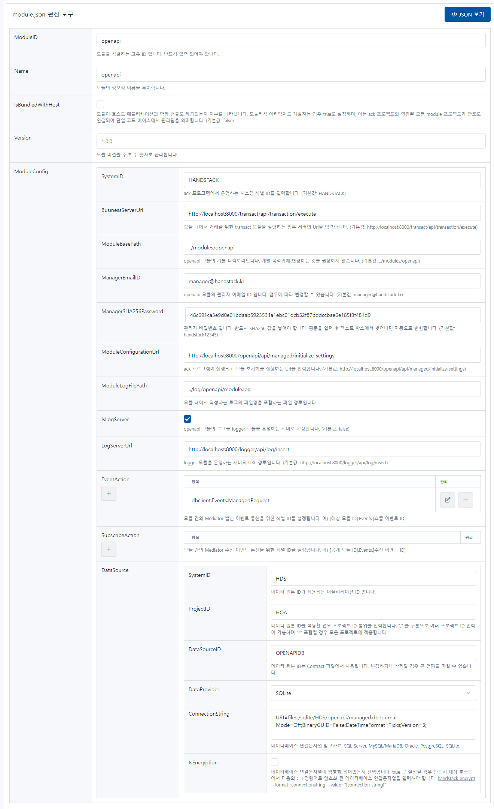

# openapi

데이터베이스 데이터를 Open API로 제공 하는 모듈입니다. 외부 시스템과 연동을 위해 API 서비스 관리, 서비스 키 발급, 접근 권한 제어, API 사용 통계 등의 기능을 제공합니다.

```json
{
    "ModuleID": "openapi",
    "Name": "openapi",
    "IsBundledWithHost": false,
    "Version": "1.0.0",
    "ModuleConfig": {
        "SystemID": "HANDSTACK",
        "ModuleBasePath": "../modules/openapi",
        "ManagerEmailID": "manager@handstack.kr",
        "ManagerSHA256Password": "48c691ca3e9d0e01bdaab5923534a1ebc01dcb52f87bddccbae6e185f3f481d9",
        "ModuleConfigurationUrl": "http://localhost:8421/openapi/api/managed/initialize-settings",
        "BusinessServerUrl": "http://localhost:8421/transact/api/transaction/execute",
        "ModuleLogFilePath": "../log/openapi/module.log",
        "IsLogServer": true,
        "LogServerUrl": "http://localhost:8421/logger/api/log/insert",
        "DataSource": {
            "ApplicationID": "HDS",
            "ProjectID": "HOA",
            "DataSourceID": "OPENAPIDB",
            "DataProvider": "SQLite",
            "ConnectionString": "URI=file:../sqlite/HDS/openapi/managed.db;Journal Mode=Off;BinaryGUID=False;DateTimeFormat=Ticks;Version=3;",
            "IsEncryption": "N"
        },
        "EventAction": [
            "dbclient.Events.ManagedRequest"
        ],
        "SubscribeAction": []
    }
}
```
소스) openapi 환경설정 예제

## 옵션 설명

### ModuleID

모듈을 식별하는 고유 ID 입니다. 반드시 입력 되어야 합니다.

### Name

모듈의 정보성 이름을 부여합니다.

### IsBundledWithHost

모듈이 호스트 애플리케이션과 함께 번들로 제공되는지 여부를 나타냅니다. 모놀리식 아키텍처로 개발하는 경우 true로 설정하며, 이는 ack 프로젝트와 연관된 모든 module 프로젝트가 참조로 연결되어 단일 코드 베이스에서 관리됨을 의미합니다. (기본값: false)

### Version

모듈 버전을 주.부.수 숫자로 관리합니다.

### ModuleConfig

#### SystemID

ack 프로그램에서 운영하는 시스템 식별 ID를 입력합니다. (기본값: HANDSTACK)

#### BusinessServerUrl

모듈 내에서 거래를 위한 transact 모듈을 실행하는 업무 서버의 Url을 입력합니다. (기본값: http://localhost:8421/transact/api/transaction/execute)

#### ModuleBasePath

openapi 모듈의 기본 디렉토리입니다. 개발 목적외에 변경하는 것을 권장하지 않습니다. (기본값: ../modules/openapi)

#### ManagerEmailID

openapi 모듈의 관리자 이메일 ID 입니다. 업무에 따라 변경할 수 있습니다. (기본값: manager@handstack.kr)

#### ManagerSHA256Password

관리자 비밀번호 입니다. 반드시 SHA256 값을 넣어야 합니다. 평문을 입력 후 텍스트 박스에서 벗어나면 자동으로 변환합니다. (기본값: handstack12345)

#### ModuleConfigurationUrl

ack 프로그램이 실행되고 모듈 초기화를 실행하는 Url을 입력합니다. (기본값: http://localhost:8421/openapi/api/managed/initialize-settings)

#### ModuleLogFilePath

모듈 내에서 작성하는 로그의 파일명을 포함하는 파일 경로입니다.

#### IsLogServer

openapi 모듈의 로그를 logger 모듈을 운영하는 서버로 저장합니다. (기본값: false)

#### LogServerUrl

logger 모듈을 운영하는 서버의 URL 경로입니다. (기본값: http://localhost:8421/logger/api/log/insert)

#### EventAction

모듈 간의 Mediator 발신 이벤트 통신을 위한 식별 ID를 설정합니다. 예) [대상 모듈 ID].Events.[호출 이벤트 ID]

#### SubscribeAction

모듈 간의 Mediator 수신 이벤트 통신을 위한 식별 ID를 설정합니다. 예) [공개 모듈 ID].Events.[수신 이벤트 ID]

#### DataSource

##### SystemID

데이터 원본 ID가 적용되는 어플리케이션 ID 입니다.

##### ProjectID

데이터 원본 ID를 적용할 업무 프로젝트 ID 범위를 입력합니다. "," 를 구분으로 여러 프로젝트 ID 입력이 가능하며 "*" 포함될 경우 모든 프로젝트에 적용합니다.

##### DataSourceID

데이터 원본 ID는 Contract 파일에서 사용됩니다. 변경하거나 삭제할 경우 큰 영향을 미칠 수 있습니다.

##### DataProvider

데이터베이스 제공자를 다음의 항목중에 하나를 입력합니다.

- SqlServer
- MySQL
- Oracle
- PostgreSQL
- SQLite

##### ConnectionString

업무에 사용 하는 데이터베이스 연결 문자열을 설정합니다. 데이터베이스 연결문자열 참고자료:

- [SQL Server](https://www.connectionstrings.com/sql-server),
- [MySQL/MariaDB](https://www.connectionstrings.com/mysql),
- [Oracle](https://www.connectionstrings.com/oracle),
- [PostgreSQL](https://www.connectionstrings.com/postgresql),
- [SQLite](https://www.connectionstrings.com/sqlite)

##### IsEncryption
데이터베이스 연결문자열이 암호화 되어있는지 선택합니다. true 로 설정할 경우 반드시 대상 호스트에서 다음의 CLI 명령어로 암호화 된 데이터베이스 연결문자열을 입력해야 합니다. handstack encrypt --format=connectionstring --value="[connection string]"

## 설정 정보 관리 화면

프로그램 실행 후, 자세한 내용은 웹 브라우저에서 다음 URL을 통해 확인할 수 있습니다. 또한, 편집한 환경설정을 가져오기 및 내보내기 기능도 제공합니다.

> http://localhost:8421/openapi/module-settings.html

