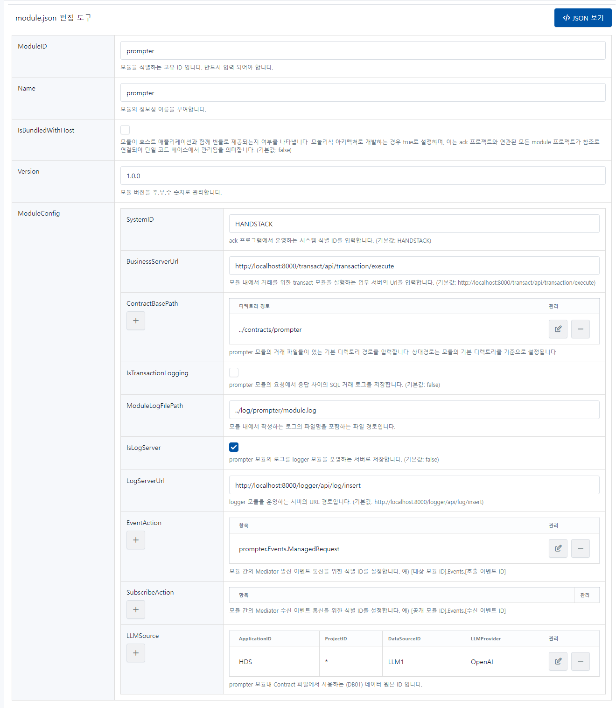

# prompter

시맨틱 커널을 기반으로 LLM의 프롬프트 명령을 Open API로 제공 하는 모듈입니다.

```json
{
    "ModuleID": "prompter",
    "Name": "prompter",
    "IsBundledWithHost": false,
    "Version": "1.0.0",
    "ModuleConfig": {
        "SystemID": "HANDSTACK",
        "ModuleBasePath": "../modules/prompter",
        "ContractBasePath": [
            "../contracts/prompter"
        ],
        "BusinessServerUrl": "http://localhost:8000/transact/api/transaction/execute",
        "IsTransactionLogging": false,
        "ModuleLogFilePath": "../log/prompter/module.log",
        "IsLogServer": true,
        "LogServerUrl": "http://localhost:8000/logger/api/log/insert",
        "EventAction": [
            "prompter.Events.ManagedRequest"
        ],
        "SubscribeAction": [],
        "LLMSource": [
            {
                "ApplicationID": "HDS",
                "ProjectID": "*",
                "DataSourceID": "LLM1",
                "LLMProvider": "OpenAI",
                "ApiKey": "[sk-proj-API...키]",
                "ModelID": "gpt-3.5-turbo",
                "Comment": "OpenAI 프롬프트 API"
            }
        ]
    }
}
```
소스) prompter 환경설정 예제

## 옵션 설명

### ModuleID

모듈을 식별하는 고유 ID 입니다. 반드시 입력 되어야 합니다.

### Name

모듈의 정보성 이름을 부여합니다.

### IsBundledWithHost

모듈이 호스트 애플리케이션과 함께 번들로 제공되는지 여부를 나타냅니다. 모놀리식 아키텍처로 개발하는 경우 true로 설정하며, 이는 ack 프로젝트와 연관된 모든 module 프로젝트가 참조로 연결되어 단일 코드 베이스에서 관리됨을 의미합니다. (기본값: false)

### Version

모듈 버전을 주.부.수 숫자로 관리합니다.

### ModuleConfig

#### SystemID

ack 프로그램에서 운영하는 시스템 식별 ID를 입력합니다. (기본값: HANDSTACK)

#### BusinessServerUrl

모듈 내에서 거래를 위한 transact 모듈을 실행하는 업무 서버의 Url을 입력합니다. (기본값: http://localhost:8000/transact/api/transaction/execute)

#### ContractBasePath

prompter 모듈의 거래 파일들이 있는 기본 디렉토리 경로를 입력합니다. 상대경로는 모듈의 기본 디렉토리를 기준으로 설정됩니다.

#### IsTransactionLogging

prompter 모듈의 요청에서 응답 사이의 SQL 거래 로그를 저장합니다. (기본값: false)

#### ModuleLogFilePath

모듈 내에서 작성하는 로그의 파일명을 포함하는 파일 경로입니다.

#### IsLogServer

prompter 모듈의 로그를 logger 모듈을 운영하는 서버로 저장합니다. (기본값: false)

#### LogServerUrl

logger 모듈을 운영하는 서버의 URL 경로입니다. (기본값: http://localhost:8000/logger/api/log/insert)

#### EventAction

모듈 간의 Mediator 발신 이벤트 통신을 위한 식별 ID를 설정합니다. 예) [대상 모듈 ID].Events.[호출 이벤트 ID]

#### SubscribeAction

모듈 간의 Mediator 수신 이벤트 통신을 위한 식별 ID를 설정합니다. 예) [공개 모듈 ID].Events.[수신 이벤트 ID]

#### LLMSource

prompter 모듈내 Contract 파일에서 사용하는 (DB01) 데이터 원본 ID 입니다.

함수에서 접근 가능한 데이터베이스 소스를 설정합니다. 함수 설정에서 DataSourceID를 사용하여 연동 할 수 있는 데이터베이스 소스를 지정할 수 있습니다.

- ApplicationID: 어플리케이션의 ID를 설정합니다.
- ProjectID: 프로젝트의 ID를 설정합니다.
- DataSourceID: 데이터 소스의 ID를 설정합니다.
- LLMProvider: LLM 제공자를 설정합니다. (기본값: OpenAI)
- ApiKey: LLM 서비스에서 발급한 ApiKey를 입력합니다.
- ModelID: LLM 서비스에서 제공하는 모델 ID를 입력합니다. 예) https://platform.openai.com/docs/models (기본값: gpt-3.5-turbo)
- Comment: 주석을 설정합니다.

## 설정 정보 관리 화면

프로그램 실행 후, 자세한 내용은 웹 브라우저에서 다음 URL을 통해 확인할 수 있습니다. 또한, 편집한 환경설정을 가져오기 및 내보내기 기능도 제공합니다.

> http://localhost:8000/prompter/module-settings.html

