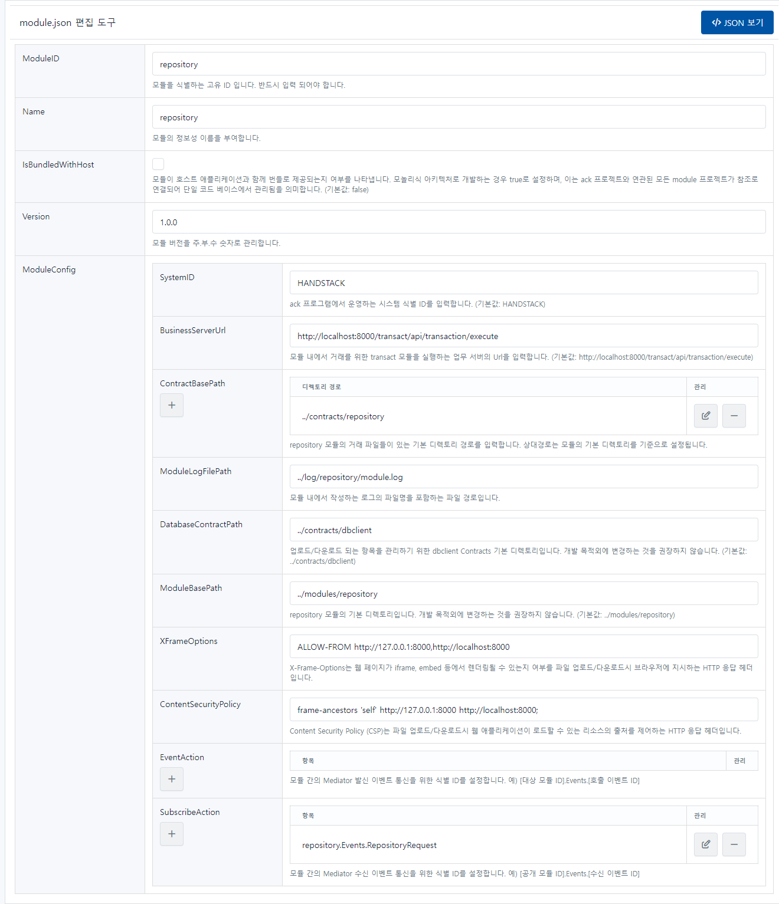

# repository

파일 업로드/다운로드 및 파일 메타데이터 관리를 위한 모듈입니다.

```json
{
    "ModuleID": "repository",
    "Name": "repository",
    "IsBundledWithHost": false,
    "Version": "1.0.0",
    "ModuleConfig": {
        "SystemID": "HANDSTACK",
        "FileServerUrl": "http://localhost:8421",
        "BusinessServerUrl": "http://localhost:8421/transact/api/transaction/execute",
        "ContractBasePath": [
            "../contracts/repository"
        ],
        "ModuleLogFilePath": "../log/repository/module.log",
        "DatabaseContractPath": "../contracts/dbclient",
        "ModuleBasePath": "../modules/repository",
        "EventAction": [],
        "SubscribeAction": [ "repository.Events.RepositoryRequest" ],
        "XFrameOptions": "ALLOW-FROM http://127.0.0.1:8421,http://localhost:8421",
        "ContentSecurityPolicy": "frame-ancestors 'self' http://127.0.0.1:8421 http://localhost:8421;"
    }
}
```
소스) repository 환경설정 예제

## 옵션 설명

### ModuleID

모듈을 식별하는 고유 ID 입니다. 반드시 입력 되어야 합니다.

### Name

모듈의 정보성 이름을 부여합니다.

### IsBundledWithHost

모듈이 호스트 애플리케이션과 함께 번들로 제공되는지 여부를 나타냅니다. 모놀리식 아키텍처로 개발하는 경우 true로 설정하며, 이는 ack 프로젝트와 연관된 모든 module 프로젝트가 참조로 연결되어 단일 코드 베이스에서 관리됨을 의미합니다. (기본값: false)

### Version

모듈 버전을 주.부.수 숫자로 관리합니다.

### ModuleConfig

#### SystemID

ack 프로그램에서 운영하는 시스템 식별 ID를 입력합니다. (기본값: HANDSTACK)

#### BusinessServerUrl

모듈 내에서 거래를 위한 transact 모듈을 실행하는 업무 서버의 Url을 입력합니다. (기본값: http://localhost:8421/transact/api/transaction/execute)

#### ContractBasePath

repository 모듈의 거래 파일들이 있는 기본 디렉토리 경로를 입력합니다. 상대경로는 모듈의 기본 디렉토리를 기준으로 설정됩니다.

#### ModuleLogFilePath

모듈 내에서 작성하는 로그의 파일명을 포함하는 파일 경로입니다.

#### DatabaseContractPath

업로드/다운로드 되는 항목을 관리하기 위한 dbclient Contracts 기본 디렉토리입니다. 개발 목적외에 변경하는 것을 권장하지 않습니다. (기본값: ../contracts/dbclient)

#### ModuleBasePath

repository 모듈의 기본 디렉토리입니다. 개발 목적외에 변경하는 것을 권장하지 않습니다. (기본값: ../modules/repository)

#### XFrameOptions

X-Frame-Options는 웹 페이지가 iframe, embed 등에서 렌더링될 수 있는지 여부를 파일 업로드/다운로드시 브라우저에 지시하는 HTTP 응답 헤더입니다.

#### ContentSecurityPolicy

Content Security Policy (CSP)는 파일 업로드/다운로드시 웹 애플리케이션이 로드할 수 있는 리소스의 출처를 제어하는 HTTP 응답 헤더입니다.

#### EventAction

모듈 간의 Mediator 발신 이벤트 통신을 위한 식별 ID를 설정합니다. 예) [대상 모듈 ID].Events.[호출 이벤트 ID]

#### SubscribeAction

모듈 간의 Mediator 수신 이벤트 통신을 위한 식별 ID를 설정합니다. 예) [공개 모듈 ID].Events.[수신 이벤트 ID]

## 설정 정보 관리 화면

프로그램 실행 후, 자세한 내용은 웹 브라우저에서 다음 URL을 통해 확인할 수 있습니다. 또한, 편집한 환경설정을 가져오기 및 내보내기 기능도 제공합니다.

> http://localhost:8421/repository/module-settings.html

