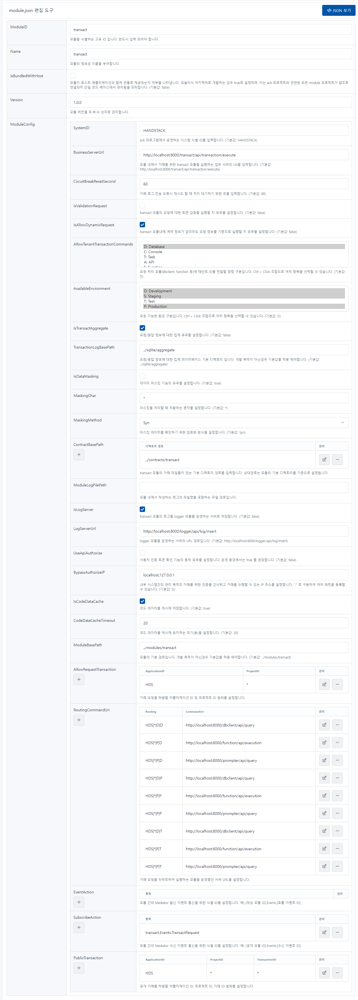

# transact

클라이언트의 거래 요청을 수신하여 데이터베이스, 함수, 외부 API 등을 호출하여 처리하고 결과를 반환하는 모듈입니다.

```json
{
    "ModuleID": "transact",
    "Name": "transact",
    "IsBundledWithHost": false,
    "Version": "1.0.0",
    "ModuleConfig": {
        "SystemID": "HANDSTACK",
        "BusinessServerUrl": "http://localhost:8421/transact/api/transaction/execute",
        "CircuitBreakResetSecond": 60,
        "IsValidationRequest": false,
        "IsAllowDynamicRequest": true,
        "AllowTenantTransactionCommands": [ "D" ],
        "IsLogServer": true,
        "LogServerUrl": "http://localhost:8421/logger/api/log/insert",
        "IsTransactionLogging": true,
        "IsTransactAggregate": true,
        "IsDataMasking": false,
        "MaskingChar": "*",
        "MaskingMethod": "Syn",
        "ContractBasePath": [
            "../contracts/transact"
        ],
        "AvailableEnvironment": [ "P", "D", "S" ],
        "IsCodeDataCache": true,
        "CodeDataCacheTimeout": 20,
        "ModuleBasePath": "../modules/transact",
        "TransactionLogBasePath": "../sqlite/aggregate",
        "UseApiAuthorize": false,
        "BypassAuthorizeIP": [
            "localhost",
            "127.0.0.1"
        ],
        "AllowRequestTransactions": {
            "HDS": [ "*" ]
        },
        "RoutingCommandUri": {
            "HDS|*|D|D": "http://localhost:8421/dbclient/api/query",
            "HDS|*|F|D": "http://localhost:8421/function/api/execution",
            "HDS|*|P|D": "http://localhost:8421/prompter/api/query",
            "HDS|*|D|P": "http://localhost:8421/dbclient/api/query",
            "HDS|*|F|P": "http://localhost:8421/function/api/execution",
            "HDS|*|P|P": "http://localhost:8421/prompter/api/query",
            "HDS|*|D|T": "http://localhost:8421/dbclient/api/query",
            "HDS|*|F|T": "http://localhost:8421/function/api/execution",
            "HDS|*|P|T": "http://localhost:8421/prompter/api/query"
        },
        "EventAction": [],
        "SubscribeAction": [
            "transact.Events.TransactRequest"
        ],
        "PublicTransactions": [
            {
                "ApplicationID": "HDS",
                "ProjectID": "*",
                "TransactionID": "*"
            }
        ]
    }
}
```
소스) transact 환경설정 예제

## 옵션 설명

### ModuleID	

모듈을 식별하는 고유 ID 입니다. 반드시 입력 되어야 합니다.

### Name	

모듈의 정보성 이름을 부여합니다.

### IsBundledWithHost	

모듈이 호스트 애플리케이션과 함께 번들로 제공되는지 여부를 나타냅니다. 모놀리식 아키텍처로 개발하는 경우 true로 설정하며, 이는 ack 프로젝트와 연관된 모든 module 프로젝트가 참조로 연결되어 단일 코드 베이스에서 관리됨을 의미합니다. (기본값: false)

### Version	

모듈 버전을 주.부.수 숫자로 관리합니다.

### ModuleConfig	

#### SystemID	

ack 프로그램에서 운영하는 시스템 식별 ID를 입력합니다. (기본값: HANDSTACK)

#### BusinessServerUrl	

모듈 내에서 거래를 위한 transact 모듈을 실행하는 업무 서버의 Url을 입력합니다. (기본값: http://localhost:8421/transact/api/transaction/execute)

#### CircuitBreakResetSecond	

거래 로그 전송 오류시 재시도 할 때 까지 대기하기 위한 초를 입력합니다. (기본값: 60)

#### IsValidationRequest	

transact 모듈의 요청에 대한 토큰 검증을 실행할 지 유무를 설정합니다. (기본값: false)

#### IsAllowDynamicRequest	

transact 모듈내에 계약 정보가 없더라도 요청 정보를 기준으로 실행할 지 유무를 설정합니다. (기본값: false)

#### AllowTenantTransactionCommands

요청 처리 모듈(dbclient, function 등)에 태넌트 ID를 전달할 명령 구분입니다. 여러 항목을 입력 할 수 있습니다. (기본값: D)

- D: Database
- C: Console
- T: Task
- A: API
- F: Function
- P: Prompter
- R: ReturnResult

#### AvailableEnvironment

요청 가능한 환경 구분입니다. 여러 항목을 입력 할 수 있습니다. (기본값: D)

- D: Development
- S: Staging
- T: Test
- P: Production

#### IsTransactAggregate	

요청/응답 정보에 대한 집계 유무를 설정합니다. (기본값: false)

#### TransactionLogBasePath	

요청/응답 정보에 대한 집계 데이터베이스 기본 디렉토리 입니다. 개발 목적이 아닌경우 기본값을 적용 해야합니다. (기본값: ../sqlite/aggregate)

#### IsDataMasking	

데이터 마스킹 기능의 유무를 설정합니다. (기본값: true)

#### MaskingChar	

마스킹을 처리할 때 치환하는 문자를 설정합니다. (기본값: *)

#### MaskingMethod	

마스킹 데이터를 확인하기 위한 암호화 방식을 설정합니다. (기본값: Syn)

#### ContractBasePath

transact 모듈의 거래 파일들이 있는 기본 디렉토리 경로를 입력합니다. 상대경로는 모듈의 기본 디렉토리를 기준으로 설정됩니다.

#### ModuleLogFilePath	

모듈 내에서 작성하는 로그의 파일명을 포함하는 파일 경로입니다.

#### IsLogServer	

transact 모듈의 로그를 logger 모듈을 운영하는 서버로 저장합니다. (기본값: false)

#### LogServerUrl	

logger 모듈을 운영하는 서버의 URL 경로입니다. (기본값: http://localhost:8421/logger/api/log/insert)

#### UseApiAuthorize	

사용자 인증 토큰 확인 기능의 동작 유무를 설정합니다. 운영 환경에서는 true 를 권장합니다. (기본값: false)

#### BypassAuthorizeIP	

내부 시스템간의 관리 목적의 거래를 위한 인증을 건너뛰고 거래를 수행할 수 있는 IP 주소를 설정합니다. "," 로 구분하여 여러 패턴을 등록할 수 있습니다. (기본값: D)

#### IsCodeDataCache	

코드 데이터를 캐시에 저장합니다. (기본값: true)

#### CodeDataCacheTimeout	

코드 데이터를 캐시에 유지하는 주기(분)을 설정합니다. (기본값: 20)

#### ModuleBasePath	

모듈의 기본 경로입니다. 개발 목적이 아닌경우 기본값을 적용 해야합니다. (기본값: ../modules/transact)

#### AllowRequestTransaction
	
거래 요청을 허용할 어플리케이션 ID 및 프로젝트 ID 범위를 설정합니다.

#### RoutingCommandUri

거래 요청을 라우트하여 실행하는 모듈을 운영중인 서버 URL을 설정합니다.

#### EventAction

모듈 간의 Mediator 발신 이벤트 통신을 위한 식별 ID를 설정합니다. 예) [대상 모듈 ID].Events.[호출 이벤트 ID]

#### SubscribeAction

모듈 간의 Mediator 수신 이벤트 통신을 위한 식별 ID를 설정합니다. 예) [공개 모듈 ID].Events.[수신 이벤트 ID]

#### PublicTransaction

공개 거래를 적용할 어플리케이션 ID, 프로젝트 ID, 거래 ID 범위를 설정합니다.

## 설정 정보 관리 화면

프로그램 실행 후, 자세한 내용은 웹 브라우저에서 다음 URL을 통해 확인할 수 있습니다. 또한, 편집한 환경설정을 가져오기 및 내보내기 기능도 제공합니다.

> http://localhost:8421/transact/module-settings.html

