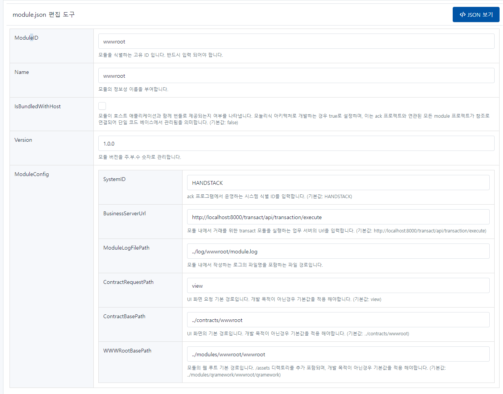

# wwwroot

프로그램과 태넌트 앱의 화면 구성에 필요한 리소스를 제공하는 모듈입니다.

```json
{
    "ModuleID": "wwwroot",
    "Name": "wwwroot",
    "IsBundledWithHost": false,
    "Version": "1.0.0",
    "ModuleConfig": {
        "SystemID": "HANDSTACK",
        "BusinessServerUrl": "http://localhost:8000/transact/api/transaction/execute",
        "ModuleLogFilePath": "../log/wwwroot/module.log",
        "ContractRequestPath": "view",
        "ContractBasePath": "../contracts/wwwroot",
        "WWWRootBasePath": "../modules/wwwroot/wwwroot"
    }
}
```
소스) wwwroot 환경설정 예제

## 옵션 설명

### ModuleID

모듈을 식별하는 고유 ID 입니다. 반드시 입력 되어야 합니다.

### Name

모듈의 정보성 이름을 부여합니다.

### IsBundledWithHost

모듈이 호스트 애플리케이션과 함께 번들로 제공되는지 여부를 나타냅니다. 모놀리식 아키텍처로 개발하는 경우 true로 설정하며, 이는 ack 프로젝트와 연관된 모든 module 프로젝트가 참조로 연결되어 단일 코드 베이스에서 관리됨을 의미합니다. (기본값: false)

### Version

모듈 버전을 주.부.수 숫자로 관리합니다.

### ModuleConfig

#### SystemID

ack 프로그램에서 운영하는 시스템 식별 ID를 입력합니다. (기본값: HANDSTACK)

#### BusinessServerUrl

모듈 내에서 거래를 위한 transact 모듈을 실행하는 업무 서버의 Url을 입력합니다. (기본값: http://localhost:8000/transact/api/transaction/execute)

#### ModuleLogFilePath

모듈 내에서 작성하는 로그의 파일명을 포함하는 파일 경로입니다.

#### ContractRequestPath

UI 화면 요청 기본 경로입니다. 개발 목적이 아닌경우 기본값을 적용 해야합니다. (기본값: view)

#### ContractBasePath

UI 화면의 기본 경로입니다. 개발 목적이 아닌경우 기본값을 적용 해야합니다. (기본값: ../contracts/wwwroot)

#### WWWRootBasePath

모듈의 웹 루트 기본 경로입니다. /assets 디렉토리를 추가 포함되며, 개발 목적이 아닌경우 기본값을 적용 해야합니다. (기본값: ../modules/qramework/wwwroot/qramework)

## 설정 정보 관리 화면

프로그램 실행 후, 자세한 내용은 웹 브라우저에서 다음 URL을 통해 확인할 수 있습니다. 또한, 편집한 환경설정을 가져오기 및 내보내기 기능도 제공합니다.

> http://localhost:8000/module-settings.html

