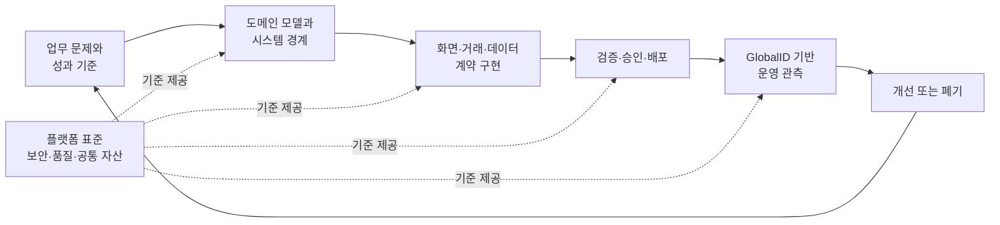

# HandStack 도메인 주도 로우코드 거버넌스

> 현업이 직접 만들고 IT가 안전하게 운영하는 정보화 시스템을 위한 기준입니다.

## 왜 거버넌스가 필요한가

업무의 규칙과 예외를 가장 잘 아는 사람은 도메인 담당자입니다. 그러나 실제 정보화 시스템은 중앙 IT 조직이나 외부 개발사에 의존하는 경우가 많습니다. 요구사항이 여러 단계를 거치는 동안 맥락이 누락되고, 작은 변경에도 분석·견적·개발·검수·배포가 반복됩니다.

반대로 도메인 담당자에게 개발 권한만 열어 주면 비슷한 화면과 데이터가 중복되고 보안·품질·운영 기준이 달라질 수 있습니다. 필요한 것은 중앙 통제와 현업 자율성 중 하나를 선택하는 일이 아닙니다.

> **중앙 IT는 안전한 경계와 공통 기반을 제공하고, 도메인 팀은 그 경계 안에서 필요한 시스템을 직접 구현합니다.**

HandStack 로우코드 거버넌스는 이 운영 모델을 만들기 위한 역할, 표준, 승인 기준과 측정 방법을 정의합니다.

## HandStack이 말하는 로우코드

HandStack은 화면을 그리는 도구만 제공하는 노코드 제품이 아닙니다. HTML, JavaScript, SQL 같은 표준 기술을 유지하면서 반복되는 연결 코드와 운영 구성을 선언적인 계약으로 옮깁니다.

| 개발 관심사 | HandStack의 단순화 방식 |
|---|---|
| 화면 구성 | 선언적 UI 컨트롤과 데이터 바인딩 |
| 화면 동작 | 정해진 JavaScript 객체 구조와 이벤트 규칙 |
| 데이터 처리 | `dbclient` XML 계약으로 SQL과 파라미터 관리 |
| 업무 거래 | `transact` JSON 계약으로 입력·출력·실행 대상 관리 |
| 전문 로직 | 필요한 경우에만 `function` 모듈로 확장 |
| 변경 관리 | 화면과 계약을 일반 소스처럼 Git으로 관리 |
| 운영 추적 | GlobalID와 거래 로그로 요청 흐름 확인 |

따라서 HandStack의 로우코드는 **코드를 없애는 방식**이 아니라 **도메인 구현에 필요한 코드의 종류와 연결 지점을 줄이고 표준화하는 방식**입니다. 도메인 팀은 업무 규칙과 데이터에 집중하고, 플랫폼 팀은 공통 실행 환경과 통제 장치를 관리합니다.

## 운영 원칙: 중앙 표준, 도메인 자율 구현



이 모델은 책임을 다음과 같이 나눕니다.

- **도메인 책임자:** 업무 목표, 용어, 규칙, 우선순위와 완료 조건을 결정합니다.
- **도메인 빌더:** 데이터 모델, 화면, 거래 계약과 단순 업무 규칙을 구현합니다.
- **플랫폼 담당자:** 공통 모듈, 템플릿, 개발·배포 환경을 제공합니다.
- **데이터·보안 담당자:** 데이터 접근, 공개 거래, 인증·인가 기준을 검토합니다.
- **운영·품질 담당자:** 테스트, 배포 승인, 로그, 장애 대응과 수명주기를 관리합니다.

## 1. 도메인 거버넌스

시스템을 만들기 전에 기술이 아니라 업무 경계부터 등록합니다. 최소한 다음 정보를 한 장으로 합의합니다.

| 항목 | 확인 질문 |
|---|---|
| 업무 문제 | 지금 어떤 수작업, 지연 또는 오류를 줄이려는가? |
| 도메인 소유자 | 규칙과 우선순위를 최종 결정할 사람은 누구인가? |
| 사용자 | 누가 조회하고 누가 입력·승인·관리하는가? |
| 핵심 용어 | 같은 단어를 참여자가 같은 의미로 사용하고 있는가? |
| 시스템 경계 | 이번 시스템이 책임질 일과 책임지지 않을 일은 무엇인가? |
| 데이터 | 원본 데이터의 소유자와 보관 위치는 어디인가? |
| 연계 | 다른 시스템에서 가져오거나 전달해야 할 정보는 무엇인가? |
| 위험 | 개인정보, 금액, 승인, 외부 공개가 포함되는가? |
| 성공 지표 | 무엇이 얼마나 개선되면 계속 운영할 가치가 있는가? |
| 종료 조건 | 사용하지 않을 때 데이터와 시스템을 어떻게 폐기할 것인가? |

이 정보가 없으면 화면은 빠르게 만들어도 올바른 시스템인지 판단하기 어렵습니다. PoC 단계에서도 소유자와 성공 지표는 반드시 정합니다.

### 작은 경계로 시작하기

첫 적용 대상은 화면 1–3개, 테이블 1–2개 정도의 독립된 CRUD 업무가 적합합니다. 업무 경계가 작으면 도메인 팀이 전체 흐름을 이해하고, 비용과 효과도 비교하기 쉽습니다. 적용 범위 판단은 [HandStack 도입 범위 판단](/docs/tutorial/handstack-기초개념/도입범위-판단)을 참고합니다.

## 2. 개발 표준 거버넌스

HandStack의 식별자와 디렉터리 규칙은 개발 편의를 넘어 도메인 자산을 찾고 추적하는 공통 언어입니다.

```txt
ApplicationID | ProjectID | TransactionID | ServiceID
애플리케이션  | 도메인    | 화면·업무 단위 | 실행 기능
```

- `ProjectID`: 도메인을 식별하는 짧은 코드로 관리합니다. 예: `PUR`, `FAC`, `HRM`.
- `TransactionID`: 사용자가 인식할 수 있는 화면 또는 업무 단위와 연결합니다. 예: `PUR010`.
- `ServiceID`: 조회·등록·수정·삭제 같은 실행 기능을 일관되게 구분합니다. 예: `LD01`, `ID01`.
- 동일한 업무 ID를 화면, JavaScript, `transact`, `dbclient` 계약에서 함께 사용합니다.

| 구현 영역 | 기본 자산 | 거버넌스 기준 |
|---|---|---|
| 화면 | `wwwroot` HTML/JavaScript | 화면 ID, 데이터 필드, 이벤트 명명 규칙 |
| 거래 관문 | `transact` JSON 계약 | 인증, 입력·출력, 실행 환경과 라우팅 |
| 데이터 | `dbclient` XML/SQL 계약 | 데이터 소스, 파라미터, 반환 구조 |
| 전문 로직 | `function` 계약과 코드 | 로우코드 범위를 벗어나는 로직의 격리 |
| 공통 자산 | UI 컨트롤, 코드 도움, 템플릿 | 소유자, 버전, 사용 범위와 폐기 기준 |

구현 구조는 [계약 중심 거래](/docs/reference/concept/계약-중심-거래)와 [모듈러 모놀리식 아키텍처](/docs/reference/concept/모듈러-모놀리식-아키텍처)에서 자세히 설명합니다.

### 공통 자산 등록 기준

두 개 이상의 도메인에서 같은 화면 패턴이나 기능을 만들기 시작하면 공통화 후보로 등록합니다. 단, 비슷해 보인다는 이유만으로 서로 다른 업무 규칙을 하나로 합치지 않습니다.

- 자산 이름과 책임 범위
- 소유자와 유지보수 담당자
- 입력·출력과 의존 모듈
- 호환 버전과 변경 이력
- 사용 예제와 테스트 방법
- 폐기 예정일과 대체 자산

## 3. 데이터·보안 거버넌스

도메인 팀이 시스템을 직접 구현해도 데이터 접근과 공개 범위는 공통 정책을 따라야 합니다.

### 데이터 계약

- 데이터베이스 접근은 `dbclient` 계약을 기본 경로로 사용합니다.
- 입력값은 파라미터로 선언하고 문자열 결합 SQL을 피합니다.
- 조회 결과에는 업무에 필요한 필드만 포함합니다.
- 개인정보와 비밀 값은 화면, 거래 로그와 오류 메시지에 남지 않게 합니다.
- 테이블과 컬럼의 의미, 소유자, 보관 기간을 데이터 모델과 함께 기록합니다.

### 거래 접근 통제

- `AllowRequestTransactions`로 요청 가능한 애플리케이션과 프로젝트 범위를 제한합니다.
- `PublicTransactions`는 비로그인 사용이 업무상 필요한 최소 거래만 허용합니다.
- 인증이 필요한 거래는 API 토큰과 사용자 권한을 함께 검증합니다.
- 화면 ID, 사용자 ID, 실행 환경과 거래 ID가 추적 가능하도록 유지합니다.
- 외부 시스템 연계는 endpoint, 자격 증명, timeout과 실패 처리 기준을 별도로 승인합니다.

### 비밀정보와 환경 분리

- 연결 문자열, 인증 키와 암호는 저장소와 문서에 실제 값으로 기록하지 않습니다.
- 개발·테스트·운영 환경별 설정과 권한을 분리합니다.
- HandStack CLI 암호화 기능이나 조직의 비밀 저장소를 사용합니다.
- 로그와 화면 캡처에도 운영 데이터가 노출되지 않는지 확인합니다.

관련 절차는 [공개 거래와 인증 점검](/docs/tutorial/환경설정과-보안/공개거래와-인증-점검)과 [비밀정보 관리](/docs/tutorial/환경설정과-보안/비밀정보-관리)를 참고합니다.

## 4. 변경·품질 거버넌스

모든 변경에 같은 승인 절차를 적용하면 자율성이 사라지고, 모든 변경을 자율 처리하면 위험이 누적됩니다. 변경의 영향도에 따라 검증과 승인 수준을 다르게 적용합니다.

| 변경 유형 | 기본 처리 원칙 |
|---|---|
| 기존 계약 범위의 화면 문구·조회 조건 변경 | 도메인 팀 자율 변경과 동료 검토 |
| 표준 컴포넌트와 기존 데이터 기반 신규 화면 | 간소화된 기능·회귀 검토 |
| 신규 테이블 또는 데이터 구조 변경 | 데이터 담당자 검토 |
| 공통 모듈·계약의 호환성 변경 | 플랫폼 담당자 검토와 영향 분석 |
| 외부 시스템 연계 | 아키텍처·보안 검토 |
| 공개 거래 또는 인증·권한 변경 | 보안 담당자 승인 |
| 운영 배포와 데이터 마이그레이션 | 품질·운영 담당자 승인 |

### 변경 단위에 포함할 정보

- 변경 목적과 연결된 업무 요청
- 대상 도메인, 화면 ID와 거래 ID
- 변경 파일과 영향받는 사용자·데이터
- 정상·오류·권한별 확인 시나리오
- 배포 순서와 되돌리기 방법
- 검토자와 승인 결과

### 완료의 정의

기능이 화면에서 한 번 동작하는 것만으로 완료하지 않습니다.

- **기능 완료:** 업무 시나리오와 입력·출력 계약을 충족합니다.
- **품질 완료:** 정상, 경계값, 오류와 회귀 시나리오를 확인했습니다.
- **운영 완료:** 로그, 배포, 복구와 담당자 인수인계가 준비됐습니다.

## 5. 운영·비용 거버넌스

HandStack의 GlobalID는 화면 요청부터 실행 모듈까지 같은 거래를 추적하는 기준입니다. 운영 조직은 로그를 장애 이후에만 보는 파일이 아니라 시스템의 가치와 상태를 판단하는 데이터로 사용합니다.

### 운영 기준

- `ack`와 각 모듈의 시작·오류 로그를 구분합니다.
- `wwwroot`, `transact`, `dbclient`, `function` 흐름을 GlobalID로 연결합니다.
- 성공률, 응답 시간, 반복 실패와 사용량을 도메인·거래 단위로 확인합니다.
- 요청·응답 데이터의 마스킹과 로그 보관 기간을 정합니다.
- 장애 대응 담당자와 복구·되돌리기 절차를 문서화합니다.
- 사용량과 담당자가 없는 시스템은 통합하거나 폐기합니다.

`logger` 모듈의 저장·조회·보관 설정은 [`logger` 레퍼런스](/docs/reference/api/modules/logger)에서, 관측 방법은 [로그와 관측 개념](/docs/tutorial/모니터링과-운영인수인계/로그와-관측-개념)에서 확인합니다.

## 총소유비용으로 효과 측정하기

로우코드의 비용 효과를 개발 기간 하나로만 설명하면 운영 비용이 가려집니다. 도입 전과 후를 다음 총소유비용 구조로 비교합니다.

```text
총소유비용 =
  초기 구축비
+ 요구사항 전달 비용
+ 반복 개발비
+ 시스템 연계비
+ 변경·배포비
+ 운영·장애 대응비
+ 인수인계와 기술 종속 비용
```

### 권장 측정 지표

| 지표 | 측정 방법 | 확인하려는 효과 |
|---|---|---|
| 최초 구현 리드타임 | 업무 승인부터 첫 사용 가능 버전까지 | 초기 구축 속도 |
| 변경 리드타임 | 요청 등록부터 운영 반영까지 | 변화 대응 비용 |
| 도메인 자율 처리율 | 중앙 개발 없이 완료한 변경 비율 | 대기와 전달 비용 |
| 자산 재사용률 | 공통 UI·거래·템플릿 사용 비율 | 중복 개발 감소 |
| 사용자 정의 서버 코드량 | 기능별 별도 서버 코드 파일·라인 | 유지보수 대상 감소 |
| 배포 실패율 | 되돌리기 또는 긴급 수정이 발생한 배포 비율 | 품질 안정성 |
| 평균 복구 시간 | 장애 인지부터 정상화까지 | 운영 대응력 |
| 월 운영 시간 | 점검·문의·장애 대응에 투입된 시간 | 지속 운영 비용 |
| 실제 사용률 | 등록 사용자 대비 활성 사용자와 핵심 거래량 | 시스템 가치 |

금액으로 환산하기 어려운 항목도 같은 단위와 주기로 측정하면 개선 추세를 확인할 수 있습니다. 근거 없는 절감률을 먼저 정하지 말고 작은 업무의 실제 데이터를 기준선으로 사용합니다.

## 예시: 구매 요청 도메인

구매 요청 업무를 작은 로우코드 정보화 대상으로 선정했다고 가정합니다.

| 항목 | 예시 |
|---|---|
| 도메인 소유자 | 구매팀장 |
| ProjectID | `PUR` |
| 화면 | `PUR010` 요청 목록, `PUR011` 등록, `PUR012` 검토 |
| 주요 거래 | `LD01` 목록 조회, `ID01` 등록, `UD01` 승인 상태 변경 |
| 데이터 | 구매 요청, 품목, 요청자, 금액, 승인 상태 |
| 주요 위험 | 금액 변경, 부서 간 조회 권한, 승인자 위임 |
| 성공 기준 | 처리시간, 누락 건수, 문의 건수와 수작업 문서 감소 |

### 구현과 통제 흐름

1. 구매팀이 용어, 승인 규칙과 완료 조건을 정의합니다.
2. 도메인 빌더가 화면과 데이터 모델을 작성합니다.
3. 조회·등록 SQL을 `dbclient` 계약으로 구성합니다.
4. `transact` 계약에서 입력·출력, 인증과 실행 대상을 제한합니다.
5. 금액 변경과 승인 기능은 권한·오류·감사 시나리오를 추가 검증합니다.
6. 운영 배포 후 GlobalID와 거래량으로 처리 상태를 관측합니다.

화면 문구와 기존 범위의 조회 조건은 도메인 팀이 빠르게 개선할 수 있습니다. 승인 권한, 데이터 구조, 외부 회계 시스템 연계는 담당 조직의 검토를 거칩니다.

## 성숙도와 도입 로드맵

| 단계 | 상태 | 다음 목표 |
|---|---|---|
| 1. 개별 실험 | 개인별로 화면과 계약을 만들고 기준이 다름 | 작은 도메인과 소유자 지정 |
| 2. 표준화 | ID, 디렉터리, 계약과 배포 템플릿 사용 | 공통 자산과 검토 기준 운영 |
| 3. 통제된 자율성 | 위험도별 승인과 도메인 자율 변경 정착 | 비용·품질·사용 지표 수집 |
| 4. 포트폴리오 최적화 | 시스템 통합·재사용·폐기를 데이터로 결정 | 여러 도메인으로 지속 확장 |

### 권장 도입 순서

1. 반복 CRUD 중심이며 소유자가 분명한 업무를 선정합니다.
2. 현재 처리시간, 변경비용과 오류 건수를 기준선으로 기록합니다.
3. 화면 1–3개와 SQLite 같은 격리된 환경으로 PoC를 만듭니다.
4. ID, 계약, 보안, 테스트와 배포 기준을 템플릿으로 남깁니다.
5. 영향도가 낮은 변경부터 도메인 팀의 자율 범위를 넓힙니다.
6. 운영 지표와 사용자 피드백으로 확장·통합·폐기를 결정합니다.

## 실행 체크리스트

### 시작 전

- [ ] 업무 문제와 성공 지표를 합의했습니다.
- [ ] 도메인 소유자와 데이터 책임자를 정했습니다.
- [ ] 시스템의 포함·제외 범위를 정의했습니다.
- [ ] 개인정보, 금액, 승인, 외부 공개 여부를 분류했습니다.
- [ ] 기존 시스템이나 공통 자산과의 중복을 확인했습니다.

### 구현과 검토

- [ ] ID와 디렉터리 명명 규칙을 따릅니다.
- [ ] 화면, 거래와 데이터 계약의 추적 관계가 분명합니다.
- [ ] 입력값, 인증, 공개 거래와 데이터 접근 범위를 검증했습니다.
- [ ] 정상·오류·권한별 테스트를 수행했습니다.
- [ ] 배포와 되돌리기 방법을 준비했습니다.

### 운영

- [ ] GlobalID로 전체 거래 흐름을 추적할 수 있습니다.
- [ ] 로그 마스킹과 보관 기간을 정했습니다.
- [ ] 소유자, 문의 창구와 장애 대응 절차를 공개했습니다.
- [ ] 비용·품질·사용 지표를 정기적으로 검토합니다.
- [ ] 사용하지 않는 시스템과 자산의 폐기 기준이 있습니다.

## HandStack을 적용하지 말아야 할 때

거버넌스는 모든 업무를 하나의 도구로 강제하는 규칙이 아닙니다. 다음 영역은 다른 기술이나 전문 개발을 우선 검토합니다.

- 프레임 단위 렌더링이 중요한 게임·고성능 그래픽
- 초저지연 제어나 안전 인증이 필요한 장비 소프트웨어
- 독립 확장과 격리가 핵심인 대규모 분산 서비스
- 패키지 제품의 표준 프로세스를 그대로 쓰는 편이 경제적인 업무
- 소유자와 운영 주체가 없어 요구사항을 결정할 수 없는 업무

HandStack에 적합하지 않은 대상을 일찍 제외하는 것도 포트폴리오 비용을 줄이는 거버넌스 활동입니다.

## 관련 문서

- [HandStack 개요](/docs/startup/개요)
- [도입 범위 판단](/docs/tutorial/handstack-기초개념/도입범위-판단)
- [계약 중심 거래](/docs/reference/concept/계약-중심-거래)
- [`transact` 모듈](/docs/reference/api/modules/transact)
- [`logger` 모듈](/docs/reference/api/modules/logger)
- [비밀정보 관리](/docs/tutorial/환경설정과-보안/비밀정보-관리)
- [로그와 관측 개념](/docs/tutorial/모니터링과-운영인수인계/로그와-관측-개념)
