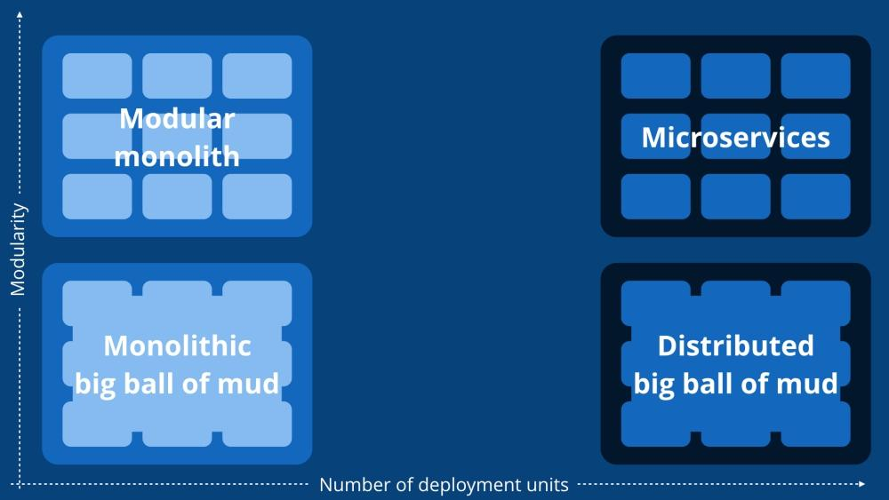
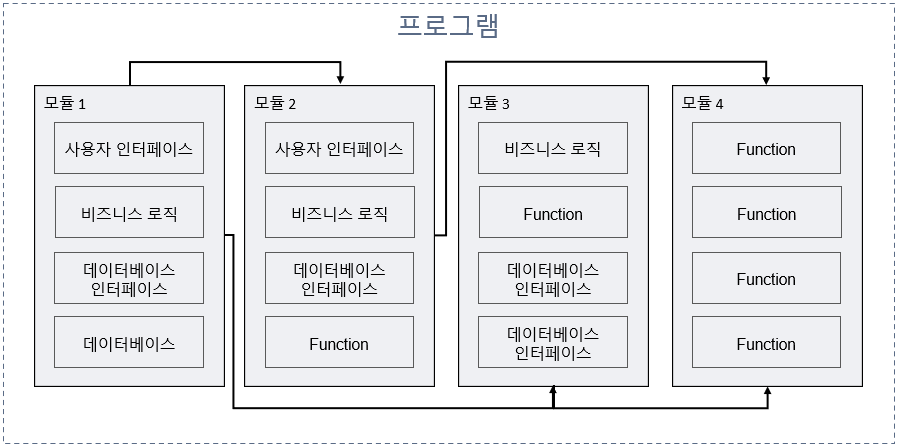
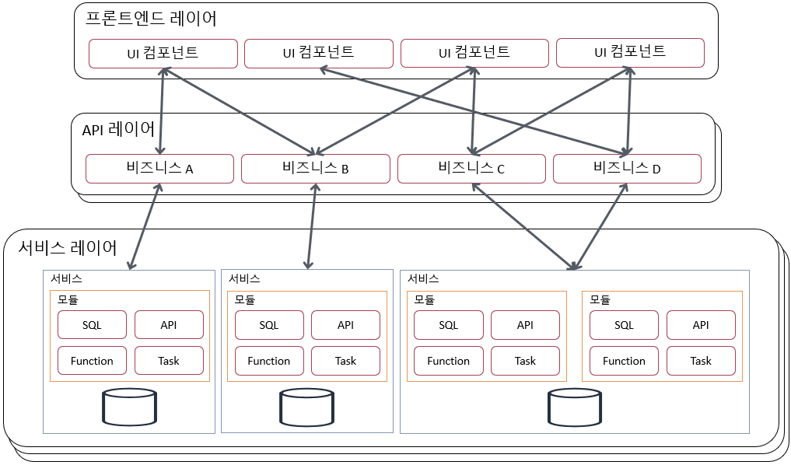

# 모듈러 모놀리식 아키텍처

IT 프로젝트를 시작하면 비즈니스에 대한 이해를 바탕으로 개발 및 운영에 대한 아키텍처에 대한 고민이 많아집니다. 장기적인 지속 가능성을 위해 지속적으로 성장하는 대규모 웹 애플리케이션을 구성하는 아키텍처는 크게 3개로 요약 될 수 있습니다.

* 모놀리식 (Monolithic) 아키텍처
* 모듈러 모놀리식 (Modular Monolithic) 아키텍처
* 마이크로서비스 (Microservice) 아키텍처

그림) 배포 단위 수와 모듈성에 따른 다양한 아키텍처 형태

> 자세한 정보는 [사이먼 브라운의 모놀리식 아키텍처](https://www.youtube.com/watch?v=5OjqD-ow8GE)를 참고하세요

## 모놀리식 아키텍처 장단점 요약

### 장점:

* 단순성: 간단한 환경설정과 유지 관리하기 쉽습니다, 제한된 자원과 개발 팀이 있는 작은 프로젝트나 스타트업에 적합합니다.
* 복잡성 감소: 단일 코드베이스를 가지고 있어 개발자가 전체 애플리케이션의 로직과 흐름을 이해하기 쉽습니다.

### 단점:

* 확장 비용 증가: 애플리케이션의 복잡성과 사용자 증가에 따라 스케일링하는 비용이 급격하게 증가합니다.
* 개선의 어려움: 모든 컴포넌트가 밀접하게 연결되어 있기 때문에 특정 기능이나 서비스를 독립적으로 개선하는 것이 번거롭습니다.
* 긴밀한 결합: 컴포넌트 간의 긴밀한 연결은 공유 라이브러리와 데이터베이스에 의존합니다. 특정 기능을 추가하거나 수정하려는 시도에 문제를 일으킬 수 있습니다.

## 모듈러 모놀리식 아키텍처 장단점 요약

장점:

* 단순화된 개발: 모놀리식의 단순성과 마이크로서비스의 모듈성 사이의 균형을 제공합니다. 개발자는 경계를 가진 독립적인 모듈에서 작업할 수 있습니다.
* 더 쉬운 배포 및 확장성: 모듈러 모놀리식은 개별 모듈 배포를 허용합니다. 세분화된 배포 접근 방식은 버전 관리를 단순화하고, 다운타임을 줄입니다.
* 향상된 유지 관리: 전체 시스템에 영향을 미치지 않고 특정 모듈을 유지 관리하고 업데이트하기 쉽게 합니다.
* 공유 리소스 및 감소된 오버헤드: 모듈러 모놀리식 내의 모듈은 데이터베이스, 캐싱 계층, 인프라 등의 리소스를 공유할 수 있어 중복과 운영 오버헤드를 줄입니다.

단점:

* 제한된 독립성: 모듈러 모놀리식는 독립적인 개발과 배포를 촉진하지만, 마이크로서비스 아키텍처에 비해 여전히 밀접하게 연결되어 있습니다.

## 마이크로서비스 아키텍처 장단점 요약

장점:

* 확장성: 각 서비스를 독립적으로 확장할 수 있어, 사용자 수가 많거나 트래픽이 높은 애플리케이션에 적합합니다.
* 유연성: 개발자는 각 서비스에 가장 적합한 기술 스택을 선택할 수 있습니다. 이는 개발 효율성을 향상시키고, 새로운 기술을 채택하는 데 더 유연하게 만듭니다.
* 독립적인 배포 및 업데이트: 각 서비스는 독립적으로 배포 및 업데이트할 수 있어, 전체 시스템에 영향을 미치지 않고 빠른 업데이트를 가능하게 합니다.

단점:

* 복잡성 증가: 서비스 간 통신, 데이터 일관성 유지, 서비스 디스커버리 등에 대한 복잡성을 증가시킵니다.
* 테스트의 어려움: 각 서비스가 독립적으로 작동하므로, 통합 테스트를 수행하는 것이 어려울 수 있습니다.
* 복잡한 인프라: 각 서비스는 별도의 데이터베이스를 유지하고, 서비스 간 통신을 위한 보다 복잡한 인프라를 필요로 합니다.

## 왜 아키텍처가 중요할까요?

아키텍처에 대한 고민은 반드시 프로젝트에 대한 운영 규모, 개발 인원, 도입 비용, 일정, 기능/비기능 요구사항 등을 고려하여 적정선을 찾아 설계해야 합니다.

그림) 좋은 아키텍처에 따른 기능 복잡성

자세한 설명은 마틴 파울러의 [Design Stamina Hypothesis](https://martinfowler.com/bliki/DesignStaminaHypothesis.html) 기사를 참고하세요

HandStack은 이 모든 것을 염두에 두고 모듈러 모놀리식 아키텍처를 사용합니다. 단일 또는 여러 모놀리식 방식으로 부하를 분산하여 운영 가능하기 때문입니다.

* 마이크로서비스 방식의 분산된 서비스 제품군을 관리하는 데 따른 추가적인 복잡성과 DevOps 리소스는 적은 팀 규모로는 달성할 수 없습니다.
* 비즈니스에 중요한 데이터의 대부분은 비즈니스 특성으로 인해 긴밀하게 결합되고 상호 의존적입니다. 
* 체계적인 단위의 API를 간소화된 방법으로 개발하는 것이 필요합니다.
* 분산된 서비스를 구축하고 유지하는 비용은 매우 큽니다.

> 대부분의 경우 비즈니스 앱은 모놀리식의 방식으로 실행이 가능해야 하고 이 다양한 규모의 스케일을 감당하기 위한 업그레이드하는 데 필요한 리소스는 적게 들어가는 아키텍처가 복잡한 분산 시스템을 유지하는 것보다 유리합니다.

### HandStack 모듈 구성

비즈니스의 요구사항을 처리하기 위해 HandStack에서는 모듈 단위로 개발되어지며, 각 module들은 다음과 같이 4개의 영역으로 만들어집니다.

* 사용자 인터페이스
* 비즈니스 로직
* 데이터베이스 인터페이스
* 서버리스 Function

> 이것은 공식적으로 제공되는 모듈들도 동일한 구조를 가지고 있습니다. 공식 모듈에 대한 자세한 설명은 [기본 modules 소개](/docs/startup/learning/기본-modules-소개)을 참고하세요

그림) 모듈 구성요소 및 이벤트 연계

모듈러 모놀리식 아키텍처는 먼저 로직을 모듈로 나누는 방식으로 구성되며, 각 모듈은 독립적이고 격리됩니다. 각 모듈에는 고유한 화면과 비즈니스 로직이 있을수 있으며 다른 모듈에는 최대한 영향을 주지 않고 레이어를 만들고 수정할 수 있습니다.

HandStack의 모듈러 모놀리식은 아래의 특징을 지니고 있습니다.

* 모듈은 완전히 독립적이지 않습니다. 
* 다른 모듈과의 종속성은 프로그램 수준에서 관리되어야 합니다.
* 모듈 코드를 재사용할 수 있습니다.
* 기존의 모놀리식보다 유지 관리하고 개발하기가 쉽습니다.
* 배포를 위해 전체 프로젝트를 단일 단위로 유지할 수 있습니다.
* 기존의 모놀리식보다 확장성이 뛰어납니다.
* 마이크로서비스 아키텍처보다 덜 복잡하다.

그림) 규모에 따른 어플리케이션 모듈 구성

이렇게 하면, 느슨하게 결합된 모듈을 만들 수 있고 인터페이스를 일관되게 유지 할 수 있고 향후 마이크로서비스 아키텍처로 전환 할 경우에도 유리하게 작용될 수 있습니다.

> 좋은 아키텍처는 끊임없이 진화하는 작업이며 올바른 솔루션은 프로젝트에 대한 운영 규모와 담당 인원에 따라 달라져야 합니다.