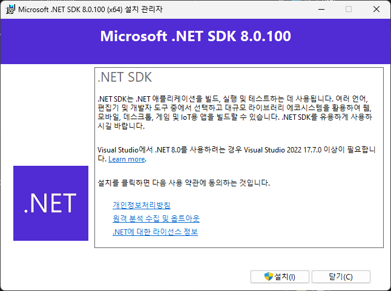
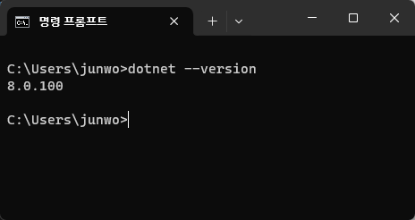
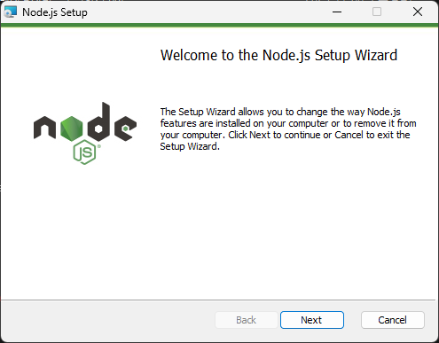
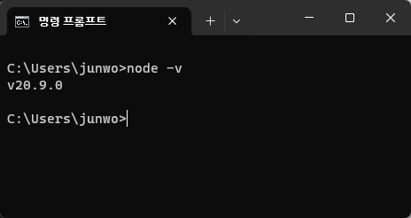
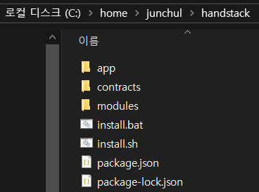
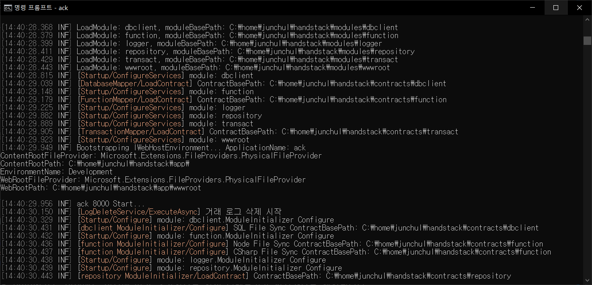
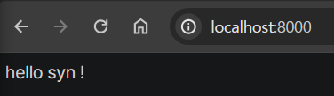

# Windows 메뉴얼로 필수 프로그램 설치하기

## .NET 10.x 버전과 Node.js 20.x LTS 버전 설치하기

HandStack은 비즈니스 앱을 구동하는 **프로그램**과 화면과 서버 기능 개발에 필요한 **공통 기능 라이브러리**를 제공합니다. 사용 중인 오픈 소스들은 LTS (장기 지원) 이거나 잘 알려진 버전으로 개발합니다. 기반이 되는 .NET Core, Node.js 환경은 x86, x64, Arm 실행 환경을 제공하며, 온프레미스와 클라우드 네이티브 서비스에 적합한 실행 환경입니다. 개발되는 비즈니스 앱은 다음 분야에 적합합니다.

|주요 분야|설명|
|---|---|
|웹|Windows, Linux, macOS 및 Docker용 웹 앱 및 서비스를 빌드합니다|
|모바일 및 데스크톱|하이브리드 앱 방식으로 단일 코드를 사용하여 Windows, Linux, macOS 앱을 빌드합니다|
|클라우드|모든 주요 클라우드 공급자에서 실행되는 확장 가능하고 복원력 있는 클라우드 네이티브 앱을 빌드합니다|
|마이크로 서비스|Docker 컨테이너에서 실행되는 독립적으로 배포 가능한 마이크로 서비스를 만듭니다|

IT 시스템은 신뢰를 기본으로 운영 되기 때문에 지속적인 업그레이드에는 성능과 개선, 안정성 향상이 필수 입니다. 그래서 비즈니스 앱을 구축하기 위한 간소화된 기술 스택이 필요합니다.

> HandStack의 HAND는 HTML5 + ASP.NET Core + Node.js + Docker의 기반 스택을 정의합니다.

## Windows 환경에서 시작하기

2023년 12월 기준, 대한민국에서 데스크탑 운영체제의 점유율은 88 % 입니다. [Desktop Operating System Market Share Republic Of Korea](https://gs.statcounter.com/os-market-share/desktop/south-korea)

macOS, Linux 환경의 경우 설치 옵션이 다양합니다. 관련 자료는 외부 링크로 제공합니다

### .NET SDK 설치 관리자 설치하기

최근 대부분의 환경은 보안 및 성능 향상을 위해 기본적으로 x64 (64비트) 환경을 권장하고 있습니다. 이 문서는 x64를 전제로 설명합니다.

* 웹 브라우저로 [.NET SDK 설치 관리자](https://dotnet.microsoft.com/ko-kr/download/dotnet/thank-you/sdk-10.0.100-windows-x64-installer) 프로그램을 다운로드 하세요.
* 다운로드가 완료되면 설치 프로그램을 실행하고 컴퓨터에 .NET을 설치하는 단계를 완료하세요. 
* 설치 프로그램이 완료되면 새 명령 프롬프트를 열고 `dotnet` 명령을 실행합니다. 

### Node.js 설치 관리자 설치하기

* 웹 브라우저로 [Node.js 설치 관리자](https://nodejs.org/dist/v20.9.0/node-v20.9.0-x64.msi) 프로그램을 다운로드 하세요.
* 다운로드가 완료되면 설치 프로그램을 실행하고 컴퓨터에 Node.js을 설치하는 단계를 완료하세요. 
* 설치 프로그램이 완료되면 새 명령 프롬프트를 열고 `node -v` 명령을 실행합니다. 

## HandStack 다운로드 및 설치하기

* 웹 브라우저로 [HandStack 최신 Releases](https://github.com/handstack77/handstack/releases) 압축 파일을 다운로드 하세요. (압축 파일은 주요 버전에 따른 운영체제별 실행 프로그램과 소스입니다.)
* 실행 프로그램 압축 파일 다운로드가 완료되면 압축 파일을 해제합니다. 압축 해제 경로는 향후 macOS, Linux에도 동일한 경로를 만들기 위해 `C:/home/[사용자 ID]/handstack` 를 권장합니다. 
* 압축 해제가 완료되면 관리자 권한으로 터미널(명령 프롬프트)을 열고 압축 해제한 디렉토리로 이동 하여 `install.bat` 명령을 실행합니다. 번들러 및 Node.js 기반 Function 기능을 위한 라이브러리가 설치됩니다.
* app 디렉토리로 이동 하여 `ack` 명령을 실행합니다. 
* HandStack 서버가 실행되면 웹 브라우저를 실행하여 `http://localhost:8421/module.html` 주소를 연결합니다. 

축하합니다. 이제 비즈니스 앱을 개발하기 위한 모든 준비가 되었습니다.

## 주요 정보 바로가기

이제 비즈니스 앱을 개발 하기 위한 기본적인 환경이 만들어졌습니다. 맞춤형 기술 스택으로 직접 앱이나 서비스를 구축하는 것은 많은 비용이 듭니다. HandStack은 오픈 소스 기반으로 기업에서 자유롭게 사용할 수 있으며 공식 문서로 자습서와 핸즈온랩, 참조 자료 및 리소스를 지속적으로 업데이트 합니다.

* [기본 모듈 소개](/docs/startup/learning/기본-modules-소개)
* [화면 개발 시작하기](/docs/startup/learning/화면-개발-시작하기)
* [.NET 10.x 다운로드](https://dotnet.microsoft.com/ko-kr/download/dotnet/10.0)
* [Windows에 .NET 설치](https://learn.microsoft.com/ko-kr/dotnet/core/install/windows?tabs=net80)
* [macOS에 .NET 설치](https://learn.microsoft.com/ko-kr/dotnet/core/install/macos)
* [Linux에 .NET 설치](https://learn.microsoft.com/ko-kr/dotnet/core/install/linux)
* [Node.js 다운로드](https://nodejs.org/en/download)
* [HandStack 다운로드](https://github.com/handstack77/handstack/releases)
