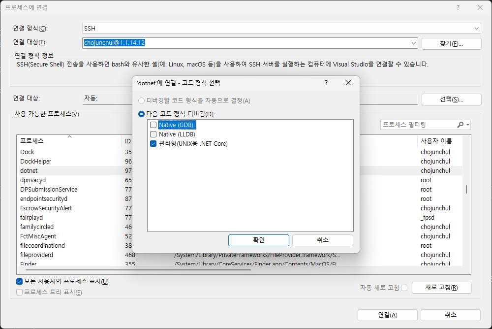

# SSH를 이용한 원격 디버깅

Visual Studio 2022 통합 개발 환경으로 SSH(Secure Shell)를 통해 로컬 또는 원격 macOS, Linux 원격 환경에서 실행되는 ack 프로세스에 연결할 수 있습니다. 디버깅을 설정하는 방법과 디버그하는 방법은 다음과 같습니다.

## Ubuntu 원격 디버깅 설정

Ubuntu에서 SSH 서버를 위한 22번 포트가 허용 되어 있는지 확인하려면 다음 명령을 실행합니다.

```bash
netstat -tulpn | grep :22
```

netstat 명령으로 22번 포트가 열려 있지 않다면 다음 명령을 실행하여 openssh-server 프로그램을 설치합니다.

```bash
sudo apt-get install openssh-server
```

다음 명령을 실행하여 방화벽에 22번 포트를 허용하도록 설정합니다.

```bash
sudo ufw allow 22
sudo ufw status verbose
```

## macOS에 원격 디버깅 설정

시스템 환경 설정 변경: 또한, 시스템 환경 설정에서 22 포트로 들어오는 ssh 요청의 원격 로그인을 활성화할 수 있습니다.

아래의 경로를 따라가세요.

> System Preference (시스템 환경설정) -> Sharing (공유) -> Enable Remote Login (원격 로그인 체크)

만약 접속이 되지않는 다면 방화벽을 임시로 꺼보거나 방화면 옵션에서 원격 로그인 (SSH) 항목을 들어오는 연결을 허용해야 합니다.

> System Preference (보안 및 개인 정보 보호) -> Firewall (방화벽) -> Firewall Option (방화벽 옵션)

## 디버거 연결

ack 프로그램이 macOS, Linux 컴퓨터에서 실행 중이라면 디버거를 연결할 수 있습니다.

- Visual Studio에서 디버그 > 프로세스에 연결... 을 선택합니다.
- 연결 형식 목록에서 SSH를 선택합니다.
- 연결 대상 컴퓨터의 IP 주소 또는 호스트 이름으로 변경합니다.
- 자격 증명을 위한 암호 및/또는 프라이빗 키 파일을 입력합니다.

SSH 서버에 연결되면 프로세스에 연결 대화 상자에 SSH 전송을 사용하는 원격 호스트의 프로세스 목록이 표시된 것을 볼 수 있습니다.

디버그할 프로세스를 찾습니다. 프로세스는 `ack` 또는 `dotnet` 이라는 프로세스에서 실행됩니다.

원하는 프로세스를 찾으려면 프로세스의 명령줄 인수를 보여 주는 Title 열을 확인후 더블 클릭을 하거나 선택후 `연결` 버튼을 선택합니다.

표시되는 대화 상자에서 디버그하려는 코드의 형식을 `관리형(UNIX용 .NET Core)` 을 선택합니다.



이제 Visual Studio 디버깅 기능을 사용하여 앱을 디버그합니다.

## 원격 디버깅 연결 오류 대응

Windows 에서 macOS, Ubuntu 에 있는 ack 프로그램을 원격 디버깅을 하려는데 다음과 같은 오류가 발생 할 수 있습니다.

```text
디버그 어댑터를 시작하지 못했습니다. 출력 창에서 추가 정보를 확인할 수 있습니다.
Unable to find debugger script at '/home/[사용자 ID]/.vs-debugger'.
```

이럴 경우 다음의 명령을 실행해서 디렉토리를 생성하고 다시 디버깅을 시도합니다.

```bash
cd ~
mkdir .vs-debugger'.
```