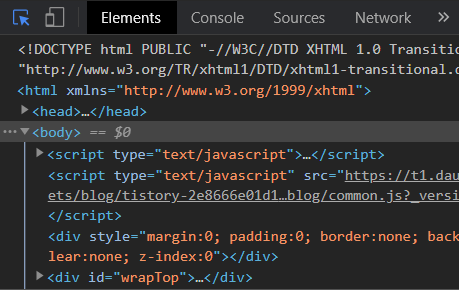

# UI 화면 디버깅하기

HandStack 기반 UI 화면은 Java, C#, PHP 등 서버 코드에 전혀 의존 하지 않는 완전한 표준 HTML, CSS, JavaScript로 구성되어 있습니다. 비즈니스에 따라 UI 화면 개발을 위해 다양한 상용소스와 오픈소스 기반에서 동작하는 화면을 개발하게 됩니다.

HandStack 에서는 효율적인 UI 화면 개발을 위해 기존의 컴포넌트들을 좀 더 사용하기 쉽게 고도화 한 도메인 프레임워크 스크립트와 함께 제공합니다. 이러한 스크립트들은 업무에 따라 필요한 부분만을 선택하여 사용할 수 있습니다. 그래서 화면 디버깅을 위해 업계 표준으로 사용되는 Chrome DevTools을 권장합니다.

```javascript
jquery-3.3.1.js,
jquery.alertmodal.js,
jquery.simplemodal.js,
jquery.maskedinput-1.3.js,
jquery.WM.js,
Notifier.js,
lib/handsontable-13.1.0/handsontable.full.js,
lib/clipboard-2.0.4/clipboard.js,
lib/color-picker-1.0.0/color-picker.js,
lib/filedrop-1.0.0/filedrop.js,
lib/flatpickr-4.6.3/flatpickr.js,
lib/iframe-resizer-4.2.6/iframeresizer.js,
lib/ispin-2.0.1/ispin.js,
lib/pikaday-1.8.0/pikaday.js,
lib/superplaceholder-1.0.0/superplaceholder.js,
lib/tingle-0.15.2/tingle.js,
lib/tail.select-0.5.15/js/tail.select.js,
lib/vanilla-masker-1.1.1/vanilla-masker.js,
lib/codemirror-5.50.2/codemirror.js,
lib/download-4.12/download.js,
...
```

## 크롬 개발 도구 (Chrome DevTools)

Chrome DevTools은 웹 개발에 필수적인 도구로, Google Chrome 브라우저에 내장되어 있습니다. 이 도구를 사용하면 웹 페이지를 실시간으로 편집하고 문제를 빠르게 진단할 수 있어, 더 나은 웹사이트를 더 빠르게 구축하는 데 도움이 됩니다.

Chrome DevTools의 주요 기능은 다음과 같습니다:

1. **Elements**: 웹 페이지의 DOM(Document Object Model)을 보고 변경할 수 있습니다. CSS 스타일도 볼 수 있으며, 미리보기 환경에서 변경할 수 있습니다.
2. **Console**: 메시지를 로그하고 JavaScript를 실행할 수 있습니다.
3. **Sources**: 파일을 보고 편집하고, Snippets를 생성하고, JavaScript를 디버그하고, Workspace를 설정할 수 있습니다.
4. **Network**: 네트워크 요청을 로그할 수 있습니다.
5. **Performance**: 사이트 성능을 평가할 수 있습니다.
6. **Memory**: 페이지 성능에 영향을 미치는 메모리 문제를 찾을 수 있습니다.
7. **Application**: 웹 앱을 검사, 수정, 디버그하고, 캐시를 테스트하고, 저장소를 보는 등의 작업을 할 수 있습니다.

Chrome DevTools은 브라우저에서 직접 열 수 있으며, 여러 가지 방법으로 열 수 있습니다. 예를 들어, macOS에서는 `Option + ⌘ + J`를, Windows/Linux에서는 `Shift + CTRL + J`를 누르면 DevTools 콘솔이 브라우저 창에서 바로 열립니다.

Chrome DevTools을 사용하면 웹 페이지의 동작을 빠르게 이해하고, 문제를 신속하게 해결하며, 웹 개발 과정을 효율적으로 만들 수 있습니다. 따라서 웹 개발을 배우는 초보 개발자에게는 매우 유용한 도구입니다.

### Elements 패널
Elements PanelDOM과 CSS를 자유롭게 조작하여 사이트의 레이아웃과 디자인을 정의합니다.

* [페이지 검사 및 조정](https://developers.google.com/web/tools/chrome-devtools/inspect-styles?hl=ko)
* [스타일 수정](https://developers.google.com/web/tools/chrome-devtools/inspect-styles/edit-styles?hl=ko)
* [DOM 수정](https://developers.google.com/web/tools/chrome-devtools/inspect-styles/edit-dom?hl=ko)
* [애니메이션 검사](https://developers.google.com/web/tools/chrome-devtools/inspect-styles/animations?hl=ko)

### Console 패널

Console Panel 개발 중 진단 정보를 남기고 페이지의 자바스크립트와 상호작용한 결과를 출력합니다.

* [Console 사용하기](https://developers.google.com/web/tools/chrome-devtools/console?hl=ko)
* [커맨드 라인으로 상호작용하기](https://developers.google.com/web/tools/chrome-devtools/console/command-line-reference?hl=ko)

### Sources 패널

Sources 에서 브레이크 포인트를 사용해 자바스크립트를 디버깅하거나 Workspace를 로컬파일에 연결하여 DevTools를 **코드 에디터**로 사용할 수 있습니다.

> HandStack에서는 Node.js Function 디버깅에서도 Chrome DevTools를 사용합니다.

* [자바스크립트 디버깅 시작하기](https://developers.google.com/web/tools/chrome-devtools/javascript?hl=ko)
* [브레이크 포인트를 사용한 디버깅](https://developers.google.com/web/tools/chrome-devtools/javascript/add-breakpoints?hl=ko)
* [DevTools Workspace로 지속성 설정](https://developers.google.com/web/tools/setup/setup-workflow?hl=ko)
* [모든 페이지에서 코드 스니펫 실행](https://developers.google.com/web/tools/chrome-devtools/snippets?hl=ko)

### Network 패널

클라이언트 서버 간의 요청 관련 문제의 디버깅과 페이지 로딩 성능을 최적화에 사용합니다.

* [시작하기](https://developers.google.com/web/tools/chrome-devtools/network-performance?hl=ko)
* [네트워크 이슈 가이드](https://developers.google.com/web/tools/chrome-devtools/network-performance/issues?hl=ko)
* [Network 패널 참조](https://developers.google.com/web/tools/chrome-devtools/network-performance/reference?hl=ko)

### Application 패널

로컬 및 세션 스토리지, 쿠키, 어플리케이션 캐시, 이미지, 폰트, 스타일시트를 포함한 로딩된 모든 리소스를 검사합니다.

* [스토리지, 데이터베이스, 캐시 관리 및 검사](https://developers.google.com/web/tools/chrome-devtools/manage-data/local-storage?hl=ko)
* [쿠키 삭제 및 검사](https://developers.google.com/web/tools/chrome-devtools/manage-data/cookies?hl=ko)

## 디버깅 팁

### 여러 iframe에서 컨텍스트 포커스 얻기

iframe을 활용하여 여러 화면을 동시에 처리하는 UI를 구축하면 디버깅 콘솔이 특정 iframe 컨텍스트를 얻어 디버깅을 해야 할 경우 생깁니다.

이때 Elements 탭에서 마우스로 특정 HTML를 선택하는 버튼을 클릭하거나 `Shift + CTRL + C`를 누르고 특정 iframe내에 있는 요소를 선택하면 디버깅 콘솔의 컨텍스트를 얻을 수 있습니다.



그림) 요소를 검사하기 위한 마우스 버튼 클릭

### 콘솔에서 jQuery Selector 사용

```javascript
// SELECTOR에 해당하는 element 하나만 가져오기 == document.querySelector
$(SELECTOR)
// ex)
$('tagName')
$('.className')
$('#id')
 
// SELECTOR에 해당하는 element 전부 가져오기 == document.querySelectorAll
$$(SELECTOR)
```

### DOM element에 걸린 Event Listener 가져오기

화면 디버깅을 위해 특정 DOM element에 걸린 Event Listener를 확인해야 할 경우가 있습니다. 이때 Elements 탭에서 해당 DOM element를 선택하고 `getEventListeners($(SELECTOR))`를 입력하면 해당 DOM element에 걸린 Event Listener를 확인할 수 있습니다.

```javascript
getEventListeners($(SELECTOR))
// ex) 클릭이벤트의 첫번째 event listener = getEventListeners($('#id')).click[0].listener
```

### 이벤트 모니터링

화면 디버깅을 위해 특정 DOM element에 걸린 Event 호출 정보를 확인해야 할 경우가 있습니다. 이때 Elements 탭에서 해당 DOM element를 선택하고 `monitorEvents($(SELECTOR))`를 입력하면 해당 DOM element에 Event 가 호출되는 정보를 실시간으로 확인할 수 있습니다.

> 이 기능은 브라우저의 성능을 저하 시키기 때문에 사용이 끝나면 명시적으로 모니러팅을 중지해야 합니다.

```javascript
// 이벤트 전부 모니터링
monitorEvents($(SELECTOR));

// 특정 이벤트 하나만 모니터링
monitorEvents($(SELECTOR), 'eventName');

// 이벤트 여러개 모니터링
monitorEvents($(SELECTOR), ['eventName1', 'eventName2']);
// 특정 이벤트 여러개 모니터링은 이벤트 이름의 일부를 넘기면 가능
// 예를 들어 아래와 같이 할 경우 mouse에 관련된 mouseover, mousemove 등 모든 이벤트 모니터링
monitorEvents($(SELECTOR), 'mouse');

// 모니터링 중지
unmonitorEvents($(SELECTOR));
```

### 콘솔창 지우기
```javascript
clear()
// 단축키는 ctrl + L
```

### 함수명으로 함수 시작 부분에 실시간으로 브레이크 포인트 걸기

JavaScript에서 debugger는 코드의 실행을 일시 중지하고 디버깅 기능을 호출하는 키워드입니다. 이는 디버거에서 브레이크 포인트를 설정하는 것과 같은 기능을 합니다.

디버깅이 가능한 소스 코드 원본이 있는 환경에서는 debugger 키워드를 원하는 곳에 배치 해두어 코드 실행을 중지하지만 운영 환경처럼 소스 코드 원본이 없는 환경에서는 다음과 같이 함수명으로 함수 시작 부분에 실시간으로 브레이크 포인트를 걸 수 있습니다.

```javascript
// Console 탭에서 해당 함수가 호출되면 소스코드상의 함수 선언부에 break가 걸린 상태로 Sources 탭으로 넘어갑니다.
debug(함수명)


// 함수 이름만 알고 어디에 정의되어 있는지 모를 경우에도 유용하며 해당 함수의 브레이크 포인트를 해제 할 때 다음과 같이 사용합니다.
undebug(함수명)
```

### 함수 호출시 매개변수 출력

Console 탭에서 특정 함수가 호출될 때 넘겨지는 매개변수를 실시간으로 Console 창에 출력해줍니다.

```javascript
// 함수 매개변수 값을 알기 위해 함수 시작부분에 console.log(args) 찍는걸 완벽히 대체 가능합니다.
monitor(함수명)


// 함수 이름만 알고 어디에 정의되어 있는지 모를 경우에도 유용하며 해당 함수의 매개변수 출력를 해제 할 때 다음과 같이 사용합니다.
unmonitor(함수명)
```