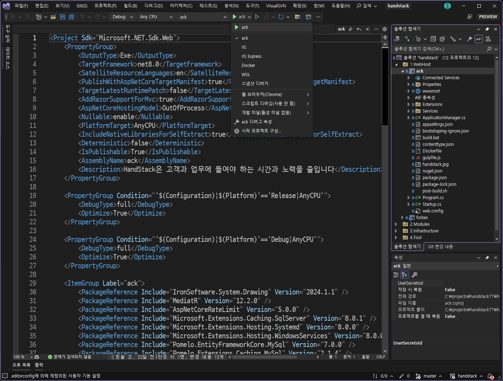
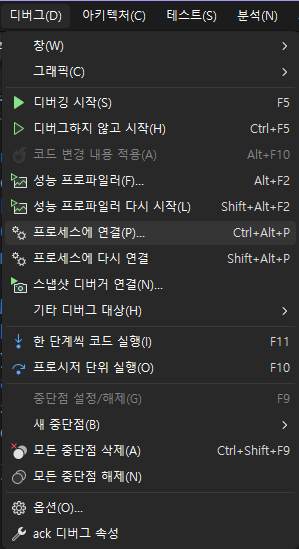
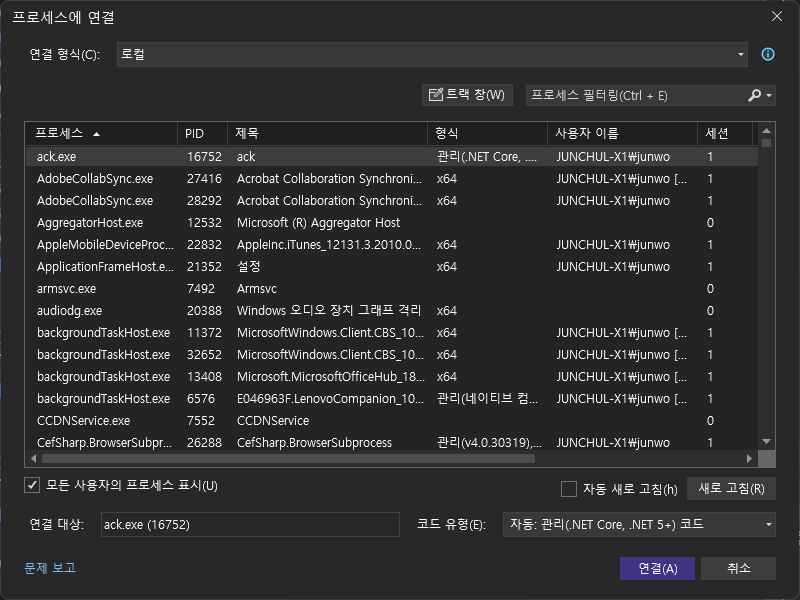
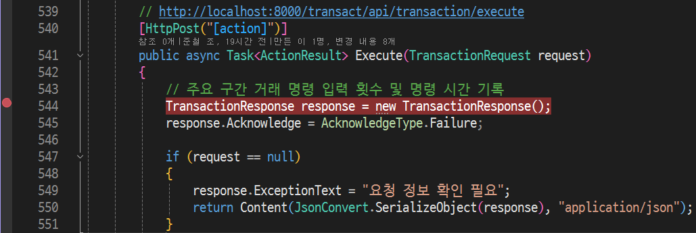
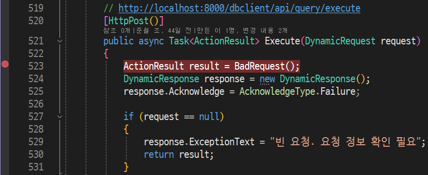
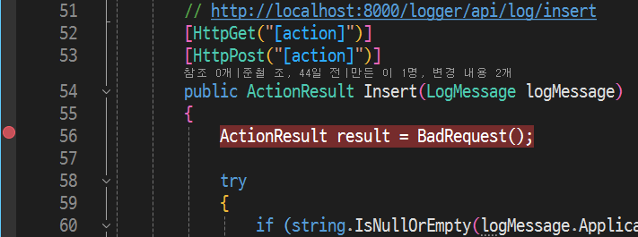
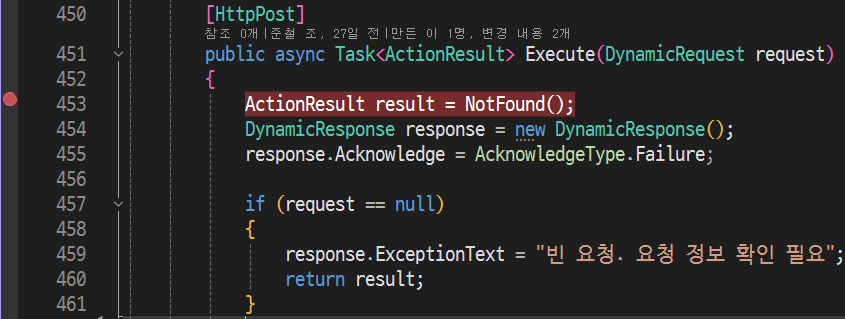
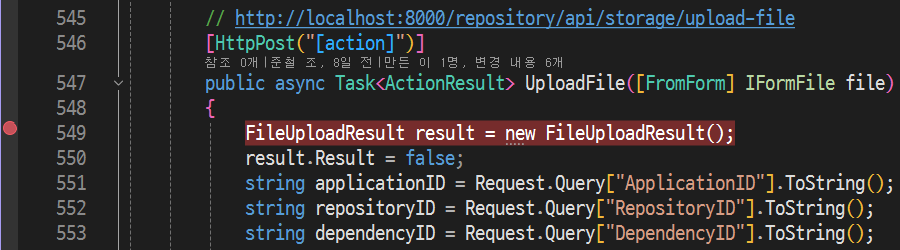

# ack 및 module 디버깅하기

프로그램 디버깅은 코드에서 오류를 찾고 수정하는 과정입니다. 이는 개발자의 코드가 의도대로 작동하지 않을 때, 문제가 무엇인지 파악하고 해결하는 데 필수적인 과정이자 기술입니다.

> 디버깅 과정은 매우 어렵습니다. 단순히 지식을 암기하거나 책을 읽는 것만으로는 디버깅을 잘 할 수 없습니다. 디버깅은 경험을 통해 배울 수 있는 기술이며 문제에 대한 성숙도와 개개인의 직관에 따라서 해결 방안이 달라지기 때문입니다.

일반적으로 디버깅은 다음과 같은 과정으로 진행됩니다.

1. 프로그램 이슈 또는 장애 인지
2. 원인 및 문제 파악
3. 대상 소스 코드 위치 확인
4. 논리적 오류 확인
5. 비슷한 오류 발생 가능성 점검
6. 소스 코드 오류 대응 수정
7. 오류가 발생한 조건으로 재현
8. 프로그램 테스트 및 검증
9. 프로그램 배포 및 모니터링
10. 변경사항 및 오류 기록 관리

그래서 고급 개발자로 나아가기 위해 그리고 팀 전체의 성공을 위해 시니어 개발자는 자신의 경험과 지식을 공유하여, 주니어 개발자가 디버깅 기술을 향상시키는 데 도움을 줘야 합니다.

> 이 문서는 .NET 10.0 기반으로 개발된 HandStack 솔루션의 ack 프로그램과 module 프로그램을 디버깅하는 방법을 설명합니다. 이 문서는 Visual Studio 2022를 기준으로 작성되었으며, .NET Core 에 대한 경험이 있어야 합니다.

## 사전 요구 사항

HandStack 솔루션에서 서버 프로그램을 담당하는 ack 프로그램은 .NET Core 10.0 기반으로 개발 되었습니다. .NET Core 프로젝트는 Windows, macOS, Linux 에서 개발 할 수 있으며 주어진 상황에 따라 다음과 같은 개발 도구 들로 개발 가능합니다.

1. **Visual Studio**: Windows에서 웹, 클라우드, 데스크톱, 모바일 앱, 서비스, 게임등 모든 유형의 .NET 애플리케이션을 빌드하기 위한 완전한 기능을 갖춘 IDE 이며 가장 권장됩니다.
2. **Visual Studio Code**: Linux, macOS 또는 Windows에서 개발하여 플랫폼 간 웹 사이트 및 서비스를 동일한 경험으로 개발 할 수 있습니다.
3. **OmniSharp**: Atom, Brackets, Sublime Text, Emacs 및 Vim과 같은 편집기에서 플랫폼 간 .NET 개발을 지원합니다.
4. **JetBrains Rider**: IntelliJ 및 ReSharper 기술을 사용하여 빌드된 플랫폼 간 .NET IDE로, 모든 플랫폼에서 동일한 개발 경험을 제공하는 완전한 기능을 갖춘 IDE 입니다.

이러한 도구들과 .NET SDK와 함께 제공되는 **.NET CLI**: CLI (명령줄 인터페이스)는 다양한 유형의 애플리케이션을 효과적으로 개발할 수 있도록 지원합니다.

> 마이크로소프트는 Visual Studio 버전으로 개발에 필요한 대부분의 기능을 학생, 오픈 소스 참여자 및 개인에게 무료로 제공합니다. 자세한 내용은 [Visual Studio 다운로드](https://visualstudio.microsoft.com/ko/downloads/)를 참고하세요.

 ### Visual Studio 설치시 개발 워크로드 선택

ASP.NET Core 개발을 위해 Visual Studio 에서 선택해야 하는 워크로드는 다음과 같습니다:

1. **ASP.NET 및 웹 개발 워크로드**: 이 워크로드는 ASP.NET Core 웹 애플리케이션 개발에 필요한 모든 기능을 제공합니다. 이 워크로드는 웹 애플리케이션, REST API, 실시간 통신을 위한 SignalR, 그리고 웹 프론트엔드 개발을 위한 기능을 포함하고 있습니다.

2. **.NET Core 크로스 플랫폼 개발 워크로드**: 이 워크로드는 .NET Core를 사용하여 Linux, macOS, 그리고 Windows에서 실행되는 애플리케이션을 개발하는 데 필요한 도구를 제공합니다.

> 참고로, Visual Studio 설치 관리자를 사용하여 언제든 워크로드를 추가하거나 제거할 수 있습니다. 워크로드를 선택한 후, '수정'을 클릭하여 필요한 워크로드를 설치합니다.

## 프로그램 디버그 준비

디버깅을 시작하기 전에, 코드가 어떤 동작을 해야 했는지, 실제로 어떤 동작을 했는지를 명확히 이해해야 합니다. 예외가 발생했다면, 디버거는 코드에서 예외가 발생한 정확한 위치를 찾아주고 가능한 수정 방안을 제시해줄 수 있습니다. Visual Studio 2022에서 .NET Core를 디버깅을 하면 다음과 같이 이점이 있습니다.

* 코드 단계별로 실행하기: 디버거에서 코드를 단계별로 실행하면, 변수의 각 변경 사항을 검사하여 정확히 언제 어떻게 잘못된 값이 할당되는지 발견할 수 있습니다.
* 변수 검사하기: 데이터 팁과 디버거 창에서 변수를 검사할 수 있습니다.
* 호출 스택 검사하기: 호출 스택을 검사하여 함수 호출의 순서와 위치를 확인할 수 있습니다.

일반적으로 ack 프로그램은 크게 2가지 방법으로 다운로드 하여 실행합니다.

### 최신 소스 코드를 복제하여 빌드 후 실행

Git CLI 명령어로 로컬 PC에 최신 소스를 유지하며 개발을 진행할 수 있습니다. .NET 경험이 있는 경우 권장됩니다. 이 방법은 많은 자유도를 제공하며 다음과 같은 이점이 있습니다.

* HandStack 에서 제공하는 프로그램과 프레임워크의 내부 구조를 확인 할 수 있습니다.
* 오픈소스와 상용소스를 활용한 추가 기능 확장 modules 에 대한 개발과 커스터마이징이 가능합니다.
* 개발자가 직접 소스 코드를 수정하여 버그를 수정하거나 새로운 기능을 추가할 수 있습니다.

```bash
gh repo clone handstack77/handstack
```

### GitHub Releases 에서 다운로드 하여 실행

.NET 경험이 없고 비즈니스 앱을 개발하는 경우 권장됩니다. 주요 버전에 맞춰 최신 빌드를 운영체제에 맞게 소스 코드와 프로그램을 제공하며 이 방법은 다음과 같은 이점이 있습니다.

* 운영체제 별로 제공되는 ack 프로그램과 modules을 실행할 수 있습니다.
* 소스 코드가 제공되기 때문에 동일한 환경에서 비즈니스 앱에 대한 지원이 가능합니다.
* 프로그램을 위한 추가 기능 개발과 커스터마이징을 제공 할 수 있습니다.

.NET Core 프로그램은 크게 Debug, Release 모드로 컴파일되어 배포되며, Release 모드의 컴파일은 보안 및 약간의 성능 향상을 기대할 수 있지만 Debug 모드에 비해 디버그 하기가 어렵습니다.

> HandStack 의 releases 들은 기본적으로 Debug 모드로 컴파일되어 배포됩니다.

디버깅을 해야 할 경우 개발 PC에 있는 프로그램 파일들과 대상 서버에 배포된 파일들의 버전이 일치해야 문제없이 디버깅이 가능하기 때문에 새로운 개발 담당자가 디버그를 해야 할 경우 GitHub에서 소스를 내려받아 컴파일 한 프로그램 파일들을 대상 서버에 미리 배포 해두는 것이 좋습니다.

디버깅을 위한 다음 항목을 유의해야 합니다.

* 프로그램과 소스가 일치하지 않다면 먼저 내 코드만을 사용하지 않도록 설정합니다. 이 설정을 해제하려면 도구 > 옵션 > 디버깅 을 선택한 다음 내 코드만 사용 을 선택 취소합니다.
* 프로젝트가 이식 가능 PDB(기본 설정)를 생성하도록 구성되었는지, PDB가 DLL과 동일한 위치에 있는지 확인합니다.
* Visual Studio에서 이를 구성하려면 프로젝트를 마우스 오른쪽 단추로 클릭하고 속성 > 빌드 > 고급 > 디버깅 정보 를 선택합니다.
* 디버깅을 수행하면 모든 프로세스 업무가 중단되기 때문에 미리 운영 환경과 동일한 개발 또는 테스트 환경에 작업할 수 있도록 사전에 인프라 환경을 만들어 두는 것을 권장합니다.

기본 디렉토리에 있는 `handstack.sln` 솔루션 파일을 개발 도구로 실행합니다.

소스 코드는 다음과 같은 구조를 가지고 있으며 각각의 디렉토리는 다음과 같은 역할을 수행합니다.

```txt
.
├─1.WebHost - 서버 프로그램 및 태넌트 앱 실행을 위한 프로젝트
│  ├─ack
│  └─forbes
├─2.Modules - 모듈러 모놀리식 아키텍처 기반 모듈 단위 프로그램
│  ├─dbclient
│  ├─function
│  ├─logger
│  ├─repository
│  ├─transact
│  └─wwwroot
├─3.Infrastructure - 공통 라이브러리 프로젝트
│  ├─Assemblies
│  ├─HandStack.Core
│  ├─HandStack.Data
│  └─HandStack.Web
└─4.Tool - CLI 도구 프로젝트
    └─CLI
        └─handstack
```

## ack 디버깅하기

Visual Studio 2022에서 .NET Core를 디버깅하는 방법은 크게 2가지가 있습니다. 첫 번째 방법은 프로젝트를 열고 `F5` 단축키나 프로그램 디버깅 시작 버튼을 클릭하여 디버깅을 시작하는 것이며, 두 번째 방법은 실행 중인 프로그램의 프로세스를 연결하여 디버깅을 시작하는 것입니다.

### 첫 번째 방법 디버깅하기

디버거 명령을 시작하려면 F5를 단축키를 선택하거나, 표준 도구 모음에서 메뉴 모음에서 디버그 > 디버깅 시작을 클릭합니다.

F5는 ack 앱 프로세스에 연결된 디버거를 사용하여 앱을 시작합니다. 코드를 검사하기 위해 특별한 작업을 수행하지 않았으므로 앱은 완료될 때까지 실행되고 콘솔 출력이 표시됩니다.

디버거를 중지하려면 Shift+F5를 선택하거나, 메뉴 모음에서 디버그>디버깅 중지를 클릭합니다.

Visual Studio 2022에서 .NET Core를 디버깅할 때 사용하는 주요 단축키는 다음과 같습니다:

1. **디버깅 시작/중지**
    - 디버깅 시작: `F5`
    - 디버깅 중지: `Shift+F5`
    - 디버깅 없이 시작: `Ctrl+F5`

2. **중단점 관리**
    - 중단점 설정/해제: `F9`
    - 모든 중단점 삭제: `Ctrl+Shift+F9`

3. **실행 제어**
    - 코드 단계별로 실행 (Step Over): `F10`
    - 코드 내부로 들어가기 (Step Into): `F11`
    - 현재 함수 벗어나기 (Step Out): `Shift+F11`
    - 커서 위치까지 실행 (Run to Cursor): `Ctrl+F10`

4. **디버깅 창**
    - Quick Watch 창 열기: `Ctrl+Alt+Q` 또는 `Shift+F9`
    - Exceptions 창 열기: `Ctrl+Alt+E`

이러한 단축키들은 디버깅 과정을 훨씬 더 효율적으로 만들어줍니다. Visual Studio의 단축키는 사용자가 원하는 대로 설정을 변경할 수 있으므로, 자주 사용하는 명령어에 대한 단축키를 설정하면 작업 효율성을 높일 수 있습니다.



그림) ack 프로그램 디버깅 화면

이와 같이 Program.cs 파일내의 Main 메서드를 진입점으로 디버깅을 하면서 코드를 검사하고, 변수의 값을 확인하며, 호출 스택을 검사하여 함수 호출의 순서와 위치를 확인할 수 있습니다.

### 두 번째 방법 디버깅하기

실행 프로그램 경로는 `C:/home/[사용자 ID]/handstack` 를 권장합니다. app 디렉토리로 이동 하여 `ack` 명령을 실행합니다.

터미널에서 다음의 명령어로 프로그램을 시작합니다.

```bash
ack
```

ack 서버가 실행되면 웹 브라우저를 실행하여 `http://localhost:8421/module.html` 주소를 연결합니다.

만약 프로그램의 시작시 다양한 원인으로 시작을 할 수 없는 장애를 확인 해야 할 경우 첫번째 방법으로 디버깅을 시작하거나 다음과 같이 10초간의 시작 지연을 통해 프로세스 연결을 할 시간을 벌 수 있도록 옵션을 설정하여 프로그램 시작을 대기 시킬수 있습니다.

```bash
ack --debug --delay=10000
```

ack 프로그램이 시작되면 `Ctrl+Alt+P` 단축키 또는 Visual Studio에서 디버그 > 프로세스에 연결... 을 선택합니다.



그림) 프로세스에 연결 창



그림) 프로세스에 연결 창에서 프로그램 선택

프로그램을 선택하고 연결을 클릭하면 프로그램이 중단되고 디버거가 연결됩니다.

## module 디버깅하기

HandStack에서는 module 은 프로그램 기능을 구성하는 완전한 단위입니다. 기술적으로 ASP.NET Core의 기능을 수행 할 수 있지만 독립적으로 실행 할 수 없는 프로그램입니다.

공식 module로서 다음과 같이 기본 제공됩니다.

|module명|설명|
|---|---|
|dbclient|데이터베이스 연동 (SQL Server, Oracle, MySQL & MariaDB, PostgreSQL, SQLite) 및 XML 계약 문서로 SQL을 관리|
|function|C# 또는 Node.js 기반 Function 개발 기능 관리|
|repository|단일, 다중, 이미지, 첨부파일 등등 파일 업로드/다운로드 관리|
|transact|거래 요청 검증 및 접근 제어 관리와 요청 정보를 dbclient, function 등등 module로 라우팅 기능 관리|
|logger|module 요청/응답 구간 주요 이벤트 로그 수집 관리|
|wwwroot|웹 공통 static assets 및 화면 단위 소스 호스팅 관리|

module 프로그램은 HandStack의 기본 프로그램과 동일하게 디버깅을 할 수 있으며, 프로그램을 선택하고 연결을 클릭하면 프로그램이 중단되고 디버거가 연결됩니다.

각 모듈의 주요 진입점은 다음과 같습니다. 여기에 브레이크 포인트를 설정하여 디버깅을 시작합니다.

### transact 모듈

transact 모듈은 거래 요청 검증 및 접근 제어 관리와 요청 정보를 dbclient, function 등등 module로 라우팅 기능을 담당합니다.

`handstack\2.Modules\transact\Areas\transact\Controllers\TransactionController.cs` 파일의 `public async Task<ActionResult> Execute(TransactionRequest request)` 메서드가 진입점입니다.



### dbclient 모듈

dbclient 모듈은 데이터베이스 연동 (SQL Server, Oracle, MySQL & MariaDB, PostgreSQL, SQLite) 및 XML 계약 문서로 SQL을 관리하는 기능을 담당합니다.

`handstack\2.Modules\dbclient\Areas\dbclient\Controllers\QueryController.cs` 파일의 `public async Task<ActionResult> Execute(DynamicRequest request)` 메서드가 진입점입니다.



### logger 모듈

logger 모듈은 module 요청/응답 구간 주요 이벤트 로그 수집 관리 기능을 담당합니다. 수집된 데이터는 SQL Server, Oracle, MySQL & MariaDB, PostgreSQL, SQLite 중 하나의 데이터베이스에 저장됩니다.

`handstack\2.Modules\logger\Areas\logger\Controllers\LogController.cs` 파일의 `public ActionResult Insert(LogMessage logMessage)` 메서드가 진입점입니다.



### function 모듈

function 모듈은 C# 또는 Node.js 기반 Function 개발 기능 관리 기능을 담당합니다.

`handstack\2.Modules\function\Areas\function\Controllers\ExecutionController.cs` 파일의 `public async Task<ActionResult> Execute(DynamicRequest request)` 메서드가 진입점입니다.



### repository 모듈

repository 모듈은 단일, 다중, 이미지, 첨부파일 등등 파일 업로드/다운로드 관리 기능을 담당합니다.

`handstack\2.Modules\repository\Areas\repository\Controllers\StorageController.cs` 파일의 `public async Task<ActionResult> UploadFile([FromForm] IFormFile file)` 메서드가 진입점입니다.

