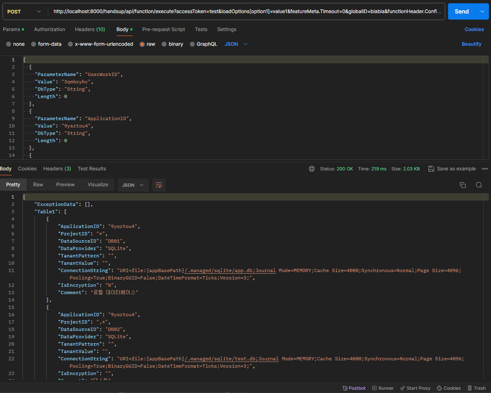

# C# 함수 디버깅하기

컴파일러는 소스 코드에서 실행 가능하거나 참조 가능한 출력 결과물을 빌드합니다.

.NET Core는 Roslyn 이라고 불리는 컴파일러 API 를 사용하여 C# 코드를 실시간으로 컴파일하여 실행하는 .NET Compiler Platform SDK를 제공합니다.


그림) .NET Compiler API

C# 코드를 컴파일하고 실행하는 자세한 정보는 [.NET Compiler Platform SDK](https://learn.microsoft.com/ko-kr/dotnet/csharp/roslyn-sdk/)를 참조하세요.

> C# 함수는 ack 프로그램의 **참조 라이브러리에 대한 종속성**을 가집니다. 즉 ack 내에서 개발할 수 있는 코드를 함수로 구현 가능합니다.

## C# 함수 디버깅하기

HandStack에서 제공하는 function 모듈에서 실행 가능한 CSharp 함수들은 다음과 같은 구조를 가지고 있습니다.

```bash
function
└─HDS
    └─HAC
        └─HAC010
            ├─featureMain.cs
            └─featureMeta.json
```

featureMain.cs 파일은 빌드 작업 없이 텍스트 파일로 관리되는 파일이며, featureMeta.json 파일은 함수의 메타 정보를 가지고 있습니다. 예를 들어 다음과 같이 기본적인 문법으로 간단한 LF01 함수를 만들 수 있습니다.

```csharp
using System;
using System.Collections.Generic;
using System.Data;
using System.Data.Common;
using System.IO;

using HandStack.Core.ExtensionMethod;
using HandStack.Core.Extensions;
using HandStack.Data;
using HandStack.Web;
using HandStack.Web.Entity;
using HandStack.Web.MessageContract.DataObject;

using handsup;

using Microsoft.AspNetCore.Mvc;

using Newtonsoft.Json;

using Serilog;

namespace HDS.Function.HAC
{
    public class HAC010
    {
        public DataSet? LF01(List<DynamicParameter> dynamicParameters, DataContext dataContext)
        {
            string typeMember = "HAC.HAC010.LF01";
            using DataSet result = new DataSet();
            try
            {
                result.BuildExceptionData();

                string userWorkID = dynamicParameters.Value("UserWorkID").ToStringSafe();
                string applicationID = dynamicParameters.Value("ApplicationID").ToStringSafe();

                if (string.IsNullOrEmpty(userWorkID) == true
                    || string.IsNullOrEmpty(applicationID) == true)
                {
                    result.BuildExceptionData("Y", "Warning", "필수 요청 정보 확인 필요", typeMember);
                    goto TransactionException;
                }

                string appBasePath = Path.Combine(GlobalConfiguration.TenantAppBasePath, userWorkID, applicationID);
                if (Directory.Exists(appBasePath) == true)
                {
                    string settingFilePath = Path.Combine(appBasePath, "settings.json");
                    if (System.IO.File.Exists(settingFilePath) == true)
                    {
                        string appSettingText = System.IO.File.ReadAllText(settingFilePath);
                        var appSetting = JsonConvert.DeserializeObject<AppSettings>(appSettingText);
                        if (appSetting != null)
                        {
                            var dataTable = JsonConvert.DeserializeObject<DataTable>(JsonConvert.SerializeObject(appSetting.DataSource == null ? "[]" : appSetting.DataSource));
                            if (dataTable != null)
                            {
                                result.Tables.Add(dataTable);
                            }
                        }
                    }
                    else
                    {
                        result.BuildExceptionData("Y", "Warning", $"applicationID: {applicationID}의 앱 환경설정 파일 확인 필요", typeMember);
                        goto TransactionException;
                    }
                }
                else
                {
                    result.BuildExceptionData("Y", "Warning", $"applicationID: {applicationID} 확인 필요", typeMember);
                    goto TransactionException;
                }
            }
            catch (Exception exception)
            {
                result.BuildExceptionData("Y", "Error", exception.Message, typeMember, exception.StackTrace);
            }

TransactionException:
            if (result.Tables.Count == 1)
            {
                result.Tables.Add(new DataTable());
            }

            return result;
        }
    }
}
```
코드) function\CSharp\HDS\HAC\HAC010\featureMain.cs 파일 소스

```json
{
    "Header": {
        "ApplicationID": "HDS",
        "ProjectID": "HAC",
        "TransactionID": "HAC010",
        "DataSourceID": "DB01",
        "LanguageType": "csharp",
        "ReferenceModuleID": "handsup",
        "Use": true,
        "Description": "태넌트 앱 dbclient 데이터 원본 관리"
    },
    "Commands": [
        {
            "ID": "LF01",
            "Seq": 0,
            "Use": true,
            "Timeout": 0,
            "Description": "데이터 원본 데이터 목록 조회",
            "ModifiedAt": "2023-07-10 00:00:00",
            "Params": [
                {
                    "id": "UserWorkID",
                    "type": "String",
                    "length": 36,
                    "value": null
                },
                {
                    "id": "ApplicationID",
                    "type": "String",
                    "length": 0,
                    "value": null
                }
            ]
        }
    ]
}
```
코드) function\CSharp\HDS\HAC\HAC010\featureMeta.json 파일 소스

C# 함수는 ack 프로그램의 종속성을 가지고 있으며 개발자는 이러한 제한을 염두하고 개발해야 합니다.

C# 함수는 컴파일 없이 텍스트로 관리됩니다. 함수 코드를 개발 및 디버깅하려면 다음중 하나의 방법을 사용할 수 있습니다.

* 콘솔 프로젝트를 생성하여 함수 코드를 작성합니다.
* ASP.NET Core API Controller를 추가하여 함수 코드를 작성합니다.

> 개인적으로는 ASP.NET Core API Controller를 생성하여 함수 코드를 작성하는 것을 추천합니다. 이유는 ASP.NET Core API Controller 프로젝트를 생성하면 함수 코드를 작성하고 디버깅하는데 Postman, Swagger 와 같은 클라이언트 도구들을 활용할 수 있어 편리하기 때문입니다.

### FunctionController 작성

```csharp
using System;
using System.Collections.Generic;
using System.Data;
using System.IO;
using System.Linq;

using HandStack.Core.ExtensionMethod;
using HandStack.Core.Extensions;
using HandStack.Core.Helpers;
using HandStack.Web;
using HandStack.Web.MessageContract.Contract;
using HandStack.Web.MessageContract.DataObject;

using handsup.Entity;

using Microsoft.AspNetCore.Http;
using Microsoft.AspNetCore.Mvc;

using Newtonsoft.Json;
using Newtonsoft.Json.Linq;

namespace handsup.Areas.handsup.Controllers
{
    [Area("handsup")]
    [Route("[area]/api/[controller]")]
    [ApiController]
    public class FunctionController : ControllerBase
    {
        [HttpPost("[action]")]
        public DataSet? Execute([FromBody] List<DynamicParameter> dynamicParameters, [FromQuery] DataContext dataContext)
        {
            string typeMember = "HAC.HAC010.LF01";
            using DataSet? result = new DataSet();

            // 여기에 LF01 함수 코드를 작성합니다.

            return result;
        }
    }
}
```
코드) FunctionController.cs 파일 소스

FunctionController 클래스는 HAC010.LF01 함수를 실행하는 Execute 메서드를 가지고 있습니다. 이 메서드는 다음과 같은 요청을 처리합니다.

```http
http://localhost:8000/handsup/api/function/execute?accessToken=test&loadOptions[option1]=value1&featureMeta.Timeout=0
```


그림) Postman API 테스트

## HTTP Client CLI 테스트

Postman 과 같은 프로그램 외에도 명령 프롬프트나 터미널에서 HTTP 요청 테스트를 할 수 있습니다.

.http 파일은 일반적으로 HTTP 요청을 포함하는 파일로, 다음 예제를 참고하여 featureTest.http 파일을 만듭니다.

```http
POST /function/api/function/execute?accessToken=&loadOptions[option1]=value1&featureMeta.Timeout=0&globalID=blabla&featureSQLPath=C:\projects\qcn.qramework\modules\filehub\Contracts\function\csharp\HDS\FHB\SYS010\featureSQL.xml&dataProvider=SqlServer&connectionString=Data Source=localhost;TrustServerCertificate=True;Initial Catalog=master;User ID=sa;Password=Strong@Passw0rd;&platform=Windows&functionID=FHB.SYS010.GF01 HTTP/1.1
Host: localhost:8000
accept: */*
Content-Type: application/json

[
  {
    "ParameterName": "WorkUserID",
    "Value": "handstack@handstack.kr",
    "DbType": "String",
    "Length": 0
  },
  {
    "ParameterName": "UserNo",
    "Value": "12401002",
    "DbType": "String",
    "Length": 0
  },
  {
    "ParameterName": "ApplicationName",
    "Value": "ack",
    "DbType": "String",
    "Length": 0
  },
  {
    "ParameterName": "ApplicationID",
    "Value": "HDS",
    "DbType": "String",
    "Length": 0
  },
  {
    "ParameterName": "ProjectType",
    "Value": "U",
    "DbType": "String",
    "Length": 0
  },
  {
    "ParameterName": "ItemPath",
    "Value": "FHB/SYS010.html",
    "DbType": "String",
    "Length": 0
  }
]
```

featureTest.http 파일로 요청을 실행하려면 HTTP 클라이언트 도구가 필요합니다.

확장자가 .http인 파일을 실행할 수 있는 CLI 프로그램으로는 **IntelliJ HTTP Client CLI**가 있습니다. 이 도구는 JetBrains에서 제공하며, .http 파일에 작성된 HTTP 요청을 명령줄에서 실행할 수 있게 해줍니다.

> ijhttp CLI 프로그램은 JDK 17 이상이 설치되어 있어야 합니다.

IntelliJ HTTP Client CLI를 사용하려면 다음 단계를 따르세요.

1. **IntelliJ HTTP Client CLI 다운로드**:
   - [JetBrains 공식 웹사이트](https://www.jetbrains.com/ko-kr/ijhttp/download/)에서 최신 버전의 IntelliJ HTTP Client CLI를 다운로드합니다.
   - 또는 터미널에서 `curl -f -L -o ijhttp.zip "https://jb.gg/ijhttp/latest"` 명령어를 실행합니다.

2. **압축 해제 및 설치**:
   - 다운로드한 ZIP 파일을 압축 해제합니다.
   - 압축 해제한 디렉토리로 이동합니다.

3. **명령어 실행**:
   - 명령 프롬프트나 터미널에서 다음 명령어를 사용하여 .http 파일을 실행하며, 요청과 응답의 헤더 및 본문 정보를 모두 포함하려면 결과를 터미널에 출력합니다.
     ```bash
     ijhttp -L VERBOSE <파일 경로>
     ```

이 도구를 사용하면 .http 파일에 작성된 HTTP 요청을 쉽게 테스트하고 실행할 수 있습니다.
