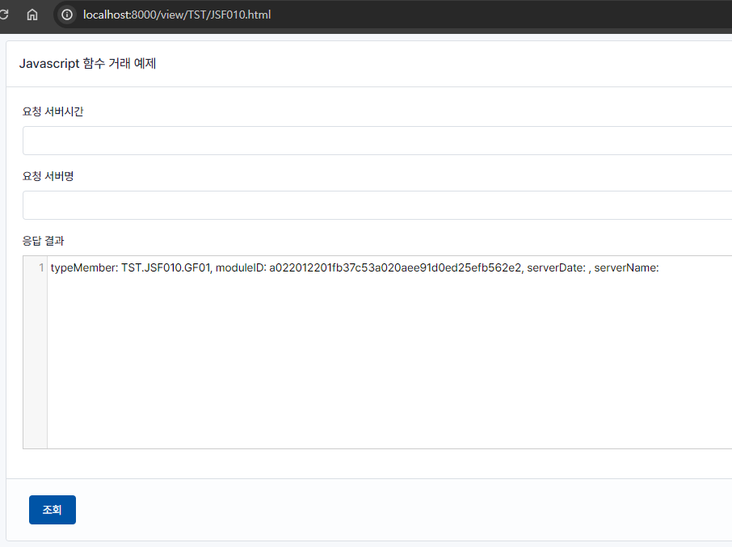
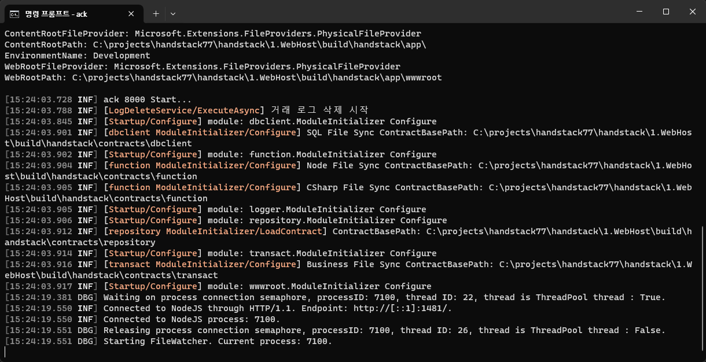
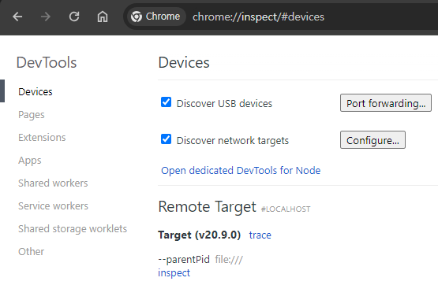
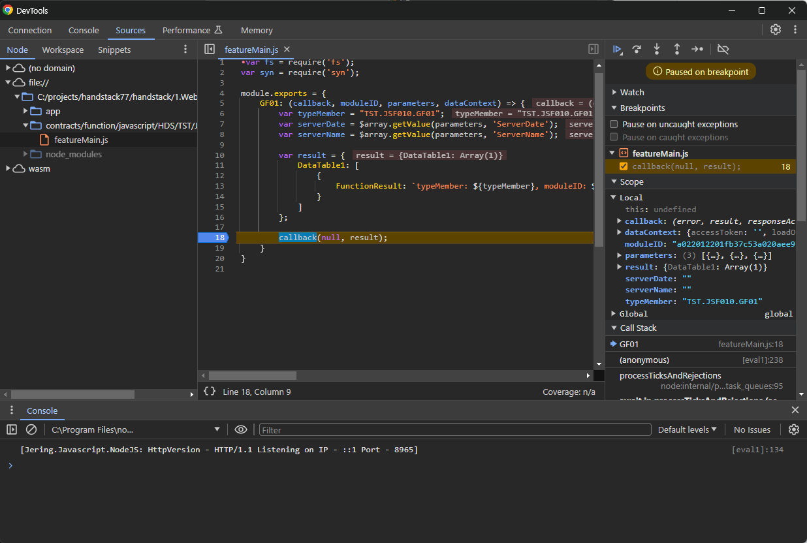

# Node.js 함수 디버깅하기

**Jering.Javascript.NodeJS**는 ack 프로그램에서 Node.js 기반 함수를 호출 할 수 있게 해주는 오픈소스 라이브러리입니다.

이 라이브러리는 개발자들이 네이티브 C# 함수만큼 쉽게 JavaScript 함수를 호출할 수 있게 해주는 기능을 제공하며, 프로그램 내에서 JavaScript 객체에 쉽게 접근하고 통합할 수 있게 해줍니다.

> 이 라이브러리는 호스트에 설치된 Node.js를 의존하며 20.x 버전을 기반으로 작성되었습니다.

Jering.Javascript.NodeJS의 핵심 기능은 다음과 같이 요약할 수 있습니다.

* JavaScript 코드를 실행하는 Node.js 프로세스는 ack 프로그램과 별개로 실행되며, 이를 통해 ack 프로그램의 안정성과 보안을 보장합니다.
* IPC 통신을 통해 ack 프로그램과 Node.js 프로세스 간의 데이터 전달을 지원합니다.
* Chrome DevTools 프로토콜을 통해 Node.js 프로세스를 디버깅할 수 있습니다.

자세한 정보는 [여기를](https://github.com/JeringTech/Javascript.NodeJS)를 참고하세요.

## 자바스크립트 디버깅

디버깅을 위한 자바스크립트 함수에 브레이크 포인트를 위한 debugger 명령문을 추가하세요.

자바스크립트를 디버깅하려면 HandStack function 모듈의 `handstack\2.Modules\function\module.json` 파일을 열고 다음과 같이 구성하세요.

```json
"NodeFunctionConfig": {
    "LocalStoragePath": "../cache/function",
    "NodeScriptMapBasePath": "",
    "LogMinimumLevel": "trace",
    "FileLogBasePath": "../log/function/javascript",
    "TimeoutMS": -1,
    "IsSingleThread": true,
    "WatchGracefulShutdown": true,
    "EnableFileWatching": true,
    "WatchFileNamePatterns": [ "featureMain.js", "featureMeta.json", "featureSQL.xml", "syn.config.json" ],
    "NodeAndV8Options": "--inspect",
    "EnvironmentVariables": ""
},
```

NodeAndV8Options= --inspect 를 사용하여 Node.js 디버깅을 활성화합니다. 설정에 따라 원격 디버깅도 가능합니다. 자세한 내용은 [Node.js CLI 옵션](https://nodejs.org/api/cli.html#--inspecthostport)을 참고하세요.

Node.js 디버깅을 활성화 한 후 ack 프로그램 실행을 한 다음 HandStack에 기본 제공되는 기능을 사용하여 자바스크립트 함수를 호출하는 예제를 실행합니다. http://localhost:8000/view/TST/JSF010.html 


그림) JSF010 예제 실행 화면

ack 프로그램 실행후 처음 Node.js 함수가 호출 되면 다음과 같은 정보가 화면에 출력됩니다.


그림) ack 프로그램에서 Node.js Function 처리를 위한 프로세스 실행 화면

## Chrome에서 `chrome://inspect` 열기

`Open dedicated DevTools for Node` (노드 전용 DevTools 열기)를 클릭합니다.

Chrome Inspector가 열리면 다음과 같은 화면이 표시됩니다. (Node.js 프로세스가 실행되어 찾을 때까지 약간의 시간이 걸릴 수 있습니다)


그림) Chrome Inspector에서 Node.js 프로세스 디버깅 화면


그림) Chrome Inspector에서 JSF010 함수 디버깅 화면

## JSF010 예제에 대한 전체 소스

```html
<!DOCTYPE html>
<html lang="ko">
<head>
    <meta charset="UTF-8">
    <meta name="viewport" content="width=device-width, initial-scale=1.0">
</head>
<body style="visibility: hidden;">
    <form autocomplete="off" id="form1" syn-datafield="MainForm">
        <div class="page">
            <div class="page-wrapper">
                <div class="page-body">
                    <div class="container-xl">
                        <div class="row row-cards">
                            <div class="container-xl">
                                <div class="col">
                                    <div class="card">
                                        <div class="card-header">
                                            <h3 class="card-title">Javascript 함수 거래 예제</h3>
                                        </div>
                                        <div class="card-body">
                                            <div class="mb-3">
                                                <label class="form-label">요청 서버시간</label>
                                                <input id="txtServerDate" syn-datafield="ServerDate" syn-options="{belongID: ['GF01']}" class="form-control">
                                            </div>
                                            <div class="mb-3">
                                                <label class="form-label">요청 서버명</label>
                                                <input id="txtServerName" syn-datafield="ServerName" syn-options="{belongID: ['GF01']}" class="form-control">
                                            </div>
                                            <div class="mb-3">
                                                <label class="form-label">응답 결과</label>
                                                <textarea id="txtFunctionResult" syn-datafield="FunctionResult" class="form-control"></textarea>
                                            </div>
                                        </div>
                                        <div class="card-footer">
                                            <div class="row align-items-center">
                                                <div class="col-auto">
                                                    <button type="button" id="btnSearch" syn-events="['click']" class="btn btn-primary">조회</button>
                                                </div>
                                            </div>
                                        </div>
                                    </div>
                                </div>
                            </div>
                        </div>
                    </div>
                </div>
            </div>
        </div>
    </form>
    <script src="/js/syn.loader.js"></script>
</body>
</html>
```
코드) handstack\2.Modules\wwwroot\wwwroot\view\TST\JSF010.html

```javascript
'use strict';
let $JSF010 = {
    transaction: {
        GF01: {
            inputs: [{ type: 'Row', dataFieldID: 'MainForm' }],
            outputs: [{ type: 'Form', dataFieldID: 'MainForm' }]
        }
    },

    event: {
        btnSearch_click(evt) {
            syn.$w.transactionAction('GF01');
        }
    }
}
```
코드) handstack\2.Modules\wwwroot\wwwroot\js\TST\JSF010.js


```json
{
    "ApplicationID": "HDS",
    "ProjectID": "TST",
    "TransactionID": "JSF010",
    "Comment": "Javascript 기본 거래 확인",
    "Services": [
        {
            "ServiceID": "GF01",
            "Authorize": false,
            "ReturnType": "Json",
            "CommandType": "F",
            "TransactionScope": false,
            "Inputs": [
                {
                    "ModelID": "Dynamic",
                    "Fields": [],
                    "TestValues": [],
                    "DefaultValues": [],
                    "Type": "Row",
                    "BaseFieldMappings": [],
                    "ParameterHandling": "Rejected"
                }
            ],
            "Outputs": [
                {
                    "ModelID": "Dynamic",
                    "Fields": [
                    ],
                    "Type": "Form"
                }
            ]
        }
    ],
    "Models": []
}
```
코드) handstack\2.Modules\wwwroot\Contracts\transact\HDS\TST\JSF010.json


```javascript
var fs = require('fs');
var syn = require('syn');

module.exports = {
    GF01: (callback, moduleID, parameters, dataContext) => {
        var typeMember = "TST.JSF010.GF01";
        var serverDate = $array.getValue(parameters, 'ServerDate');
        var serverName = $array.getValue(parameters, 'ServerName');

        var result = {
            DataTable1: [
                {
                    FunctionResult: `typeMember: ${typeMember}, moduleID: ${moduleID}, serverDate: ${serverDate}, serverName: ${serverName}`
                }
            ]
        };

        callback(null, result);
    }
}
```
코드) handstack\2.Modules\function\Contracts\function\javascript\HDS\TST\JSF010\featureMain.js