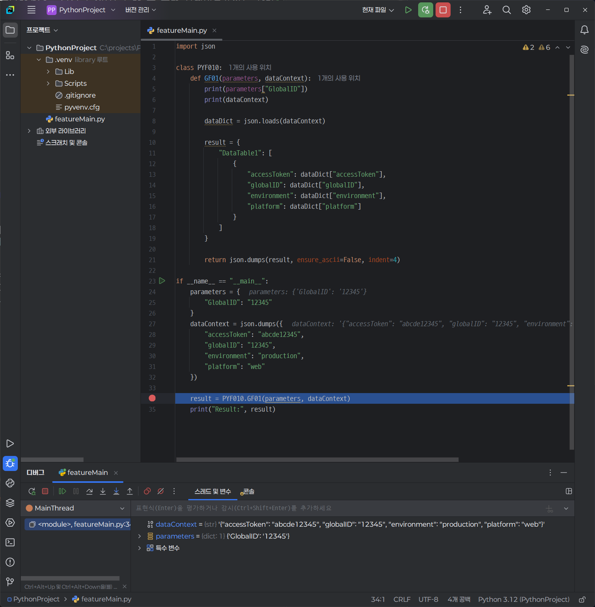

# Python 함수 디버깅하기

함수 단위로 업무를 개발할 때 JetBrain 의 PyCharm Community 에디션을 이용하는 것을 권장합니다.

https://www.jetbrains.com/pycharm/download 에서 사용중인 운영체제에 맞게 PyCharm Community 에디션을 다운로드하여 설치하거나, Windows 운영체제에서는 다음의 CLI 명령 프롬프트로 간단하게 설치 할 수 있습니다.

```bash
winget install -e --id=JetBrains.PyCharm.Community
```

> PyCharm Community 에디션은 오픈소스 프로젝트 및 개인용으로 무료로 사용할 수 있습니다.

## 테스트 코드 가져오기

서버 함수의 기본 틀을 만들기 위해 다음과 같이 코드를 참고하여 featureMain.py 파일을 작성합니다. 이 코드는 GitHub 에 게시된 [/2.Modules/function/Contracts/function/HDS/TST/PYF010/featureMain.py](https://github.com/handstack77/handstack/blob/master/2.Modules/function/Contracts/function/HDS/TST/PYF010/featureMain.py) 예제입니다.

```python
import json

class PYF010:
    def GF01(parameters, dataContext):
        print(parameters["GlobalID"])
        print(dataContext)
        
        dataDict = json.loads(dataContext)

        result = {
            "DataTable1": [
                {
                    "accessToken": dataDict["accessToken"],
                    "globalID": dataDict["globalID"],
                    "environment": dataDict["environment"],
                    "platform": dataDict["platform"]
                }
            ]
        }

        return json.dumps(result, ensure_ascii=False, indent=4)
```

PYF010 클래스에는 다양한 목적을 수행하는 함수들이 선언되어 있으며 여기에서는 GF01 함수를 디버깅 하기 위해 다음과 같이 맨 하단에 진입 함수를 추가하고 매개변수 값을 설정합니다.

```python
if __name__ == "__main__":
    parameters = {
        "GlobalID": "12345"
    }
    dataContext = json.dumps({
        "accessToken": "abcde12345",
        "globalID": "12345",
        "environment": "production",
        "platform": "web"
    })

    result = PYF010.GF01(parameters, dataContext)
    print("Result:", result)
```

## 디버깅 모드 시작하기

1. **디버깅할 파일 열기**: 디버깅할 파이썬 파일을 엽니다.
2. **디버깅 모드 시작**: 상단 메뉴에서 `Run` -> `Debug`를 선택하거나, `Shift + F9` 키를 눌러 디버깅 모드를 시작합니다.

## 브레이크포인트 설정

1. **브레이크포인트 추가**: 디버깅할 코드 줄 번호 왼쪽을 클릭하여 브레이크포인트를 추가합니다. 빨간색 점이 나타나면 브레이크포인트가 설정된 것입니다.
2. **브레이크포인트 관리**: 브레이크포인트를 제거하려면 다시 클릭하거나, `Ctrl + Shift + F8`을 눌러 브레이크포인트 관리 창에서 관리할 수 있습니다.

## 디버깅 도구 사용법

현재 선택한 파이썬 파일에 대해 디버깅 모드가 시작되면 하단에 디버깅 도구 창이 나타납니다. PyCharm에서 디버깅을 효율적으로 할 수 있는 주요 단축키는 다음과 같습니다.

- Shift + F9: 디버깅 시작
- F8: Step Over (현재 줄을 실행하고 다음 줄로 이동)
- F7: Step Into (함수 내부로 들어가서 디버깅)
- Shift + F8: Step Out (현재 함수 실행을 마치고 호출한 함수로 돌아감)
- F9: Resume Program (다음 브레이크포인트까지 실행)
- Ctrl + F8: 브레이크포인트 설정/해제
- Alt + F9: Run to Cursor (커서 위치까지 실행)
- Alt + F8: Evaluate Expression (표현식 평가)

## 변수 검사 및 수정

1. **변수 값 확인**: 디버깅 도구 창의 `Variables` 탭에서 현재 변수 값을 확인할 수 있습니다.
2. **변수 값 수정**: 변수 값을 더블 클릭하여 수정할 수 있습니다. 수정 후 `Enter` 키를 눌러 변경 사항을 적용합니다.

## 스택 프레임 탐색

1. **스택 프레임 확인**: 디버깅 도구 창의 `Frames` 탭에서 현재 스택 프레임을 확인할 수 있습니다.
2. **스택 프레임 전환**: 다른 스택 프레임을 클릭하여 해당 프레임의 변수와 코드를 확인할 수 있습니다.

## 디버깅 팁

1. **조건부 브레이크포인트**: 브레이크포인트를 오른쪽 클릭하여 조건을 설정할 수 있습니다. 특정 조건이 만족될 때만 브레이크포인트가 작동합니다.
2. **로그 메시지 추가**: 브레이크포인트를 오른쪽 클릭하여 로그 메시지를 추가할 수 있습니다. 코드 실행 중 로그 메시지를 출력할 수 있습니다.
3. **Evaluate Expression**: `Alt + F8`을 눌러 표현식을 평가하고 결과를 확인할 수 있습니다.

## 디버깅 스크린 샷


그림) PYF010 예제 디버깅 화면

디버깅 도구 창에서 변수, 스택 프레임, 콘솔 등을 확인할 수 있습니다. 여기에서 만들어진 소스코드를 HandStack 서버에 배포하고, Postman 등의 API 테스트 도구를 이용하여 테스트합니다.