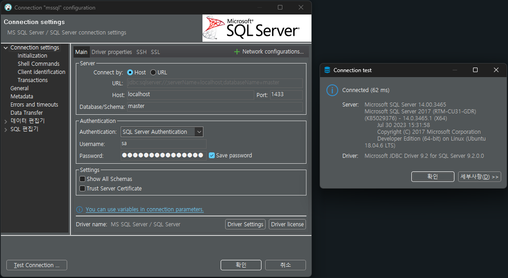
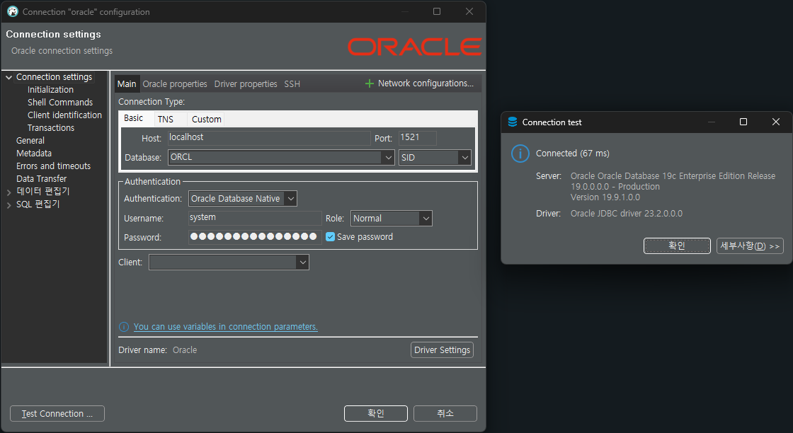
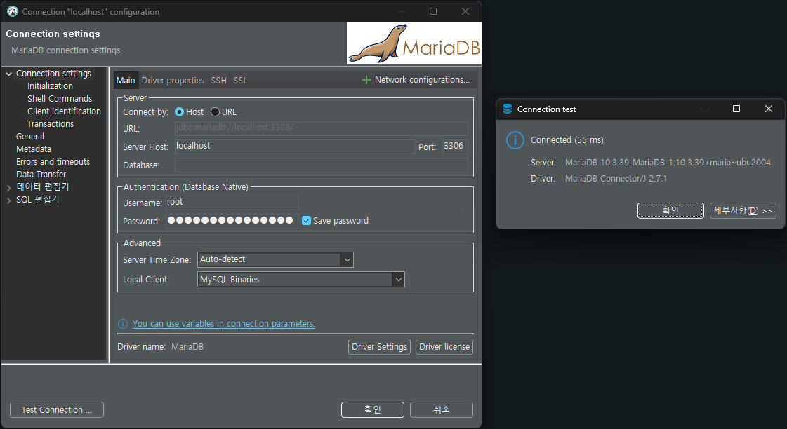
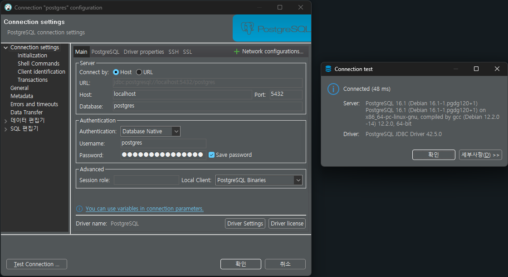

# docker 기반 개발용 데이터베이스 설치하기

## Docker Desktop 설치하기

개발용 로컬 환경에 Docker를 설치하려면 Docker Desktop 설치를 권장합니다. Docker Desktop 은 Windows 10 이상 버전과 macOS 10.14 이상 버전이 필요합니다.

> Linux의 경우 Ubuntu, Debian, Fedora를 지원합니다.

다음 단계를 따르면 됩니다:

* [Windows에 Docker Desktop 설치](https://docs.docker.com/desktop/install/windows-install/) 문서를 확인합니다.
* [macOS에 Docker Desktop 설치](https://docs.docker.com/desktop/install/mac-install/) 문서를 확인합니다.
* [Linux에 Docker Desktop 설치](https://docs.docker.com/desktop/install/linux-install/) 문서를 확인합니다.
* 다운로드한 파일을 실행합니다.
* 설치 마법사를 따라 Docker Desktop을 설치합니다.

> Docker Desktop을 설치하면 Docker Engine, Docker CLI, Docker Compose, Notary, Kubernetes 등의 도구가 함께 설치됩니다. 이 도구들을 사용하여 컨테이너를 관리하고 배포할 수 있습니다. Docker Desktop을 사용하는 방법에 대한 자세한 내용은 Docker 공식 문서를 참고하시기 바랍니다.

## 로컬 데이터베이스 설치하기

다음의 스크립트를 실행하면 각각의 데이터베이스가 실행되며, 로컬에서 해당 데이터베이스를 사용할 수 있습니다. Strong@Passw0rd 부분은 사용자가 원하는 비밀번호로 변경할 수 있습니다.

> 데이터베이스에 따라 대소문자, 특수문자, 숫자가 포함되어야 하는 강력한 비밀번호를 요구할 수 있습니다.

### SQL Server 2017

```bash
docker run --name mssql -p 1433:1433 -d -e 'ACCEPT_EULA=Y' -e 'MSSQL_SA_PASSWORD=Strong@Passw0rd' mcr.microsoft.com/mssql/server:2017-latest
```



### Oracle 12c

```bash
docker run --name oracle -p 1521:1521 -d -e ORACLE_SID=ORCL -e ORACLE_PWD=Strong@Passw0rd -e ORACLE_CHARACTERSET=KO16MSWIN949 doctorkirk/oracle-19c
```



### MariaDB 10.3

```bash
docker run --name mariadb -d -p 3306:3306 -e MYSQL_ROOT_PASSWORD=Strong@Passw0rd mariadb:10.3
```



### PostgreSQL 9.6

```bash
docker run --name postgres -d -p 5432:5432 -e POSTGRES_PASSWORD=Strong@Passw0rd postgres:16
```



> 처음 Docker를 설치하고 스크립트를 실행하면 대용량의 Docker Image 파일을 다운 받기 때문에 시간이 네트워크 환경에 따라 많이 소요될 수 있습니다.