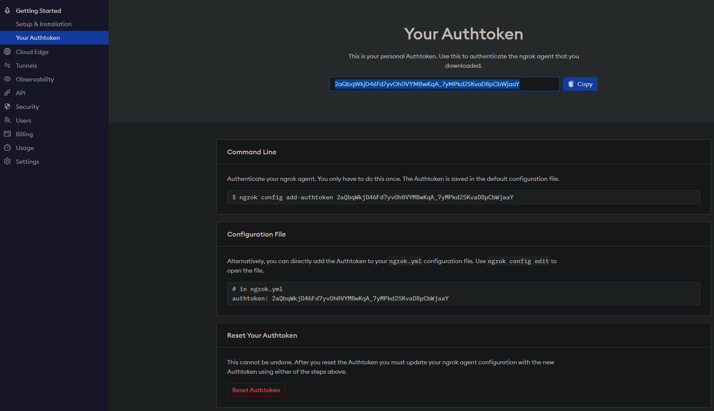
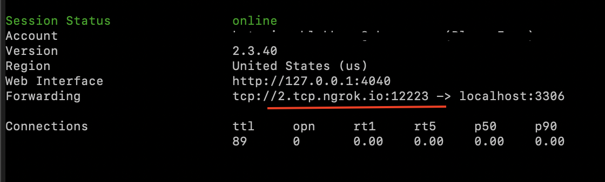

# ngrok을 통해 로컬 데이터베이스 연결하기

개발 용도로 로컬 데이터베이스를 외부에서 연결해야 하지만 온프레미스 버전을 사용하고 싶지 않다면 ngrok을 통해 연결하는 옵션을 선택할 수 있습니다. 

ngrok는 로컬 서버를 외부에서 접근할 수 있게 해주는 터널링 프로그램입니다. ngrok를 사용하면 로컬 서버를 인터넷에 연결하여 외부에서도 접근할 수 있습니다. ngrok는 무료 버전과 유료 버전이 있으며, 무료 버전은 분당 120회의 tcp 커넥션을 허용합니다. ngrok는 다양한 운영체제에서 사용할 수 있으며, 설치 방법은 각 운영체제에 따라 다릅니다. ngrok를 사용하는 방법에 대한 자세한 내용은 ngrok 공식 문서를 참고하세요.

## ngrok 설치 및 환경 구성하기

ngrok을 통해 로컬 데이터베이스를 연결하려면 아래 단계를 따르세요:

* [ngrok](https://ngrok.com/)에서 계정을 만듭니다.
* 운영체제에 적합한 [ngrok 프로그램을 다운로드](https://ngrok.com/download) 합니다.
* 터미널(MacOS, Linux) 또는 명령줄(Windows)을 열고 다운로드 폴더(또는 ngrok 폴더가 저장된 다른 폴더)로 이동합니다.
* 압축 파일을 풉니다.
* 인증하려면 인증 토큰 페이지에서 개인 인증 토큰을 찾습니다. 
* 인증 토큰은 기본 구성 파일에 저장합니다. 이 작업은 한 번만 수행하면 됩니다.

```bash
ngrok config add-authtoken 2aQgPOTix7rT3t231VbDEnq63aB_61S4UX1XJpw68a4dNBP8f
```

## 외부에 접속 가능하도록 실행하기

다음 명령 중 하나를 사용하여 로컬 앱 서버 또는 데이터베이스를 외부에 접속 가능하도록 노출합니다. 다음 예제는 기본 포트를 사용합니다.

```bash
web server: ./ngrok http 80
mysql: ./ngrok tcp 3306
postgre: ./ngrok tcp 5432
mssql: ./ngrok tcp 1433
oracle: ./ngrok tcp 1521
```

## 데이터베이스 연결 문자열 확인하기

다음과 같이 mariadb 를 외부에 접속 가능하도록 프로그램이 실행 중인 경우



데이터베이스 연결 문자열에 Host 와 Port 를 지정할 수 있습니다

> Host: 2.tcp.ngrok.io
> Port: 12223