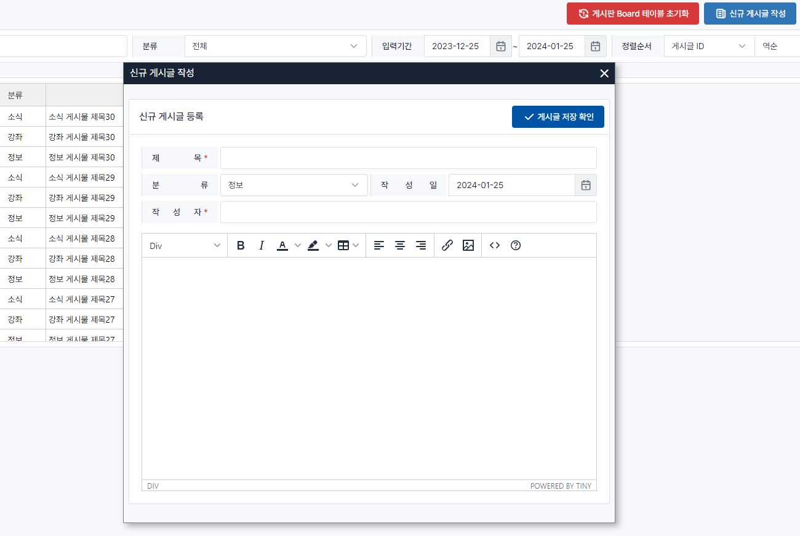

# 게시판 프로젝트 시작하기

처음 개발을 시작할 때 게시판 만들기는 가장 기본적인 프로젝트로 권장됩니다. 특히 게시판은 웹 개발에 필요한 여러 주요 요소를 포괄하기 때문에 게시판 예제가 다음과 같이 HandStack 기반 개발의 핵심 개념을 이해하고 실습하는 데 매우 유용합니다.

* **웹 페이지 화면 구성**: 게시판을 만들면서 HandStack에서 기본 제공되는 tabler CSS Framework 기반의 웹 페이지의 레이아웃과 디자인을 배울 수 있습니다.
* **서버 데이터 통신 처리**: 게시판은 사용자의 요청을 서버로 전송하고, 서버의 응답을 처리하는 HandStack의 거래 과정을 이해하는 데 도움이 됩니다.
* **데이터베이스 처리**: 게시글을 작성, 읽기, 수정, 삭제하는 기능을 구현하면서 데이터베이스와의 상호작용을 Contracts로 설정하는 방법을 배울 수 있습니다.

IT 분야에서 요즘 대세로 사용 중인 생성형 AI (Copilot)를 게시판을 만드는 데 참고 자료로 활용해서 만들어 보겠습니다. 여기에서는 [Microsoft Copilot (ChatGPT v4)](https://copilot.microsoft.com/)를 사용합니다.

최근 Copilot 을 개발 업무에 적극적으로 활용하는 중입니다. 단순 반복적인 업무는 확실히 줄어들었고 개발 보조 도구로서 만족하기 때문에 아직 개발 업무에 AI 를 활용 안해보셨다면 시간내어 살펴볼 가치는 있다고 생각합니다.

## 사용자 스토리 만들기

개발 프로젝트를 위해 제일 먼저 해야 할 것은 무엇일까요? 즉흥적으로 개념을 증명할 코드를 만들거나 유사한 프로젝트를 벤치마킹 또는 R&D를 진행할 수도 있고 요구사항이나 업무를 먼저 이해해야 하는 걸수도 있습니다. 무엇이든 정답이 될 수 있습니다.

일반적으로 IT 프로젝트에서 제일 먼저 해야 하는 것은 "페르소나 정하기" 입니다. 페르소나를 정하는 이유는 다음과 같습니다.

* 사용자의 이해: 페르소나를 만들어 놓으면 사용자들의 요구 사항, 경험, 행동, 목표 등을 이해하는 데 있어서 도움이 됩니다.
* 소통의 효율성: 프로젝트의 페르소나를 설정하면 조직원들이 공통의 타깃을 이해하고 커뮤니케이션을 효율적으로 진행할 수 있다는 이점도 있습니다.

> 게시판 프로젝트의 사용자는 "개발자" 본인 1명으로 한정합니다.

그래서 게시판의 기능은 로그인/권한 기능, 파일 첨부 등등 다양한 고급 기능은 일부러 고려하지 않습니다. 대신 너무 기본에 충실한 게시판은 재미가 없으니 개발자가 원하는 게시판의 주요 요구 사항을 다음과 같이 설정했습니다.

* 개발자가 작성하는 글은 글꼴, 컬러, 크기, 서식을 지정해야 하며 글 내용에 외부 이미지나 로컬 PC의 이미지를 보여 줄 수 있어야 합니다.
* 개발자가 게시 글을 작성할 때 "정보, 강좌, 소식"과 같이 분류하는 글을 작성합니다. 글에 대한 그룹과 조회 기능의 편의를 위해 필요합니다.
* 개발자가 자신의 글을 조회하고 바로 수정 또는 삭제 할 수 있어야 합니다. 개인 용도로 게시 글 관리에 시간 절약을 위해 화면 전환을 최소화 하기를 원합니다.
* 개발자가 글을 조회할 때 최신 순으로 보여지며 "분류, 기간, 제목"을 기준으로 조건 검색이 가능 해야합니다. 이때 기간은 조회 성능을 효율적으로 관리하기 위해 최근 1달을 오늘 날짜를 기준으로 자동 설정됩니다.
* 개발자가 원하는 게시글을 빠르게 찾기 위해 조회 한 글 목록에서 "분류, 기간, 제목, 입력시간"을 기준으로 순차, 역순으로 정렬 해야합니다.

## 화면/기능 생각하기

"개발자" 사용자가 원하는 게시판의 주요 기능에 필요한 화면과 기능을 간단하게 정리하면 다음과 같습니다.

* 게시글 목록 화면
  * "분류, 기간, 제목" 기준 조회 필터 기능
  * "분류, 기간, 제목, 입력시간" 기준 글 목록 정렬 기능
  * 게시글 등록 화면 호출
  * 기존 게시글 조회 화면 호출
* 신규 게시글 등록 화면
  * 글꼴, 컬러, 크기, 서식, 이미지를 표시할 수 있는 편집기 기능
  * 제목, 본문, 작성자 항목을 입력하는 기능
* 기존 게시글 편집 및 삭제 화면
  * 게시글 정보를 조회하는 기능
  * 글꼴, 컬러, 크기, 서식, 이미지를 표시할 수 있는 편집기 기능
  * 제목, 본문, 작성자 항목을 편집하는 기능
  * 경고 팝업 후 게시글을 삭제하는 기능

대략적으로 3개의 화면과 6 ~ 8개 정도의 주요 기능이 필요한 것을 알 수 있습니다. 이러한 요구 사항들은 HandStack 에서 기본 제공하는 기능들로 대부분 개발이 가능합니다. 물론 이에 대한 약간의 학습 비용이 필요하며 여기에서는 자세히 다루지 않습니다. 자세한 내용은 [자습서 튜토리얼](/docs/category/자습서-튜토리얼)을 참고하세요. 

앞으로 나올 예제 코드들은 모두 표준 언어와 문법으로 사용하기 때문에 의사코드(Pseudo Code)로서 각 모듈이 작동하는 논리를 표현하기 위한 코드로 생각하면 좀 더 편하게 읽으실 수 있습니다.

> 학습 자료는 지속적으로 추가합니다. 알고 싶거나 찾고자 하는 내용이 있으시면 handstack77@gmail.com 로 피드백을 주시면 우선적으로 적용하겠습니다.

### 작업 항목 분류하기

만들어야 할 3개의 화면의 작업 항목을 관리하기 위해 다음과 같이 항목 ID로 분류합니다.

```
BOD: 게시판 프로젝트 ID
└-BOD010: 게시글 목록 ID
└-BOD011: 게시글 신규 등록 ID
└-BOD012: 게시글 편집 및 삭제 ID
```

개인적으로 개발자가 만드는 소스 코드는 신뢰를 바탕으로 합의에 의한 결과를 만들어내야 하는 계약이라고 생각합니다. 그래서 화면/기능에 대한 전체 설정과 코드는 contracts 디렉토리 하위에 관리합니다.

작업 항목 ID로 분류한 게시판에 필요한 모든 소스의 디렉토리와 파일 구성은 다음과 같습니다.

```
contracts
├─dbclient
│  └─HDS
│      └─BOD
│          ├─BOD010.xml
│          ├─BOD011.xml
│          └─BOD012.xml
├─transact
│  └─HDS
│      └─BOD
│          ├─BOD010.json
│          ├─BOD011.json
│          └─BOD012.json
└─wwwroot
   └─BOD
       ├─BOD010.html
       ├─BOD010.js
       ├─BOD011.html
       ├─BOD011.js
       ├─BOD012.html
       └─BOD012.js
```

위의 소스 구성의 의미는 다음과 같습니다.

* HandStack의 약어 (HDS) 프로그램에 게시판 업무 (BOD)를 디렉토리로 관리하며 기본적으로 하나의 화면/기능은 wwwroot, transact, dbclient 모듈내 동일한 항목 ID로 관리합니다. 이러한 약속은 유지보수/인수인계 비용을 절감합니다.
* 항목 ID 6자리 (BOD010)는 개인적인 업무 규칙을 두어 만드는 것을 권장합니다. 여기에서는 XXX010, XXX020 등은 각각의 주 화면/기능을 의미하고 XXX011, XXX012는 주 화면에 종속된 팝업 화면 또는 내부 기능을 의미합니다.

## Copilot으로 관리 데이터 생각 정리하기

HandStack은 공식적으로 SQL Server, Oracle, MySQL/MariaDB, PostgreSQL, SQLite 데이터베이스를 지원합니다. 게시판 프로젝트에서 사용하는 데이터베이스는 SQLite 입니다. SQLite는 개발자에게 다음과 같은 장점을 제공합니다.

* 최신 ANSI SQL 준수: 표준 SQL 문법을 사용 가능합니다. 고유 기능을 제외한 호환성이 높은 SQL을 다른 데이터베이스에 재사용 가능합니다.
* 서버가 필요 없습니다: SQLite는 서버 프로세스를 시작, 중지 또는 구성할 필요가 없습니다.
* 간단한 데이터베이스 파일: SQLite 데이터베이스는 단일 일반 디스크 파일로, 백업 및 복구가 간단합니다.

게시판을 만드는 데 필요한 데이터 항목을 Copilot에게 다음과 같이 활용해서 만들어 보겠습니다.

> 동일한 프롬프트 스크립트여도 로그인 계정의 작업 이력에 따라 다른 결과가 나올수 있고 출력 결과는 검증되지 않았기 때문에 참고용으로 사용 해야 합니다.

### 테이블 및 DDL 쿼리 작성 도움받기

게시판 테이블 및 쿼리 작성을 위해 Copilot에게 질문한 스크립트와 결과는 다음과 같습니다.

> ```
> 간단한 분류 게시판 데이터베이스 테이블 정보 (컬럼명, 데이터 타입, 설명)를 SQLite 기준으로 MarkDown 문법으로 만들어줘. 그리고 실행 결과에서 테이블을 생성 하는 ddl 문법에서 ID를 자동 증가 키 컬럼으로 구성하고 기존 테이블이 없으면 CREATE 하는 예제를 알려줘
> ```

---

> SQLite 기준으로 분류 게시판 데이터베이스 테이블을 만들었습니다. 아래는 간단한 분류 게시판 테이블의 구조입니다:
> 
> | 컬럼명 | 데이터 타입 | 설명 |
> |--------|-------------|------|
> | ID | INTEGER | 게시글의 고유 번호 (기본 키) |
> | Category | TEXT | 게시글의 카테고리 |
> | Title | TEXT | 게시글의 제목 |
> | Content | TEXT | 게시글의 내용 |
> | Author | TEXT | 게시글 작성자의 이름 |
> | DatePosted | TEXT | 게시글이 작성된 날짜와 시간 |
> 
> 이 테이블은 게시판의 기본적인 기능을 수행할 수 있습니다. 필요에 따라 추가적인 컬럼을 추가하거나 수정할 수 있습니다. 이 정보를 CSV 파일에 입력하면 SQLite 기준의 분류 게시판 데이터베이스 테이블 정보를 CSV 형식으로 만들 수 있습니다. 
> 
> 참고로, SQLite에서 테이블을 생성하는 SQL 쿼리는 다음과 같습니다:
> 
> ```sql
> CREATE TABLE IF NOT EXISTS Board (
>   ID INTEGER PRIMARY KEY AUTOINCREMENT,
>   Category TEXT,
>   Title TEXT,
>   Content TEXT,
>   Author TEXT,
>   DatePosted TEXT
> );
> ```


### 게시판 CRUD 쿼리 작성 도움받기

> ```
> 위의 Board 테이블 결과에서 SQLite 기준으로 CRUD 쿼리를 만들어줘
> ```

---

> 네, Board 테이블에 대한 CRUD(Create, Read, Update, Delete) 쿼리를 SQLite 기준으로 작성해드리겠습니다.
> 
> 1. **Create (생성)**: 새로운 게시글을 추가합니다.
> ```sql
> INSERT INTO Board (ID, Category, Title, Content, Author, DatePosted)
> VALUES (1, '카테고리', '제목', '내용', '작성자', datetime('now'));
> ```
> 
> 2. **Read (조회)**: 게시글을 조회합니다.
> ```sql
> -- 모든 게시글 조회
> SELECT * FROM Board;
> 
> -- 특정 ID의 게시글 조회
> SELECT * FROM Board WHERE ID = 1;
> 
> -- 특정 카테고리의 게시글 조회
> SELECT * FROM Board WHERE Category = '카테고리';
> ```
> 
> 3. **Update (수정)**: 기존 게시글을 수정합니다.
> ```sql
> UPDATE Board
> SET Title = '새 제목', Content = '새 내용'
> WHERE ID = 1;
> ```
> 
> 4. **Delete (삭제)**: 게시글을 삭제합니다.
> ```sql
> DELETE FROM Board WHERE ID = 1;
> ```
> 
> 위의 쿼리들은 간단한 예시이며, 실제 사용 시에는 필요에 따라 적절히 수정하여 사용하시면 됩니다. 또한, 데이터베이스 작업을 할 때는 항상 주의를 기울여야 합니다. 특히, `UPDATE`와 `DELETE` 쿼리는 신중하게 사용해야 합니다. 잘못 사용하면 예상치 못한 데이터 손실이 발생할 수 있습니다.

---

게시판을 만들고 관리하기 위해 참고용 SQL이 충분히 만들어져 있지만 업무에 맞게 조금 다듬어 이후 예제에 활용 하겠습니다.

## 테이블 DDL 및 CRUD 쿼리 적용하기

Copilot의 도움으로 생성된 쿼리를 게시판의 주요 기능에 적절하게 관리하기 위해 간단한 규칙을 만들어 기능 ID 값을 생성합니다. 예를 들어 기능 ID는 다음과 같습니다.

* LD01
* LD02
* GD01
* MD01
* DD01

명령구분 1자리 + 기능 1자리 + 순번 2자리 = "LD01" 4자리로 구성된 이 규칙은 하나의 화면에 CRUD에 대한 각각의 기능이 99개가 넘지 않는 것을 전제로 만들었습니다.

> 실제로 아무리 복잡한 화면도 이 전제를 넘어서는 경우는 무언가 잘못된 설계나 유지보수 비용을 고려하여 화면이나 기능을 좀 더 세분화하는 리펙토링이 필요할 거라 생각합니다.

| 명령구분 | 명칭 | 설명 |
| --- | --- | --- |
| D | Database  | 데이터베이스 명령 |
| F | Function  | 서버 함수 실행 |
| A | API  | RESTful API 호출 |
| T | Task  | 배치 프로그램 작업 |

게시판 프로젝트에서는 명령구분을 "D" 만 사용합니다.

| 기능명 | 명칭 | 설명 |
| --- | --- | --- |
| I | INSERT  | 단순 INSERT |
| U | UPDATE  | 단순 UPDATE |
| D | DELETE  | 단순 DELETE |
| G | GET ROW | 단일 데이터를 조회하는 경우 |
| L | LIST    | 목록 데이터를 조회하는 경우 |
| M | MODIFY  | CRUD 복합 |
| Z | MANAGED  | 관리 목적의 실행 |

이 규칙은 wwwroot, transact, dbclient 모듈등등 모든 분야에 동일하게 적용합니다. 이제 데이터베이스 쿼리를 다음과 같이 적용할 수 있습니다.

### BOD010.xml 게시글 목록 쿼리

```xml
<?xml version="1.0" encoding="UTF-8"?>
<mapper xmlns="contract.xsd">
	<header>
		<application>HDS</application>
		<project>BOD</project>
		<transaction>BOD010</transaction>
		<datasource>DB01</datasource>
		<use>Y</use>
		<desc>게시판 Board 테이블 DDL 및 게시글 조회</desc>
	</header>
	<commands>
        <statement id="ZD01" seq="0" use="Y" timeout="0" desc="Board 테이블 DDL 및 초기 데이터 입력 적용">
            <![CDATA[
CREATE TABLE IF NOT EXISTS Board (
	ID INTEGER PRIMARY KEY AUTOINCREMENT,
	Category TEXT,
	Title TEXT,
	Content TEXT,
	Author TEXT,
	DatePosted TEXT
);

DELETE FROM Board;

DELETE FROM sqlite_sequence WHERE name = 'Board';

INSERT INTO Board (Category, Title, Content, Author, DatePosted) VALUES ('정보', '정보 게시물 제목1', '정보 게시물 내용1', '개발자', datetime('now', 'localtime', '-1 day'));
INSERT INTO Board (Category, Title, Content, Author, DatePosted) VALUES ('강좌', '강좌 게시물 제목1', '강좌 게시물 내용1', '개발자', datetime('now', 'localtime', '-1 day'));
INSERT INTO Board (Category, Title, Content, Author, DatePosted) VALUES ('소식', '소식 게시물 제목1', '소식 게시물 내용1', '개발자', datetime('now', 'localtime', '-1 day'));
......
INSERT INTO Board (Category, Title, Content, Author, DatePosted) VALUES ('소식', '소식 게시물 제목30', '소식 게시물 내용30', '개발자', datetime('now', 'localtime', '-30 day'));
            ]]>
        </statement>
        
        <statement id="LD01" seq="0" use="Y" timeout="0" desc="분류, 기간, 제목을 기준으로 게시글 조회">
            <![CDATA[
SELECT B.ID
    , B.Category
    , B.Title
    , B.Author
    , B.DatePosted
    , '확인' AS EditPost
FROM Board B 
WHERE B.DatePosted BETWEEN @StartDate AND (@EndDate || '23:59:59')
    AND CASE WHEN @Category = '' THEN @Category ELSE B.Category END = @Category
    AND CASE WHEN @Title = '' THEN @Title ELSE B.Title END LIKE ('%' || @Title || '%')
ORDER BY (CASE @Sequence WHEN 'ASC' THEN CASE @OrderBy 
        WHEN 'ID' THEN ID 
        WHEN 'Category' THEN Category 
        WHEN 'Title' THEN Title 
        WHEN 'Author' THEN Author END
    END) ASC
    , (CASE @Sequence WHEN 'DESC' THEN CASE @OrderBy 
        WHEN 'ID' THEN ID 
        WHEN 'Category' THEN Category 
        WHEN 'Title' THEN Title 
        WHEN 'Author' THEN Author END
    END) DESC;
            ]]>
            <param id="@Category" type="String" length="-1" value="" />
            <param id="@Title" type="String" length="-1" value="" />
            <param id="@StartDate" type="String" length="-1" value="" />
            <param id="@EndDate" type="String" length="-1" value="" />
        </statement>
	</commands>
</mapper>
```

### BOD011.xml 게시글 신규 등록 쿼리

```xml
<?xml version="1.0" encoding="UTF-8"?>
<mapper xmlns="contract.xsd">
	<header>
		<application>HDS</application>
		<project>BOD</project>
		<transaction>BOD011</transaction>
		<datasource>DB01</datasource>
		<use>Y</use>
		<desc>게시글 신규 등록</desc>
	</header>
	<commands>
        <statement id="ID01" seq="0" use="Y" timeout="0" desc="게시글 입력">
            <![CDATA[
INSERT INTO Board
(
    Category
    , Title
    , Content
    , Author
    , DatePosted
) 
VALUES
(
    @Category
    , @Title
    , @Content
    , @Author
    , CASE WHEN @CreateDate = '' THEN datetime('now', 'localtime') ELSE (@CreateDate || ' ' || strftime('%H:%M:%S', 'now', 'localtime')) END
);
            ]]>
            <param id="@Category" type="String" length="-1" value="" />
            <param id="@Title" type="String" length="-1" value="" />
            <param id="@Content" type="String" length="-1" value="" />
            <param id="@Author" type="String" length="-1" value="" />
            <param id="@CreateDate" type="String" length="-1" value="" />
        </statement>
	</commands>
</mapper>
```

### BOD012.xml 게시글 편집 및 삭제 쿼리

```xml
<?xml version="1.0" encoding="UTF-8"?>
<mapper xmlns="contract.xsd">
	<header>
		<application>HDS</application>
		<project>BOD</project>
		<transaction>BOD012</transaction>
		<datasource>DB01</datasource>
		<use>Y</use>
		<desc>게시글 편집 및 삭제</desc>
	</header>
	<commands>
        <statement id="GD01" seq="0" use="Y" timeout="0" desc="게시글 조회">
            <![CDATA[
SELECT B.ID
    , B.Category
    , B.Title
    , B.Content
    , B.Author
    , B.DatePosted
FROM Board B 
WHERE B.ID = @ID;
            ]]>
            <param id="@ID" type="String" length="-1" value="" />
        </statement>

        <statement id="UD01" seq="0" use="Y" timeout="0" desc="게시글 변경">
            <![CDATA[
UPDATE Board
SET Category = @Category
    , Title = @Title
    , Content = @Content
    , Author = @Author
WHERE ID = @ID;
            ]]>
            <param id="@ID" type="String" length="-1" value="" />
            <param id="@Category" type="String" length="-1" value="" />
            <param id="@Title" type="String" length="-1" value="" />
            <param id="@Content" type="String" length="-1" value="" />
            <param id="@Author" type="String" length="-1" value="" />
        </statement>

        <statement id="DD01" seq="0" use="Y" timeout="0" desc="게시글 삭제">
            <![CDATA[
DELETE FROM Board
WHERE ID = @ID;
            ]]>
            <param id="@ID" type="String" length="-1" value="" />
        </statement>
	</commands>
</mapper>
```

데이터베이스 쿼리는 XML로 관리하며 SQL 쿼리와 저장 프로시저 호출을 위한 매개변수 매핑을 직접 제어할 수 있게 해줍니다.

이 방식은 직접적인 SQL 제어로 복잡한 쿼리나 성능 튜닝에 유용합니다. 특히 GitHub, Sub Version 등 소스 제어 관리에 커밋 이력을 남길 수 있어 전체 코드에 대해 투명한 관리가 가능합니다.

dbclient 모듈에서는 유연한 SQL 작성을 위한 동적 쿼리처럼 복잡한 쿼리 처리나 필드 매핑, 전처리 쿼리, 보상 거래 실행 등등 다양한 시나리오에 대응 가능한 추가 기능을 제공합니다.

정리하면 게시판을 위한 쿼리 구성을 다음과 같이 3개의 파일에 6개의 쿼리로 기능 ID를 부여하여 정리했습니다.

```
contracts
└─dbclient
   └─HDS
       └─BOD
           ├─BOD010.xml: ZD01, LD01
           ├─BOD011.xml: ID01
           └─BOD012.xml: GD01, UD01, DD01
```

## 게시판 거래 요청 관리하기

HandStack 기반의 화면에서 모든 요청은 단일 EndPoint으로 호출됩니다. 그래서 요청 거래가 적절하게 들어오는 지 검증을 하기 위한 기능 ID 설정을 정의 해야합니다. 다음은 각 기능 ID에 따라 요청/응답 되어야 할 설정입니다.

### BOD010.json 게시글 목록 거래

```json
{
    "ApplicationID": "HDS",
    "ProjectID": "BOD",
    "TransactionID": "BOD010",
    "Comment": "게시글 목록 거래",
    "Services": [
        {
            "ServiceID": "ZD01",
            "Authorize": false,
            "ReturnType": "Json",
            "CommandType": "D",
            "TransactionScope": false,
            "Inputs": [
                {
                    "ModelID": "Dynamic",
                    "Fields": [],
                    "TestValues": [],
                    "DefaultValues": [],
                    "Type": "Row",
                    "BaseFieldMappings": [],
                    "ParameterHandling": "Rejected"
                }
            ],
            "Outputs": []
        },
        {
            "ServiceID": "LD01",
            "Authorize": false,
            "ReturnType": "Json",
            "CommandType": "D",
            "TransactionScope": false,
            "Inputs": [
                {
                    "ModelID": "Dynamic",
                    "Fields": [],
                    "TestValues": [],
                    "DefaultValues": [],
                    "Type": "Row",
                    "BaseFieldMappings": [],
                    "ParameterHandling": "Rejected"
                }
            ],
            "Outputs": [
                {
                    "ModelID": "Dynamic",
                    "Fields": [
                    ],
                    "Type": "Grid"
                }
            ]
        }
    ],
    "Models": []
}
```

### BOD011.json 게시글 신규 등록 거래

```json
{
    "ApplicationID": "HDS",
    "ProjectID": "BOD",
    "TransactionID": "BOD011",
    "Comment": "게시글 신규 등록 거래",
    "Services": [
        {
            "ServiceID": "ID01",
            "Authorize": false,
            "ReturnType": "Json",
            "CommandType": "D",
            "TransactionScope": false,
            "Inputs": [
                {
                    "ModelID": "Dynamic",
                    "Fields": [],
                    "TestValues": [],
                    "DefaultValues": [],
                    "Type": "Row",
                    "BaseFieldMappings": [],
                    "ParameterHandling": "Rejected"
                }
            ],
            "Outputs": []
        }
    ],
    "Models": []
}
```

### BOD012.json 게시글 편집 및 삭제 거래

```json
{
    "ApplicationID": "HDS",
    "ProjectID": "BOD",
    "TransactionID": "BOD012",
    "Comment": "게시글 편집 및 삭제 거래",
    "Services": [
        {
            "ServiceID": "GD01",
            "Authorize": false,
            "ReturnType": "Json",
            "CommandType": "D",
            "TransactionScope": false,
            "Inputs": [
                {
                    "ModelID": "Dynamic",
                    "Fields": [],
                    "TestValues": [],
                    "DefaultValues": [],
                    "Type": "Row",
                    "BaseFieldMappings": [],
                    "ParameterHandling": "Rejected"
                }
            ],
            "Outputs": [
                {
                    "ModelID": "Dynamic",
                    "Fields": [
                    ],
                    "Type": "Form"
                }
            ]
        },
        {
            "ServiceID": "UD01",
            "Authorize": false,
            "ReturnType": "Json",
            "CommandType": "D",
            "TransactionScope": false,
            "Inputs": [
                {
                    "ModelID": "Dynamic",
                    "Fields": [],
                    "TestValues": [],
                    "DefaultValues": [],
                    "Type": "Row",
                    "BaseFieldMappings": [],
                    "ParameterHandling": "Rejected"
                }
            ],
            "Outputs": []
        },
        {
            "ServiceID": "DD01",
            "Authorize": false,
            "ReturnType": "Json",
            "CommandType": "D",
            "TransactionScope": false,
            "Inputs": [
                {
                    "ModelID": "Dynamic",
                    "Fields": [],
                    "TestValues": [],
                    "DefaultValues": [],
                    "Type": "Row",
                    "BaseFieldMappings": [],
                    "ParameterHandling": "Rejected"
                }
            ],
            "Outputs": []
        }
    ],
    "Models": []
}
```

> 이 규칙을 벗어나는 요청이 들어올 경우 transact 모듈에서는 잘못된 요청 처리 응답을 반환합니다. transact 모듈에 전달되어 지는 전문 구조에 대해 자세한 정보는 [계약 중심 거래](/docs/reference/concept/%EA%B3%84%EC%95%BD-%EC%A4%91%EC%8B%AC-%EA%B1%B0%EB%9E%98)를 참고하세요

정리하면 게시판을 위한 거래 구성을 다음과 같이 3개의 파일에 6개의 요청/응답 설정으로 정리했습니다.

```
contracts
└─transact
   └─HDS
       └─BOD
           ├─BOD010.json
               ZD01 - 단일값 요청/응답 없음
               LD01 - 단일값 요청/Grid 목록값 응답
           ├─BOD011.json
               ID01 - 단일값 요청/응답 없음
           └─BOD012.json
               GD01 - 단일값 요청/Form 단일값 응답
               UD01 - 단일값 요청/응답 없음
               DD01 - 단일값 요청/응답 없음
```

## 게시판 화면 개발하기

화면은 wwwroot 모듈에서 관리되며 화면 디자인은 오픈소스인 Bootstrap 기반의 Tabler CSS Framework를 기본 번들로 사용합니다. Tabler는 비즈니스 앱을 만들기 위한 다양한 예제와 문서를 제공합니다. 필요에 따라 간단한 설정 변경으로 다른 CSS Framework을 사용 할 수 있습니다.

다음은 예제에 사용된 레이아웃과 디자인에 대한 주요 참고자료 입니다. 여기에 있는 예제를 화면 개발에 그대로 사용 할 수 있습니다.

* [Tabler 시작하기](https://tabler.io/docs/getting-started)
* [Tabler 데모 미리보기](https://tabler.io/preview)
* [Tabler 아이콘 찾기](https://tabler.io/icons)

HandStack 의 화면은 syn.loader.js 자바스크립트를 통해 필요한 리소스를 개발/운영 환경에 따라 자동으로 불러옵니다. 그래서 화면에 필요한 기본 HTML 구성은 다음과 같습니다.

```html
<!DOCTYPE html>
<html lang="ko">
<head>
  <meta charset="UTF-8">
  <meta name="viewport" content="width=device-width, initial-scale=1.0">
</head>
<body style="visibility: hidden;">
  <form autocomplete="off" id="form1" syn-datafield="MainForm">
    <div class="page">
      <div class="page-wrapper">
        <div class="page-body">
          <div class="container-xl">
            <!-- 디자인 서식 -->
          </div>
        </div>
      </div>
    </div>
  </form>
  <script src="/js/syn.loader.js"></script>
</body>
</html>

```

기본적으로 화면 소스 코드는 화면 디자인 HTML과 업무 기능을 담당하는 Javascript 파일을 동일한 이름의 파일로 만들어야 합니다. 화면에 대한 소스는 조금 내용이 길어 GitHub 에서 데모 소스를 확인 해보시는 것을 권장하며 여기에서는 주요 코드를 살펴봅니다.

### BOD010.html: 게시글 목록 화면 주요 코드

```html
<div class="btn-list">
    <button type="button" id="btnTruncateTable" syn-events="['click']" class="btn btn-danger">
        <i class="font:20 mr:4 ti ti-refresh-alert"></i>
        게시판 Board 테이블 초기화
    </button>
    <button type="button" id="btnNewBoard" syn-events="['click']" class="btn btn-primary">
        <i class="font:20 mr:4 ti ti-news"></i>
        신규 게시글 작성
    </button>
    <button type="button" id="btnSearch" syn-events="['click']" class="btn btn-secondary">
        <i class="font:20 mr:4 ti ti-search"></i>
        조회
    </button>
</div>
```
코드) 버튼에 대한 **syn-events** 이벤트 처리기와 디자인을 설정

```html
<div class="row mt--2">
    <div class="col-sm-12 col-md-6 col-lg-3 mt-2 pl-0">
        <div class="input-group">
            <label class="w:86 col-form-label px-3">제목</label>
            <input id="txtTitle" syn-datafield="Title" syn-options="{editType: 'text', belongID: ['LD01']}" type="text" class="form-control" maxlengthB="256">
        </div>
    </div>
    <div class="col-sm-12 col-md-6 col-lg-3 mt-2 pl-0">
        <div class="input-group">
            <label class="w:86 col-form-label px-3">분류</label>
            <select class="form-select" id="ddlCategory" syn-datafield="Category" syn-options="{toSynControl: false, belongID: ['LD01']}">
                <option value="" selected="">전체</option>
                <option value="정보">정보</option>
                <option value="강좌">강좌</option>
                <option value="소식">소식</option>
            </select>
        </div>
    </div>
    <div class="col-sm-12 col-md-6 col-lg-3 mt-2 pl-0">
        <div class="input-group">
            <label class="w:86 col-form-label px-3">입력기간</label>
            <syn_datepicker id="dtpStartDate" syn-datafield="StartDate" syn-options="{value: 'month:-1', useRangeSelect: true, rangeEndControlID: 'dtpEndDate', belongID: ['LD01']}"></syn_datepicker>
            <label class="bg-white col-form-label border-left:0! ml:1! mr:2!">~</label>
            <syn_datepicker id="dtpEndDate" syn-datafield="EndDate" syn-options="{value: 'now', useRangeSelect: true, rangeStartControlID: 'dtpStartDate', belongID: ['LD01']}"></syn_datepicker>
        </div>
    </div>
    <div class="col-sm-12 col-md-6 col-lg-3 mt-2 pl-0">
        <div class="input-group">
            <label class="w:86 col-form-label px-3">정렬순서</label>
            <select class="form-select" id="ddlOrderBy" syn-datafield="OrderBy" syn-options="{toSynControl: false, belongID: ['LD01']}">
                <option value="ID" selected="">게시글 ID</option>
                <option value="Category">분류</option>
                <option value="Title">제목</option>
                <option value="Author">작성자</option>
            </select>
            <select class="form-select" id="ddlSequence" syn-datafield="Sequence" syn-options="{toSynControl: false, belongID: ['LD01']}">
                <option value="DESC" selected="">역순</option>
                <option value="ASC">정순</option>
            </select>
        </div>
    </div>
</div>
```
코드) 조회 필터 조건을 위한 **syn-datafield, syn-options** 속성 설정

```html
<div class="form-fieldset p-0">
    <syn_grid id="grdBoard" syn-datafield="Board" syn-options="{
    height: 420
	, columns: [
        ['ID', '게시글 ID', 100, false, 'text', false, 'center']
        , ['Category', '분류', 100, false, 'text', false, 'center']
        , ['Title', '제목', 400, false, 'text', false, 'left']
        , ['Author', '작성자', 100, false, 'text', true, 'center']
        , ['DatePosted', '게시일자', 200, false, 'text', true, 'center']
        , ['EditPost', '상세', 80, false, 'button', true, 'center']
	]
    , readOnly: true
}" syn-events="['afterSelectionEnd']"></syn_grid>
</div>
```
코드) 게시글 목록을 표현하기 위한 uicontrol 설정

HTML 요소에 syn-events, syn-datafield, syn-options 속성을 활용하여 요청/응답에 필요한 설정을 정의하면 거래 실행시 자동으로 화면 내 각 항목의 데이터를 가져와 서버로 전달하며, 서버에 응답받은 데이터를 화면의 각 항목에 보여줍니다. 

게시글 목록 HTML 소스 코드에는 syn_datepicker, syn_grid 와 같은 UI 컴포넌트들을 사용합니다. 이러한 컴포넌트들로 화면 개발 생산성에 도움을 주며 자세한 내용은 다음을 참고하세요.

* [syn.controls.js 가이드](/docs/startup/learning/syn.controls.js-가이드)
* [syn.controls.js 라이브러리](/docs/reference/api/syn.controls.js-라이브러리)
* [UI 컨트롤 주요 사용법](/docs/category/ui-컨트롤-주요-사용법)

업무 로직은 Javascript 객체로 객체명은 $ 접두어와 항목 ID를 붙여서 "$XXX010" 과 같이 만듭니다. 객체에는 예약어로 사용되는 속성들로 구성되어 있으며 필요 없는 속성은 선언 하지 않아도 되며, 이러한 방식으로 화면 개발에 필요한 코드들은 자연스럽게 일관성을 가질 수 있습니다. 기본적으로 화면 업무 로직을 구성하는 Javascript 객체는 다음과 같이 구성됩니다.

```js
'use strict';
let $XXX010 = {
    // 공통 기능 상속 선언
    extends: [
    ],

    // 화면 구성에 필요한 환경설정
    config: {
    },

    // 화면내 전역변수 선언
    prop: {

    },

    // life cycle, 외부 이벤트 hook 선언
    hook: {
    },

    // 사용자 이벤트 핸들러 선언
    event: {

    },

    // 거래 메서드 선언
    transaction: {
    },

    // 기능 메서드 선언
    method: {
    }
};
```

### BOD010.js: 게시글 목록 화면 업무 주요 코드

```js
'use strict';
let $BOD010 = {
    transaction: {
        ZD01: {
            inputs: [{ type: 'Row', dataFieldID: 'MainForm' }],
            outputs: [],
            callback: (error, responseObject, addtionalData) => {
                if ($string.isNullOrEmpty(error) == true) {
                    syn.$w.notify('success', `게시판 테이블이 초기화 되었습니다 !`);
                    syn.$w.transactionAction('LD01');
                }
            }
        },

        LD01: {
            inputs: [{ type: 'Row', dataFieldID: 'MainForm' }],
            outputs: [{ type: 'Grid', dataFieldID: 'Board' }]
        },
    },

    hook: {
        pageLoad() {
            syn.$w.transactionAction('LD01');
        }
    },

    event: {
        btnTruncateTable_click(evt) {
            var alertOptions = $object.clone(syn.$w.alertOptions);
            alertOptions.icon = 'question';
            alertOptions.buttonType = '3';
            syn.$w.alert('정말로 게시판 테이블을 초기화 하시겠습니까?', '초기화 확인', alertOptions, (result) => {
                if (result == 'Yes') {
                    syn.$w.transactionAction('ZD01');
                }
            });
        },

        btnNewBoard_click(evt) {
            var windowID = 'BOD010';
            var popupOptions = $object.clone(syn.$w.popupOptions);
            ......
            popupOptions.notifyActions.push({
                actionID: 'response',
                handler(evt, val) {
                    syn.$w.windowClose(windowID);
                    syn.$w.transactionAction('LD01');
                }
            });

            syn.$w.windowOpen(windowID, popupOptions);
        },

        btnSearch_click(evt) {
            syn.$w.transactionAction('LD01');
        },

        grdBoard_cellButtonClick(elID, row, column, prop, value) {
            var gridID = 'grdBoard';
            var columnViewPost = syn.uicontrols.$grid.propToCol(gridID, 'EditPost');
            if (column == columnViewPost && row > -1) {
                var windowID = 'BOD010';
                var popupOptions = $object.clone(syn.$w.popupOptions);
                ......
                popupOptions.notifyActions.push({
                    actionID: 'response',
                    handler(evt, val) {
                        syn.$w.windowClose(windowID);
                        syn.$w.transactionAction('LD01');
                    }
                });

                syn.$w.windowOpen(windowID, popupOptions, (elID) => {
                    var post = {
                        postID: syn.uicontrols.$grid.getDataAtCell(gridID, row, 'ID'),
                        title: syn.uicontrols.$grid.getDataAtCell(gridID, row, 'Title')
                    };

                    syn.$n.call(windowID, 'request', post);
                });
            };
        }
    }
}
```

### BOD011.html: 게시글 신규 등록 팝업 주요 코드

```html
<div class="card">
    <div class="row g-0">
        <div class="card-header">
            <h3 class="card-title ellipsis">신규 게시글 등록</h3>
            <div class="card-actions">
                <div class="btn-list">
                    <button type="button" id="btnConfirm" syn-events="['click']" class="btn btn-primary">
                        <i class="font:20 mr:4 ti ti-check"></i>
                        게시글 저장 확인
                    </button>
                </div>
            </div>
        </div>
        <div class="card-body">
            <div class="mb-3">
                <div class="mb-2 row">
                    <label class="col-2 col-form-label px-3 text-justify required">제 목</label>
                    <div class="col">
                        <input type="text" id="txtTitle" syn-datafield="Title" class="form-control" syn-options="{belongID: ['ID01']}">
                    </div>
                </div>
                <div class="mb-2 row">
                    <label class="col-2 col-form-label px-3 text-justify">분 류</label>
                    <div class="col-4">
                        <select class="form-select" id="ddlCategory" syn-datafield="Category" syn-options="{toSynControl: false, belongID: ['ID01']}">
                            <option value="정보">정보</option>
                            <option value="강좌">강좌</option>
                            <option value="소식">소식</option>
                        </select>
                    </div>
                    <label class="col-2 col-form-label px-3 text-justify">작 성 일</label>
                    <div class="col-4">
                        <div class="input-group">
                            <syn_datepicker id="dtpCreateDate" syn-datafield="CreateDate" syn-options="{value: 'now', belongID: ['ID01']}"></syn_datepicker>
                        </div>
                    </div>
                </div>
                <div class="mb-2 row">
                    <label class="col-2 col-form-label px-3 text-justify required">작 성 자</label>
                    <div class="col">
                        <input type="text" id="txtAuthor" syn-datafield="Author" class="form-control" syn-options="{belongID: ['ID01']}">
                    </div>
                </div>
            </div>
            <div>
                <div class="row">
                    <div class="col pl-0">
                        <syn_htmleditor id="htmContent" syn-datafield="Content" style="width:100%; height: 420px;" syn-options="{repositoryID: 'TSTLE01', belongID: ['ID01']}"></syn_htmleditor>
                    </div>
                </div>
            </div>
        </div>
    </div>
</div>
```

### BOD011.js: 게시글 신규 등록 팝업 업무 주요 코드

```js
'use strict';
let $BOD011 = {
    transaction: {
        ID01: {
            inputs: [{ type: 'Row', dataFieldID: 'MainForm' }],
            outputs: [],
            callback: (error, responseObject, addtionalData, correlationID) => {
                if ($string.isNullOrEmpty(error) == true) {
                    syn.$w.notify('success', '저장 되었습니다');

                    setTimeout(() => {
                        syn.$n.emit('response');
                    }, 200);
                }
                else {
                    syn.$w.notify('warning', '저장에 실패했습니다. 오류: ' + error);
                }
            }
        },
    },

    hook: {
        pageLoad() {
            var channelID = syn.$r.query('channelID');
            if (window != window.parent && channelID) {
                syn.$n.rooms.connect({ window: window.parent, origin: '*', scope: channelID });
            }
        }
    },

    event: {
        btnConfirm_click() {
            var title = syn.$l.get('txtTitle').value.trim();
            if (title == '') {
                syn.$w.alert('제목을 입력하세요');
                return false;
            }

            var createDate = syn.$l.get('dtpCreateDate').value.trim();
            if (createDate == '') {
                syn.$w.alert('작성일을 입력하세요');
                return false;
            }

            var author = syn.$l.get('txtAuthor').value.trim();
            if (author == '') {
                syn.$w.alert('작성자를 입력하세요');
                return false;
            }

            var content = syn.uicontrols.$htmleditor.getValue('htmContent').trim();
            if (content == '') {
                syn.$w.alert('게시글 내용을 입력하세요');
                return false;
            }

            syn.$w.transactionAction('ID01');
        }
    },
}
```

게시글 편집 및 삭제 화면의 BOD012.html, BOD012.js은 신규 등록화면과 비슷하여 GitHub 에서 데모 소스 확인하면 좋을 듯합니다.

> 화면 소스 코드내에 사용 중인 함수들에 대한 자세한 정보는 [syn.js 라이브러리](/docs/category/synjs-라이브러리)를 참고하세요.

```
contracts
└─wwwroot
   └─BOD
       ├─BOD010.html: 게시글 목록 화면
       ├─BOD010.js
       ├─BOD011.html: 게시글 신규 등록 팝업 화면
       ├─BOD011.js
       └─BOD012.html: 게시글 편집 및 삭제 화면
       └─BOD012.js
```

### GitHub 에서 데모 소스 확인하기

"개발자" 사용자가 원하는 게시판의 주요 기능의 전체 소스는 다음과 같습니다.

dbclient > HDS > BOD

* [BOD010.xml](https://github.com/handstack77/handstack/blob/master/2.Modules/wwwroot/Contracts/dbclient/HDS/BOD/BOD010.xml)
* [BOD011.xml](https://github.com/handstack77/handstack/blob/master/2.Modules/wwwroot/Contracts/dbclient/HDS/BOD/BOD011.xml)
* [BOD012.xml](https://github.com/handstack77/handstack/blob/master/2.Modules/wwwroot/Contracts/dbclient/HDS/BOD/BOD012.xml)

transact > HDS > BOD
* [BOD010.json](https://github.com/handstack77/handstack/blob/master/2.Modules/wwwroot/Contracts/transact/HDS/BOD/BOD010.json)
* [BOD011.json](https://github.com/handstack77/handstack/blob/master/2.Modules/wwwroot/Contracts/transact/HDS/BOD/BOD011.json)
* [BOD012.json](https://github.com/handstack77/handstack/blob/master/2.Modules/wwwroot/Contracts/transact/HDS/BOD/BOD012.json)

wwwroot > BOD
* [BOD010.html](https://github.com/handstack77/handstack/blob/master/2.Modules/wwwroot/wwwroot/view/BOD/BOD010.html)
* [BOD010.js](https://github.com/handstack77/handstack/blob/master/2.Modules/wwwroot/wwwroot/view/BOD/BOD010.js)
* [BOD011.html](https://github.com/handstack77/handstack/blob/master/2.Modules/wwwroot/wwwroot/view/BOD/BOD011.html)
* [BOD011.js](https://github.com/handstack77/handstack/blob/master/2.Modules/wwwroot/wwwroot/view/BOD/BOD011.js)
* [BOD012.html](https://github.com/handstack77/handstack/blob/master/2.Modules/wwwroot/wwwroot/view/BOD/BOD012.html)
* [BOD012.js](https://github.com/handstack77/handstack/blob/master/2.Modules/wwwroot/wwwroot/view/BOD/BOD012.js)

## 게시판 화면 데모 확인하기

### 로컬 PC 에서 화면 데모 확인하기

HandStack 에서 제공하는 데모는 .NET Core 10.0 이상 버전과 Node.js v20 이상 버전이 설치되어 있어야 합니다. Windows, Linux, macOS 운영체제에서 .NET Core와 Node.js를 설치하는 방법은 [빠른 시작](/docs/startup/빠른-시작)를 확인하세요.

자신의 운영체제에 적합한 [최신 HandStack Releases](https://github.com/handstack77/handstack/releases)를 다운로드 하여 적절한 디렉토리에 압축을 해제합니다.

* Windows 운영체제 에서는 [압축해제한 디렉토리]\handstack\app\ack 를 실행합니다.
* Linux, macOS 운영체제 에서는 [압축해제한 디렉토리]/handstack/app/ack 를 실행합니다.

웹 브라우저로 다음 주소를 확인하세요. http://localhost:8421/view/BOD/BOD010.html

> 처음 데모를 시작하면 다음과 같은 오류가 발생합니다. "SQL logic error no such table: Board" SQLite 에 Board 테이블이 없어서 발생하는 것이며 "게시판 Board 테이블 초기화" 버튼을 클릭하여 게시판 테이블과 기초 데이터를 생성하면 정상적으로 동작합니다.


### 스크린 샷





이와 같이 게시판 프로젝트 예제를 보며 비즈니스 앱을 텍스트 편집기 만으로 컴파일 과정 없이 만들수 있고 정적 웹 서버, CDN, 하이브리드 앱 등등 자유롭게 배포할 수 있는 간소화된 방법을 확인 했습니다. 이 예제는 HelloWorld 수준의 간단한 예제이며 기업에 필요한 다양한 시나리오의 요구사항에 대응하는 기능들을 제공합니다.

HandStack은 순수한 웹 표준 기술 (HTML, Javascript)과 SQL 만으로 비즈니스 앱을 개발하고 운영할 수 있는 **오픈소스 솔루션**입니다. 이러한 개발 및 운영 절차는 기존의 Java, ASP.NET, PHP, Node.js, Go, Python 등등 다양한 개발 기술들과 비교 하여 개발자들의 개발 지식 학습 및 운영 비용 절감에 분명한 장점을 제공합니다.