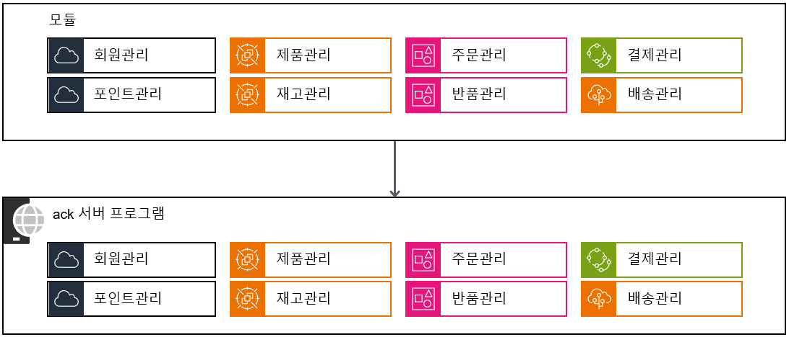
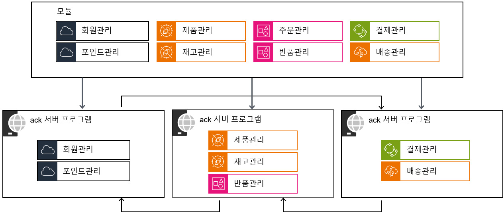

# ack 프로그램 가이드

HandStack 에서 제공되는 서버 프로그램인 ack는 마이크로소프트에서 개발한 Kestrel 서버 프로그램이며 플랫폼 간 웹 서버로, Windows, Linux 및 macOS에서 실행됩니다. 

Kestrel은 많은 수의 동시 연결을 효율적으로 처리하도록 성능을 중점으로 최적화되어 있으며, 컨테이너 및 에지 디바이스와 같이 리소스가 제한된 환경에서 실행되도록 설계 되었습니다.

ack 프로그램으로도 기본적인 웹 서버의 역할은 물론 HTTPS를 지원하고 HTTP/1.1, HTTP/2 및 HTTP/3, WebSocket 등 일반적인 웹 프로토콜을 지원합니다. 특히 마이크로소프트에서 개발된 만큼 ASP.NET Core 모든 구성 요소와 원활하게 통합됩니다.

다만 이러한 특징 때문에 Apache, IIS, Nginx 등등 일반적인 웹 서버의 관리 화면이나 편의성은 제공하지 않아 복잡한 운영 환경에서는 SSL 처리, URL 재작성, GZip 압축 등등 관리 편의성 측면에서 약간의 성능은 낮추더라도 앞단에 IIS 또는 Nginx와 같은 처리를 담당하는 웹 서버 뒷단에 프로그램을 배치하여 역방향 프록시를 수행하는 방법을 권장합니다.

## 여러 개의 독립된 모듈로 구분된 애플리케이션

모듈러 모놀리식 아키텍처는 애플리케이션의 도메인을 더 작고 관리하기 쉬운 컴포넌트 또는 모듈로 나누는 아키텍처 접근법입니다. 이는 코드베이스를 논리적이고 구조적인 디렉토리로 구성하도록 권장하며, 시스템 기능 간의 관심사를 분리하고 경계를 명확하게 합니다.

이러한 모듈은 특정 업무와 기능을 포함하며, 독립적으로 개발하고 테스트할 수 있습니다. 그러나 ack 프로그램을 실행 할 때 단일 단위로 결정되어 운영됩니다.

그림) 모놀리식 방식 프로그램 실행

그림) 마이크로서비스 방식 프로그램 실행