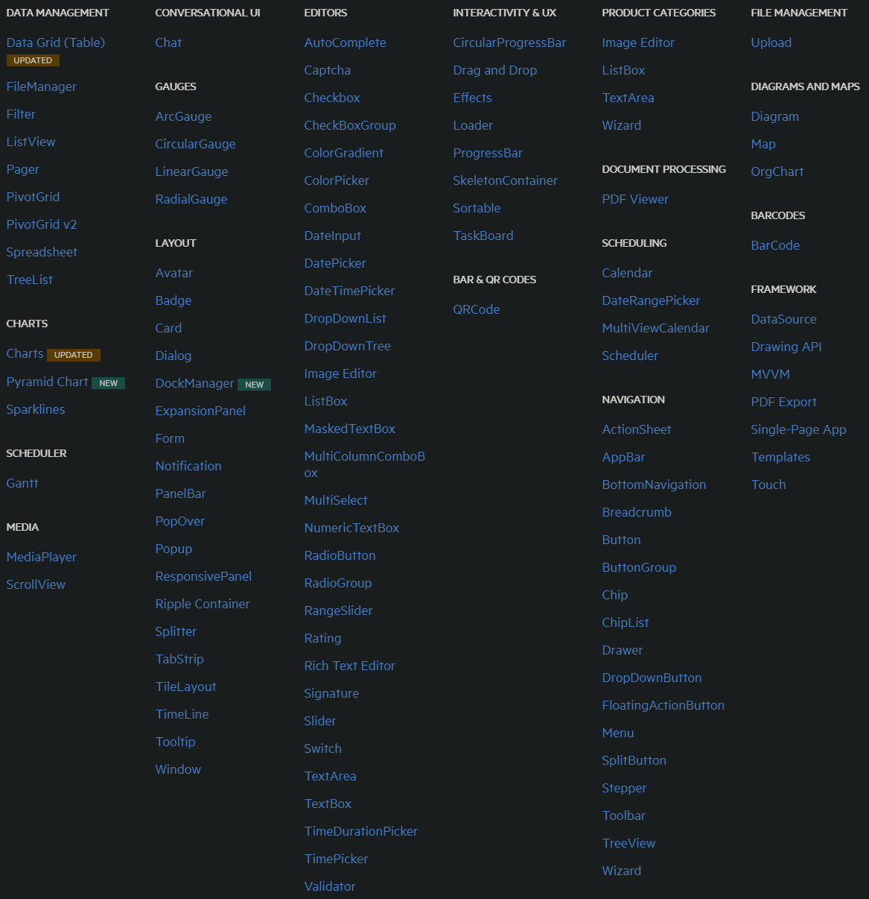
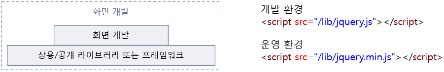
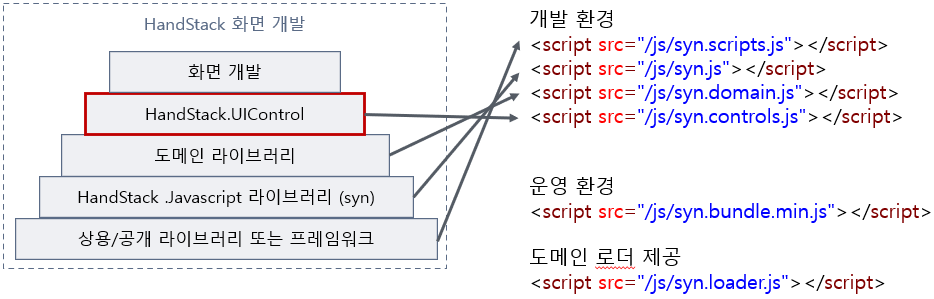

# syn.controls.js 가이드

비즈니스 앱 화면을 개발하기 위해 일관된 기능과 디자인 테마로 만드는 것이 필요합니다. 

잘 설계된 디자인 시스템은 최신 브라우저에 적합한 현대적이고 반응성이 뛰어나며 접근성과 속도가 빠른 UI를 만들 수 있도록 돕습니다.

HandStack에서는 화면 디자인과 레이아웃을 위한 공통 CSS 시스템으로 Bootstrap 기반의 tabler를 사용합니다. 기본적으로 업무 화면 디자인에 최적화 되어 있는 오픈소스이기 때문입니다.

> Bootstrap은 세계에서 가장 많은 사랑을 받고 있는 디자인 시스템이며 관리자, 대시보드, 회사, 업무, 블로그 등등 다양한 디자인 템플릿과 도구들이 유료, 무료 버전으로 만들어져 있기 때문에 참고 할 수 있는 리소스가 풍부합니다.

그리고 화면 개발에 필요한 상용/오픈 소스 기반 공통 UI 컴포넌트를 화면 개발자가 일관된 방법으로 사용하기 쉽게 고도화하여 가이드합니다. 

## 화면 컨트롤

웹 화면을 개발 하기 위해 다양한 요구 사항을 충족하기 위해 재사용 가능하고 디자인 접근성이 좋은 컴포넌트를 판매하는 곳이 많습니다. 업무와는 별개로 사용자가 입력하는 데이터를 정보화하여 적재적소하게 표현을 해야하는 방법을 얼마나 자동화 하거나 효율적으로 만드는 것이 중요하기 때문입니다.



그림) 50개 이상의 Kendo UI 화면 컨트롤

웹 브라우저에서 동작하는 화면 컨트롤 들은 대부분 Javascript 기반의 컴포넌트들로 만들어져 있으며, jQuery, Angular, React, Vue, WebAssembly 등등 다양한 개발 프레임워크에 따라 특화된 기능을 제공합니다.

그래서 화면에서는 다음과 같이 상용/공개 라이브러리 또는 프레임워크 기반에서 디자인 레이아웃과 기능을 선언하여 개발하는 방식이 일반적으로 진행됩니다. 



그림) 화면내 상용/공개 라이브러리 또는 프레임워크를 선언하여 개발

#### 업무 화면에 필요한 공통 기능 제공

HandStack 기반 에서는 비즈니스 앱 화면 개발에 필요한 다음과 같은 UI 컴포넌트을 **wwwroot 모듈**에서 제공합니다. 필요한 기준은 얼마나 사용자에게 정보를 직관적으로 입력을 받아 표시하는 방법을 **간단하게 만들 수 있는가?** 입니다. 이에 대한 자세한 내용은 [데이터 게더링과 바인딩](/docs/reference/concept/데이터-게더링과-바인딩) 문서를 참고하세요.

화면 개발자는 다양한 화면 컨트롤을 일관된 속성, 메서드, 이벤트 사용법으로 개발 하게 되며 각 컴포넌트의 사용 유무는 환경설정에서 정의하여 syn.loader.js 에 의해 사용됩니다.



그림) HandStack 화면 컨트롤을 선언하여 개발

> 화면 컨트롤은 자체 제작/오픈소스/유료 구분 없이 만들어지며 기본적으로 널리 사용중인 오픈소스를 기반으로 만들어집니다.

|컴포넌트명|설명|
|---|---|
|CheckBox|브라우저마다 다르게 표시되는 체크박스를 일관되게 표현합니다.|
|CodePicker|코드도움 팝업 기능을 제공합니다.|
|ColorPicker|색상 팔레트를 제공합니다.|
|ContextMenu|오른쪽 마우스 버튼 기능을 활용하여 컨텍스트 메뉴를 제공합니다.|
|DataSource|단일 또는 여러 데이터 건의 데이터 소스 객체 기능을 제공합니다.|
|DatePicker|날짜 선택 기능을 제공합니다.|
|DropDownCheckList|여러 개의 항목을 선택 할 수 있는 콤보박스를 제공합니다.|
|DropDownList|단일 항목을 선택 할 수 있는 콤보박스를 제공합니다.|
|FileClient|파일 업로드/다운로드 기능을 제공합니다.|
|HtmlEditor|파일 업로드/다운로드 기능이 통합된 HTML 편집기 기능을 제공합니다.|
|RadioButton|브라우저마다 다르게 표시되는 라디오버튼을 일관되게 표현합니다.|
|SourceEditor|소스 편집기에 특화된 에디터 기능을 제공합니다.|
|TextArea|여러 텍스트 줄을 관리하기 위한 추가 기능을 제공합니다.|
|TextBox|단일 텍스트을 관리하기 위한 추가 기능을 제공합니다.|
|WebGrid (유료 라이센스 필요)|대량 편집에 가능한 그리드 컴포넌트 기능을 제공합니다.|
|Element|최소한의 게더링 및 바인딩 기능을 제공합니다.|
|Chart (준비 중)|데이터 시각화 기능을 제공합니다.|
|GridList (준비 중)|데이터 조회에 특화된 기능을 제공합니다.|
|TreeView (준비 중)|재귀적으로 트리 구조를 표현하는 기능을 제공합니다.|
|JsonEditor (준비 중)|JSON 데이터를 직관적으로 편집하는 기능을 제공합니다.|
|OrganizationView (준비 중)|조직도 데이터를 직관적으로 편집하는 기능을 제공합니다.|

위의 UI 컴포넌트은 다양한 상용/오픈소스 기반 라이브러리를 활용되었으며 지속적으로 업데이트 됩니다.

> `C:\home\[사용자 ID]\handstack\modules\wwwroot\wwwroot\lib` 디렉토리에서 기본 제공되는 컴포넌트의 기반인 오픈소스와 상용 라이브러리를 확인 할 수 있습니다.

## CheckBox

브라우저마다 다르게 표시되는 체크박스를 일관되게 표현합니다.

#### 소스위치
    * /lib/css-checkbox-1.0.0/checkboxes.css
    * /uicontrols/CheckBox/CheckBox.css
    * /uicontrols/CheckBox/CheckBox.js
#### 다운로드: https://github.com/hunzaboy/CSS-Checkbox-Library
#### 공식예제: https://hunzaboy.github.io/CSS-Checkbox-Library/
#### 사용법
```html
<div class="ckbx-square-1">
  <input type="checkbox" checked id="ckbx-square-1-2" value="0" name="ckbx-square-1">
  <label for="ckbx-square-1-2"></label>
</div>
```

## CodePicker

코드도움 팝업 기능을 제공합니다.

#### 소스위치
    * /uicontrols/CodePicker/CodePicker.css
    * /uicontrols/CodePicker/CodePicker.js
#### 사용법
```html
<syn_codepicker id="chpSubjectID" syn-datafield="SubjectID" syn-options="{belongID: 'LD01', dataSourceID: 'CHP005', local: false, isMultiSelect: false, textBelongID: ['LD01', 'MD01'], textDataFieldID: 'CodeText'}"></syn_codepicker>
```

## ColorPicker

색상 팔레트를 제공합니다.

#### 소스위치
    * /lib/color-picker-1.0.0/color-picker.css
    * /lib/color-picker-1.0.0/color-picker.js
    * /uicontrols/ColorPicker/ColorPicker.css
    * /uicontrols/ColorPicker/ColorPicker.js
#### 다운로드: https://github.com/taufik-nurrohman/color-picker
#### 공식예제: https://taufik-nurrohman.js.org/color-picker/
#### 사용법
```html
<syn_colorpicker id="dtpColorPicker" syn-datafield="ColorPicker"></syn_colorpicker>
```

## ContextMenu

오른쪽 마우스 버튼 기능을 활용하여 컨텍스트 메뉴를 제공합니다.

#### 소스위치
    * /lib/jquery-ui-contextmenu-1.18.1/jquery-ui.css
    * /lib/jquery-ui-contextmenu-1.18.1/jquery-ui.js
    * /lib/jquery-ui-contextmenu-1.18.1/jquery.ui-contextmenu.js
    * /uicontrols/ContextMenu/ContextMenu.css
    * /uicontrols/ContextMenu/ContextMenu.js
#### 다운로드: https://github.com/mar10/jquery-ui-contextmenu
#### 공식예제: https://wwwendt.de/tech/demo/jquery-contextmenu/demo/
#### 사용법
```html
<syn_contextmenu id="ctxButtonControl" syn-options="{
    target: 'div',
    delegate: 'input[type=button]'
}" syn-events="['close', 'beforeOpen', 'open', 'select']"></syn_contextmenu>
```

## DataSource

단일 또는 여러 데이터 건의 데이터 소스 객체 기능을 제공합니다.

#### 소스위치
    * /uicontrols/DataSource/DataSource.css
    * /uicontrols/DataSource/DataSource.js
#### 사용법
```html
<syn_data id="srcForm1" syn-options="{
    dataSourceID: 'StoreForm',
    storeType: 'Form',
	columns: [
        { data: 'ApplicationID', dataType: 'string', belongID: 'LD01' },
        { data: 'CodeGroupID', dataType: 'string', belongID: ['LD01', 'MD01'] },
        { data: 'CodeType', dataType: 'string', belongID: ['LD02', 'MD01'] },
        { data: 'CodeGroupName', dataType: 'string', belongID: ['LD02', 'MD01'] },
        { data: 'Description.', dataType: 'string', belongID: ['LD02', 'MD01'] },
        { data: 'Custom1 date', dataType: 'string', belongID: ['LD02', 'MD01'] },
        { data: 'UseYN', dataType: 'string', belongID: ['LD02', 'MD01'] },
        { data: 'CreatePersonID', dataType: 'string', belongID: ['LD02', 'MD01'] },
        { data: 'CreateDateTime', dataType: 'string', belongID: ['LD02', 'MD01'] }
    ]
}"></syn_data>
```

## DatePicker

날짜 선택 기능을 제공합니다.

#### 소스위치
        /lib/pikaday-1.8.0/pikaday.css
        /lib/moment-2.24.0/moment.js
        /lib/pikaday-1.8.0/pikaday.js
        /uicontrols/DatePicker/DatePicker.cs
        /uicontrols/DatePicker/DatePicker.js
#### 다운로드: https://github.com/Pikaday/Pikaday, https://github.com/moment/moment
#### 공식예제: https://pikaday.com/
#### 사용법
```html
<syn_datepicker id="dtpDatePicker" syn-options="{format: 'YYYY-MM-DD'}"></syn_datepicker>
<syn_datepicker id="dtpStartDatePicker" syn-options="{format: 'YYYY-MM-DD', useRangeSelect: true, rangeEndControlID: 'dtpEndDatePicker'}"></syn_datepicker>
<syn_datepicker id="dtpEndDatePicker" syn-options="{format: 'YYYY-MM-DD', useRangeSelect: true, rangeStartControlID: 'dtpStartDatePicker'}"></syn_datepicker>
```

## DropDownCheckList, DropDownList

여러 개의 항목을 선택 할 수 있는 콤보박스를 제공합니다.

#### 소스위치
    * /lib/tail.select-0.5.15/css/default/tail.select-light.css
    * /lib/tail.select-0.5.15/js/tail.select.js
    * /uicontrols/DropDownCheckList/DropDownCheckList.css
    * /uicontrols/DropDownCheckList/DropDownCheckList.js
#### 다운로드: https://github.com/wolffe/tail.select.js
#### 사용법
```html
<select id="ddlFileExtension" syn-options="{dataSourceID: 'CH000', parameters: '@GROUPCODE:MS001;', local: false, toSynControl: true, required: false}"></select>
<select id="ddlBusinessRank" syn-options="{dataSourceID: 'CH000', parameters: '@GROUPCODE:MS002;', local: false, toSynControl: true, required: false}" multiple></select>
```

## FileClient

파일 업로드/다운로드 기능을 제공합니다.

#### 소스위치
    * /uicontrols/FileClient/FileClient.css
    * /uicontrols/FileClient/FileClient.js
#### 사용법
```html
<syn_fileclient id="txtProfile1FileID" syn-datafield="Profile1FileID" syn-options="{
    repositoryID: 'LFSLP01'
}"></syn_fileclient>
```

## HtmlEditor

파일 업로드/다운로드 기능이 통합된 HTML 편집기 기능을 제공합니다.

#### 소스위치
    * /lib/tinymce-5.6.0/tinymce.min.js
    * /uicontrols/HtmlEditor/HtmlEditor.css
    * /uicontrols/HtmlEditor/HtmlEditor.js
#### 다운로드: https://github.com/tinymce/tinymce, https://www.tiny.cloud/docs/release-notes/release-notes56/
#### 공식예제: https://www.tiny.cloud/docs/demo/
#### 사용법
```html
<syn_htmleditor id="txtHtmlEditor" syn-datafield="HtmlEditor" style="width:100%; height: 320px;" syn-options="{
    repositoryID: 'LFSLE01'
}">
```

## RadioButton

브라우저마다 다르게 표시되는 라디오버튼을 일관되게 표현합니다.

#### 소스위치
    * /uicontrols/RadioButton/RadioButton.css
    * /uicontrols/RadioButton/RadioButton.js
#### 사용법
```html
<input id="rdoUseYN1" name="rdoUseYN" type="radio" syn-datafield="RadioUseYN" value="value 1" syn-events="['change']" syn-options="{textContent: '사용', toSynControl: true}">
<input id="rdoUseYN2" name="rdoUseYN" type="radio" syn-datafield="RadioUseYN" value="value 2" syn-events="['change']" syn-options="{textContent: '미사용', toSynControl: true}">
<input id="rdoUseYN3" name="rdoUseYN" type="radio" syn-datafield="RadioUseYN" value="value 3" syn-events="['change']" checked="checked" syn-options="{textContent: '알수없음', toSynControl: true}">
```

## SourceEditor

소스 편집기에 특화된 에디터 기능을 제공합니다.

#### 소스위치
    * /lib/monaco-editor-0.39.0/vs/loader.js
    * /lib/monaco-editor-0.39.0/vs/editor/editor.main.js
    * /uicontrols/SourceEditor/SourceEditor.css
    * /uicontrols/SourceEditor/SourceEditor.js
#### 다운로드: https://github.com/microsoft/monaco-editor
#### 공식예제: https://microsoft.github.io/monaco-editor/
#### 사용법
```html
<syn_sourceeditor id="txtEditor1" syn-datafield="Editor1" syn-options="{contents: 'hello world', language:'javascript', minimap: {enabled: true}}"></syn_sourceeditor>
```

## TextArea

여러 텍스트 줄을 관리하기 위한 추가 기능을 제공합니다.

#### 소스위치
    * /lib/codemirror-5.50.2/codemirror.css
    * /lib/codemirror-5.50.2/codemirror.js
    * /uicontrols/TextArea/TextArea.css
    * /uicontrols/TextArea/TextArea.js
#### 다운로드: https://github.com/codemirror/codemirror5
#### 공식예제: https://codemirror.net/5/
#### 사용법
```html
<textarea id="txtTextArea" syn-datafield="TextArea" syn-options="{width: '800px'}">
using System;

namespace Example
{
    /// &lt;summary>
    /// Represents a person employed at the company
    /// &lt;/summary>
    public class Employee : Person
    {
        #region Properties

        /// &lt;summary>
        /// Gets or sets the first name.
        /// &lt;/summary>
        /// &lt;value>The first name.&lt;/value>
        public string FirstName {get; set; }
    }
}
</textarea>
```

## TextBox

단일 텍스트을 관리하기 위한 추가 기능을 제공합니다.

#### 소스위치
    * /lib/jquery.maskedinput-1.3.js'
    * /lib/ispin-2.0.1/ispin.js'
    * /lib/superplaceholder-1.0.0/superplaceholder.js'
    * /lib/vanilla-masker-1.1.1/vanilla-masker.js'
    * /uicontrols/TextBox/TextBox.css
    * /uicontrols/TextBox/TextBox.js
#### 다운로드: https://github.com/uNmAnNeR/ispinjs, https://github.com/chinchang/superplaceholder.js, https://github.com/vanilla-masker/vanilla-masker
#### 공식예제: https://unmanner.github.io/ispinjs/, https://vanilla-masker.github.io/vanilla-masker/
#### 사용법
```html
txtApplicationID - <input id="txtApplicationID" type="text" syn-options="{editType: 'numeric', formatNumber: false, dataType: 'int'}" value="0">
txtSpinnerID - <input id="txtSpinnerID" type="text" syn-options="{editType: 'spinner', dataType: 'int', minCount: -10, maxCount: 10}" value="0">
txtCreateDate - <input id="txtCreateDate" type="text" syn-options="{editType: 'date'}">
txtHour - <input id="txtHour" type="text" syn-options="{editType: 'hour'}">
txtMinute - <input id="txtMinute" type="text" syn-options="{editType: 'minute'}">
txtYearMonth - <input id="txtYearMonth" type="text" syn-options="{editType: 'yearmonth'}">
txtHomePhone - <input id="txtHomePhone" type="text" syn-options="{editType: 'homephone'}">
txtMobilePhone - <input id="txtMobilePhone" type="text" syn-options="{editType: 'mobilephone'}">
txtEmail - <input id="txtEmail" type="text" syn-options="{editType: 'email'}">
txtCodeGroupID - <input id="txtCodeGroupID" type="text" syn-options="{editType: 'text'}">
txtJuminID - <input id="txtJuminID" type="text" syn-options="{editType: 'juminno'}">
txtBusinessID - <input id="txtBusinessID" type="text" syn-options="{editType: 'businessno'}">
txtCustomFormat - <input id="txtCustomFormat" type="text" syn-options="{editType: 'text', maskPattern: '(99) SSSS-AAAA'}">
txtMaxLength - <input id="txtMaxLength" maxlengthB="10" type="text" syn-options="{editType: 'text'}">
```

## WebGrid (유료 라이센스 필요)

대량 편집에 가능한 그리드 컴포넌트 기능을 제공합니다.

#### 소스위치
    * /lib/handsontable-13.1.0/handsontable.full.css
    * /lib/papaparse-5.3.0/papaparse.js
    * /lib/sheetjs-0.16.8/xlsx.core.min.js
    * /lib/handsontable-13.1.0/handsontable.full.js
    * /lib/handsontable-13.1.0/languages/ko-KR.js
    * /uicontrols/WebGrid/WebGrid.css
    * /uicontrols/WebGrid/WebGrid.js
#### 다운로드: https://github.com/handsontable/handsontable, https://github.com/mholt/PapaParse, https://github.com/gitbrent/xlsx-js-style
#### 공식예제: https://handsontable.com/demo, https://www.papaparse.com/demo, https://gitbrent.github.io/xlsx-js-style/
#### 사용법
```html
<syn_grid id="grdGrid" syn-options="{autoColumnSize: true,
    columns: [
        ['PersonID', '사용자ID', 200, false, 'button', false, 'center', null, null, {placeholder: '빈 값', sorting: true, clearBorder: true, color: 'red', bold: true, toCurrency: true}],
        ['UserName', '사용자', 200, false, 'safehtml', false, 'left'],
        ['MaritalStatus', '혼인여부', 200, false, {
            columnType: 'checkbox2',
            isSelectAll: true
        }, false, 'center'],
        ['ReligionYN', '종교여부', 200, false, {
            columnType: 'radio'
        }, false, 'center'],
        ['SUBJECTID', '학과코드ID', 140, true, 'text', false, 'left','M01'],
        ['SUBJECTNAME', '학과명', 160, false, {
            columnType: 'codehelp',
            dataSourceID: 'CH005',
            local: false,
            codeColumnID: 'SUBJECTID'
        }, false, 'left','M01'],
        ['GenderType', '성별ID', 200, false, 'text', false, 'left'],
        ['GenderTypeName', '성별', 200, false, 'text', false, 'left'],
        ['CreateDateTime', '입력일자', 200, false, 'date', false, 'left']
    ],
    keyLockedColumns: ['PersonID', 'UserName'],
    isContainFilterHeader: true,
    dropdownMenu: true,
    autoInsertRow: true,
    controlText: '데모예제',
    importFileColumns: 'all',
}" syn-events="['afterSelectionEnd', 'beforeKeyDown', 'afterCreateRow']"></syn_grid>
```

## Element

최소한의 게더링 및 바인딩 기능을 제공합니다.

#### 소스위치
    * /uicontrols/Element/Element.js
#### 사용법
```html
<div id="divElement1" syn-datafield="Element1" syn-options="{belongID: 'LD01', content: 'value'}" value="div value 1"></div>
<span id="lblElement2" syn-datafield="Element2" syn-options="{belongID: 'LD01', content: 'text'}">span value 1</span>
<label id="lblElement3" syn-datafield="Element3" syn-options="{belongID: 'LD01', content: 'html'}">blabla</label>
```

## Chart (준비 중)

데이터 시각화 기능을 제공합니다.

#### 소스위치
    /lib/chartjs-4.3.0/chart.js
    /uicontrols/Chart/ChartJS.css
    /uicontrols/Chart/ChartJS.js
#### 다운로드: https://github.com/chartjs/Chart.js
#### 공식예제: https://www.chartjs.org/
#### 사용법
```html
<syn_chart id="chtChart" style="width:450px; height: 320px;"></syn_chart>
```

## GridList (준비 중)

데이터 조회에 특화된 기능을 제공합니다.

#### 소스위치
    * /lib/datatable-1.10.21/datatables.js
    * /lib/datatable-1.10.21/dataTables.checkboxes.js
    * /uicontrols/GridList/GridList.css
    * /uicontrols/GridList/GridList.js
#### 다운로드: https://github.com/DataTables/DataTables
#### 공식예제: https://www.datatables.net/examples/index
#### 사용법
```html
<syn_list id="lstDataTable" syn-options="{
    checkbox: true,
    pageLength: 50,
    columns: [
        { title: 'ID', data: 'id', visible: true, width: '30px' },
        { title: 'Name', data: 'name', width: '200px' },
        { title: 'Position', data: 'position', width: '100px' },
        { title: 'Office', data: 'office', width: '100px' },
        { title: 'Extn.', data: 'extn', width: '100px' },
        { title: 'Start date', data: 'start_date', width: '100px' },
        { title: 'Salary', data: 'salary', width: '100px' }
    ]
}" syn-events="['select']" style="width: 100%; border: 1px solid;"></syn_list>
```

## TreeView (준비 중)

재귀적으로 트리 구조를 표현하는 기능을 제공합니다.

#### 소스위치
    * /lib/fancytree-2.38.0/skin-win8/ui.fancytree.css
    * /lib/fancytree-2.38.0/modules/jquery.fancytree.ui-deps.js
    * /lib/fancytree-2.38.0/modules/jquery.fancytree.js
    * /uicontrols/TreeView/TreeView.css
    * /uicontrols/TreeView/TreeView.js
#### 다운로드: https://github.com/mar10/fancytree
#### 공식예제: https://wwwendt.de/tech/fancytree/demo/
#### 사용법
```html
<syn_tree id="tvlTreeView" syn-options="{
    checkbox: false,
    itemID: 'key',
    parentItemID: 'parentID',
    childrenID: 'children',
    reduceMap: {
        key: 'PROGRAMID',
        title: 'PROGRAMNAME',
        parentID: 'PARENTID',
        folder: 'FOLDERYN',
        icon: false
    }
}" syn-events="['click', 'focus', 'dblclick']"></syn_tree>
```


## JsonEditor (준비 중)

JSON 데이터를 직관적으로 편집하는 기능을 제공합니다.

#### 소스위치
    * /lib/jsoneditor-9.10.0/jsoneditor.css
    * /lib/jsoneditor-9.10.0/jsoneditor.js
    * /uicontrols/JsonEditor/JsonEditor.css
    * /uicontrols/JsonEditor/JsonEditor.js
#### 다운로드: https://github.com/josdejong/jsoneditor
#### 공식예제: https://jsoneditoronline.org/
#### 사용법
```html
<syn_jsoneditor id="txtEditor" syn-options="{contents: '{}'}"></syn_jsoneditor>
```

## OrganizationView (준비 중)

조직도 데이터를 직관적으로 편집하는 기능을 제공합니다.

#### 소스위치
    * /lib/orgchart-3.1.1/jquery.orgchart.css
    * /lib/orgchart-3.1.1/jquery.orgchart.js
    * /uicontrols/OrganizationView/OrganizationView.css
    * /uicontrols/OrganizationView/OrganizationView.js
#### 다운로드: https://github.com/dabeng/OrgChart
#### 사용법
```html
<syn_organization id="orgChartView" syn-options="{
    draggable: true,
    nodeTitle: 'name',
    nodeContent: 'title',
    reduceMap: {
        key: 'id',
        title: 'title',
        parentID: 'parentId',
    },
    nodeTemplate: '$this.event.orgChartView_nodeTemplate',
    createNode: '$this.event.orgChartView_createNode'
}" syn-events="['nodedrop', 'select', 'click']"></syn_organization>
```
