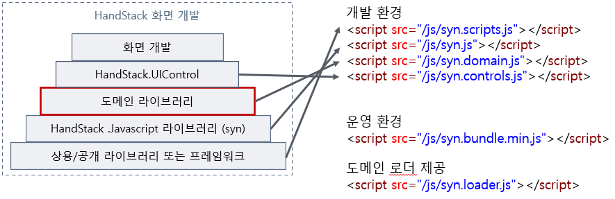

# syn.domain

HandStack의 제공 기능과 비즈니스 사이에서 도메인의 고유 업무에 필요한 공통 기능을 제공합니다.



주요 기능으로 진행바, 알림바, 메시지 박스, 윈도우 팝업, 모달 팝업 등과 같은 공통 UI 컴포넌트들과 거래 메시지의 요청과 응답에 필요한 도메인 기능을 제공합니다.

> 프로젝트와 업무에 따라 syn.domain.js 의 기능은 달라집니다.

## Javascript 예제

```javascript
// 진행바
syn.$w.progressMessage();
syn.$w.closeProgress();

// 상태바
syn.$w.statusMessage('사용자 정보를 조회 중입니다.');

// HTML 템플릿 모달 팝업
syn.$w.showDialog(syn.$l.get('tplCodeGroup'), {
    minWidth: 480,
    minHeight: 500,
});
syn.$w.closeDialog();

// URL 템플릿 모달 팝업
syn.$w.showUIDialog(openUrl, {
    minWidth: 480,
    minHeight: 500,
});
syn.$w.closeDialog();

// 알림 팝업
syn.$w.alert('제목을 입력하세요');
var alertOptions = $object.clone(syn.$w.alertOptions);
alertOptions.icon = 'question';
alertOptions.buttonType = '3';
syn.$w.alert('정말로 게시판 테이블을 초기화 하시겠습니까?', '초기화 확인', alertOptions, (result) => {
    if (result == 'Yes') {
        syn.$w.transactionAction('ZD01');
    }
});

// 알림 표시
syn.$w.notify('success', '저장 되었습니다');
syn.$w.notify('warning', '삭제에 실패했습니다. 오류: ' + error);

// 윈도우 팝업
let windowID = 'BOD010';
let popupOptions = $object.clone(syn.$w.popupOptions);
popupOptions.title = title;
popupOptions.src = src;
popupOptions.channelID = windowID;
popupOptions.isModal = true;
popupOptions.width = 800;
popupOptions.height = 750;
popupOptions.notifyActions.push({
    actionID: 'response',
    handler(evt, val) {
        syn.$w.windowClose(windowID);
        syn.$w.transactionAction('LD01');
    }
});

syn.$w.windowOpen(windowID);
syn.$w.windowShow(windowID);
syn.$w.windowHide(windowID);
syn.$w.windowClose(windowID);
```