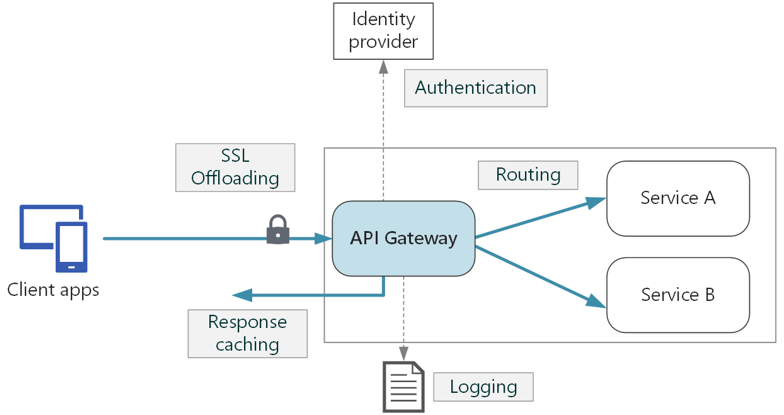

# 비즈니스, 데이터 개발 시작하기

## 거래란 무엇인가요?

거래의 사전적 의미는 '주고 받는 것 또는 사고 파는 것'이지만 처리 방식 또는 업무에 따라 차이가 있습니다. 예를 들어 거래를 영어 단어로 Transaction로 표현하며, 일반적으로 돈이나 물건을 주고 받는 것을 의미하지만, IT에 서 데이터베이스 분야에서는 데이터의 상태를 변화시키기 위해 수행하는 논리적인 작업 단위를 의미합니다.

HandStack 기반의 프로젝트에서 거래는 출발지와 도착지간의 데이터를 주고 받는 작업 단위를 의미합니다. 그래서 다음과 같이 표현할 수 있습니다.
* 클라이언트에서 업무 서버간에 거래를 한다
* 업무 서버에서 메시지 서버간에 거래를 한다
* 메시지 서버에서 데이터베이스 서버간에 거래를 한다
* 메시지 서버에서 외부 서비스간에 거래를 한다

화면에서 업무 거래를 위해 클라이언트와 서버간에는 반드시 어떻게 요청과 응답이 이뤄질 것인지 계약을 정의 해야 합니다. 계약은 transact 모듈의 업무와 dbclient 모듈 또는 function 모듈의 기능으로 만들어 집니다. 이 문서는 데이터베이스에 요청 및 응답을 처리하는 과정을 설명합니다.

## transact module 업무 계약

클라이언트의 요청 데이터를 검증하고 중계하여 정확한 응답 데이터를 전달 하는 것을 목적으로 하는 Gateway 역할을 담당합니다. 즉 클라이언트와 서비스 사이에서 미들웨어로 사용 되며, 클라이언트로 부터 API 요청을 받아서, 적합한 기능 서비스로 라우팅 하는 역할을 담당 합니다.

> transact module의 모든 요청은 단 하나의 Endpoint로 수신합니다.

transact module 거래 흐름은 다음과 같습니다.



일반적으로 클라이언트에 필요한 요청에 대한 Endpoint에 대해 각각의 서비스에서 구현해야 하는 기능을 Gateway단으로 통합함으로써, 서비스 개발을 간편하게 할 수 있고, 메세지 포맷 변경이나, 캐싱, 보안, 로깅등 기존 API 호출에 추가적인 기능을 더할 수 있는 유연성을 더할 수 있습니다.

transact module의 주요 기능은 다음과 같습니다.

* 요청 검증
* 허가
* 응답 정보 캐싱
* 모니터링
* 로깅
* dbclient, function 등등 이벤트 라우팅
* 메시지 변경

클라이언트 요청 거래를 위해 어떻게 요청과 응답이 이뤄질 것인지 계약을 정의 해야합니다. 그리고 프로젝트 업무에 따라 공개 거래 또는 내부 인트라넷용 연계등에 따라 계약 없이 사용 할 수 있는 옵션을 제공합니다.

### 거래 요청과 응답 설정

클라이언트에서 요청되는 모든 데이터는 transact 모듈에서 수신할 때 기본적으로 신뢰하지 않습니다. 

요청/응답 거래 정보에 대한 데이터 정합성 검증과 올바르게 응답을 내려주고 있는지 확인합니다. 예를 들어 하나의 요청에 하나의 응답이 있을 수 있고, 여러 응답이 있을 수 있습니다. 여러 요청에 하나의 응답이 있을 수도 있고 여러 응답이 있을 수도 있습니다. 어떤 요청은 데이터베이스에 CRUD 처리를 실행하는 것일 수도 있고 오픈 API나 배치 작업등 다양한 요청을 수행을 필요로 합니다.

이러한 업무를 처리하기 위해 일반적으로 많이 사용하는 다음과 같은 계약을 Json으로 작성합니다.

```json
{
    "ApplicationID": "HDS",
    "ProjectID": "TST",
    "TransactionID": "TST010",
    "Description": "테스트 > 첫번째 테스트 거래",
    "Services": [
        {
            "ServiceID": "GD01",
            "Authorize": false,
            "ReturnType": "Json",
            "CommandType": "D",
            "TransactionScope": false,
            "Inputs": [
                {
                    "ModelID": "Dynamic",
                    "Fields": [],
                    "TestValues": [],
                    "DefaultValues": [],
                    "Type": "Row",
                    "BaseFieldMappings": [],
                    "ParameterHandling": "Rejected"
                }
            ],
            "Outputs": [
                {
                    "ModelID": "Dynamic",
                    "Fields": [],
                    "Type": "Grid"
                }
            ]
        }
    ],
    "Models": []
}
```
소스) transact/HDS/TST/TST010.json 계약 파일

위의 계약 정보는 다음과 같이 해석 할 수 있습니다. 

* HDS 어플리케이션에서 TST 프로젝트의 TST010 거래를 LD01 서비스 ID로 요청을 수신합니다.
* LD01 수신 정보는 인증 정보(Authorize)가 필요 없는 공개된 수신 설정입니다.
* 반환되는 데이터 포맷은 Json 으로 반환됩니다.
* 요청은 데이터베이스 (CommandType) 거래를 수행하며, 이때 트랜잭션(TransactionScope)을 수행하지 않습니다.
* 요청 정보는 하나의 Row에 여러 Column으로 구성된 정보가 요청되며 이때 어떤 Fields 정보라도 허용합니다.
* 응답 정보는 여러 Row와 여러 Column으로 구성된 정보가 반환되야 합니다.
* 요청 정보가 없을 경우 잘못된 요청 응답 처리를 수행합니다.

> transact module의 계약 기능은 다양한 시나리오에 대응 할 수 있는 더 많은 옵션을 제공합니다. 이 계약 정보는 지속적으로 개선되고 있으며 자세한 정보는 가이드나 참고 정보를 참조하세요.

## dbclient module 기능 계약

업무 프로젝트에서 대부분의 90% 업무는 데이터베이스의 CRUD 쿼리를 수행합니다. dbclient 모듈은 dbclient 모듈의 요청 데이터를 수신하여 데이터베이스의 처리 후 결과를 응답하는 과정을 실행 하는 것을 목적으로 하며, 이러한 업무를 처리하기 위해 다음과 같은 계약을 Xml로 작성합니다.

지원 데이터베이스는 다음과 같습니다.

* SQL Server
* Oracle
* MySQL & MariaDB
* PostgreSQL
* SQLite 

```xml
<?xml version="1.0" encoding="UTF-8"?>
<mapper xmlns="contract.xsd">
	<header>
		<application>HDS</application>
		<project>TST</project>
		<transaction>TST010</transaction>
		<datasource>DB01</datasource>
		<use>Y</use>
		<desc>사용자, 이메일, 연락처 2FA 인증 관리</desc>
	</header>
	<commands>
		<statement id="LD01" seq="0" use="Y" timeout="0" desc="인증 정보 조회">
			<![CDATA[
SELECT C.*
FROM   Certify C
WHERE  C.CertifiedYN = 'N'
	AND C.VerifyTarget = @VerifyTarget
	AND C.ExpiredAt > GETDATE();
			]]>
			<param id="@VerifyTarget" type="String" length="1" value="" />
		</statement>
	</commands>
</mapper>
```
소스) dbclient/HDS/TST/TST010.xml 계약 파일

## 테스트

HandStack의 transact module의 기능을 확인 하기 위해 테스트 목적으로 직접 거래 요청을 진행할 경우 Postman을 권장합니다.

Postman은 개발한 http 프로토콜 기반의 API를 테스트하고, 테스트 결과를 공유하여 API 개발의 생산성을 높여주는 도구입니다. [Postman 다운로드](https://go.postman.co/build)를 선택하여 프로그램을 설치하세요.

Postman 실행 후 다음의 정보를 입력하여 테스트 합니다.

* Method: Post
* Url: http://localhost:8000/transact/api/transaction/execute
* Content-Type: application/json


다음과 같이 [Body] 영역에 JSON Data를 입력합니다.

```json
{
    "accessToken": "",
    "action": "SYN",
    "kind": "BIZ",
    "clientTag": "HANDSTACK|WebClient|ack|D",
    "loadOptions": {
        "encryptionType": "P",
        "encryptionKey": "G",
        "platform": "Win32",
        "dynamic": "Y",
        "authorize": "N",
        "commandType": "D",
        "returnType": "Json",
        "transactionScope": "N",
        "transactionLog": "Y"
    },
    "requestID": "LD00000HDSHMLHML010LD01W76M6JH160600",
    "version": "001",
    "environment": "D",
    "system": {
        "programID": "HDS",
        "version": "1.0.0",
        "routes": [
            {
                "systemID": "HANDSTACK",
                "requestTick": 1700809560524
            }
        ],
        "localeID": "ko-KR",
        "hostName": "localhost:8000",
        "pathName": "/handsup/view/TST/TST010.html"
    },
    "interface": {
        "devicePlatform": "browser",
        "interfaceID": "WEB",
        "sourceIP": "192.168.0.45",
        "sourcePort": 0,
        "sourceMAC": "",
        "connectionType": "4g",
        "timeout": 180000
    },
    "transaction": {
        "globalID": "LD00000HDSHMLHML010LD01S76M6JH160600",
        "businessID": "HML",
        "transactionID": "HML010",
        "functionID": "LD01",
        "commandType": "D",
        "simulationType": "P",
        "terminalGroupID": "undefined|undefined",
        "operatorID": "handstack@handstack.kr",
        "screenID": "HML010",
        "startTraceID": "",
        "dataFormat": "J",
        "compressionYN": "N"
    },
    "payLoad": {
        "property": {},
        "dataMapInterface": "Row|Grid",
        "dataMapCount": [
            1
        ],
        "dataMapSet": [
            [
                {
                    "id": "ApplicationNo",
                    "value": "08dbcde8520ce00cca91a85e00064bf7"
                }
            ]
        ],
        "dataMapSetRaw": []
    }
}
```
소스) 요청 데이터

위와 같이 요청하면 다음과 같은 응답 전문을 결과로 얻을 수 있습니다.

```json
{
    "system": {
        "programID": "HDS",
        "version": "",
        "routes": [
            {
                "systemID": "HANDSTACK",
                "hostName": "HOSTNAME",
                "environment": "",
                "requestTick": 1700809560524,
                "acceptTick": 1700809560531,
                "responseTick": 1700809560566
            }
        ],
        "localeID": "ko-KR",
        "hostName": "",
        "pathName": ""
    },
    "transaction": {
        "globalID": "LD00000HDSHMLHML010LD01S76M6JH160600",
        "businessID": "HML",
        "transactionID": "HML010",
        "functionID": "LD01",
        "commandType": "D",
        "simulationType": "P",
        "terminalGroupID": "",
        "operatorID": "",
        "screenID": "",
        "startTraceID": "",
        "dataFormat": "J",
        "compressionYN": "N"
    },
    "message": {
        "responseStatus": "N",
        "mainCode": "T200",
        "mainText": "(성공): 서버가 요청을 제대로 처리",
        "additions": []
    },
    "result": {
        "property": null,
        "outputAction": {
            "outputType": "",
            "nextTransactionID": "",
            "nextFunctionID": "",
            "reportName": "",
            "reportOptions": "",
            "screenID": ""
        },
        "responseType": "0",
        "dataSetMeta": [],
        "dataMapCount": [],
        "dataSet": [
            {
                "id": "GridData0",
                "value": [
                    {
                        "CompanyName": "큐씨엔",
                        "JoinAt": null,
                        "ExpiredAt": "2024-11-13",
                        "Options": null,
                        "CreatedMemberNo": "",
                        "CreatedMemberName": null,
                        "CreatedAt": "2023-11-13",
                        "ModifiedMemberNo": null,
                        "ModifiedMemberName": null,
                        "ModifiedAt": null
                    }
                ]
            }
        ]
    },
    "acceptDateTime": "2023-11-24T16:06:00.5313296+09:00",
    "acknowledge": 1,
    "correlationID": "LD00000HDSHMLHML010LD01W76M6JH160600",
    "exceptionText": "",
    "rowsAffected": 0,
    "responseID": "HANDSTACKHOSTNAMED2023112416062400",
    "loadOptions": {},
    "version": "001",
    "environment": "D"
}
```
소스) 응답 데이터

> 시스템간의 거래 메시지는 크게 헤더(설명)와 바디(정보)로 구성되어 전달되어집니다. 위와 같은 요청/응답 데이터 구조는 HandStack 기반 화면이나 프로그램, 각 서비스 간에 자동으로 만들고 전달 되는 전문 프로토콜입니다. 디버깅, 테스트, 이상거래 파악 등등 각 항목에 대한 의미와 적용 가능한 값을 알아두는 것을 권장합니다. [계약 중심 거래 확인하기](/docs/reference/concept/계약-중심-거래)

## 참고자료

* Postman: https://go.postman.co/build