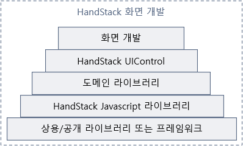

# 화면 개발 시작하기

하나의 화면 개발을 위해서는 **HTML**, **Javascript** 동일한 이름의 2개의 파일이 각각 필요합니다. 예를 들어 TST010 화면의 경우 TST010.html, TST010.js 파일이 동일한 디렉토리 내에 있어야 합니다.

## 공통 assets 디렉토리

화면 개발을 위해 공통 라이브러리와 화면 소스는 각각의 별도 디렉토리에서 관리합니다. 왜냐하면 소스 관리 및 관심사의 분리 측면에서 이점이 있기 때문입니다. 대부분의 프로젝트 개발에서 공통 기능은 상용 또는 공개 소스를 기반으로 하거나 공통 기능 개발 조직이 담당하게 됩니다.

이 경우 공통 기능 개발 소스와 화면 개발 소스의 관리 주체가 서로 다르기 때문에 각자 소스에 대한 접근 및 관리 권한은 다르게 가져가는 것이 좋습니다.

> 공통 assets 디렉토리는 `C:\home\handstack\modules\wwwroot\wwwroot` 입니다. 여기에 있는 모든 파일은 웹 브라우저에 다음과 같이 루트 경로로 공개됩니다. /module.html, /js/syn.js 등등

## wwwroot 디렉토리

다음과 같이 화면에 대한 개발 소스를 단일 디렉토리내에 저장합니다.

```txt
C:\home\handstack\contracts
└─wwwroot
   └─HDS
       └─TST
           └─TST010.html
           └─TST010.js
```

이렇게 파일을 관리하면 웹 브라우저에서 다음과 같이 실행합니다. [http://localhost:8080/view/HDS/TST/TST010.html](http://localhost:8080/view/HDS/TST/TST010.html)

참고로 회사 내 사내 그룹웨어 프로젝트에 대한 일부 프로젝트 ID와 파일 ID 규칙을 dbclient, transact, wwwroot module 에서 다음과 같이 사용 중입니다.

|화면명|프로젝트 ID|파일 ID|
|---|---|---|
|근태현황|ATM|ATM010|
|외근직원 장소 조회|ATM|ATM012|
|휴가현황|ATM|ATM040|
|자주쓰는 결재선|CMM|CMM010|
|결재라인 추가(수신자 설정)|CMM|CMM020|
|휴가신청(관리자)|CMM|CMM040|
|공문 상세|CMM|CMM050|
|신규작성|EST|EST010|
|문서기안|EST|EST020|
|오피스신청|OFC|OFC120|
|고정 결재선 / 수신자 설정|SMP|SMP170|

## HandStack 화면의 고유 특징

만약 여러분이 JSP, ASP.NET, PHP와 같은 화면 개발 경험이 있는 경우 서버 사이드 랜더링 (SSR)에 익숙 하실겁니다. 또는 Angular, React, Vue와 같이 단일 페이지 애플리케이션 (SPA) 방식이나 jQuery 기반 클라이언트 사이드 랜더링 (CSR)을 개발 경험을 하셨을 수도 있습니다.

HandStack 화면은 업무적인 관점에서 몇가지 이슈를 해결하기 위해 초보 개발자도 개발 가능하도록 몇가지 고유 특징이 있습니다.

### 서버 기술을 사용하지 않습니다

화면을 개발하기 위해 ASP, JSP, PHP 등과 같은 서버 기술을 사용하지 않는 순수한 HTML과 Javascript, Stylesheet로 구성됩니다. 클라이언트 표준 기술로도 다양한 비즈니스 요구 사항을 충족시킬 수 있기 때문입니다. 이로 인해 화면 소스는 일반 웹 서버, CDN, 하이브리드 앱 등등 어디 곳이든 간단하게 배포가 가능합니다. 또한 화면 개발에 필요한 학습 비용이 절감됩니다.

### 업무 화면에 필요한 공통 기능 제공

화면을 개발하기 위해 필요한 오픈소스 기반 디자인 시스템과 공통 UI 컴포넌트를 선정하여 가이드합니다. 화면 디자인을 위한 공통 CSS 시스템은 기본적으로 업무 화면 개발에 최적화 되어 있는 bootstrap 기반의 tabler를 사용합니다. bootstrap은 세계에서 가장 많은 사랑을 받고 있는 디자인 시스템이며 관리자, 대시보드, 회사, 업무, 블로그 등등 다양한 디자인 템플릿과 도구들이 유료, 무료 버전으로 만들어져 있기 때문에 참고 할 수 있는 리소스가 풍부합니다.

화면 기능 개발에 필요한 다음과 같은 UI 컨트롤을 제공합니다

* Chart
* CheckBox
* CodePicker
* ColorPicker
* ContextMenu
* DataSource
* DatePicker
* DropDownCheckList
* DropDownList
* FileClient
* GridList
* HtmlEditor
* JsonEditor
* OrganizationView
* RadioButton
* SourceEditor
* TextArea
* TextBox
* TextButton
* TreeView
* WebGrid (유료 라이센스 필요)
* Element

UI 컨트롤은 다음의 오픈소스 기반 라이브러리를 활용되었으며 지속적으로 업데이트 됩니다.

* jquery-3.3.1.js
* jquery.maskedinput-1.3.js
* nanobar-0.4.2/nanobar.js
* papaparse-5.3.0/papaparse.js
* sheetjs-0.16.8/xlsx.core.min.js
* handsontable-13.1.0/dist/handsontable.full.js
* handsontable-13.1.0/languages/ko-KR.js
* clipboard-2.0.4/clipboard.js
* color-picker-1.0.0/color-picker.js
* filedrop-1.0.0/filedrop.js
* flatpickr-4.6.3/flatpickr.js
* iframe-resizer-4.2.6/iframeresizer.js
* ispin-2.0.1/ispin.js
* pikaday-1.8.0/pikaday.js
* superplaceholder-1.0.0/superplaceholder.js
* tingle-0.15.2/tingle.js
* tail.select-0.5.15/js/tail.select.js
* vanilla-masker-1.1.1/vanilla-masker.js
* codemirror-5.50.2/codemirror.js
* download-4.21/download.js
* chartjs-2.9.3/Chart.bundle.js
* chartjs-plugin-colorschemes-0.4.0/chartjs-plugin-colorschemes.js
* smartmenus-1.1.0/jquery.smartmenus.js
* autocomplete-1.0.4/auto-complete.js

> `C:\home\handstack\modules\wwwroot\wwwroot\lib` 디렉토리에서 기본 제공되는 컴포넌트의 기반인 오픈소스와 상용 라이브러리를 확인 할 수 있습니다.

### 기본에서 시작합니다

특정 라이브러리나 프레임워크에 종속적이지 않는 순수한 vanilla 개발을 지향합니다. 그래서 필요할 경우 jQuery, Svelte, Angular 등등 다양한 프레임워크나 라이브러리와 혼용으로 개발이 가능하며, 비즈니스가 기준이 되어 애플리케이션 설정에 의해 선호하는 오픈소스와 상용 S/W 들을 추가 삭제 할 수 있습니다.

## 화면 소스 기본 구조

먼저 소스를 확인 하겠습니다. 화면에 버튼을 배치하고 'Hello World' 팝업을 보여주는 화면의 경우 다음과 같이 소스를 만들면 됩니다.

### TST010.html 소스
```html
<!DOCTYPE html>
<html>
<head>
    <meta charset="utf-8">
</head>
<body>
    <input type="button" id="btnHelloWorld" value="Hello World" syn-events="['click']" />
    <script src="/js/syn.loader.js"></script>
</body>
</html>
```

### TST010.js 소스
```javascript
'use strict';
let $TST010 = {
    event: {
        btnHelloWorld_click() {
            alert('반갑습니다 !');
        }
    }
}
```

위의 소스는 HandStack 기반 화면 개발 소스의 일관성과 편의성을 보여줍니다. 예를 들면 다음 동작을 자동화 합니다. 

`syn.loader.js` 스크립트는 현재 개발/운영 환경을 확인하여 현재 화면 동작과 기능 구성에 필요한 최적의 스크립트와 스타일시트를 로드합니다. 화면 개발자는 현재 화면에 필요한 외부 파일에 대한 고민을 하지 않아도 됩니다.

사용자의 동작을 이벤트 처리로 하기 위해 HTML 요소의 속성으로 `syn-events="['click']"`를 설정합니다. 이벤트는 배열로 여러개의 이벤트를 설정할 수 있으며 표준 이벤트명을 지원합니다.

화면은 하나의 Javascript를 반드시 필요로 하며 해당 스크립트의 파일명과 객체의 이름은 동일하게 부여합니다. 예를 들어 HTML내에 선언된 버튼의 이벤트 핸들러를 `$TST010.event.btnHelloWorld_click`와 같이 정의할 수 있습니다.

> Javascript는 ECMAScript 2017 이상을 준수 해야 하며, Internet Explorer 브라우저는 동작에 제한이 있을 수 있습니다.

## HTML 요소에 적용 가능한 syn-* 속성 3개

HTML 파일은 화면에 출력할 컨트롤을 배치하고, 서버와 연결하여 데이터를 바인딩 할 컨트롤을 지정합니다. 화면에서 보여져야 할 항목들의 모양과 기능 동작 및 서버와의 요청/응답(이하 `거래`라고 표현)에 대해 다음과 같은 확장 속성을 제공합니다.

* syn-datafield
* syn-events
* syn-options

### syn-datafield

이 속성은 일반적으로 서버와의 거래 요청 및 응답이 필요한 사용자 입력에 대응하는 HTML 태그(이하 UI 컨트롤)에 선언됩니다.

```txt
BUTTON
INPUT [type]
    hidden
    text
    password
    color
    email
    number
    search
    tel
    url
    submit
    reset
    button
    radio
    checkbox
TEXTAREA
SELECT (multiple)
SYN_GRID
SYN_CHART
SYN_CODEPICKER
SYN_COLORPICKER
SYN_DATEPICKER
SYN_EDITOR
ETC...
```

qaf-datafield 속성 선언을 하면 HTML 요소를 고유하게 식별할 수 있는 id 속성은 반드시 선언해야 하며, id 값은 헝그리안 표기법을 권장 하며 프로젝트에 따라 결정합니다.

```txt
btn: BUTTON
txt: INPUT [type]
hdn:     hidden
txt:     text
pin:     password
clr:     color
eml:     email
num:     number
txt:     search
tel:     tel
url:     url
smt:     submit
rst:     reset
btn:     button
rdo:     radio
chk:     checkbox
txt: TEXTAREA
ddl: SELECT (multiple)
grd: SYN_GRID
cht: SYN_CHART
chp: SYN_CODEPICKER
clp: SYN_COLORPICKER
dtp: SYN_DATEPICKER
edt: SYN_EDITOR
etc: ETC...
```

### syn-events

UI 컨트롤에 문자열 배열로 HTML 이벤트 및 컨트롤 이벤트 핸들러 선언 가능합니다. Javascript 객체에 이에 대응하는 이벤트 핸들러가 없으면 무시되며, 객체에서 `$this.event.[컨트롤ID]_[이벤트명]` 으로 이벤트에 대한 핸들러를 정의합니다.

```html
<input type="text" id="txtApplicationID" syn-datafield="ApplicationID" syn-options="{editType: 'english'}" syn-events="['click']" />
<input type="text" id="txtApplicationName" syn-datafield="ApplicationName" syn-events="['focus', 'change']" />
<select id="ddlApplicationType" syn-datafield="ApplicationType" syn-options="{belongID: ['GD01']}"></select>
<input type="text" id="txtRemark" syn-datafield="Remark" syn-options="{belongID: ['GD01']}" />
```

또는 Javascript에서 다음과 같이 이벤트 핸들러를 지정 할 수 있습니다.

```javascript
syn.$l.addEvent(window, 'resize', () => {
});

syn.$l.addEvent(document.body, 'click', () => {
});

syn.$l.addEvent('btnDynamicEvent', 'click', $this.event.btnDynamicEvent_click);
```

> 표준 이벤트 명에 대해 다음을 참고하세요. [HTML Event Attributes](https://www.w3schools.com/tags/ref_eventattributes.asp)

### syn-options

사용자 입력에 대응하는 UI 컨트롤의 모양과 기능을 제어하는 옵션입니다. 각 컨트롤에 따라 지원하는 옵션 항목이 다르며 대소문자를 구분합니다. JSON 문법을 사용하며, 문법 오류시 실행시 초기 랜더링 오류가 발생하기 때문에 주의해야 합니다.

예를 들어 다음과 같이 옵션을 지정 할 수 있습니다.

```html
<input id="txtEmailID" syn-datafield="EmailID" syn-options="{editType: 'text', belongID: ['LD01']}" type="text" class="form-control" maxlengthB="256">
<select class="form-select" id="ddlProjectRole" syn-datafield="ProjectRole" syn-options="{toSynControl: false, belongID: ['LD01']}">
    <option value="" selected="">전체</option>
    <option value="D">개발</option>
    <option value="B">업무</option>
    <option value="O">운영</option>
    <option value="M">관리</option>
</select>
<input id="txtMemberName" syn-datafield="MemberName" syn-options="{editType: 'text', belongID: ['LD01']}" type="text" class="form-control" maxlengthB="50">
<syn_datepicker id="dtpCreatedStartAt" syn-datafield="CreatedStartAt" syn-options="{value: 'month:-6', useRangeSelect: true, rangeEndControlID: 'dtpCreatedEndAt', belongID: ['LD01']}"></syn_datepicker>
<syn_datepicker id="dtpCreatedEndAt" syn-datafield="CreatedEndAt" syn-options="{value: 'now', useRangeSelect: true, rangeStartControlID: 'dtpCreatedStartAt', belongID: ['LD01']}"></syn_datepicker>
```

각 UI 컨트롤에서 지원 되는 옵션에 대해서는 가이드 문서 및 API 참조를 참고하세요.

## Javascript 업무 로직은 객체

파일 ID 객체로 지정하면 화면 개발에 필요한 다양한 공통 기능을 자동으로 수행합니다. 객체내 자신을 가리키는 `$this`를 사용할 수 있습니다.

화면 개발 Javascript 객체는 다음의 기반으로 실행되는 구조를 가지고 있습니다.



필요 없는 부분은 선언 하지 않아도 되며, 화면 개발에 필요한 스크립트는 일관성을 가질 수 있습니다. 다음은 위의 HTML에 대응하는 소스 구성입니다.

```javascript
'use strict';
let $TST010 = {
    // 공통 기능 상속 선언
    extends: [
    ],

    // 화면 구성에 필요한 환경설정
    config: {
    },

    // 화면내 전역변수 선언
    prop: {
        custom1: '블라블라',
        custom2: 12345,
        custom3: ['hello', 'world']
    },

    // life cycle, 외부 이벤트 hook 선언
    hook: {
    },

    // 사용자 이벤트 핸들러 선언
    event: {
        txtApplicationID_click(evt) {
            console.log($this.prop.custom1);
        },
        
        txtApplicationName_focus(evt) {
            console.log($this.prop.custom2.toString());
        },
        
        txtApplicationName_change(evt) {
            console.log($this.prop.custom3.toString());
        }
    },

    // 거래 메서드 선언
    transaction: {
    },

    // 기능 메서드 선언
    method: {
    }
};

```

## HandStack syn.js 라이브러리

화면 개발에 필요한 대부분의 기능은 syn.js 라이브러리를 이용하여 개발합니다. 이 라이브러리는 외부 종속성이 없으며 jQuery, prototype 등등 수많은 라이브러리와 결합 하여 사용 가능합니다.

이 라이브러리는 화면 개발에 필요한 기능과 최소한의 학습 비용으로 개발이 가능하도록 유지보수, 생산성 차원에서 일관적인 소스 코드 품질을 유지하기 위해 설계 되었습니다.

syn.js 라이브러리의 자세한 내용은 가이드 문서 및 API 참조를 참고하세요.

## 참고자료
* HTML Event Attributes: https://www.w3schools.com/tags/ref_eventattributes.asp
