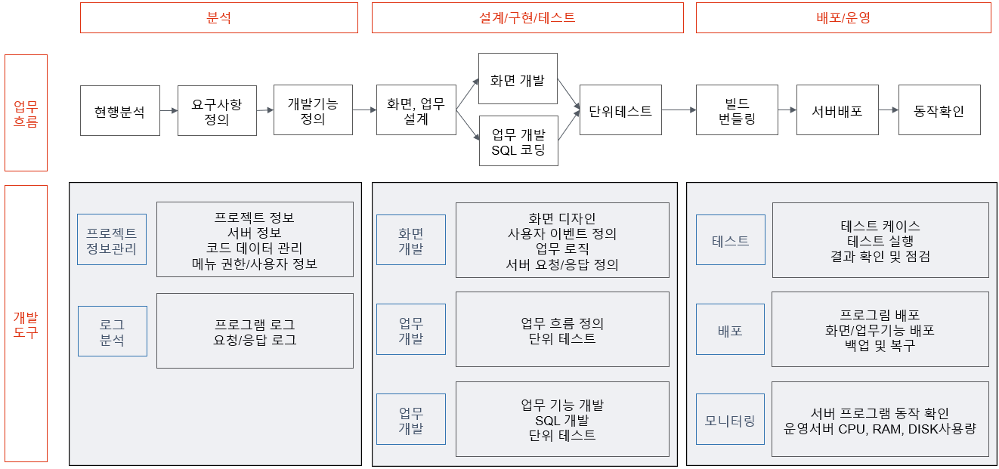

# 개요

---

## 누가 이 문서를 읽어야 하는가요?

> S/W는 업무와 관련된 기술 개발자와 엔지니어가 만드는 겁니다. 프로세스나 도구도 중요하지만, 아무리 비싼 솔루션이라도 제대로 사용할 수 없다면 비싼 장식품에 불과한 법이기 때문입니다.

HandStack은 기업의 고유 활동에 필요한 관리 업무 앱을 합리적인 비용으로 개발 및 운영하는 개발자 또는 엔지니어를 위한 고도화된 환경을 제공합니다.

최근 비즈니스 소프트웨어를 서비스 형태로 제공하는 것이 일반화되면서, 이를 웹 앱 혹은 [SaaS(Software As A Service)](https://ko.wikipedia.org/wiki/%EC%86%8C%ED%94%84%ED%8A%B8%EC%9B%A8%EC%96%B4_%EC%84%9C%EB%B9%84%EC%8A%A4)라고 부르게 되었습니다. HandStack은 아래 특징을 가진 SaaS 앱을 만들기 위한 실행 프로그램과 프레임워크 및 라이브러리의 모음입니다.

* 신규 개발자가 프로젝트에 참여하는 데 드는 시간과 비용을 최소화하기 위해 환경설정 자동화를 위한 절차를 체계화합니다.
* 운영체제에 따라 달라지는 부분을 명확히 하고, 개발 환경과 운영 환경 사이의 이식성을 극대화하여 지속적인 배포가 가능합니다.
* 최근 등장한 클라우드 플랫폼 배포에 적합하고, 서버와 시스템의 관리가 필요 없게 됩니다.
* 개발 도구, 아키텍처, 개발 방식을 크게 바꾸지 않고 서비스를 확장(Scale Out)할 수 있습니다.

## 왜 개발자와 엔지니어를 구분할까요?

똑같이 소스 코드를 확인하며 개발 업무를 수행하는 면에서는 언뜻 비슷해 보이는 역할이지만, 업무와 책임에 따라 구분됩니다.

* 개발자 (Developer): 주로 소프트웨어 개발에 중점을 둡니다. 코드를 작성하고 애플리케이션을 구축하는 데 초점을 둡니다.
* 엔지니어 (Engineer): 더 광범위한 역할을 할 수 있으며, 엔지니어링이나 시스템 아키텍처 설계, 개발, 유지보수하는 데 중점을 둡니다.

특정 조직이나 프로젝트에서는 "개발자"와 "엔지니어" 용어를 특별한 의미로 사용할 수 있습니다.

HandStack에서는 개발자는 git clone 소스 코드를 내려받아 Windows, Linux, macOS 및 Docker 기반으로 프로그램 빌드를 해보며 실행 및 디버깅을 해보는 것을 권장하고, 엔지니어는 주요 버전에 따라 릴리즈된 실행 프로그램에서 비즈니스 앱의 contracts 계약 디렉토리의 화면과 기능 소스 코드를 확인해보는 것을 권장합니다.

## 디지털 전환의 핵심 배경 및 필요성

4차 산업 혁명의 핵심은 제조업과 IT 기술의 결합입니다. 이는 기업 조직 내 비즈니스 모델에 대응하는 효과적인 개발 및 운영 역량을 내재화하는 것이 기업 활동 경쟁력을 갖추기 위한 기준이 되고 있음을 의미합니다. 문제는 시스템 구축에 필요한 기술과 지식은 이미 충분하지만 선택지가 너무 많아지고, 복잡하며, 이에 따라 설계/구현/운영에 필요한 비용이 증가하고 있어 기술의 발전과 트렌드의 변화에 오히려 기업 간의 디지털 격차가 커지고 있는 상황입니다.

기업 조직 내 비즈니스 모델을 통합하여 고객 서비스 방식을 개선하기 위한 디지털 전환 이슈가 확대되고 있습니다. 디지털 전환에 따른 업무 변화와 함께 [No Code](https://ko.wikipedia.org/wiki/%EB%85%B8_%EC%BD%94%EB%93%9C), [Low-Code](https://ko.wikipedia.org/wiki/%EB%A1%9C%EC%BD%94%EB%93%9C) 개발 환경이 등장하여 개발 지식이 없더라도 업무 담당자가 앱을 개발할 수 있는 솔루션이 향후 S/W 산업의 10대 이슈 전망에 포함되어 프로그램, 앱 개발이 보편화되는 사회적인 효과와 SW 전공자 및 비전공자 간의 전문성 격차가 줄어드는 계기로 작용할 것으로 예상됩니다.

대안으로 제시된 일반 업무 담당자도 사용 가능한 No Code, Low-Code 개발 환경은 기능이 복잡하지 않은 앱이나 간단한 서비스를 구현하는 데는 이상적이지만, 그 기능과 연계 방법이 제한적이어서 기업에 적합한 개발 및 운영 솔루션과 데이터 통합을 위해 필요한 부가적인 업무 또한 증가되고 있습니다.

> HandStack은 개발자와 엔지니어를 대상으로 기업의 전용 개발과 운영 비용을 효과적으로 절감할 수 있는 솔루션과 방안을 제공하는 것을 목표로 합니다.

## 구체화 방안

기업의 업무 프로젝트들은 데이터베이스 [CRUD(입력, 조회, 수정, 삭제)](https://ko.wikipedia.org/wiki/CRUD) 요청 거래가 전체 업무의 90%를 차지하는 경우가 대부분입니다. 왜냐하면 크고 작은 다양한 업무와 고객 요구사항에 대응하기 위해 유지보수가 많은 소프트웨어 아키텍처의 비즈니스 로직이 거의 비슷하게 구성되면서 SQL에 매개변수를 전달하는 부분을 다르게 처리하는 것을 반복적으로 개발되고 배포되기 때문입니다.

HandStack은 업계 표준 기술을 기반으로 기업의 비즈니스 앱 개발 및 운영 환경을 단순화, 표준화 방안을 제시하여 최소한의 학습 비용으로 기획/분석, 개발, 운영 담당을 수행할 수 있는 기업 내에서 3명으로 지속 가능한 IT 인프라 서비스를 할 수 있는 솔루션을 제공합니다.

## 더 나은 소프트웨어로 성장하기 위해

일반적으로 서비스나 제품에 필요한 소프트웨어를 만들기 위해서는 [오픈 소스](https://ko.wikipedia.org/wiki/%EC%98%A4%ED%94%88_%EC%86%8C%EC%8A%A4_%EC%86%8C%ED%94%84%ED%8A%B8%EC%9B%A8%EC%96%B4) 기술이 반드시 필요합니다. 누구나 개발에 참여할 수 있도록 프로젝트를 공개하면 외부 개발자들과 함께 문제를 공유하고 해결할 수 있습니다. 소스 코드에 대한 컨트리뷰션 외에도 다양한 테스트 환경과 오류 신고 등으로 소프트웨어의 품질을 높일 수 있습니다.

HandStack은 오픈 소스 프로젝트입니다. 기업의 비즈니스에 필요한 관리와 업무에 대한 개발 및 운영하는 방안으로 주요 기능들을 레고 블럭화하여 항상 최신 상태로 관리되도록 만들어 제공합니다.

> 개발자와 엔지니어를 위한 한 줄의 코드나 문서는 비즈니스의 의미와 가치를 생각합니다.

## 추가 정보

HandStack은 다양한 기능과 도구를 제공하여 개발자와 엔지니어가 효율적으로 작업할 수 있도록 돕습니다. 예를 들어, 자동화된 테스트 도구, 지속적인 통합 및 배포(CI/CD) 파이프라인, 그리고 다양한 클라우드 서비스와의 통합 기능을 제공합니다. 이를 통해 개발자는 더 빠르고 안정적으로 코드를 배포할 수 있으며, 엔지니어는 시스템의 안정성과 성능을 유지할 수 있습니다.

또한, HandStack은 커뮤니티 중심의 개발을 지향합니다. 개발자와 엔지니어는 프로젝트에 기여하고, 문제를 공유하며, 해결책을 찾기 위해 협력할 수 있습니다. 이를 통해 소프트웨어의 품질을 높이고, 새로운 기능을 빠르게 도입할 수 있습니다.

HandStack은 지속적인 학습과 성장을 지원합니다. 다양한 교육 자료와 튜토리얼을 제공하여 개발자와 엔지니어가 최신 기술과 트렌드를 따라갈 수 있도록 돕습니다. 이를 통해 개인의 역량을 강화하고, 기업의 경쟁력을 높일 수 있습니다.

