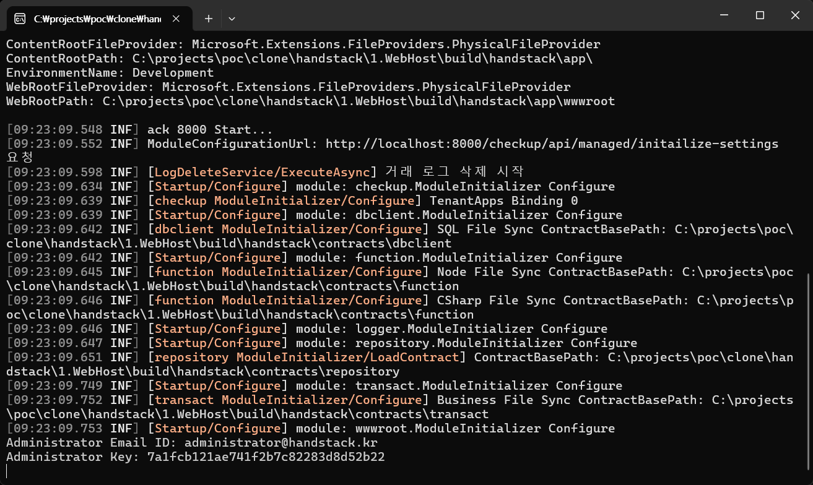

# 빠른 시작

> [중요] ack 실행 환경 설정을 위해 [패키지 관리자 설치하기](/docs/startup/install/패키지-관리자-설치하기), [필수 프로그램 설치하기](/docs/startup/install/필수-프로그램-설치하기) 문서의 내용을 먼저 수행 해야합니다.

## ack 실행 환경 설정

화면/기능 개발자의 PC 와 개발, 운영 서버에 HandStack 실행 환경 설정을 설명합니다. HandStack은 Windows 10+, Linux, macOS 운영체제에서 실행할 수 있습니다.

https://github.com/handstack77/handstack/releases/latest 에서 운영체제에 적합한 프로그램 압축 파일을 다운로드 후 적절한 경로에 압축을 해제합니다.

* linux-x64.zip: 리눅스 운영체제
* osx-x64.zip: Intel CPU 기반 macOS 운영체제
* win-x64.zip: Windows 10 이상 운영체제

다운로드 한 압축 파일을 다음의 경로에 해제 하는 것을 권장합니다. 다른 경로에 배치해도 경로가 다른 것외에 동일하게 작업합니다.

- Windows 10+: `C:/projects/handstack`
- Linux 또는 macOS: `/home/[사용자 ID]/projects/handstack`

압축을 해제 한후 [HandStack 소스 기본경로]로 이동하면 다음과 같은 디렉토리 구조를 확인할 수 있습니다.

```bash
HandStack 압축 해제 경로
├─app
│  ├─ack <- ack 서버 프로그램
│  └─cli <- handstack CLI 도구
├─contracts <- 화면/기능 소스
├─forbes <- 업무 앱 템플릿
└─modules <- 업무 단위 모듈
```

터미널 또는 명령 프롬프트를 열고 curl 명령어를 사용하여 최신 HandStack 압축 파일을 다운로드 할 수 있습니다. Windows, macOS, Linux에서 기본적으로 동일한 방식으로 활용할 수 있습니다. HandStack 압축 파일을 다운로드 할 적절한 디렉토리로 이동하고 다음의 명령어를 실행합니다.

## Windows 운영체제에서 실행하기

```bash
cd C:/projects
curl -L -o handstack-win-x64.zip https://github.com/handstack77/handstack/releases/latest/download/win-x64.zip
powershell Expand-Archive -Path handstack-win-x64.zip -DestinationPath .
cd handstack
install.bat
```

압축을 해제 한후 `C:/projects/handstack` 로 이동하여 install.bat 배치 스크립트를 실행합니다.

실행에 필요한 필수 설치 프로그램과 환경을 자동으로 구성합니다. 서버 사양과 네트워크 상태에 따라 10분 이상 소요될 수 있습니다.

설정이 완료되면 app 디렉토리로 이동하여 ack 프로그램을 실행합니다.

```bash
cd C:/projects/handstack/app
ack
```

## Linux 또는 macOS 운영체제에서 실행하기


```bash
cd /home/[사용자 ID]/projects
curl -L -o handstack-linux-x64.zip https://github.com/handstack77/handstack/releases/latest/download/linux-x64.zip
unzip -q -o handstack-linux-x64.zip -d handstack
tr -d '\r' < install.sh > install_fixed.sh && mv install_fixed.sh install.sh
chmod +x install.sh
sudo ./install.sh
```

> macOS 운영체제에서 실행하려면 `handstack-osx-x64.zip` 파일을 다운로드하고 압축을 해제합니다. macOS M1 기반에서 .NET Core로 빌드된 프로그램을 실행 하려면 로제타를 이용하여 실행 해야합니다.
> ```bash
> curl -L -o handstack-osx-x64.zip https://github.com/handstack77/handstack/releases/latest/download/osx-x64.zip
> unzip -q -o handstack-osx-x64.zip -d handstack
> ```

압축을 해제 한후 `/home/[사용자 ID]/projects/handstack` 로 이동하여 install.sh 배치 스크립트를 실행합니다.

실행에 필요한 필수 설치 프로그램과 환경을 자동으로 구성합니다. 서버 사양과 네트워크 상태에 따라 10분 이상 소요될 수 있습니다.

ack, handstack 실행 파일에 권한을 부여하여 실행이 가능합니다. 다음과 같이 실행 권한을 부여합니다.

```bash
cd /home/[사용자 ID]/projects/handstack/app
chmod +x ack

cd /home/[사용자 ID]/projects/handstack/app/cli
chmod +x handstack
```

설정이 완료되면 app 디렉토리로 이동하여 ack 프로그램을 실행합니다.

```bash
cd /home/[사용자 ID]/projects/handstack/app
./ack
# 또는
dotnet ack.dll
```

## 웹 브라우저로 HandStack 실행 확인하기

ack 프로그램을 처음 실행하면 Administrator Email ID, Key를 확인할 수 있습니다. 이 정보는 checkup 모듈의 사용자 인증에 사용됩니다.

> checkup 인증 정보는 [HandStack 소스 기본경로]/sqlite/HDS/dbclient/checkup.db SQLite 파일에 저장됩니다.



웹 브라우저를 열고 http://localhost:8421/checkup/account/signin.html 에 접속하여 HandStack을 실행합니다.