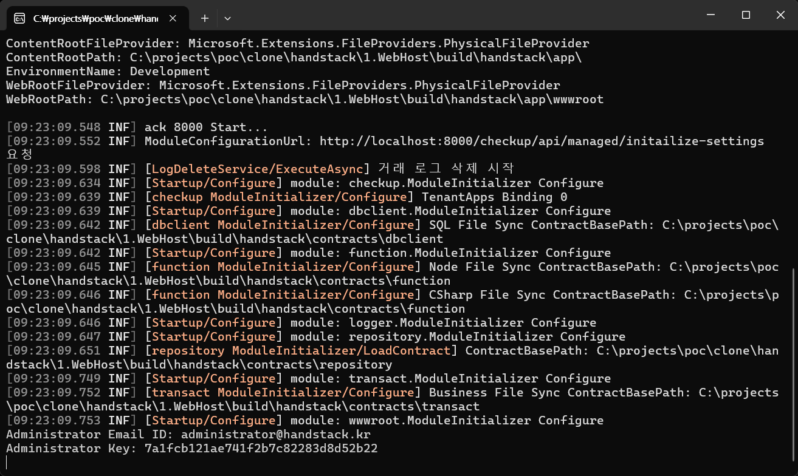

import Tabs from '@theme/Tabs';
import TabItem from '@theme/TabItem';

# 내 PC에서 실행하기

HandStack 배포본으로 서버를 실행합니다. 이 단계의 완료 기준은 브라우저에서 관리 화면에 접속하는 것입니다. 도구 설치와 다운로드 시간은 PC와 네트워크에 따라 달라집니다.

## 준비 확인 {#ack-실행-환경-설정}

[필수 프로그램 안내](/docs/startup/install/필수-프로그램-설치하기)에서 .NET SDK, Node.js·npm, gulp-cli, curl을 확인하세요. `install.bat`과 `install.sh`는 이 도구를 이용해 HandStack의 패키지와 화면 자원을 구성합니다. 기본 도구 설치와는 다른 단계입니다.

기존 프로젝트와 분리된 실습 디렉터리를 사용하세요. 여기서는 압축 안의 `handstack` 디렉터리를 Windows의 `C:/projects/handstack`, Linux·macOS의 사용자 디렉터리 아래 `projects/handstack`에 둡니다.

## 배포본 받기

[HandStack 릴리스](https://github.com/handstack77/handstack/releases/latest)에서 OS와 CPU에 맞는 파일을 내려받으세요. 파일명에 `win`, `linux`, `osx`와 `x64`, `arm64` 등의 대상이 표시됩니다. 실제 제공되는 파일과 요구사항은 해당 릴리스 설명을 따릅니다.

압축을 풀고 아래 항목이 있는 디렉터리를 찾으세요. 이 문서에서는 그 위치를 **HandStack 기본 경로**라고 부릅니다.

~~~text
handstack/
├─ app/       # ack 실행 파일과 설정
├─ modules/   # 서버 모듈과 화면 자원
├─ install.bat
└─ install.sh
~~~

운영체제와 배포본의 아키텍처를 맞추는 방법은 [지원 환경 확인](/docs/startup/install/지원-운영체제)을 참고하세요.

## 구성하고 실행하기

<Tabs groupId="operating-system" queryString="os">
<TabItem value="windows" label="Windows" default>

### Windows에서 실행

PowerShell에서 HandStack 기본 경로로 이동해 구성 스크립트를 실행합니다.

~~~powershell
Set-Location C:/projects/handstack
.\install.bat
~~~

완료 메시지를 확인한 뒤 서버를 실행하세요. 오류가 나면 먼저 누락된 도구나 다운로드 실패를 해결합니다.

~~~powershell
Set-Location C:/projects/handstack/app
.\ack.exe
~~~

</TabItem>
<TabItem value="linux" label="Linux">

### Linux에서 실행

일반 사용자 터미널에서 구성합니다. 압축을 다른 위치에 풀었다면 첫 경로를 바꾸세요.

~~~bash
cd ~/projects/handstack
bash ./install.sh
~~~

완료 후 서버를 실행합니다.

~~~bash
cd ~/projects/handstack/app
chmod +x ack
./ack
~~~

배포본에 `ack.dll`이 있으면 `dotnet ack.dll`로도 실행할 수 있습니다.

</TabItem>
<TabItem value="macos" label="macOS">

### macOS에서 실행 {#macos에서-실행}

일반 사용자 터미널에서 구성합니다. Apple Silicon과 Intel용 배포본·.NET의 아키텍처가 맞는지 먼저 확인하세요.

~~~bash
cd ~/projects/handstack
bash ./install.sh
~~~

완료 후 서버를 실행합니다.

~~~bash
cd ~/projects/handstack/app
chmod +x ack
./ack
~~~

배포본에 `ack.dll`이 있으면 `dotnet ack.dll`로도 실행할 수 있습니다.

</TabItem>
</Tabs>

## 브라우저에서 확인하기 {#웹-브라우저로-handstack-실행-확인하기}

서버 터미널을 열어 둔 채 [관리 화면](http://localhost:8421/checkup/account/signin.html)에 접속하세요. 기본 포트는 `8421`이며 설정을 바꿨다면 실행 로그에 표시된 주소를 사용합니다.

로그인 화면이 표시되고 서버에 기동 오류가 없으면 이 단계가 완료됩니다. 관리 화면에 로그인할 때는 최초 실행 로그에 안내된 Administrator Email ID와 Key를 사용합니다.

접속되지 않으면 [실행·화면·거래 문제 해결](/docs/guides/문제-해결#서버에-접속되지-않음)을 확인하세요.

다음은 [게시판 첫 조회](/docs/tutorial/첫-조회)입니다.
