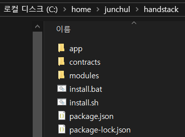
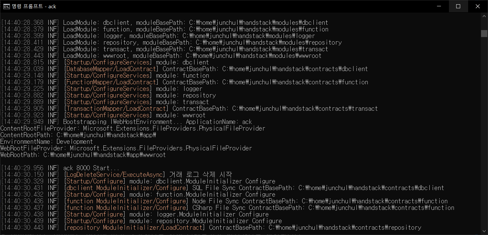

# 빠른 시작

환영합니다! HandStack은 기업의 비즈니스에 필요한 관리와 업무에 대한 앱을 합리적인 방법으로 개발 및 운영하는 개발 솔루션입니다.

## 전달 하고자 하는 주요 내용은 다음과 같습니다
* 필수 설치 프로그램 다운로드 정보
* HandStack 프로그램 시작 및 확인
* 주요 기능 정보 바로가기

## .NET 8.x 버전과 Node.js 18.x LTS 버전 설치

HandStack은 LTS 장기 지원을 기반으로 개발중입니다. .NET, Node.js 환경은 x86, x64, Arm 실행 환경을 제공하며, 다음과 같이 온프레미스와 클라우드 네이티브 서비스에 적합한 기술 스택입니다.

|주요 분야|설명|
|---|---|
|웹|Windows, Linux, macOS 및 Docker용 웹 앱 및 서비스를 빌드합니다|
|모바일 및 데스크톱|하이브리드 앱 방식으로 단일 코드를 사용하여 Windows, Linux, macOS, iOS 및 Android용 기본 앱을 빌드합니다|
|클라우드|모든 주요 클라우드 공급자에서 실행되는 확장 가능하고 복원력 있는 클라우드 네이티브 앱을 빌드합니다|
|마이크로 서비스|Docker 컨테이너에서 실행되는 독립적으로 배포 가능한 마이크로 서비스를 만듭니다|

기업 IT의 업그레이드에는 성능과 개선, 안정성 향상이 기본이기 때문에 간소화된 기술 스택이 필요합니다.

> HandStack의 HAND는 HTML5 + ASP.NET Core + Node.js + Docker의 기술 스택을 정의하며, 고객과 수행사의 신뢰를 의미합니다.

최근 운영체제 환경은 보안 및 성능 향상을 위해 기본적으로 x64 (64비트) 환경을 권장하고 있습니다. 이 문서는 x64를 전제로 설명합니다.

## Windows 환경에서 시작하기

### .NET SDK 설치 관리자 설치하기

* 웹 브라우저로 [.NET SDK 설치 관리자](https://dotnet.microsoft.com/ko-kr/download/dotnet/thank-you/sdk-8.0.100-windows-x64-installer) 프로그램을 다운로드 하세요.
* 다운로드가 완료되면 설치 프로그램을 실행하고 컴퓨터에 .NET을 설치하는 단계를 완료하세요. 
* 설치 프로그램이 완료되면 새 명령 프롬프트를 열고 `dotnet` 명령을 실행합니다. 

### Node.js 설치 관리자 설치하기

* 웹 브라우저로 [Node.js 설치 관리자](https://nodejs.org/dist/v20.9.0/node-v20.9.0-x64.msi) 프로그램을 다운로드 하세요.
* 다운로드가 완료되면 설치 프로그램을 실행하고 컴퓨터에 Node.js을 설치하는 단계를 완료하세요. 
* 설치 프로그램이 완료되면 새 명령 프롬프트를 열고 `node -v` 명령을 실행합니다. 

### HandStack 설치하기

> 공식 문서는 HandStack의 releases 압축 파일을 C:\home\handstack 디렉토리에 압축 파일을 해제하는 것으로 가이드 됩니다.

* 웹 브라우저로 [HandStack 최신 Release](https://nodejs.org/dist/v20.9.0/node-v20.9.0-x64.msi) 압축 파일을 다운로드 하세요.
* 다운로드가 완료되면 압축 파일을 해제합니다. 압축 해제 경로는 향후 macOS, Linux에도 동일한 경로를 만들기 위해 `C:/home/handstack` 를 권장합니다. 
* 압축 해제가 완료되면 새 명령 프롬프트를 열고 압축 해제한 디렉토리로 이동 하여 `npm install` 명령을 실행합니다. Node.js 기반 Function 기능을 위한 라이브러리가 설치됩니다.
* ack 디렉토리로 이동 하여 `ack` 명령을 실행합니다. 
* HandStack 서버가 실행되면 웹 브라우저를 실행하여 `http://localhost:8080/module.html` 주소를 연결합니다. 

HandStack 디렉토리는 다음을 의미합니다. 이외에도 업무에 따라 추가적으로 하위 디렉토리가 실시간으로 생성됩니다.

* ack: HandStack 서버 실행 프로그램이 있습니다. Windows, Linux, macOS를 지원하며, 기본 포트로 8080을 사용합니다
* contracts: 프론트엔드, 백엔드에 대한 모든 계약, 설정, 소스가 있습니다.
* modules: HandStack 필수 기능 제공을 위한 .NET Core 기반 공식 모듈 들이 있습니다.
* src: 도메인 업무 기능을 위한 .NET Core 기반 모듈이 있습니다.

## 마치며

이제 웹 앱을 개발 하기 위한 환경이 만들어졌습니다. 맞춤형 기술 스택으로 직접 앱이나 서비스를 구축하는 것은 많은 비용이 듭니다. HandStack은 오픈소스 기반으로 기업에서 자유롭게 사용할 수 있으며 공식 문서로 자습서와 핸즈온랩, 참조 자료 및 리소스를 지속적으로 업데이트 합니다.

## 참고자료
* .NET 8.x 다운로드: https://dotnet.microsoft.com/ko-kr/download/dotnet/8.0
* Windows에 .NET 설치: https://learn.microsoft.com/ko-kr/dotnet/core/install/windows?tabs=net80
* macOS에 .NET 설치: https://learn.microsoft.com/ko-kr/dotnet/core/install/macos
* Linux에 .NET 설치: https://learn.microsoft.com/ko-kr/dotnet/core/install/linux
* Node.js 다운로드: https://nodejs.org/en/download
* HandStack 다운로드: https://github.com/handstack77/handstack/releases
