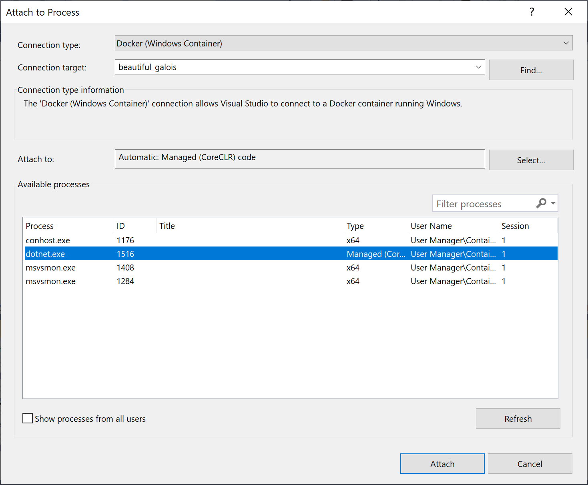

# Docker 컨테이너에서 ack 프로세스에 연결 디버깅하기

ack 프로그램은 docker를 이용하여 실행될 수 있습니다. 이 경우에는 docker 내부에서 디버깅을 해야합니다. docker에서 실행하기 위한 Dockerfile은 다음과 같습니다.

```dockerfile
FROM mcr.microsoft.com/dotnet/sdk:8.0

# 서비스 포트 설정
EXPOSE 8000

# 변수 선언 (전달 예: docker build --tag handstack:1.0.0 --build-arg NODE_MAJOR=20 .)
ARG NODE_MAJOR=20

# Install Node.js 20.x 및 필수 도구 설치 
RUN apt-get update && \
    apt-get install -y ca-certificates curl gnupg && \
    mkdir -p /etc/apt/keyrings && \
    curl -fsSL https://deb.nodesource.com/gpgkey/nodesource-repo.gpg.key | gpg --dearmor -o /etc/apt/keyrings/nodesource.gpg

RUN echo "deb [signed-by=/etc/apt/keyrings/nodesource.gpg] https://deb.nodesource.com/node_$NODE_MAJOR.x nodistro main" | tee /etc/apt/sources.list.d/nodesource.list && \
    apt-get update && \
    apt-get install nodejs -y

RUN apt-get install -y procps net-tools iputils-ping vim

# 호스트 디렉토리 파일을 베이스 handstack 디렉토리에 복사
WORKDIR /home/handstack
COPY . .

# npm 패키지 설치
RUN npm i

# 프로그램 시작
# RUN chmod +x preference.sh
WORKDIR /home/handstack/app
ENTRYPOINT ["dotnet", "ack.dll"]
```

프로세스에 연결 대화 상자를 사용하여 로컬 컴퓨터의 Windows Docker 컨테이너에서 실행되는 프로세스에 Visual Studio 디버거를 연결할 수 있습니다.

> .NET Core 프로세스에 이 기능을 사용하려면 .NET Core 플랫폼 간 개발 워크로드를 설치하고 소스 코드에 대한 로컬 액세스 권한이 있어야 하며, 대상 프로세스는 실행 중인 Docker Windows 컨테이너와 프로세서 아키텍처가 동일해야 합니다.

Linux Docker 컨테이너에서 실행 중인 프로세스에 연결하려면 다음 단계를 수행합니다.

* Visual Studio에서 디버그 > 프로세스에 연결(또는 CTRL+ALT+P)을 선택하여 프로세스에 연결 대화 상자를 엽니다.
* 연결 형식을 Docker(Windows 컨테이너)로 설정합니다.
* 찾기...를 선택하여 Docker 컨테이너 선택 대화 상자를 통해 연결 대상을 Docker Daemon으로 설정합니다.
* Docker 호스트(선택 사항)에서 Daemon 주소(예: TCP, IP 등)를 지정하고 새로 고침 링크를 클릭합니다.
* 사용 가능한 프로세스 목록에서 해당 컨테이너 프로세스를 선택하고 연결을 선택하여 C# 컨테이너 프로세스 디버깅을 시작합니다.



그림) Windows Docker 컨테이너에서 dotnet 프로세스에 연결 디버깅하기

ack 프로그램을 docker로 빌드 및 확인하기 위해 다음과 같은 명령어를 실행합니다.

```bash
# docker build --tag handstack:1.0.0 --build-arg NODE_MAJOR=20 .
# docker run -d --name ack-pg-1.0.0 -v "C:/home/handstack/contracts:/home/handstack/contracts" -v "C:/home/handstack/log:/home/handstack/log" -v "C:/home/handstack/modules:/home/handstack/modules" -v "C:/home/handstack/storage:/home/handstack/storage" -p 8080:8080 handstack:1.0.0
# docker run -d --name ack-pg-1.0.0 --net host handstack:1.0.0
# docker exec -it ack-pg-1.0.0 /bin/bash
# docker stop ack-pg-1.0.0
# docker rm ack-pg-1.0.0
# docker rmi handstack:1.0.0
```