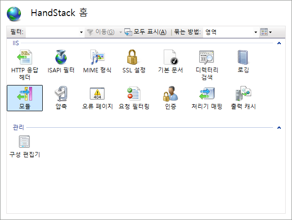
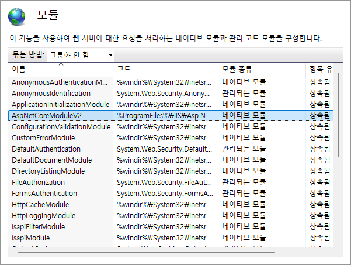
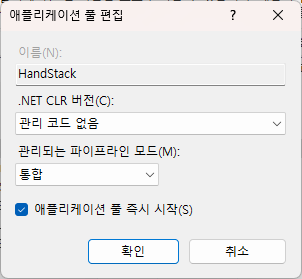

# Windows 서버 호스팅


## IIS (인터넷 정보 서비스) 관리자 설치하기

IIS (인터넷 정보 서비스) 관리자를 설치하는 방법은 다음과 같습니다.

1. **프로그램 및 기능 열기**:
   - 시작 메뉴에서 **제어판**을 엽니다.
   - **프로그램 및 기능**을 선택합니다.

2. **Windows 기능 켜기/끄기**:
   - 왼쪽 메뉴에서 **Windows 기능 켜기/끄기**를 클릭합니다.
   - **인터넷 정보 서비스** 항목을 찾아 체크합니다.
   - 웹 서버 운영에 필요한 세부 항목들도 체크합니다.

3. **설치**:
   - 확인 버튼을 눌러 설치를 시작합니다.
   - 설치가 완료될 때까지 기다립니다.

4. **설치 완료 후 확인**:
   - 설치가 완료되면 **시작 메뉴 > Windows 관리 도구 > IIS (인터넷 정보 서비스)**를 통해 IIS 관리자를 실행할 수 있습니다.
   - 또는 **Windows 검색**에서 `IIS` 또는 `인터넷 정보 서비스`를 입력해도 쉽게 찾을 수 있습니다.


### IIS 다시 시작

호스팅 번들을 설치한 후 수동 IIS 다시 시작이 필요할 수 있습니다. 

IIS를 수동으로 다시 시작하려면 WAS(Windows Process Activation Service)를 중지한 다음, W3SVC(World Wide Web Publishing 서비스)와 모든 종속 서비스를 다시 시작합니다. 관리자 권한 명령 셸에서 다음 명령을 실행합니다.

```bash
net stop was /y
net start w3svc
```

## .NET Core 호스팅 번들 설치하기

.NET Core 호스팅 번들은 IIS 에서 .NET Core 기반 웹 어플리케이션을 실행 할 수 있는 환경을 제공합니다.

- [.NET Core 호스팅 번들 설치 관리자](https://dotnet.microsoft.com/permalink/dotnetcore-current-windows-runtime-bundle-installer)를 다운로드합니다.
- 다운로드한 설치 파일을 실행하여 설치합니다.

## AspNetCoreModuleV2 모듈 확인하기

IIS 관리자에서 웹 사이트를 선택하고, "기본 설정"을 클릭합니다.

"모듈" 섹션에서 "AspNetCoreModuleV2"가 있는지 확인합니다. 만약 없다면, .NET Core 호스팅 번들이 제대로 설치되지 않았을 수 있거나 IIS를 종료하고 다시 실행 해야합니다.





웹 사이트의 "응용 프로그램 풀"을 선택하고, .NET Core 버전에 맞는 풀을 설정합니다.



## web.config에 AspNetCoreModuleV2 설정하기

3. **web.config 파일 설정**:
- 웹 사이트 기본 디렉토리에 `web.config` 파일을 추가해서 다음과 같은 설정을 추가합니다.

```xml
<configuration>
    <system.webServer>
        <handlers>
            <add name="aspNetCore" path="*" verb="*" modules="AspNetCoreModuleV2" resourceType="Unspecified"/>
        </handlers>
        <aspNetCore processPath="dotnet" arguments=".\ack.dll" hostingModel="inprocess"/>
    </system.webServer>
</configuration>
```

이렇게 설정하면 .NET Core 애플리케이션을 IIS에서 호스팅할 수 있습니다.
