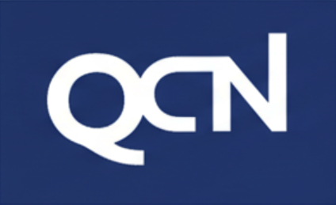

---
marp: true
theme: gaia
_class: lead
footer: QCN
paginate: true
backgroundColor: #fff
---

# HandStack 을 제안합니다

### 개발자가 좋아하고 기업이 신뢰하는 비즈니스 앱 '시스템'

 
 
 
 
 

---
## 프로젝트는 실패하지 않습니다. 시스템이 실패합니다.

- 프로젝트 실패 원인은 코드가 아니라 환경, 운영, 정책에 있습니다.
- 개발은 진행되지만, 시스템이 발목을 잡는 경우가 많습니다.

<!--
> “기술이 부족해서 실패하는 프로젝트는 거의 없습니다.  
> 대부분은 개발 외적인 시스템 문제로 인해 어려움을 겪습니다.”
-->

---

## 이런 순간을 겪어보신 적이 있으신가요?

- 로컬과 운영 환경의 불일치
- 보안팀의 SaaS 사용 제한
- 사소한 수정에도 큰 빌드, 배포 부담
- 외주, 파트너 결과물의 재현 불가

<!--
> “이 중 하나라도 공감되신다면, 오늘의 이야기는 결코 남의 이야기가 아닙니다.”
-->

---

## 문제는 ‘기능’이 아니라 ‘순간’에 드러납니다

- Pain Point는 항상 존재합니다.
- 그러나 문제는 특정한 ‘순간’ 에만 발생합니다.
- 그 순간을 놓치면 아무리 좋은 기술도 설득력을 가지기 어렵습니다.

<!--
> “사람은 문제가 있다는 이유만으로 움직이지 않습니다.  
> 더 이상 참기 어려운 순간이 와야 비로소 움직이게 됩니다.”
-->

---

## 개발자 역할 변화의 시대에 기존 접근 방식의 한계

- 최신 프레임워크 도입 → 승인 및 유지보수 리스크 증가
- SaaS 의존 → 보안 및 정책 충돌
- DevOps 복잡화 → 운영 비용 증가
- 개발자 경험(DX) 저하 → 전체 속도 저하

<!--
> “기술은 계속 좋아지고 있는데,  
> 왜 프로젝트는 점점 더 무거워지고 있을까요?”
-->

---

## 그렇다면, 우리가 정말로 필요한 것은 무엇일까요?

- 더 많은 기능은 아닙니다.
- 더 새로운 기술도 아닙니다.
- 끝까지 운영 가능한 시스템입니다.

<!--
> “우리에게 필요한 것은 또 하나의 프레임워크가 아니라,  
> 비즈니스 애플리케이션을 끝까지 책임질 수 있는 구조입니다.”
-->

---

## HandStack은 ‘플랫폼’이 아니라 ‘시스템’입니다

- 개발자가 신뢰할 수 있고
- 기업이 안심하고 사용할 수 있는
- 비즈니스 애플리케이션 시스템입니다.

<!--
> “HandStack은 단순한 개발 도구가 아닙니다.  
> 개발과 운영, 그리고 신뢰를 하나로 묶은 시스템입니다.”
-->

---

## 기업이 신뢰하는 이유 – 표준과 통제

- 검증된 업계 표준 기술 기반
- 셀프 호스팅, 클라우드, SaaS 모두 지원
- 데이터와 실행 환경을 조직이 직접 통제
- 커스터마이징 및 유연성 제공

<!--
> “새로운 기술을 설득하실 필요가 없습니다.  
> 이미 기업이 신뢰하고 있는 표준 위에서 출발합니다.”
> 데이터 보안 및 데이터 거버넌스
-->

---

## 개발자가 선호하는 이유 – 일관된 개발 흐름

- 컴파일 없는 비즈니스 애플리케이션
- 기존에 익숙한 도구 그대로 사용
- 로컬과 운영 환경이 동일한 실행 구조

<!--
> “사소한 수정 하나 때문에  
> 빌드와 배포에 하루를 쓰지 않으셔도 됩니다.”
-->

---

## HandStack이 변화시키는 것

- 개발 속도 향상
- 운영 마찰 감소
- 보안 및 감사 대응 강화
- 총 IT 비용 절감

<!--
> “HandStack은 개발을 빠르게 만드는 도구가 아닙니다.  
> 프로젝트를 끝까지 완주하게 만드는 시스템입니다.”
-->

---

## 제품을 바꾸는 것이 아니라, 시스템을 바꾸는 선택입니다

- 지금 겪고 계신 문제는 개인의 역량 문제가 아닙니다.
- 시스템을 바꾸면 팀의 속도와 신뢰가 달라집니다.

<!--
> “현재의 문제를 더 좋은 코드로만 해결하려 하지 마십시오.  
> 문제를 만들어내는 시스템부터 바꾸셔야 합니다.”
-->

---

## 비즈니스와 개발을 지속 가능하게 만듭니다.

- 간단함 - 화면, 쿼리, 함수
- 저비용 - 자유로운 IT 인프라
- 확장성 - 오픈 소스, modules

> - HandStack GitHub 주소: https://github.com/handstack77/handstack
> - HandStack 공식 문서: https://handstack.kr/docs/startup/개요
> - HandStack 개발자 시작 가이드: https://www.youtube.com/@handstack-kr

<!--
- HandStack 그룹웨어 데모: https://qrame.kr/qramework/login.html (tester@qcn.co.kr / tester1234)
-->

