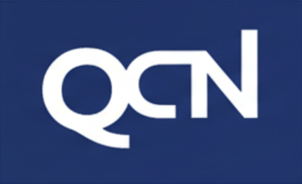

---
marp: true
theme: gaia
_class: lead
footer: QCN
paginate: true
backgroundColor: #fff
---

# HandStack 을 제안합니다

우리 팀의 개발·운영 병목을 골라 HandStack 도입을 검증할 기준을 정합니다.

 
 
 
 
 

<!--
발표: 첫 화면의 목표를 말한 뒤 핵심 개념과 예제로 진행합니다. 확인 질문 뒤에는 답할 시간을 주고, 마지막 완료 기준을 남겨 질문을 받습니다.
발표 구성 참고: MIT OpenCourseWare, Patrick Winston, How to Speak (2018), https://ocw.mit.edu/courses/res-tll-005-how-to-speak-january-iap-2018/pages/how-to-speak/
-->

---

## 개발을 지연시키는 환경과 운영 조건

- 코드 품질과 함께 환경·운영·정책을 점검해야 합니다.
- 같은 기능도 승인·배포·인수인계 과정에서 지연될 수 있습니다.

<!--
재현 가능한 사례 하나로 설명합니다. 환경 차이 또는 승인 대기로 지연된 변경이 있었는지 청중에게 묻습니다.
-->

---

## 이런 순간을 겪어보신 적이 있으신가요?

- 로컬과 운영 환경의 불일치
- 보안팀의 SaaS 사용 제한
- 사소한 수정에도 큰 빌드, 배포 부담
- 외주, 파트너 결과물의 재현 불가

<!--
지연 원인 중 환경·권한·배포·인수인계에서 가장 자주 겪는 문제 하나를 고르게 합니다.
-->

---

## 병목이 드러나는 순간

- 배포, 보안 검토, 외주 결과물 인수 시 어떤 문제가 반복되는지 기록합니다.
- 도입 제안은 기능 목록보다 실제 지연·오류 사례와 연결합니다.

<!--
변경 리드타임과 오류·복구 시간을 함께 비교해 문제의 크기를 확인합니다.
-->

---

## 개발자 역할 변화의 시대에 기존 접근 방식의 한계

- 최신 프레임워크 도입 → 승인 및 유지보수 리스크 증가
- SaaS 의존 → 보안 및 정책 충돌
- DevOps 복잡화 → 운영 비용 증가
- 개발자 경험(DX) 저하 → 전체 속도 저하

<!--
사용 기술의 수보다 반복되는 연결 작업과 책임 경계에 초점을 맞춥니다.
-->

---

## 운영 가능한 시스템의 조건

- 재현 가능한 실행·배포 절차
- 조직의 보안 정책에 맞는 데이터 통제
- 변경 이력과 인수인계 기준

<!--
공통 구조가 줄이는 작업과 개발자가 계속 맡아야 하는 업무 로직·검증을 구분합니다.
-->

---

## HandStack의 적용 범위

- 화면·거래·실행 모듈을 연결하는 비즈니스 앱 프레임워크입니다.
- 개발과 운영의 공통 구조를 제공합니다.
- 조직의 보안·품질 기준은 프로젝트에서 검증해야 합니다.

<!--
개발·운영 담당자가 같은 계약과 로그를 읽는 사례로 연결합니다.
-->

---

## 잠깐, 구분해 보기

작은 수정의 배포가 늦다면, 코드 외에 무엇을 확인해야 할까요?

<!--
질문 후 잠시 기다립니다. 답이 없으면 앞에서 본 예제를 다시 가리킵니다.
확인할 답: 환경 차이, 승인 절차, 재현 가능한 배포와 운영 책임을 함께 확인합니다.
다음 주제로 넘어가기 전에 차이를 청중의 표현으로 한 번 확인합니다.
-->

---

## 기업이 신뢰하는 이유 – 표준과 통제

- 검증된 업계 표준 기술 기반
- 셀프 호스팅, 클라우드, SaaS 모두 지원
- 데이터와 실행 환경을 조직이 직접 통제
- 커스터마이징 및 유연성 제공

<!--
표준 기술을 사용해도 데이터 보안·거버넌스와 조직의 호환성 검토가 필요합니다.
-->

---

## 개발자가 선호하는 이유 – 일관된 개발 흐름

- 화면·쿼리 계약은 전체 서버 재컴파일 없이 변경 가능
- 기존에 익숙한 도구 그대로 사용
- 로컬과 운영에 공통 실행 구조 적용. 환경별 설정은 별도 검증

<!--
화면·SQL 계약 변경과 컴파일된 모듈 변경의 배포 절차 차이를 설명합니다.
-->

---

## 도입 전후에 비교할 지표

- 최초 구현·변경 소요 시간
- 배포 실패·운영 대응 시간
- 보안 검토·감사 증거 준비 시간
- 구축·운영·인수인계의 총비용

<!--
개발 속도 외에 인수인계와 복구 가능성을 함께 측정합니다.
-->

---

## 도입 판단의 단위

- 개인 역량과 작업 환경을 함께 살펴봅니다.
- 작은 업무에서 효과를 확인한 뒤 팀의 공통 기준으로 확장합니다.

<!--
코드 품질과 운영 구조를 함께 개선할 수 있는 작은 적용 대상을 고릅니다.
-->

---

## 비즈니스와 개발을 지속 가능하게 만듭니다.

- 간단함 - 화면, 쿼리, 함수
- 저비용 - 자유로운 IT 인프라
- 확장성 - 오픈 소스, modules

> - HandStack GitHub 주소: https://github.com/handstack77/handstack
> - HandStack 공식 문서: https://handstack.kr/docs/startup/개요
> - HandStack 개발자 시작 가이드: https://www.youtube.com/@handstack-kr

<!--
- HandStack 그룹웨어 데모: https://qrame.kr/qramework/login.html (tester@qcn.co.kr / tester1234)
-->

---

## 도입을 판단할 근거

- 환경·보안·배포·인수인계 중 현재의 병목을 하나 고릅니다.
- 작은 업무에서 변경 시간과 운영 비용을 측정합니다.
- HandStack의 표준 기술·모듈 구성이 그 병목을 줄이는지 판단합니다.

<!--
질문을 받는 동안 이 확인 기준을 화면에 남깁니다. 청중이 자신의 업무에 적용할 다음 행동 하나를 고르게 합니다.
-->

