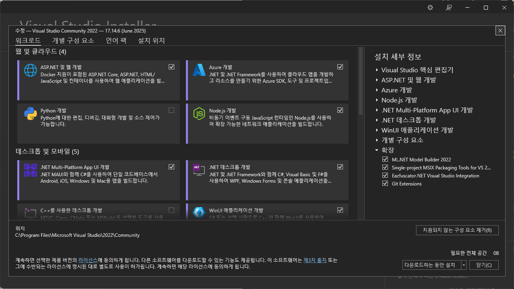

<style>
:root {
  font-family: Pretendard;
  --border-color: #303030;
  --text-color: #0a0a0a;
  --bg-color-alt: #dadada;
  --mark-background: #ffef92;
}

h1 {
  border-bottom: none;
  font-size: 1.6em;
}

h2 {
  border-bottom: none;
  font-size: 1.3em;
}

h3 {
  font-size: 1.1em;
}

h4 {
  font-size: 1.05em;
}

h5 {
  font-size: 1em;
}

h6 {
  font-size: 0.9em;
}

h1,
h2,
h3,
h4,
h5,
h6 {
  color: var(--text-color);
}

code:not([class*="language-"]) {
  font-family: D2Coding;
  color: #000;
  vertical-align: text-bottom;
  background-color: rgba(100, 100, 100, 0.2);
}

section {
  padding: 1rem;
  border-bottom: 1px solid #000;
  background-image: linear-gradient(to bottom right, #f7f7f7 0%, #d3d3d3 100%);
}

section > h2 {
  border-bottom: 4px solid #17344f;
}

section table {
    margin: auto;
    margin-top: 1rem;
    font-size: 28px;
}

section::after {
  font-size: 0.75em;
  content: attr(data-marpit-pagination) " / " attr(data-marpit-pagination-total);
}

img[alt~="center"] {
  display: block;
  margin: 0 auto;
}

blockquote {
  font-size: 26px;
  border-left: 8px solid var(--border-color);
  background: var(--bg-color-alt);
  margin: 0.5em;
  padding: 0.5em;
}

blockquote::before,
blockquote::after {
    content: '';
}

mark {
  background-color: var(--mark-background);
  padding: 0 2px 2px;
  border-radius: 4px;
  margin: 0 2px;
}

section.tinytext>p,
section.tinytext>ul,
section.tinytext>blockquote {
  font-size: 0.65em;
}
</style>

# 내 컴퓨터에 개발 환경 꾸미기

### .NET Core, Node.js 및 CLI 도구 설치

---

## 가장 먼저 해야 할 일!

HandStack은 x64 아키텍처 기반의 Windows 11+, Ubuntu 22.04+, macOS 12+ (Monterey) 에서 개발하고 테스트합니다.

- 내 컴퓨터에 HandStack 실행에 <mark>필수적인 프로그램</mark>들을 설치합니다.
- 각 프로그램이 <mark>왜 필요한지</mark> 간단하게 알아봅니다.
- 설치가 <mark>잘 되었는지 확인</mark>하는 방법을 배웁니다.

---

## HandStack의 엔진을 설치해요

자동차에 엔진이 있어야 움직이듯, HandStack도 <mark>.NET Core</mark>와 <mark>Node.js</mark>라는 엔진이 꼭 필요합니다.

- HandStack의 핵심 기능들이 이 두 가지를 기반으로 만들어졌기 때문입니다.
- 지금부터 이 두 개의 엔진을 설치해 보겠습니다.

---

## 패키지 관리자 설치

개발에 필요한 대부분의 프로그램은 공식 웹 사이트에서 다운로드 해서 설치하거나 운영체제의 패키지 매니저를 사용하여 명령으로 자동화된 설치 프로세스를 수행할 수 있습니다.

- Windows: winget
- macOS: Homebrew
- Linux: apt 또는 yum

> 패키지 관리자를 이용한 설치 과정은 기본적으로 공식 저장소에 있는 프로그램을 다운로드 하기 때문에 인터넷 연결이 필요합니다.

---

## Windows 에서 .NET Core 설치

### .NET Core는 왜 필요한가요?

- HandStack의 서버(백엔드)와 CLI(Command Line Interface)가 .NET Core 기술로 만들어졌습니다.
- 안정적이고 빠른 서버를 만드는 데 사용되는 마이크로소프트의 오픈소스 기술입니다.
- 명령 프롬프트를 실행하고 다음의 명령을 실행하여 .NET 8 LTS 를 설치

```bash
winget install --id=Microsoft.DotNet.SDK.8
```

---

## .NET Core 설치 확인하기

설치가 완료되면, 아래 명령어를 입력해 보세요.

```bash
dotnet --version
```

- 위와 같이 설치된 버전 번호가 나타나면 성공입니다.
- 예시: `8.0.xxx`

---

## Windows 에서 Node.js 설치

### Node.js는 왜 필요한가요?

- HandStack 기반 업무 기능(서버 함수)와 CLI(명령어 도구)가 Node.js 기술로 만들어졌습니다.
- 빠르고 효율적인 웹 서비스를 만들 때 널리 사용되는 기술입니다.
- 명령 프롬프트를 실행하고 다음의 명령을 실행하여 Node.js LTS 20.19.2 를 설치

> 최신 LTS 22.x 를 설치

```bash
winget install --id=OpenJS.NodeJS.LTS --version 20.19.2
```

---

## Node.js 설치 확인하기

터미널이나 명령 프롬프트에서 아래 두 명령어를 차례대로 입력합니다.

```bash
node -v
```

```bash
npm -v
```

- `node -v`는 Node.js 버전을, `npm -v`는 npm(패키지 관리자) 버전을 보여줍니다.
- 버전 번호가 보이면 성공적으로 설치된 것입니다.

---

## macOS 에서 Homebrew 를 이용한 설치

Homebrew가 없다면 먼저 아래 명령어로 설치하세요

```bash
/bin/bash -c "$(curl -fsSL https://raw.githubusercontent.com/Homebrew/install/HEAD/install.sh)"
```

.NET Core, Node.js 설치

```bash
brew install --cask dotnet-sdk
brew install node@20
echo 'export PATH="/opt/homebrew/opt/node@20/bin:$PATH"' >> ~/.zprofile
source ~/.zprofile
```

---

## Linux apt-get 를 이용한 설치

Ubuntu 와 같이 Debian 기반의 Linux 에서 .NET Core, Node.js 설치

```bash
# .NET Core 8
sudo apt-get update
sudo apt-get install -y dotnet-sdk-8.0
sudo apt-get install -y aspnetcore-runtime-8.0
sudo apt-get install -y dotnet-runtime-8.0

# node.js LTS 20.x
curl -fsSL https://deb.nodesource.com/setup_20.x | sudo -E bash -
sudo apt-get install -y nodejs
```

---

## `nuget`과 `npm`이 무엇인가요?

NuGet은 .NET 플랫폼, npm(Node Package Manager)은 Node.js 환경에서 사용하는 공식 패키지 관리 시스템입니다.

- 패키지 관리자란?
  - 개발에 필요한 다양한 도구(패키지, 라이브러리)들을 쉽게 설치하고 관리해주는 프로그램입니다.
  - 마치 스마트폰의 앱 스토어와 비슷한 역할을 합니다.
- `nuget` : .NET 라이브러리, C# 패키지, CLI 등
- `npm` : JavaScript 라이브러리, Node.js 모듈, CLI 등

HandStack은 이 두 가지를 모두 활용하여 개발 생산성을 높입니다.

---

## 개발 도구 설치하기

프레임워크 개발자: Visual Studio 2022 또는 JetBreins Rider 필요
화면/기능/쿼리 개발자: Visual Studio Code 또는 Notepad++ 선택

- <mark>Visual Studio 2022</mark> 설치하기
- <mark>Visual Studio Code</mark> 설치하기
- (선택) <mark>JetBreins Rider</mark> 설치하기
- (선택) <mark>Notepad++</mark> 설치하기

---

## 코딩 놀이터, Visual Studio 2022 설치

HandStack으로 만든 코드를 보고 수정하려면 디버깅, 테스트, 빌드, 성능 분석, UI 디자이너 등 다양한 개발 도구와 기능이 필요합니다.

Visual Studio 2022 Community는 Microsoft에서 개발, Windows에서만 완전 지원하는 오픈소스 프로젝트에서 사용 가능한 대형 프로젝트, 엔터프라이즈급 개발에 적합한 기능을 갖춘 통합 개발 환경입니다.

명령 프롬프트에서 다음의 명령어로 최소한의 구성요소로 Visual Studio 2022 를 설치할 수 있습니다.

```bash
winget install --id=Microsoft.VisualStudio.2022.Community
```
> 설치 완료 후에 필요한 구성 요소만 선택하여 설치 시간과 디스크 공간을 절약할 수 있습니다.

---

## Visual Studio 2022 설치 시 워크로드 선택

시작 메뉴 > Visual Studio Installer 실행

<style scoped>
  img { width: 90%; display: inline; margin-left: 60px }
</style>



---

## Visual Studio 2022 추천 확장 프로그램 설치

Visual Studio 2022 를 실행하고 개발을 더 편하게 만들어 줄 <mark>추천 확장 프로그램</mark> 을 설치합니다. 상단 메뉴의 확장 > 확장 관리에서 아래 이름으로 검색하여 설치하세요.

<style scoped>
  li { font-size: 28px }
</style>

- Bundler & Minifier 2022+
- Microsoft Library Manager
- Open Command Line
- Open in Visual Studio Code
- Productivity Power Tools 2022

> 확장 프로그램은 Visual Studio 2022 가 종료 될 때 실행되므로, 모든 확장 프로그램을 설치 확인을 하고 프로그램을 종료하세요.

---

## 필수 프로그램 한번에 설치 하기

<style scoped>
  marp-pre code { font-size: 16px; }
</style>

```bash
notepad winget-packages.json
winget import --import-file winget-packages.json
```

```json
{
  "$schema": "https://aka.ms/winget-packages.schema.2.0.json",
  "Sources": [
    {
      "Packages": [
        { "PackageIdentifier": "Git.Git" },
        { "PackageIdentifier": "Notepad++.Notepad++" },
        { "PackageIdentifier": "TortoiseGit.TortoiseGit" },
        { "PackageIdentifier": "OpenJS.NodeJS.LTS" },
        { "PackageIdentifier": "Microsoft.DotNet.SDK.8" },
        { "PackageIdentifier": "WinSCP.WinSCP" },
        { "PackageIdentifier": "Microsoft.VisualStudioCode" },
        { "PackageIdentifier": "Microsoft.WindowsTerminal" }
      ]
    },
    {
      "Packages": [
        { "PackageIdentifier": "9NRWMJP3717K" }
      ]
    }
  ]
}
```

---

## 범용 개발 경험을 제공하는 Visual Studio Code 설치

가벼운 텍스트 에디터에서 강력한 IDE 로 발전하는 Visual Studio Code 는 다양한 언어와 확장 프로그램을 지원합니다.

- Windows 환경이면 명령 프롬프트에서 실행하세요.
  ```bash
  winget install --id=Microsoft.VisualStudioCode
  ```
- macOS, Linux 에서는 다음의 공식 경로에서 설치 프로그램을 다운로드 후 실행하세요 https://code.visualstudio.com/download

---

## 동일한 개발 경험을 제공하는 JetBreins Rider 설치

JetBrains 에서 개발하고 있는 운영체제에 상관 없이 동일한 .NET 개발 경험을 제공하는 강력한 IDE 입니다.

- Windows 환경이면 명령 프롬프트에서 실행하세요.
  ```bash
  winget install --id=JetBrains.Rider
  ```
- macOS, Linux 에서는 다음의 공식 경로에서 설치 프로그램을 다운로드 후 실행하세요 https://www.jetbrains.com/rider

> 원격 디버깅 기능이 Visual Studio 2022 보다 안정적입니다.

---

## CLI 도구 설치하기 (LibMan)

LibMan는 .NET Core 기반의 CLI 도구로 가벼운 클라이언트 라이브러리 획득 도구입니다.

이 도구는 파일 시스템 또는 CDN (CDNJS, jsDelivr 및 unpkg)에서 인기 있는 라이브러리 및 프레임워크를 다운로드합니다.

### 터미널 또는 명령 프롬프트로 설치하기

```bash
dotnet tool install -g Microsoft.Web.LibraryManager.Cli
```

> HandStack 에서 사용중인 클라이언트 라이브러리 목록 `$(HANDSTACK_SRC)/2.Modules/wwwroot/libman.json`

---

## CLI 도구 설치하기 (pm2)

PM2는 Node.js 애플리케이션을 위한 프로세스 매니저로, .NET Core 앱도 사용 가능합니다.

> 개발 환경에서 빌드 > 재시작 과정을 자동화 합니다.

### 터미널 또는 명령 프롬프트로 설치하기

```bash
# Windows 에서 실행
npm install -g pm2

# macOS, Ubuntu 에서 실행
sudo npm install -g pm2
```

---

## CLI 도구 설치하기 (gulp)

Gulp는 Node.js 기반의 Task 업무 및 번들링 자동화 도구로, 반복적인 작업들을 위해 개발된 도구입니다.

> 개발 환경에서 빌드 > 재시작 과정을 자동화 합니다.

### 터미널 또는 명령 프롬프트로 설치하기

```bash
# Windows 에서 실행
npm install -g gulp-cli

# macOS, Ubuntu 에서 실행
sudo npm install -g gulp-cli
```

---

## CLI 도구 설치하기 (git)

- Windows 에서 Git 설치
```bash
winget install --id=Git.Git
```

- macOS 에서 Git 설치

```bash
brew install git
```

- Linux 에서 Git 설치

```bash
sudo apt install -y git
```

---

## 개발 환경 설정하기

GitHub에서 HandStack 소스 코드를 clone 하여 내려 받은 소스를 컴파일 및 번들링 하기 위해 개발 환경을 구성합니다. 구성 내용은 운영체제에 따라 HandStack 소스 코드를 다음의 경로에 배치 했을 경우 방법을 설명합니다.

- Windows 10+: `C:/projects/handstack77/handstack`
- Linux: `/home/[사용자 ID]/projects/handstack77/handstack`
- macOS: `/Users/[사용자 ID]/projects/handstack77/handstack`

---

## GitHub 프로젝트를 CLI 명령어로 복제

- Windows 운영체제에서 실행하기

```bash
mkdir C:/projects
cd C:/projects
git clone https://github.com/handstack77/handstack handstack77/handstack
```

- macOS, Linux 운영체제에서 실행하기

```bash
mkdir ~/projects
cd projects
git clone https://github.com/handstack77/handstack handstack77/handstack
```

---

## 프로젝트 빌드 및 종속성 및 도구를 복원

- Windows 운영체제에서 실행하기

```bash
cd [HandStack 소스 기본경로]
install.bat
```

- macOS, Linux 운영체제에서 실행하기

```bash
cd [HandStack 소스 기본경로]
tr -d '\r' < install.sh > install_fixed.sh && mv install_fixed.sh install.sh
chmod +x install.sh
sudo ./install.sh
```

---

## 이제 HandStack 프로젝트를 만들 준비가 되었습니다!

- `.NET Core` 설치 및 `dotnet --version`으로 확인
- `Node.js` 설치 및 `node -v`, `npm -v`로 확인
- 개발 도구 설치
- CLI 도구 설치
- HandStack 소스 내려받기 및 빌드 환경 설정