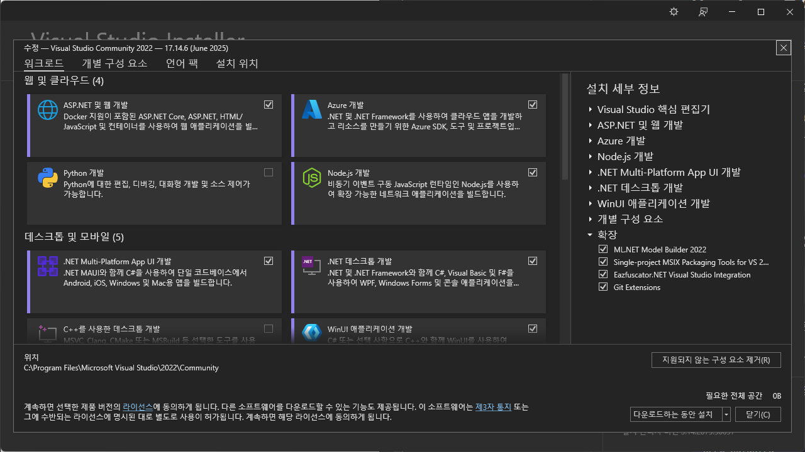

<style>
:root {
  font-family: Pretendard;
  --border-color: #303030;
  --text-color: #0a0a0a;
  --bg-color-alt: #dadada;
  --mark-background: #ffef92;
}

h1 {
  border-bottom: none;
  font-size: 1.6em;
}

h2 {
  border-bottom: none;
  font-size: 1.3em;
}

h3 {
  font-size: 1.1em;
}

h4 {
  font-size: 1.05em;
}

h5 {
  font-size: 1em;
}

h6 {
  font-size: 0.9em;
}

h1,
h2,
h3,
h4,
h5,
h6 {
  color: var(--text-color);
}

code:not([class*="language-"]) {
  font-family: D2Coding;
  color: #000;
  vertical-align: text-bottom;
  background-color: rgba(100, 100, 100, 0.2);
}

section {
  padding: 1rem;
  border-bottom: 1px solid #000;
  background-image: linear-gradient(to bottom right, #f7f7f7 0%, #d3d3d3 100%);
}

section > h2 {
  border-bottom: 4px solid #17344f;
}

section table {
    margin: auto;
    margin-top: 1rem;
    font-size: 28px;
}

section::after {
  font-size: 0.75em;
  content: attr(data-marpit-pagination) " / " attr(data-marpit-pagination-total);
}

img[alt~="center"] {
  display: block;
  margin: 0 auto;
}

blockquote {
  font-size: 26px;
  border-left: 8px solid var(--border-color);
  background: var(--bg-color-alt);
  margin: 0.5em;
  padding: 0.5em;
}

blockquote::before,
blockquote::after {
    content: '';
}

mark {
  background-color: var(--mark-background);
  padding: 0 2px 2px;
  border-radius: 4px;
  margin: 0 2px;
}

section.tinytext>p,
section.tinytext>ul,
section.tinytext>blockquote {
  font-size: 0.65em;
}

/* Long examples are paginated; keep reference text readable. */
section.reference-page { justify-content: flex-start; }
section.reference-page pre,
section.reference-page marp-pre,
section.reference-page pre code,
section.reference-page marp-pre code { font-size: 24px; line-height: 1.25; }
section.reference-page table { font-size: 25px; }
section.reference-page img { max-height: 440px; max-width: 100%; object-fit: contain; }
</style>

# 내 컴퓨터에 개발 환경 꾸미기

개발에 필요한 도구를 골라 설치하고, 버전과 소스 복원 결과를 확인합니다.


<!--
발표: 첫 화면의 목표를 말한 뒤 핵심 개념과 예제로 진행합니다. 확인 질문 뒤에는 답할 시간을 주고, 마지막 완료 기준을 남겨 질문을 받습니다.
발표 구성 참고: MIT OpenCourseWare, Patrick Winston, How to Speak (2018), https://ocw.mit.edu/courses/res-tll-005-how-to-speak-january-iap-2018/pages/how-to-speak/
-->

---

## 가장 먼저 해야 할 일!

이 자료의 설치 예제는 x64 환경을 기준으로 합니다. OS 지원 범위와 필요한 SDK·Node.js 버전은 [HandStack 개발 환경](https://handstack.kr/docs/startup/install/개발-환경-설정하기)과 선택한 배포본에서 먼저 확인합니다.

- 내 컴퓨터에 HandStack 실행에 <mark>필수적인 프로그램</mark>들을 설치합니다.
- 각 프로그램이 <mark>왜 필요한지</mark> 간단하게 알아봅니다.
- 설치가 <mark>잘 되었는지 확인</mark>하는 방법을 배웁니다.

---

## HandStack의 엔진을 설치해요

- .NET은 서버와 .NET CLI를 실행·빌드합니다.
- Node.js는 Node 함수와 프런트엔드 도구에 사용합니다.
- 배포본 실행과 소스 빌드의 요구 사항을 구분합니다.

---

## 패키지 관리자 설치

개발에 필요한 대부분의 프로그램은 공식 웹 사이트에서 다운로드 해서 설치하거나 운영체제의 패키지 매니저를 사용하여 명령으로 자동화된 설치 프로세스를 수행할 수 있습니다.

- Windows: winget
- macOS: Homebrew
- Linux: apt 또는 yum

> 패키지 관리자를 이용한 설치 과정은 기본적으로 공식 저장소에 있는 프로그램을 다운로드 하기 때문에 인터넷 연결이 필요합니다.

---

## Windows 에서 .NET Core 설치

### .NET Core는 왜 필요한가요?

- HandStack의 서버(백엔드)와 CLI(Command Line Interface)가 .NET Core 기술로 만들어졌습니다.
- 안정적이고 빠른 서버를 만드는 데 사용되는 마이크로소프트의 오픈소스 기술입니다.
- 명령 프롬프트를 실행하고 다음의 명령을 실행하여 .NET 10 을 설치

```bash
winget install --id=Microsoft.DotNet.SDK.10
```

---

## .NET Core 설치 확인하기

설치가 완료되면, 아래 명령어를 입력해 보세요.

```bash
dotnet --version
```

- 위와 같이 설치된 버전 번호가 나타나면 성공입니다.
- 예시: `10.0.xxx`

---

## Windows 에서 Node.js 설치 (1/2)

<!-- _class: reference-page -->


### Node.js는 왜 필요한가요?

- HandStack 기반 업무 기능(서버 함수)와 CLI(명령어 도구)가 Node.js 기술로 만들어졌습니다.

- 빠르고 효율적인 웹 서비스를 만들 때 널리 사용되는 기술입니다.

- 아래 명령은 기존 자료의 **Node.js 20.19.2 고정 설치 예제**입니다.

---

## Windows 에서 Node.js 설치 (2/2)

<!-- _class: reference-page -->


- 현재 권장 버전이라는 뜻은 아닙니다. 프로젝트 요구 사항과 [Node.js 공식 다운로드](https://nodejs.org/en/download)를 대조한 뒤 선택하세요.

```bash
winget install --id=OpenJS.NodeJS.LTS --version 20.19.2
```

---

## Node.js 설치 확인하기 (1/3)

<!-- _class: reference-page -->


터미널이나 명령 프롬프트에서 아래 두 명령어를 차례대로 입력합니다.

```bash
node -v
```

---

## Node.js 설치 확인하기 (2/3)

<!-- _class: reference-page -->


```bash
npm -v
```

- `node -v`는 Node.js 버전을, `npm -v`는 npm(패키지 관리자) 버전을 보여줍니다.

---

## Node.js 설치 확인하기 (3/3)

<!-- _class: reference-page -->


- 버전 번호가 보이면 성공적으로 설치된 것입니다.

---

## 참고: macOS 설치 예제

[Homebrew 공식 설치 안내](https://brew.sh/)와 CPU별 설치 경로를 먼저 확인합니다. 아래 PATH 예제는 Apple Silicon 경로입니다.

```bash
/bin/bash -c "$(curl -fsSL https://raw.githubusercontent.com/Homebrew/install/HEAD/install.sh)"
```

.NET Core, Node.js 설치

```bash
brew install --cask dotnet-sdk
brew install node@20
echo 'export PATH="/opt/homebrew/opt/node@20/bin:$PATH"' >> ~/.zprofile
source ~/.zprofile
```

---

## Linux apt-get 를 이용한 설치

배포판별 저장소 등록과 지원 버전은 [.NET Linux 설치](https://learn.microsoft.com/dotnet/core/install/linux)에서 확인합니다. 아래는 기존 Ubuntu 계열 설치 예제입니다.

```bash
# .NET 10 설치 예제
sudo apt-get update
sudo apt-get install -y dotnet-sdk-10.0
sudo apt-get install -y aspnetcore-runtime-10.0
sudo apt-get install -y dotnet-runtime-10.0

# node.js LTS 20.x
curl -fsSL https://deb.nodesource.com/setup_20.x | sudo -E bash -
sudo apt-get install -y nodejs
```

---

## `nuget`과 `npm`이 무엇인가요?

NuGet은 .NET 플랫폼, npm(Node Package Manager)은 Node.js 환경에서 사용하는 공식 패키지 관리 시스템입니다.

- 패키지 관리자란?
  - 개발에 필요한 다양한 도구(패키지, 라이브러리)들을 쉽게 설치하고 관리해주는 프로그램입니다.
  - 마치 스마트폰의 앱 스토어와 비슷한 역할을 합니다.
- `nuget` : .NET 라이브러리, C# 패키지, CLI 등
- `npm` : JavaScript 라이브러리, Node.js 모듈, CLI 등

HandStack은 이 두 가지를 모두 활용하여 개발 생산성을 높입니다.

---

## 잠깐, 구분해 보기

실행 파일만 사용하는 사람과 서버 소스를 빌드하는 사람에게 같은 도구가 필요할까요?

<!--
질문 후 잠시 기다립니다. 답이 없으면 앞에서 본 예제를 다시 가리킵니다.
확인할 답: 배포본 실행과 소스 빌드를 구분합니다. SDK·편집기·번들링 도구는 맡은 작업에 맞춰 준비합니다.
다음 주제로 넘어가기 전에 차이를 청중의 표현으로 한 번 확인합니다.
-->

---

## 개발 도구 설치하기

서버 소스 빌드·디버깅: 대상 .NET SDK를 지원하는 Visual Studio 또는 JetBrains Rider
화면·계약 편집: HandStack IDE, Visual Studio Code 또는 Notepad++

- <mark>Visual Studio 2022</mark> 설치하기
- <mark>Visual Studio Code</mark> 설치하기
- (선택) <mark>JetBrains Rider</mark> 설치하기
- (선택) <mark>Notepad++</mark> 설치하기

---

## 코딩 놀이터, Visual Studio 2022 설치 (1/2) · 세부 1/3

<!-- _class: reference-page -->


HandStack으로 만든 코드를 보고 수정하려면 디버깅, 테스트, 빌드, 성능 분석, UI 디자이너 등 다양한 개발 도구와 기능이 필요합니다.


---

## 코딩 놀이터, Visual Studio 2022 설치 (1/2) · 세부 2/3

<!-- _class: reference-page -->


대상 .NET SDK를 지원하는 Visual Studio 버전과 Community 사용 조건을 확인합니다. 아래 명령과 화면은 기존 2022 교육 환경 예시입니다. [공식 설치 안내](https://learn.microsoft.com/visualstudio/install/install-visual-studio)를 우선 확인합니다.

---

## 코딩 놀이터, Visual Studio 2022 설치 (1/2) · 세부 3/3

<!-- _class: reference-page -->


명령 프롬프트에서 다음의 명령어로 최소한의 구성요소로 Visual Studio 2022 를 설치할 수 있습니다.

```bash
winget install --id=Microsoft.VisualStudio.2022.Community
```

---

## 코딩 놀이터, Visual Studio 2022 설치 (2/2)

<!-- _class: reference-page -->


> 설치 완료 후에 필요한 구성 요소만 선택하여 설치 시간과 디스크 공간을 절약할 수 있습니다.

---

## Visual Studio 2022 설치 시 워크로드 선택 (1/2)

<!-- _class: reference-page -->


시작 메뉴 > Visual Studio Installer 실행

---

## Visual Studio 2022 설치 시 워크로드 선택 (2/2)

<!-- _class: reference-page -->




---

## Visual Studio 2022 추천 확장 프로그램 설치 (1/2)

<!-- _class: reference-page -->


Visual Studio 2022 를 실행하고 개발을 더 편하게 만들어 줄 <mark>추천 확장 프로그램</mark> 을 설치합니다. 상단 메뉴의 확장 > 확장 관리에서 아래 이름으로 검색하여 설치하세요.

- Bundler & Minifier 2022+

- Microsoft Library Manager

- Open Command Line

- Open in Visual Studio Code

---

## Visual Studio 2022 추천 확장 프로그램 설치 (2/2)

<!-- _class: reference-page -->


- Productivity Power Tools 2022

> 확장 프로그램은 Visual Studio 2022 가 종료 될 때 실행되므로, 모든 확장 프로그램을 설치 확인을 하고 프로그램을 종료하세요.

---

## 참고: 선택 도구의 일괄 설치 목록 (1/3)

<!-- _class: reference-page -->


필요한 항목만 남긴 뒤 실행합니다. 명령·버전·설치 화면의 상세 안내는 각 도구의 공식 문서를 따릅니다.

```bash
notepad winget-packages.json
winget import --import-file winget-packages.json
```

---

## 참고: 선택 도구의 일괄 설치 목록 (2/3)

<!-- _class: reference-page -->


```json
{
  "$schema": "https://aka.ms/winget-packages.schema.2.0.json",
  "Sources": [
    {
      "Packages": [
        { "PackageIdentifier": "Git.Git" },
        { "PackageIdentifier": "Notepad++.Notepad++" },
        { "PackageIdentifier": "TortoiseGit.TortoiseGit" },
        { "PackageIdentifier": "OpenJS.NodeJS.LTS" },
        { "PackageIdentifier": "Microsoft.DotNet.SDK.10" },
        { "PackageIdentifier": "WinSCP.WinSCP" },
        { "PackageIdentifier": "Microsoft.VisualStudioCode" },
        { "PackageIdentifier": "Microsoft.WindowsTerminal" }
      ]
```

<!-- 이어지는 코드 조각입니다. 앞뒤 페이지를 순서대로 읽으며 전체 예제의 일부임을 설명합니다. -->

---

## 참고: 선택 도구의 일괄 설치 목록 (3/3)

<!-- _class: reference-page -->


```json
    },
    {
      "Packages": [
        { "PackageIdentifier": "9NRWMJP3717K" }
      ]
    }
  ]
}
```

<!-- 이어지는 코드 조각입니다. 앞뒤 페이지를 순서대로 읽으며 전체 예제의 일부임을 설명합니다. -->

---

## 범용 개발 경험을 제공하는 Visual Studio Code 설치

가벼운 텍스트 에디터에서 강력한 IDE 로 발전하는 Visual Studio Code 는 다양한 언어와 확장 프로그램을 지원합니다.

- Windows 환경이면 명령 프롬프트에서 실행하세요.
  ```bash
  winget install --id=Microsoft.VisualStudioCode
  ```
- macOS, Linux 에서는 다음의 공식 경로에서 설치 프로그램을 다운로드 후 실행하세요 https://code.visualstudio.com/download

---

## 동일한 개발 경험을 제공하는 JetBrains Rider 설치 (1/3)

<!-- _class: reference-page -->


JetBrains 에서 개발하고 있는 운영체제에 상관 없이 동일한 .NET 개발 경험을 제공하는 강력한 IDE 입니다.

- Windows 환경이면 명령 프롬프트에서 실행하세요.

---

## 동일한 개발 경험을 제공하는 JetBrains Rider 설치 (2/3)

<!-- _class: reference-page -->


```bash
winget install --id=JetBrains.Rider
```

- macOS, Linux 에서는 다음의 공식 경로에서 설치 프로그램을 다운로드 후 실행하세요 https://www.jetbrains.com/rider

---

## 동일한 개발 경험을 제공하는 JetBrains Rider 설치 (3/3)

<!-- _class: reference-page -->


> 원격 디버깅은 대상 OS·런타임·권한 조건에서 직접 확인합니다.

---

## CLI 도구 설치하기 (LibMan) (1/3)

<!-- _class: reference-page -->


LibMan는 .NET Core 기반의 CLI 도구로 가벼운 클라이언트 라이브러리 획득 도구입니다.

이 도구는 파일 시스템 또는 CDN (CDNJS, jsDelivr 및 unpkg)에서 인기 있는 라이브러리 및 프레임워크를 다운로드합니다.

---

## CLI 도구 설치하기 (LibMan) (2/3)

<!-- _class: reference-page -->


### 터미널 또는 명령 프롬프트로 설치하기

```bash
dotnet tool install -g Microsoft.Web.LibraryManager.Cli
```

---

## CLI 도구 설치하기 (LibMan) (3/3)

<!-- _class: reference-page -->


> HandStack 에서 사용중인 클라이언트 라이브러리 목록 `$(HANDSTACK_SRC)/2.Modules/wwwroot/libman.json`

---

## CLI 도구 설치하기 (pm2)

PM2는 Node.js 애플리케이션을 위한 프로세스 매니저로, .NET Core 앱도 사용 가능합니다.

> 개발 환경에서 빌드 > 재시작 과정을 자동화 합니다.

### 터미널 또는 명령 프롬프트로 설치하기

```bash
# Windows 에서 실행
npm install -g pm2

# macOS, Ubuntu 에서 실행
sudo npm install -g pm2
```

---

## CLI 도구 설치하기 (gulp)

Gulp는 Node.js 기반의 Task 업무 및 번들링 자동화 도구로, 반복적인 작업들을 위해 개발된 도구입니다.

> 개발 환경에서 빌드 > 재시작 과정을 자동화 합니다.

### 터미널 또는 명령 프롬프트로 설치하기

```bash
# Windows 에서 실행
npm install -g gulp-cli

# macOS, Ubuntu 에서 실행
sudo npm install -g gulp-cli
```

---

## CLI 도구 설치하기 (git) (1/2)

<!-- _class: reference-page -->


- Windows 에서 Git 설치

```bash
winget install --id=Git.Git
```

- macOS 에서 Git 설치

---

## CLI 도구 설치하기 (git) (2/2)

<!-- _class: reference-page -->


```bash
brew install git
```

- Linux 에서 Git 설치

```bash
sudo apt install -y git
```

---

## 개발 환경 설정하기

GitHub에서 HandStack 소스 코드를 clone 하여 내려 받은 소스를 컴파일 및 번들링 하기 위해 개발 환경을 구성합니다. 구성 내용은 운영체제에 따라 HandStack 소스 코드를 다음의 경로에 배치 했을 경우 방법을 설명합니다.

- Windows 예시: `C:/projects/handstack77/handstack`
- Linux: `/home/[사용자 ID]/projects/handstack77/handstack`
- macOS: `/Users/[사용자 ID]/projects/handstack77/handstack`

---

## GitHub 프로젝트를 CLI 명령어로 복제

- Windows 운영체제에서 실행하기

```bash
mkdir C:/projects
cd C:/projects
git clone https://github.com/handstack77/handstack handstack77/handstack
```

- macOS, Linux 운영체제에서 실행하기

```bash
mkdir ~/projects
cd projects
git clone https://github.com/handstack77/handstack handstack77/handstack
```

---

## 프로젝트 빌드 및 종속성 및 도구를 복원

- Windows 운영체제에서 실행하기

```bash
cd [HandStack 소스 기본경로]
install.bat
```

- macOS, Linux 운영체제에서 실행하기

```bash
cd [HandStack 소스 기본경로]
tr -d '\r' < install.sh > install_fixed.sh && mv install_fixed.sh install.sh
chmod +x install.sh
sudo ./install.sh
```

---

## 이제 HandStack 프로젝트를 만들 준비가 되었습니다!

- `.NET Core` 설치 및 `dotnet --version`으로 확인
- `Node.js` 설치 및 `node -v`, `npm -v`로 확인
- 개발 도구 설치
- CLI 도구 설치
- HandStack 소스 내려받기 및 빌드 환경 설정

---

## 설치 완료의 기준

- dotnet, node, npm의 버전을 기록합니다.
- 편집기와 필요한 CLI를 선택하고 소스 복원 결과를 확인합니다.
- 빌드 전 HANDSTACK_SRC와 HANDSTACK_HOME의 대상을 구분합니다.

<!--
질문을 받는 동안 이 확인 기준을 화면에 남깁니다. 청중이 자신의 업무에 적용할 다음 행동 하나를 고르게 합니다.
-->
