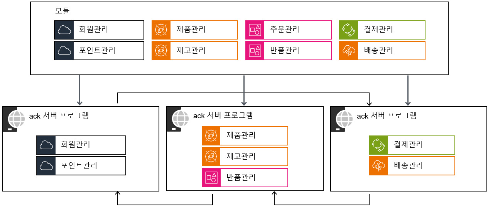
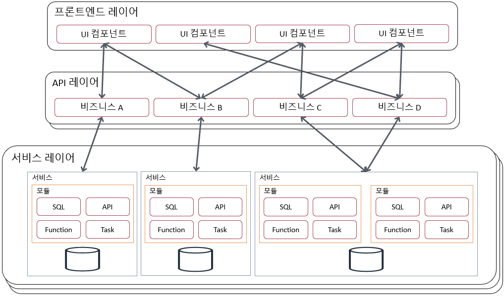

# HandStack 프로젝트 큰 그림 그리기

### 주요 디렉토리 역할을 이해하고, 전체적인 구조를 파악

---

## 잘 정리된 사무실 같은 HandStack

HandStack 프로젝트는 마치 잘 정리된 사무실과 같습니다. 각 디렉토리가 명확한 역할을 가지고 있어 전체 구조를 이해하기 쉽습니다. 예를 들어 다음과 같이 설명할 수 있습니다

- 1.WebHost: 회사의 정문과 안내 데스크 역할
- 2.Modules: 각 업무를 담당하는 전문 부서들
- 3.Infrastructure: 모든 부서가 공유하는 핵심 인프라
- 4.Tool: 업무 효율성을 높이는 각종 도구함
- Solution Items: 전사 공통 규정 및 정책 문서

---

## `1.WebHost`: 프로젝트의 시작점

- 서버 실행의 진입점(Entry Point) 역할을 하는 웹 호스트 프로젝트가 있습니다.
- 웹 애플리케이션의 환경 설정, 시작, 업무 모듈 서빙을 모두 이곳에서 담당합니다.
  - 비유하자면, 건물의 정문이자 모든 방문객을 맞는 안내 데스크와 같습니다.
- ack 서버와 forbes 개발 템플릿이 있습니다.

---

## `2.Modules`: 핵심 비즈니스 로직

- 도메인 기반의 실제 업무 기능(모듈)들이 모여있는 곳입니다.
- 각 모듈은 독립적으로 `Application`, `Domain`, `Persistence`, `API` 계층을 가질 수 있습니다.
- 예시: 게시판 관리, 사용자 관리, 주문 처리 등
- 비유하자면, 회계팀, 인사팀, 개발팀처럼 각자의 역할을 가진 ‘업무 부서’에 해당합니다.
- 하나의 배포 단위 내에서 기능별로 모듈을 분리하는 모듈러 모놀리식 아키텍처의 핵심입니다.

---

## `3.Infrastructure`: 공통 기반 시설

- 서버 프로그램 기능을 위한 공통 인프라스트럭처 레이어입니다.
- 데이터베이스 연결, 로깅, 인증 처리처럼 여러 모듈이 공유하는 시스템 자원이나 구현체를 제공합니다.
- 비유하자면, 모든 부서가 함께 사용하는 ‘회의실’이나 ‘서버실’과 같은 공용 시설입니다.
- HandStack 개발과 운영에 필요한 공통 API 집합입니다.

> <mark>syn.js</mark> 라이브러리는 `ack` 프로젝트에 포함됩니다.
> <mark>syn.uicontrols.js</mark> 라이브러리를 `wwwroot` 모듈에 포함됩니다.

---

## `4.Tool`: 개발 보조 도구

- 프로젝트 개발 및 배포, 유지보수를 위한 보조 도구와 유틸리티를 모아놓은 곳입니다.
- CLI 도구, 데이터베이스 마이그레이션 스크립트 등이 포함될 수 있습니다.
- 비유하자면, 업무 효율을 높여주는 ‘사무용품’ 또는 ‘공구함’과 같습니다.
- 모든 기능은 자동화와 시스템 통합을 위해 CLI 를 우선하여 개발합니다.
  - Node.js, .NET Core, Python 기반의 CLI 는 API 함수로 만드는 비용이 적습니다.
---

## `Solution Items`: 솔루션 공용 파일

- Visual Studio 솔루션 레벨에서 사용하는 공용 파일들을 모아놓은 논리적 디렉토리입니다.
- `.gitignore`나 `Dockerfile`, `install, publish 스크립트` 같이 솔루션 전체에 적용되는 파일들이 위치합니다.
- 비유하자면, 모든 부서원이 반드시 참고해야 하는 ‘회사 공통 규정집’입니다.

---

## 직접 확인해보기

이제 Visual Studio에서 프로젝트를 직접 열어 구조를 살펴봅시다.

1. Visual Studio 2022 Community를 실행합니다.
2. `$(HANDSTACK_SRC)/handstack.sln` 파일을 엽니다.
3. 솔루션 탐색기에서 오늘 배운 디렉토리들을 찾아보세요.
4. 각 디렉토리의 역할과 설명을 마음속으로 매칭시켜 봅니다.

---

## 다시 보는 디렉토리 역할 정리하기

| 디렉토리           | 역할 (비유)                       |
| ------------------ | --------------------------------- |
| `1.WebHost`        | 프로젝트 시작점 (안내 데스크)     |
| `2.Modules`        | 핵심 업무 기능 (업무 부서)        |
| `3.Infrastructure` | 공통 기반 시설 (공용 시설)        |
| `4.Tool`           | 개발 보조 도구 (공구함)           |
| `Solution Items`   | 솔루션 공용 파일 (회사 규정집)    |

---

## 업무의 핵심 `모듈` 라이브러리

- HandStack의 백엔드는 <mark>모듈러 모놀리식 아키텍처</mark>를 기반으로 합니다.
- 각 `모듈`은 독립적으로 개발하고 배포할 수 있는 작은 애플리케이션과 같습니다.
- 모듈들이 모여 하나의 큰 애플리케이션(ack 서버)을 구성합니다.
- 이 `모듈`의 서버 측 구성 요소들을 살펴보겠습니다.

---

## 아키텍처 간단 비교

HandStack은 모놀리식의 단순함과 마이크로서비스의 장점을 결합한 <mark>모듈러 모놀리식</mark>을 채택하여 개발 생산성과 유지보수성을 높였습니다.

> HandStack 아키텍처에 대한 자세한 내용은 [모듈러 모놀리식 아키텍처](https://handstack.kr/docs/reference/concept/모듈러-모놀리식-아키텍처)을 참고하세요.

| 아키텍처 | 장점 | 단점 |
| :--- | :--- | :--- |
| 모놀리식 | 개발 초기 단순함 | 유연성 부족, 배포 어려움 |
| 마이크로서비스 | 높은 유연성, 확장성 | 복잡성 증가, 관리 비용 |
| 모듈러 모놀리식 | 균형 잡힌 접근 | 초기 설계 중요성 증가 |

---

## 여러 개의 독립된 모듈로 구분된 애플리케이션

- 모듈러 모놀리식은 애플리케이션의 도메인을 더 작고 관리하기 쉬운 컴포넌트 또는 모듈로 나누는 아키텍처 접근법 입니다.
- 코드베이스를 논리적이고 구조적인 디렉토리로 구성해서, 시스템 기능 간의 관심사를 분리하고 경계를 명확하게 합니다.

---

## 애플리케이션 아키텍처 예시

- 단일 호스트
  - ack + (wwwroot/transact/dbclient/function/repository)
- 2 개 호스트
  - ack + (wwwroot/transact)
  - ack + (dbclient/function/repository)
- 3 개 호스트
  - ack + (wwwroot/transact)
  - ack + (transact)
  - ack + (dbclient/function/repository)

---

## 모듈 프로젝트의 SDK 개념

최신 .NET 프로젝트는 프로젝트 SDK(소프트웨어 개발 키트)와 연결됩니다. [.NET 프로젝트 SDK 확인하기](https://learn.microsoft.com/ko-kr/dotnet/core/project-sdk/overview)

- HandStack module은 `ASP.NET Core의 모든 기능을 사용 가능한` 모듈 프로젝트로 개발됩니다.
- .NET Core 프로젝트의 주요 속성을 다음과 같습니다.
  - 프로그램: Project Sdk="Microsoft.NET.Sdk.Web"
  - 모듈: Project Sdk="Microsoft.NET.Sdk.Razor"
  - 라이브러리: Project Sdk="Microsoft.NET.Sdk"

---

## 애플리케이션을 위해 필요한 주요 기능

비즈니스 요구사항에 맞게 기능을 개발 하기 위해 다음의 기능들을 하나 또는 각각의 module 단위로 개발 할 수 있습니다.

- Database CRUD 거래
- 외부 시스템과 연동을 위한 기능 개발
- 클라이언트 인증 및 권한
- 파일 업로드/다운로드 기능
- 화면 개발에 필요한 UI 컴포넌트

> 이외에도 모니터링, 장애 확인등등 안정적인 운영을 위해 다양한 부가 기능들을 고려해야 합니다.

---

## 공식 modules

HandStack은 이러한 애플리케이션을 개발하기 위한 부분을 논리적으로 추상화하여 module로 개발 및 제공합니다.

|module명|설명|
|---|---|
|checkup|태넌트 앱 개발 및 운영 기능 관리|
|dbclient|SQL Server, Oracle, MySQL & MariaDB, PostgreSQL, SQLite SQL을 관리|
|function|C# 또는 Node.js 기반 Function 개발 기능 관리|
|repository|단일, 다중, 이미지, 첨부파일 등등 파일 업로드/다운로드 관리|
|transact|거래 요청 검증 및 접근 제어 관리와 요청 정보를 dbclient, function 등등 module로 라우팅 기능 관리|
|logger|module 요청/응답 구간 주요 이벤트 로그 수집 관리|
|wwwroot|웹 공통 static assets 및 화면 단위 소스 호스팅 관리|
|openapi|데이터베이스 데이터를 Open API로 제공 하기 위한 기능 관리|

---

## 규모에 따른 어플리케이션 모듈 구성

느슨하게 결합된 모듈을 만들 수 있고, 인터페이스를 일관되게 유지 할 수 있으며, 향후 마이크로서비스 아키텍처로 전환 할 경우에도 유리하게 작용될 수 있습니다.

---

## 요약 정리 및 Q&A

- 모듈은 완전히 독립적이지 않습니다. 
- 다른 모듈과의 종속성은 프로그램 수준에서 관리되어야 합니다.
- 모듈 코드를 재사용할 수 있습니다.
- 기존의 모놀리식보다 유지 관리하고 개발하기가 쉽습니다.
- 배포를 위해 전체 프로젝트를 단일 단위로 유지할 수 있습니다.
- 기존의 모놀리식보다 확장성이 뛰어납니다.
- 마이크로서비스 아키텍처보다 덜 복잡합니다.