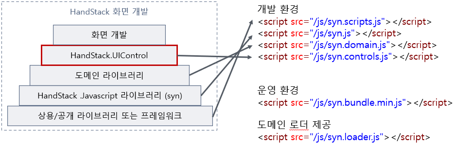

<style>
:root {
  font-family: Pretendard;
  --border-color: #303030;
  --text-color: #0a0a0a;
  --bg-color-alt: #dadada;
  --mark-background: #ffef92;
}

h1 {
  border-bottom: none;
  font-size: 1.6em;
}

h2 {
  border-bottom: none;
  font-size: 1.3em;
}

h3 {
  font-size: 1.1em;
}

h4 {
  font-size: 1.05em;
}

h5 {
  font-size: 1em;
}

h6 {
  font-size: 0.9em;
}

h1,
h2,
h3,
h4,
h5,
h6 {
  color: var(--text-color);
}

code:not([class*="language-"]) {
  font-family: D2Coding;
  color: #000;
  vertical-align: text-bottom;
  background-color: rgba(100, 100, 100, 0.2);
}

section {
  padding: 1rem;
  border-bottom: 1px solid #000;
  background-image: linear-gradient(to bottom right, #f7f7f7 0%, #d3d3d3 100%);
}

section > h2 {
  border-bottom: 4px solid #17344f;
}

section table {
    margin: auto;
    margin-top: 1rem;
    font-size: 28px;
}

section::after {
  font-size: 0.75em;
  content: attr(data-marpit-pagination) " / " attr(data-marpit-pagination-total);
}

img[alt~="center"] {
  display: block;
  margin: 0 auto;
}

blockquote {
  font-size: 26px;
  border-left: 8px solid var(--border-color);
  background: var(--bg-color-alt);
  margin: 0.5em;
  padding: 0.5em;
}

blockquote::before,
blockquote::after {
    content: '';
}

mark {
  background-color: var(--mark-background);
  padding: 0 2px 2px;
  border-radius: 4px;
  margin: 0 2px;
}

section.tinytext>p,
section.tinytext>ul,
section.tinytext>blockquote {
  font-size: 0.65em;
}

/* Long examples are paginated; keep reference text readable. */
section.reference-page { justify-content: flex-start; }
section.reference-page pre,
section.reference-page marp-pre,
section.reference-page pre code,
section.reference-page marp-pre code { font-size: 24px; line-height: 1.25; }
section.reference-page table { font-size: 25px; }
section.reference-page img { max-height: 440px; max-width: 100%; object-fit: contain; }
</style>

# 화면의 공통 UI/UX 제공을 위한 공통 컨트롤

화면의 입력·조회·편집 요구에 맞는 UI 컨트롤을 고르고 샘플로 검증합니다.

상용 제품 및 오픈소스 기반 UI 라이브러리 살펴보기


<!--
발표: 첫 화면의 목표를 말한 뒤 핵심 개념과 예제로 진행합니다. 확인 질문 뒤에는 답할 시간을 주고, 마지막 완료 기준을 남겨 질문을 받습니다.
발표 구성 참고: MIT OpenCourseWare, Patrick Winston, How to Speak (2018), https://ocw.mit.edu/courses/res-tll-005-how-to-speak-january-iap-2018/pages/how-to-speak/
-->

---

## 일관된 사용자 경험의 중요성

- 같은 입력·선택·표시 규칙을 여러 화면에서 재사용합니다.
- 컨트롤 이름보다 업무 요구와 데이터 구조를 먼저 확인합니다.

> 목록은 선택용 색인입니다. 실습에서는 컨트롤 하나의 옵션·이벤트·반환값을 확인합니다.

---

## 기본 공통 컨트롤 (1/3) · 세부 1/2

<!-- _class: reference-page -->


| 약어 | 컴포넌트명 | 설명 |
| :--- | :--- | :--- |
| `$checkbox` | CheckBox | 브라우저마다 다른 체크박스를 일관되게 표현합니다. |
| `$codepicker` | CodePicker | 코드도움 팝업 기능을 제공합니다. |
| `$colorpicker`| ColorPicker | 색상 팔레트를 제공합니다. |
| `$contextmenu`| ContextMenu | 오른쪽 마우스 버튼 컨텍스트 메뉴를 제공합니다. |
| `$data` | DataSource | 단일/여러 건의 데이터 소스 객체 기능을 제공합니다. |
| `$datepicker` | DatePicker | 날짜 선택 기능을 제공합니다. |
| `$dateperiodpicker` | DatePeriodPicker | 시작 및 종료 기간 날짜 선택 기능을 제공합니다. |

---

## 기본 공통 컨트롤 (1/3) · 세부 2/2

<!-- _class: reference-page -->


| 약어 | 컴포넌트명 | 설명 |
| :--- | :--- | :--- |
| `$select` | DropDownList | 단일 항목 선택 콤보박스를 제공합니다. |

---

## 기본 공통 컨트롤 (2/3) · 세부 1/2

<!-- _class: reference-page -->


| 약어 | 컴포넌트명 | 설명 |
| :--- | :--- | :--- |
| `$multiselect`| DropDownCheckList | 여러 항목 선택 콤보박스를 제공합니다. |
| `$element` | Element | HTML 항목의 `getValue`, `setValue` 기능을 제공합니다. |
| `$fileclient`| FileClient | 파일 업로드/다운로드 기능을 제공합니다. |
| `$list` | GridList | 데이터 조회에 특화된 기능을 제공합니다. |
| `$guide` | Guide | 화면 내 표시되는 도움말 기능을 제공합니다. |
| `$htmleditor`| HtmlEditor | 파일 업로드/다운로드 통합 HTML 편집기를 제공합니다. |
| `$organization`| OrganizationView | 조직도 데이터를 직관적으로 편집하는 기능을 제공합니다. |

---

## 기본 공통 컨트롤 (2/3) · 세부 2/2

<!-- _class: reference-page -->


| 약어 | 컴포넌트명 | 설명 |
| :--- | :--- | :--- |
| `$radio` | RadioButton | 브라우저마다 다른 라디오버튼을 일관되게 표현합니다. |
| `$sourceeditor`| SourceEditor | 소스 편집에 특화된 에디터 기능을 제공합니다. |

---

## 기본 공통 컨트롤 (3/3)

| 약어 | 컴포넌트명 | 설명 |
| :--- | :--- | :--- |
| `$textarea` | TextArea | 여러 텍스트 줄 관리 기능을 제공합니다. |
| `$textbox` | TextBox | 단일 텍스트 관리 기능을 제공합니다. |
| `$button` | Button | 버튼 관리 추가 기능을 제공합니다. |
| `$tree` | TreeView | 트리 구조를 표현하는 기능을 제공합니다. |
| `$grid` | WebGrid | 대량 편집 그리드 기능을 제공합니다. (Handsontable 라이선스) |
| `$auigrid` | AUIGrid | 대량 편집 그리드 기능을 제공합니다. (AUISoft 라이선스) |

> WebGrid·AUIGrid는 적용 버전과 사용 목적에 맞는 라이선스를 확인합니다.

---

## 소스 위치와 번들링

- HandStack의 UI 컨트롤 라이브러리는 직접 수정하고 확장할 수 있습니다.

- 소스 코드 위치
  - `$(HANDSTACK_SRC)/2.Modules/wwwroot/wwwroot/uicontrols`

- 번들링
  - 개별 JavaScript 파일로 구성된 컨트롤들은 빌드 시 `syn.controls.js` 파일 하나로 통합(Bundle)되어 서비스 성능을 최적화합니다.

---

## 업무 화면에 필요한 공통 기능 제공 (1/2)

<!-- _class: reference-page -->


<style scoped>
  img { width: 80%; display: inline; margin-left:120px; }
</style>

HandStack 기반 에서는 비즈니스 앱 화면 개발에 필요한 다음과 같은 UI 컴포넌트을 **wwwroot 모듈**에서 제공합니다.

환경설정에서 사용할 컨트롤을 정하고 syn.loader.js로 로드합니다. 속성·메서드·이벤트는 해당 컨트롤의 예제를 확인합니다.

---

## 업무 화면에 필요한 공통 기능 제공 (2/2)

<!-- _class: reference-page -->


<style scoped>
  img { width: 80%; display: inline; margin-left:120px; }
</style>



---

## CheckBox

브라우저마다 다르게 표시되는 체크박스를 일관되게 표현합니다.

### 다운로드: https://github.com/hunzaboy/CSS-Checkbox-Library
### 공식예제: https://hunzaboy.github.io/CSS-Checkbox-Library/
```html
<div class="ckbx-square-1">
  <input type="checkbox" checked id="ckbx-square-1-2" value="0" name="ckbx-square-1">
  <label for="ckbx-square-1-2"></label>
</div>
```

---

## CodePicker

코드도움 팝업 기능을 제공합니다.

### 사용법
```html
<syn_codepicker id="chpSubjectID" syn-datafield="SubjectID"
syn-options="{belongID: 'LD01',
  dataSourceID: 'CHP005',
  local: false,
  isMultiSelect: false,
  textBelongID: ['LD01', 'MD01'],
  textDataFieldID: 'CodeText'}">
</syn_codepicker>
```

---

## ColorPicker

색상 팔레트를 제공합니다.

### 다운로드: https://github.com/taufik-nurrohman/color-picker
### 공식예제: https://taufik-nurrohman.js.org/color-picker/

```html
<syn_colorpicker id="dtpColorPicker" syn-datafield="ColorPicker">

</syn_colorpicker>
```

---

## ContextMenu

오른쪽 마우스 버튼 기능을 활용하여 컨텍스트 메뉴를 제공합니다.

### 다운로드: https://github.com/mar10/jquery-ui-contextmenu
### 공식예제: https://wwwendt.de/tech/demo/jquery-contextmenu/demo/


```html
<syn_contextmenu id="ctxButtonControl" syn-options="{
    target: 'div',
    delegate: 'input[type=button]'
}" syn-events="['close', 'beforeOpen', 'open', 'select']">
</syn_contextmenu>
```

---

## DataSource (1/3)

<!-- _class: reference-page -->


단일 또는 여러 데이터 건의 데이터 소스 객체 기능을 제공합니다.

### 사용법

---

## DataSource (2/3)

<!-- _class: reference-page -->


```html
<syn_data id="srcForm1" syn-options="{
    dataSourceID: 'StoreForm',
    storeType: 'Form',
	columns: [
        { data: 'ApplicationID', dataType: 'string', belongID: 'LD01' },
        { data: 'CodeGroupID', dataType: 'string', belongID: ['LD01', 'MD01'] },
        { data: 'CodeType', dataType: 'string', belongID: ['LD02', 'MD01'] },
        { data: 'CodeGroupName', dataType: 'string', belongID: ['LD02', 'MD01'] },
        { data: 'Description.', dataType: 'string', belongID: ['LD02', 'MD01'] },
        { data: 'Custom1 date', dataType: 'string', belongID: ['LD02', 'MD01'] },
        { data: 'UseYN', dataType: 'string', belongID: ['LD02', 'MD01'] },
        { data: 'CreatePersonID', dataType: 'string', belongID: ['LD02', 'MD01'] },
        { data: 'CreateDateTime', dataType: 'string', belongID: ['LD02', 'MD01'] }
    ]
```

<!-- 이어지는 코드 조각입니다. 앞뒤 페이지를 순서대로 읽으며 전체 예제의 일부임을 설명합니다. -->

---

## DataSource (3/3)

<!-- _class: reference-page -->


```html
}"></syn_data>
```

<!-- 이어지는 코드 조각입니다. 앞뒤 페이지를 순서대로 읽으며 전체 예제의 일부임을 설명합니다. -->

---

## DatePicker, DatePeriodPicker (1/2)

<!-- _class: reference-page -->


날짜, 기간 선택 기능을 제공합니다.

### 다운로드: https://github.com/Pikaday/Pikaday, https://github.com/moment/moment
### 공식예제: https://pikaday.com/

---

## DatePicker, DatePeriodPicker (2/2)

<!-- _class: reference-page -->


```html
<syn_datepicker id="dtpDatePicker" syn-options="{format: 'YYYY-MM-DD'}"></syn_datepicker>
<syn_datepicker id="dtpStartDatePicker" syn-options="{format: 'YYYY-MM-DD',
useRangeSelect: true,
rangeEndControlID: 'dtpEndDatePicker'}">
</syn_datepicker>
<syn_dateperiodpicker id="dtpInputRangeAt" syn-datafield="InputRangeAt" syn-options="{value: 'day:-7',
belongID: ['LD01']}">
</syn_dateperiodpicker>
```

---

## DropDownCheckList, DropDownList (1/2)

<!-- _class: reference-page -->


여러 개의 항목을 선택 할 수 있는 콤보박스를 제공합니다.

### 다운로드: https://github.com/wolffe/tail.select.js
### 공식예제: https://getbutterfly.com/tail-select

---

## DropDownCheckList, DropDownList (2/2)

<!-- _class: reference-page -->


```html
<select id="ddlFileExtension" syn-options="{dataSourceID: 'CH000',
parameters: '@GROUPCODE:MS001;',
local: false,
toSynControl: true,
required: false}"></select>
<select id="ddlBusinessRank" syn-options="{dataSourceID: 'CH000',
parameters: '@GROUPCODE:MS002;',
local: false,
toSynControl: true,
required: false}" multiple></select>
```

---

## FileClient

파일 업로드/다운로드 기능을 제공합니다.

```html
<syn_fileclient id="txtProfile1FileID" syn-datafield="Profile1FileID" syn-options="{
    repositoryID: 'LFSLP01'
}"></syn_fileclient>
```

---

## HtmlEditor

파일 업로드/다운로드 기능이 통합된 HTML 편집기 기능을 제공합니다.

### 다운로드: https://github.com/tinymce/tinymce, https://www.tiny.cloud/docs/release-notes/release-notes56/
### 공식예제: https://www.tiny.cloud/docs/demo/

```html
<syn_htmleditor id="txtHtmlEditor" syn-datafield="HtmlEditor" style="width:100%; height: 320px;" syn-options="{
    repositoryID: 'LFSLE01'
}">
```

---

## RadioButton

브라우저마다 다르게 표시되는 라디오버튼을 일관되게 표현합니다.

```html
<input id="rdoUseYN1" name="rdoUseYN" type="radio"
syn-datafield="RadioUseYN" value="value 1" syn-options="{textContent: '사용',
toSynControl: true}">
<input id="rdoUseYN2" name="rdoUseYN" type="radio"
syn-datafield="RadioUseYN" value="value 2" syn-options="{textContent: '미사용',
toSynControl: true}">
<input id="rdoUseYN3" name="rdoUseYN" type="radio"
syn-datafield="RadioUseYN" value="value 3" checked="checked" syn-options="{textContent: '알수없음',
toSynControl: true}">
```

---

## SourceEditor

소스 편집기에 특화된 에디터 기능을 제공합니다.

### 다운로드: https://github.com/microsoft/monaco-editor
### 공식예제: https://microsoft.github.io/monaco-editor/

```html
<syn_sourceeditor id="txtEditor1" syn-datafield="Editor1"
syn-options="{contents: 'hello world',
language:'javascript',
minimap: {enabled: true}}">
</syn_sourceeditor>
```

---

## TextArea (1/2)

<!-- _class: reference-page -->


여러 텍스트 줄을 관리하기 위한 추가 기능을 제공합니다.

### 다운로드: https://github.com/codemirror/codemirror5
### 공식예제: https://codemirror.net/5/

---

## TextArea (2/2)

<!-- _class: reference-page -->


```html
<textarea id="txtTextArea" syn-datafield="TextArea" syn-options="{width: '800px'}">
using System;

namespace Example
{
    public class Employee : Person
    {
    }
}
</textarea>
```

---

## TextBox (1/3)

<!-- _class: reference-page -->


단일 텍스트를 관리하기 위한 추가 기능을 제공합니다.

### 다운로드: https://github.com/uNmAnNeR/ispinjs, https://github.com/chinchang/superplaceholder.js, https://github.com/vanilla-masker/vanilla-masker
### 공식예제: https://unmanner.github.io/ispinjs/, https://vanilla-masker.github.io/vanilla-masker/

---

## TextBox (2/3)

<!-- _class: reference-page -->


```html
txtApplicationID - <input id="txtApplicationID" type="text" syn-options="{editType: 'numeric', formatNumber: false, dataType: 'int'}" value="0">
txtSpinnerID - <input id="txtSpinnerID" type="text" syn-options="{editType: 'spinner', dataType: 'int', minCount: -10, maxCount: 10}" value="0">
txtCreateDate - <input id="txtCreateDate" type="text" syn-options="{editType: 'date'}">
txtHour - <input id="txtHour" type="text" syn-options="{editType: 'hour'}">
txtMinute - <input id="txtMinute" type="text" syn-options="{editType: 'minute'}">
txtYearMonth - <input id="txtYearMonth" type="text" syn-options="{editType: 'yearmonth'}">
txtHomePhone - <input id="txtHomePhone" type="text" syn-options="{editType: 'homephone'}">
txtMobilePhone - <input id="txtMobilePhone" type="text" syn-options="{editType: 'mobilephone'}">
txtEmail - <input id="txtEmail" type="text" syn-options="{editType: 'email'}">
txtCodeGroupID - <input id="txtCodeGroupID" type="text" syn-options="{editType: 'text'}">
txtJuminID - <input id="txtJuminID" type="text" syn-options="{editType: 'juminno'}">
```

<!-- 이어지는 코드 조각입니다. 앞뒤 페이지를 순서대로 읽으며 전체 예제의 일부임을 설명합니다. -->

---

## TextBox (3/3)

<!-- _class: reference-page -->


```html
txtBusinessID - <input id="txtBusinessID" type="text" syn-options="{editType: 'businessno'}">
txtCustomFormat - <input id="txtCustomFormat" type="text" syn-options="{editType: 'text', maskPattern: '(99) SSSS-AAAA'}">
txtMaxLength - <input id="txtMaxLength" maxlengthB="10" type="text" syn-options="{editType: 'text'}">
```

<!-- 이어지는 코드 조각입니다. 앞뒤 페이지를 순서대로 읽으며 전체 예제의 일부임을 설명합니다. -->

---

## WebGrid (유료 라이선스 필요) (1/4)

<!-- _class: reference-page -->


대량 편집에 가능한 그리드 컴포넌트 기능을 제공합니다.

### 다운로드: https://github.com/handsontable/handsontable
### 공식예제: https://handsontable.com/demo

---

## WebGrid (유료 라이선스 필요) (2/4)

<!-- _class: reference-page -->


```html
<syn_grid id="grdGrid" syn-options="{autoColumnSize: true,
    columns: [
        ['PersonID', '사용자ID', 200, false, 'button', false, 'center', null, null, {placeholder: '빈 값', sorting: true, clearBorder: true, color: 'red', bold: true, toCurrency: true}],
        ['UserName', '사용자', 200, false, 'safehtml', false, 'left'],
        ['MaritalStatus', '혼인여부', 200, false, {
            columnType: 'checkbox2',
            isSelectAll: true
        }, false, 'center'],
        ['ReligionYN', '종교여부', 200, false, {
            columnType: 'radio'
        }, false, 'center'],
        ['SUBJECTID', '학과코드ID', 140, true, 'text', false, 'left','M01'],
        ['SUBJECTNAME', '학과명', 160, false, {
```

<!-- 이어지는 코드 조각입니다. 앞뒤 페이지를 순서대로 읽으며 전체 예제의 일부임을 설명합니다. -->

---

## WebGrid (유료 라이선스 필요) (3/4)

<!-- _class: reference-page -->


```html
            columnType: 'codehelp',
            dataSourceID: 'CH005',
            local: false,
            codeColumnID: 'SUBJECTID'
        }, false, 'left','M01'],
        ['GenderType', '성별ID', 200, false, 'text', false, 'left'],
        ['GenderTypeName', '성별', 200, false, 'text', false, 'left'],
        ['CreateDateTime', '입력일자', 200, false, 'date', false, 'left']
    ],
    keyLockedColumns: ['PersonID', 'UserName'],
    isContainFilterHeader: true,
    dropdownMenu: true,
    autoInsertRow: true,
    controlText: '데모예제',
```

<!-- 이어지는 코드 조각입니다. 앞뒤 페이지를 순서대로 읽으며 전체 예제의 일부임을 설명합니다. -->

---

## WebGrid (유료 라이선스 필요) (4/4)

<!-- _class: reference-page -->


```html
    importFileColumns: 'all',
}" syn-events="['afterSelectionEnd', 'beforeKeyDown', 'afterCreateRow']"></syn_grid>
```

<!-- 이어지는 코드 조각입니다. 앞뒤 페이지를 순서대로 읽으며 전체 예제의 일부임을 설명합니다. -->

---

## AUIGrid (유료 라이선스 필요) (1/3)

<!-- _class: reference-page -->


대량 편집에 가능한 그리드 컴포넌트 기능을 제공합니다.

### 다운로드: https://www.auisoft.net
### 공식예제: https://www.auisoft.net/documentation/auigrid/index.html, https://www.auisoft.net/demo/auigrid/index.html

---

## AUIGrid (유료 라이선스 필요) (2/3)

<!-- _class: reference-page -->


```html
<syn_auigrid id="grdFeatureTransactItem" syn-options="{
  width: 670,
  height: 206,
  columns: [
    ['FeatureID', '기능 ID', 100, false, 'text', false, 'left'],
    ['Authorize', '인증', 60, false, 'checkbox', false, 'center'],
    ['ReturnType', '반환결과', 80, false, 'dropdown', false, 'left', null, {
        dataSourceID: 'ReturnType',
        required: true,
        local: true
    }],
    ['CommandType', '실행대상', 100, false, 'dropdown', false, 'left', null, {
        dataSourceID: 'ExecuteType',
        required: true,
```

<!-- 이어지는 코드 조각입니다. 앞뒤 페이지를 순서대로 읽으며 전체 예제의 일부임을 설명합니다. -->

---

## AUIGrid (유료 라이선스 필요) (3/3)

<!-- _class: reference-page -->


```html
        local: true
    }],
    ['TransactionScope', 'T/S', 60, false, 'checkbox', false, 'center'],
    ['DTI', '입력/출력 DTI', null, false, 'text', false, 'left']
  ]
}" syn-events="['afterSelectionEnd']"></syn_auigrid>
```

<!-- 이어지는 코드 조각입니다. 앞뒤 페이지를 순서대로 읽으며 전체 예제의 일부임을 설명합니다. -->

---

## Element

최소한의 게더링 및 바인딩 기능을 제공합니다.

### 사용법
```html
<div id="divElement1" syn-datafield="Element1"
syn-options="{belongID: 'LD01', content: 'value'}" value="div value 1"></div>
<span id="lblElement2" syn-datafield="Element2"
syn-options="{belongID: 'LD01', content: 'content'}">span value 1</span>
<label id="lblElement3" syn-datafield="Element3"
syn-options="{belongID: 'LD01', content: 'html'}">blabla</label>
```

---

## Chart

데이터 시각화 기능을 제공합니다.

### 다운로드: https://github.com/chartjs/Chart.js
### 공식예제: https://www.chartjs.org/

```html
<syn_chart id="chtChart" style="width:450px; height: 320px;"></syn_chart>
```

---

## GridList (1/2)

<!-- _class: reference-page -->


데이터 조회에 특화된 기능을 제공합니다.

### 다운로드: https://github.com/DataTables/DataTables
### 공식예제: https://www.datatables.net/examples/index

---

## GridList (2/2)

<!-- _class: reference-page -->


```html
<syn_list id="lstDataTable" syn-options="{
    checkbox: true,
    pageLength: 50,
    columns: [
        { title: 'ID', data: 'id', visible: true, width: '30px' },
        { title: 'Name', data: 'name', width: '200px' },
        { title: 'Position', data: 'position', width: '100px' },
        { title: 'Office', data: 'office', width: '100px' },
        { title: 'Extn.', data: 'extn', width: '100px' },
        { title: 'Start date', data: 'start_date', width: '100px' },
        { title: 'Salary', data: 'salary', width: '100px' }
    ]
}" syn-events="['select']" style="width: 100%; border: 1px solid;"></syn_list>
```

---

## TreeView (1/2)

<!-- _class: reference-page -->


재귀적으로 트리 구조를 표현하는 기능을 제공합니다.

### 다운로드: https://github.com/mar10/fancytree
### 공식예제: https://wwwendt.de/tech/fancytree/demo/

---

## TreeView (2/2)

<!-- _class: reference-page -->


```html
<syn_tree id="tvlTreeView" syn-options="{
    checkbox: false,
    itemID: 'key',
    parentItemID: 'parentID',
    childrenID: 'children',
    reduceMap: {
        key: 'PROGRAMID',
        title: 'PROGRAMNAME',
        parentID: 'PARENTID',
        folder: 'FOLDERYN',
        icon: false
    }
}" syn-events="['click', 'focus', 'dblclick']"></syn_tree>
```

---

## JsonEditor

JSON 데이터를 직관적으로 편집하는 기능을 제공합니다.

### 다운로드: https://github.com/josdejong/jsoneditor
### 공식예제: https://jsoneditoronline.org/

```html
<syn_jsoneditor id="txtEditor" syn-options="{contents: '{}'}"></syn_jsoneditor>
```

---

## OrganizationView (1/2)

<!-- _class: reference-page -->


조직도 데이터를 직관적으로 편집하는 기능을 제공합니다.

### 다운로드: https://github.com/dabeng/OrgChart

---

## OrganizationView (2/2)

<!-- _class: reference-page -->


```html
<syn_organization id="orgChartView" syn-options="{
    draggable: true,
    nodeTitle: 'name',
    nodeContent: 'title',
    reduceMap: {
        key: 'id',
        title: 'title',
        parentID: 'parentId',
    },
    nodeTemplate: '$this.event.orgChartView_nodeTemplate',
    createNode: '$this.event.orgChartView_createNode'
}" syn-events="['nodedrop', 'select', 'click']"></syn_organization>
```

---

## 잠깐, 구분해 보기

조회 전용 목록과 대량 편집 화면에 같은 그리드가 필요할까요?

<!--
질문 후 잠시 기다립니다. 답이 없으면 앞에서 본 예제를 다시 가리킵니다.
확인할 답: 조회·편집 기능, 데이터량, 라이선스 조건을 비교해 선택합니다.
다음 주제로 넘어가기 전에 차이를 청중의 표현으로 한 번 확인합니다.
-->

---

## 핸즈온: UI 컨트롤 사용 현황 분석

- 프로젝트에서 어떤 UI 컨트롤이 얼마나 사용되고 있는지 CLI 명령으로 분석할 수 있습니다.

- `uicontrols` 사용 현황 분석 명령어

```bash
%HANDSTACK_HOME%\tools\handstack\handstack synusage --directory="%HANDSTACK_HOME%\contracts\wwwroot\HDS" --value=uicontrols
```

- 참고 자료 및 실습 페이지
  - 로컬 `uicontrol` 샘플: [http://localhost:8421/sample/uicontrol](http://localhost:8421/sample/uicontrol)

---

## 컨트롤 선택의 기준

- 입력·선택·파일·편집·시각화 요구에 맞는 컨트롤을 고릅니다.
- syn-options와 syn-events를 샘플에서 한 항목씩 바꿉니다.
- 사용 버전의 라이선스와 번들 반영 결과를 확인합니다.

<!--
질문을 받는 동안 이 확인 기준을 화면에 남깁니다. 청중이 자신의 업무에 적용할 다음 행동 하나를 고르게 합니다.
-->
