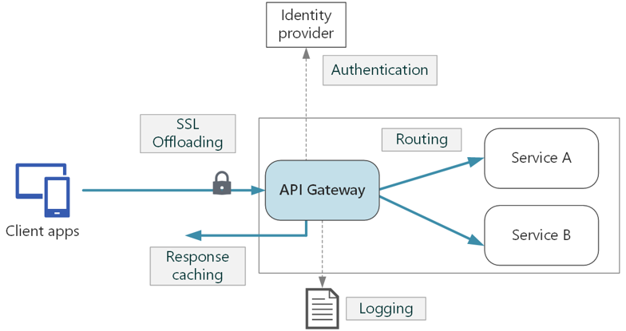

---
marp: true
theme: gaia
_class: lead
footer: QCN
paginate: true
backgroundColor: #fff
---

<style>
:root {
  font-family: Pretendard;
  --border-color: #303030;
  --text-color: #0a0a0a;
  --bg-color-alt: #dadada;
  --mark-background: #ffef92;
}

h1 {
  border-bottom: none;
  font-size: 1.6em;
}

h2 {
  border-bottom: none;
  font-size: 1.3em;
}

h3 {
  font-size: 1.1em;
}

h4 {
  font-size: 1.05em;
}

h5 {
  font-size: 1em;
}

h6 {
  font-size: 0.9em;
}

h1,
h2,
h3,
h4,
h5,
h6 {
  color: var(--text-color);
}

code:not([class*="language-"]) {
  font-family: D2Coding;
  color: #000;
  vertical-align: text-bottom;
  background-color: rgba(100, 100, 100, 0.2);
}

section {
  padding: 1rem;
  border-bottom: 1px solid #000;
  background-image: linear-gradient(to bottom right, #f7f7f7 0%, #d3d3d3 100%);
}

section > h2 {
  border-bottom: 4px solid #17344f;
}

section table {
    margin: auto;
    margin-top: 1rem;
    font-size: 28px;
}

section::after {
  font-size: 0.75em;
  content: attr(data-marpit-pagination) " / " attr(data-marpit-pagination-total);
}

img[alt~="center"] {
  display: block;
  margin: 0 auto;
}

blockquote {
  font-size: 26px;
  border-left: 8px solid var(--border-color);
  background: var(--bg-color-alt);
  margin: 0.5em;
  padding: 0.5em;
}

blockquote::before,
blockquote::after {
    content: '';
}

mark {
  background-color: var(--mark-background);
  padding: 0 2px 2px;
  border-radius: 4px;
  margin: 0 2px;
}

section.tinytext>p,
section.tinytext>ul,
section.tinytext>blockquote {
  font-size: 0.65em;
}

/* Long examples are paginated; keep reference text readable. */
section.reference-page { justify-content: flex-start; }
section.reference-page pre,
section.reference-page marp-pre,
section.reference-page pre code,
section.reference-page marp-pre code { font-size: 24px; line-height: 1.25; }
section.reference-page table { font-size: 25px; }
section.reference-page img { max-height: 440px; max-width: 100%; object-fit: contain; }
</style>

# HandStack API 사용하기

transact 계약의 식별자·권한·입출력을 읽고 같은 엔드포인트로 거래를 호출합니다.


<!--
발표: 첫 화면의 목표를 말한 뒤 핵심 개념과 예제로 진행합니다. 확인 질문 뒤에는 답할 시간을 주고, 마지막 완료 기준을 남겨 질문을 받습니다.
발표 구성 참고: MIT OpenCourseWare, Patrick Winston, How to Speak (2018), https://ocw.mit.edu/courses/res-tll-005-how-to-speak-january-iap-2018/pages/how-to-speak/
-->

---

## 전달하려는 주요 내용

- `transact` 모듈의 업무 계약(Contract)에 따라 클라이언트의 요청을 처리하는 방법을 알아봅니다.

- 데이터 요청을 검증하고, 중계하여 정확한 응답을 전달하도록 설정하는 과정을 실습합니다.

- HandStack이 어떻게 개발 생산성을 높이는지 직접 확인합니다.

---

## `transact` 모듈이란? (1/2)

<!-- _class: reference-page -->


HandStack에서 비즈니스 로직의 핵심 관문 역할을 하는 모듈입니다.

- <mark>공통 실행 엔드포인트</mark>
    - 같은 HTTP POST 주소에서 요청의 식별자로 업무 계약을 찾아 실행합니다. 계약마다 별도 URL을 만들지 않습니다.

---

## `transact` 모듈이란? (2/2)

<!-- _class: reference-page -->


- <mark>주요 기능</mark>
    - 요청 데이터 검증 (Validation)
    - 실행 허가 (Authorization)
    - 응답 정보 캐싱 (Caching)
    - 실행 상태 모니터링 (Monitoring)
    - 실행 과정 로깅 (Logging)
    - `dbclient`, `function` 등 다른 모듈로 이벤트 라우팅

---

## 거래 데이터 흐름 (1/2)

<!-- _class: reference-page -->


모든 거래 요청은 단 하나의 Endpoint로 수신합니다.

---

## 거래 데이터 흐름 (2/2)

<!-- _class: reference-page -->




---

## 계약(Contract) 문서 살펴보기 (1/3)

<!-- _class: reference-page -->


`transact` 모듈은 모든 것을 이 계약 문서에 기반하여 처리합니다.

---

## 계약(Contract) 문서 살펴보기 (2/3)

<!-- _class: reference-page -->


```json
{
    "ApplicationID": "HDS",
    "ProjectID": "TST",
    "TransactionID": "TST010",
    "Services": [
        {
            "ServiceID": "LD01",
            "Authorize": false,
            "Roles": [ "Administrator", "Master" ],
            "Policys": { "ApplicationRoleID": [ "Bot" ] },
            "ReturnType": "Json",
            "CommandType": "D",
            "SequentialOption": [...],
            "AccessScreenID": [ "TST010" ],
```

<!-- 이어지는 코드 조각입니다. 앞뒤 페이지를 순서대로 읽으며 전체 예제의 일부임을 설명합니다. -->

---

## 계약(Contract) 문서 살펴보기 (3/3)

<!-- _class: reference-page -->


```json
            "TransactionScope": false,
            "Inputs": [ { "ModelID": "Dynamic", "Type": "Row", ... } ],
            "Outputs": [ { "ModelID": "Dynamic", "Type": "Grid" } ]
        }
    ]
}
```

<!-- 이어지는 코드 조각입니다. 앞뒤 페이지를 순서대로 읽으며 전체 예제의 일부임을 설명합니다. -->

---

## 계약(Contract) 문서 해부하기 (1/2) · 세부 1/2

<!-- _class: reference-page -->


- `ApplicationID`, `ProjectID`, `TransactionID`
    - `HDS` 앱의 `TST` 프로젝트에 속한 `TST010` 거래를 의미합니다.

- ServiceID: `TST010` 거래 내에서 `LD01`이라는 서비스 ID로 요청을 식별합니다.

- Authorize: 인증 요구 여부입니다. 예제의 false와 서버의 공개 거래 정책을 함께 확인합니다.

---

## 계약(Contract) 문서 해부하기 (1/2) · 세부 2/2

<!-- _class: reference-page -->


- CommandType: D, F
    - D: 데이터베이스 관련 명령을 수행합니다.
    - F: 함수 관련 명령을 수행합니다.

---

## 계약(Contract) 문서 해부하기 (2/2)

- Roles: 인증 토큰에서 프로그램 역할(보안 레벨)에 해당되는 지 확인합니다.
- Policys: 인증 토큰에서 업무 정책(실행 권한)에 포함되는 지 확인합니다.
- AccessScreenID: 특정 화면 ID에서만 접근을 허용합니다.
- SequentialOption: 여러 거래를 순차적으로 한번에 수행합니다.
- Inputs: 여러 요청을 처리하는 정보를 포함하는 배열입니다.
- Outputs: 여러 응답을 처리하는 정보를 포함하는 배열입니다.

---

## 설계 사상: 책임의 분리 (1/2)

<!-- _class: reference-page -->


`transact` 모듈은 역할과 책임(R&R)이 분리된 구조를 지향합니다.

- <mark>화면 개발</mark>
    - 계약에 정의된 API 명세에 따라 입/출력 데이터만 처리

- <mark>운영 담당</mark>
    - 계약의 실행 권한, 로깅, 모니터링 등 시스템 운영에 집중

- <mark>업무 개발</mark>
    - 계약에 연결될 실제 비즈니스 로직(DB 쿼리, Function 등) 개발에 집중

---

## 설계 사상: 책임의 분리 (2/2)

<!-- _class: reference-page -->


더 알아보기: [계약 중심 거래](https://handstack.kr/docs/reference/concept/계약-중심-거래#요청-거래-전문정보)

---

## 핸즈온: 계약 목록 조회하고 정보 확인하기 (1/2) · 세부 1/3

<!-- _class: reference-page -->


관리 API 실습은 로컬·격리 환경에서만 수행합니다. 예제 키와 `*` 허용 범위를 운영에 복사하지 않습니다.

transact 모듈의 module.json에서 허용한 클라이언트만 호출합니다.


---

## 핸즈온: 계약 목록 조회하고 정보 확인하기 (1/2) · 세부 2/3

<!-- _class: reference-page -->


- AuthorizationKey: 기본값 (SystemID + RunningEnvironment + HostName == HANDSTACKDHOSTNAME)

- AllowClientIP: *

---

## 핸즈온: 계약 목록 조회하고 정보 확인하기 (1/2) · 세부 3/3

<!-- _class: reference-page -->


```http
# `transact` 모듈이 관리하는 계약 목록 정보를 조회하는 기본 API입니다.
http://localhost:8421/transact/api/transaction/meta
```

---

## 핸즈온: 계약 목록 조회하고 정보 확인하기 (2/2)

<!-- _class: reference-page -->


```http
# 특정 계약 상세 정보를 조회하는 기본 API입니다.
http://localhost:8421/transact/api/transaction/retrieve?applicationID=HDS&projectID=TST&transactionID=TST010
```

---

## 잠깐, 구분해 보기

계약을 추가할 때마다 새 URL도 생길까요?

<!--
질문 후 잠시 기다립니다. 답이 없으면 앞에서 본 예제를 다시 가리킵니다.
확인할 답: 공통 실행 URL에 계약 식별자를 보냅니다. 거래별 URL을 새로 만드는 구조와 구분합니다.
다음 주제로 넘어가기 전에 차이를 청중의 표현으로 한 번 확인합니다.
-->

---

## 핸즈온: 데이터 연동 실습 (1/2)

<!-- _class: reference-page -->


이제 직접 화면과 서버의 데이터 연동 과정을 체험해 봅시다.

- 1단계: 페이지 자바스크립트 파일에 거래(transaction) 함수 정의하기

- 2단계: HTML 요소에 `syn-datafield` 속성으로 데이터 Key 연결하기

- 3단계: 조회 버튼에 `onclick` 이벤트를 연결하여 거래 함수 호출하기

- 4단계: `beforeTransaction` Hook으로 조회 전 조건을, `afterTransaction` Hook으로 조회 후 결과를 확인하기

---

## 핸즈온: 데이터 연동 실습 (2/2)

<!-- _class: reference-page -->


- 5단계: 브라우저에서 버튼을 클릭하고 개발자 도구(F12) 네트워크 탭에서 실제 통신 데이터 확인하기

---

## 결과 확인 및 장점

같은 실행 주소에 거래 식별자를 보내면 계약이 실행 대상과 입출력을 결정합니다. 별도 Controller를 반복 작성하는 작업을 줄일 수 있습니다.

- 이제 우리는 `http://localhost:8421/transact/api/transaction/execute` 주소로 `TST010` 거래를 요청할 수 있는 준비가 완료되었습니다.

---

## API 연동의 완료 기준

- ApplicationID·ProjectID·TransactionID·ServiceID를 맞춥니다.
- 권한·입출력·CommandType과 연결된 실행 계약을 확인합니다.
- Network 요청과 응답으로 화면 바인딩 결과를 검증합니다.

<!--
질문을 받는 동안 이 확인 기준을 화면에 남깁니다. 청중이 자신의 업무에 적용할 다음 행동 하나를 고르게 합니다.
-->
