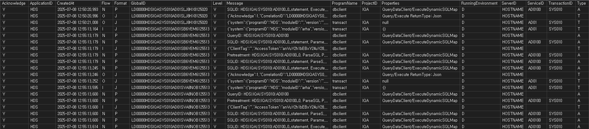

---
marp: true
theme: gaia
_class: lead
footer: QCN
paginate: true
backgroundColor: #fff
---

<style>
:root {
  font-family: Pretendard;
  --border-color: #303030;
  --text-color: #0a0a0a;
  --bg-color-alt: #dadada;
  --mark-background: #ffef92;
}

h1 {
  border-bottom: none;
  font-size: 1.6em;
}

h2 {
  border-bottom: none;
  font-size: 1.3em;
}

h3 {
  font-size: 1.1em;
}

h4 {
  font-size: 1.05em;
}

h5 {
  font-size: 1em;
}

h6 {
  font-size: 0.9em;
}

h1,
h2,
h3,
h4,
h5,
h6 {
  color: var(--text-color);
}

code:not([class*="language-"]) {
  font-family: D2Coding;
  color: #000;
  vertical-align: text-bottom;
  background-color: rgba(100, 100, 100, 0.2);
}

section {
  padding: 1rem;
  border-bottom: 1px solid #000;
  background-image: linear-gradient(to bottom right, #f7f7f7 0%, #d3d3d3 100%);
}

section > h2 {
  border-bottom: 4px solid #17344f;
}

section table {
    margin: auto;
    margin-top: 1rem;
    font-size: 28px;
}

section::after {
  font-size: 0.75em;
  content: attr(data-marpit-pagination) " / " attr(data-marpit-pagination-total);
}

img[alt~="center"] {
  display: block;
  margin: 0 auto;
}

blockquote {
  font-size: 26px;
  border-left: 8px solid var(--border-color);
  background: var(--bg-color-alt);
  margin: 0.5em;
  padding: 0.5em;
}

blockquote::before,
blockquote::after {
    content: '';
}

mark {
  background-color: var(--mark-background);
  padding: 0 2px 2px;
  border-radius: 4px;
  margin: 0 2px;
}

section.tinytext>p,
section.tinytext>ul,
section.tinytext>blockquote {
  font-size: 0.65em;
}
</style>

# 거래 로그 데이터베이스 설정하기

### SQL Server 기반의 거래 로그 설정하기

---

## 데이터베이스 사용자 추가

예를 들어 다음과 같이 SQL Server에 거래 로그를 저장할 권한이 있는 사용자 추가

- 사용자 ID: dev
- 비밀번호: qlalfqjsgh

---

## 데이터베이스 생성 및 연결문자열 작성

- SQL Server에 거래 로그를 저장할 데이터베이스를 원하는 이름으로 생성
- HandStack_Log 명으로 데이터베이스를 생성할 경우 연결문자열

> Data Source=[호스트 명 또는 IP];TrustServerCertificate=True;Initial Catalog=HandStack_Log;User ID=[사용자 ID];Password=[비밀번호];Pooling=true;

---

## HandStack_Log 데이터베이스 사용자 매핑

- dev 사용자의 로그인 속성에서 HandStack_Log 데이터베이스를 매핑
- 데이터베이스 역할 멤버 자격을 db_owner 로 체크

---

## logger 모듈의 module.json 설정에 연결문자열 추가

거래 로그를 저장하기 위한 설정정보를 다음과 같이 추가 합니다.

$(HANDSTACK_HOME)/modules/logger/module.json

```json
"DataSource": [
    {
        "ApplicationID": "HDS",
        "TableName": "HandStack_Log",
        "DataProvider": "SqlServer",
        "RemovePeriod": -30,
        "ConnectionString": "Data Source=[호스트 명 또는 IP];TrustServerCertificate=True;Initial Catalog=HandStack_Log;User ID=[사용자 ID];Password=[비밀번호];Pooling=true;",
        "IsEncryption": "N"
    }
]
```

---

## dbclient 모듈의 module.json 설정에 연결문자열 추가

거래 로그 업무화면과 같이 관리 화면을 개발하려면 다음과 같이 연결문자열을 추가 해야합니다.

$(HANDSTACK_HOME)/modules/dbclient/module.json

```json
"DataSource": [
    ...
    {
        "ApplicationID": "HDS",
        "ProjectID": "*",
        "DataSourceID": "DB02",
        "DataProvider": "SqlServer",
        "ConnectionString": "Data Source=[호스트 명 또는 IP];TrustServerCertificate=True;Initial Catalog=HandStack_Log;User ID=[사용자 ID];Password=[비밀번호];Pooling=true;",
        "IsEncryption": "N",
        "Comment": "HandStack 거래 로그 데이터베이스"
    }
]
```

---

## logger DDL, DML 쿼리

연결문자열이 설정 후에 logger 모듈이 로드되면 데이터베이스에 테이블이 생성되며, 데이터베이스에 따라 기본 제공되는 쿼리가 실행되며 거래 로그를 관리합니다.

$(HANDSTACK_HOME)/modules/logger/SQL

- Create
- Delete
- Get
- Insert
- List

---

## 거래 로그 테이블 스키마

<style scoped>
  table {font-size: 16px;}
</style>

| 컬럼명 | 데이터 타입 | 길이 | Null 유무 | 설명 |
|---|---|:---:|:---:|---|
| LogNo | int | -1 | NO | 로그 번호 (고유 식별자) |
| Acknowledge | nvarchar | 1 | YES | 승인 여부 (예: Y/N) |
| ApplicationID | nvarchar | 36 | YES | 애플리케이션 고유 ID |
| CreatedAt | nvarchar | 50 | YES | 로그 생성 시간 |
| Flow | nvarchar | 1 | YES | 트랜잭션 흐름 또는 단계 |
| Format | nvarchar | 1 | YES | 데이터 형식 또는 메시지 형식 |
| GlobalID | nvarchar | 50 | YES | 전역 고유 식별자 |
| Level | nvarchar | 1 | YES | 로그 레벨 (예: 정보, 경고, 에러) |
| Message | nvarchar | -1 | YES | 로그 메시지 내용 |
| ProgramName | nvarchar | 50 | YES | 로그를 생성한 프로그램 이름 |
| ProjectID | nvarchar | 36 | YES | 프로젝트 고유 ID |
| Properties | nvarchar | -1 | YES | 추가 속성 또는 메타데이터 (JSON 등) |
| RunningEnvironment | nvarchar | 1 | YES | 실행 환경 (예: 개발, 테스트, 운영) |
| ServerID | nvarchar | 30 | YES | 서버 고유 ID |
| ServiceID | nvarchar | 36 | YES | 서비스 고유 ID |
| TransactionID | nvarchar | 36 | YES | 트랜잭션 고유 ID |
| Type | nvarchar | 1 | YES | 로그 유형 |
| UserID | nvarchar | 36 | YES | 사용자 고유 ID |

---

## 업무 모듈에서 거래 로그 기록 설정하기

다음의 모듈의 주요 흐름에서 거래 데이터를 기록합니다.

- dbclient
- transact
- prompter
- function

```json
{
  "IsLogServer": true,
  "LogServerUrl": "http://localhost:8421/logger/api/log/insert",
}
```

---

## 거래 로그 기록 확인하기

GlobalID 기준으로 필터 검색을 하거나 최대 500 건의 데이터를 조회하도록 권장합니다.

```sql
DECLARE @GlobalID VARCHAR(36) = '';

SELECT TOP 500 *
FROM TransactLog AS TL
WHERE
  CASE WHEN @GlobalID = '' THEN @GlobalID ELSE TL.GlobalID END = @GlobalID
```
<style scoped>
  img {width: 100%}
</style>



---

## 요약 정리 및 Q&A

- 데이터베이스 사용자 및 연결 설정
- HandStack 모듈 설정 파일 업데이트
- 거래 로그 테이블 및 쿼리 관리
- 업무 모듈에서 거래 로그 기록 설정
- 거래 로그 기록 확인