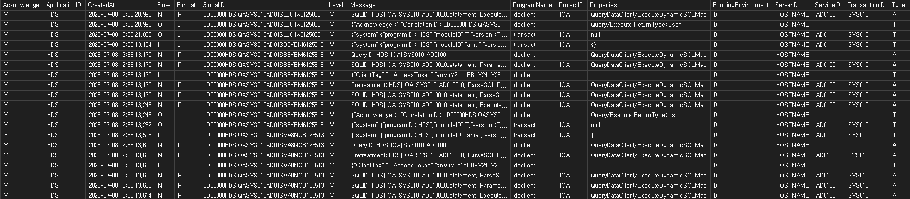

---
marp: true
theme: gaia
_class: lead
footer: QCN
paginate: true
backgroundColor: #fff
---

<style>
:root {
  font-family: Pretendard;
  --border-color: #303030;
  --text-color: #0a0a0a;
  --bg-color-alt: #dadada;
  --mark-background: #ffef92;
}

h1 {
  border-bottom: none;
  font-size: 1.6em;
}

h2 {
  border-bottom: none;
  font-size: 1.3em;
}

h3 {
  font-size: 1.1em;
}

h4 {
  font-size: 1.05em;
}

h5 {
  font-size: 1em;
}

h6 {
  font-size: 0.9em;
}

h1,
h2,
h3,
h4,
h5,
h6 {
  color: var(--text-color);
}

code:not([class*="language-"]) {
  font-family: D2Coding;
  color: #000;
  vertical-align: text-bottom;
  background-color: rgba(100, 100, 100, 0.2);
}

section {
  padding: 1rem;
  border-bottom: 1px solid #000;
  background-image: linear-gradient(to bottom right, #f7f7f7 0%, #d3d3d3 100%);
}

section > h2 {
  border-bottom: 4px solid #17344f;
}

section table {
    margin: auto;
    margin-top: 1rem;
    font-size: 28px;
}

section::after {
  font-size: 0.75em;
  content: attr(data-marpit-pagination) " / " attr(data-marpit-pagination-total);
}

img[alt~="center"] {
  display: block;
  margin: 0 auto;
}

blockquote {
  font-size: 26px;
  border-left: 8px solid var(--border-color);
  background: var(--bg-color-alt);
  margin: 0.5em;
  padding: 0.5em;
}

blockquote::before,
blockquote::after {
    content: '';
}

mark {
  background-color: var(--mark-background);
  padding: 0 2px 2px;
  border-radius: 4px;
  margin: 0 2px;
}

section.tinytext>p,
section.tinytext>ul,
section.tinytext>blockquote {
  font-size: 0.65em;
}

/* Long examples are paginated; keep reference text readable. */
section.reference-page { justify-content: flex-start; }
section.reference-page pre,
section.reference-page marp-pre,
section.reference-page pre code,
section.reference-page marp-pre code { font-size: 24px; line-height: 1.25; }
section.reference-page table { font-size: 25px; }
</style>

# 거래 로그 데이터베이스 설정하기

SQL Server 로그 DB와 모듈 설정을 연결하고, GlobalID로 한 거래를 찾습니다.


<!--
발표: 첫 화면의 목표를 말한 뒤 핵심 개념과 예제로 진행합니다. 확인 질문 뒤에는 답할 시간을 주고, 마지막 완료 기준을 남겨 질문을 받습니다.
발표 구성 참고: MIT OpenCourseWare, Patrick Winston, How to Speak (2018), https://ocw.mit.edu/courses/res-tll-005-how-to-speak-january-iap-2018/pages/how-to-speak/
-->

---

## 데이터베이스 사용자 추가

예를 들어 다음과 같이 SQL Server에 거래 로그를 저장할 권한이 있는 사용자 추가

- 사용자 ID 예시: `dev` — 운영에서는 로그 전용 계정을 사용합니다.
- 비밀번호: 환경별 비밀 저장소에서 주입하고 문서·소스에 기록하지 않습니다.

---

## 데이터베이스 생성 및 연결문자열 작성

- SQL Server에 거래 로그를 저장할 데이터베이스를 원하는 이름으로 생성
- HandStack_Log 명으로 데이터베이스를 생성할 경우 연결문자열

> Data Source=[호스트 명 또는 IP];TrustServerCertificate=True;Initial Catalog=HandStack_Log;User ID=[사용자 ID];Password=[비밀번호];Pooling=true;

---

## HandStack_Log 데이터베이스 사용자 매핑

- dev 사용자의 로그인 속성에서 HandStack_Log 데이터베이스를 매핑
- 초기 테이블 생성에 필요한 DDL 권한과 평상시 로그 쓰기·조회 권한을 분리합니다.
- `db_owner`를 쓰는 초기 실습은 격리된 DB로 제한하고, 운영 계정에는 필요한 권한만 부여합니다.

---

## logger 모듈의 module.json 설정에 연결문자열 추가 (1/2)

<!-- _class: reference-page -->


거래 로그 저장소를 지정합니다. 예제 연결문자열의 계정·비밀번호를 실제 환경의 값으로 바꾸고 접근 권한을 제한합니다.

$(HANDSTACK_HOME)/modules/logger/module.json

---

## logger 모듈의 module.json 설정에 연결문자열 추가 (2/2)

<!-- _class: reference-page -->


```json
"DataSource": [
    {
        "ApplicationID": "HDS",
        "TableName": "TransactLog",
        "DataProvider": "SqlServer",
        "RemovePeriod": -30,
        "ConnectionString": "Data Source=[호스트 명 또는 IP];TrustServerCertificate=True;Initial Catalog=HandStack_Log;User ID=[사용자 ID];Password=[비밀번호];Pooling=true;",
        "IsEncryption": "N"
    }
]
```

---

## dbclient 모듈의 module.json 설정에 연결문자열 추가 (1/2)

<!-- _class: reference-page -->


거래 로그 업무화면과 같이 관리 화면을 개발하려면 다음과 같이 연결문자열을 추가 해야합니다.

$(HANDSTACK_HOME)/modules/dbclient/module.json

---

## dbclient 모듈의 module.json 설정에 연결문자열 추가 (2/2)

<!-- _class: reference-page -->


```json
"DataSource": [
    ...
    {
        "ApplicationID": "HDS",
        "ProjectID": "*",
        "DataSourceID": "DB02",
        "DataProvider": "SqlServer",
        "ConnectionString": "Data Source=[호스트 명 또는 IP];TrustServerCertificate=True;Initial Catalog=HandStack_Log;User ID=[사용자 ID];Password=[비밀번호];Pooling=true;",
        "IsEncryption": "N",
        "Comment": "HandStack 거래 로그 데이터베이스"
    }
]
```

---

## logger DDL, DML 쿼리 (1/2)

<!-- _class: reference-page -->


연결문자열이 설정 후에 logger 모듈이 로드되면 데이터베이스에 테이블이 생성되며, 데이터베이스에 따라 기본 제공되는 쿼리가 실행되며 거래 로그를 관리합니다.

$(HANDSTACK_HOME)/modules/logger/SQL

- Create

- Delete

- Get

---

## logger DDL, DML 쿼리 (2/2)

<!-- _class: reference-page -->


- Insert

- List

---

## 거래 로그 테이블 스키마 (1/3)

<!-- _class: reference-page -->


| 컬럼명 | 데이터 타입 | 길이 | Null 유무 | 설명 |
|---|---|:---:|:---:|---|
| LogNo | int | -1 | NO | 로그 번호 (고유 식별자) |
| Acknowledge | nvarchar | 1 | YES | 승인 여부 (예: Y/N) |
| ApplicationID | nvarchar | 32 | YES | 애플리케이션 고유 ID |
| Flow | nvarchar | 1 | YES | 트랜잭션 흐름 또는 단계 |
| Format | nvarchar | 1 | YES | 데이터 형식 또는 메시지 형식 |
| GlobalID | nvarchar | 50 | YES | 전역 고유 식별자 |
| Level | nvarchar | 1 | YES | 로그 레벨 (예: 정보, 경고, 에러) |

---

## 거래 로그 테이블 스키마 (2/3)

<!-- _class: reference-page -->


| 컬럼명 | 데이터 타입 | 길이 | Null 유무 | 설명 |
|---|---|:---:|:---:|---|
| Message | nvarchar | -1 | YES | 로그 메시지 내용 |
| ProgramName | nvarchar | 50 | YES | 로그를 생성한 프로그램 이름 |
| ProjectID | nvarchar | 32 | YES | 프로젝트 고유 ID |
| Properties | nvarchar | -1 | YES | 추가 속성 또는 메타데이터 (JSON 등) |
| RunningEnvironment | nvarchar | 1 | YES | 실행 환경 (예: 개발, 테스트, 운영) |
| ServerID | nvarchar | 30 | YES | 서버 고유 ID |
| ServiceID | nvarchar | 32 | YES | 서비스 고유 ID |

---

## 거래 로그 테이블 스키마 (3/3)

<!-- _class: reference-page -->


| 컬럼명 | 데이터 타입 | 길이 | Null 유무 | 설명 |
|---|---|:---:|:---:|---|
| TransactionID | nvarchar | 32 | YES | 트랜잭션 고유 ID |
| Type | nvarchar | 1 | YES | 로그 유형 |
| UserID | nvarchar | 32 | YES | 사용자 고유 ID |
| CreatedAt | datetime2 | -1 | YES | 로그 생성 시간 |
| IpAddress | varchar | 50 | YES | 요청자 IP 주소 |
| DeviceID | varchar | 64 | YES | 단말 고유 ID |
| ProgramID | varchar | 50 | YES | 프로그램 고유 ID |

---

## 업무 모듈에서 거래 로그 기록 설정하기

다음의 모듈의 주요 흐름에서 거래 데이터를 기록합니다.

- dbclient
- transact
- function

```json
{
  "IsLogServer": true,
  "LogServerUrl": "http://localhost:8421/logger/api/log/insert",
}
```

---

## 잠깐, 구분해 보기

로그 DB 연결만 만들면 모든 모듈의 거래가 기록될까요?

<!--
질문 후 잠시 기다립니다. 답이 없으면 앞에서 본 예제를 다시 가리킵니다.
확인할 답: logger 저장소와 dbclient·transact·function의 기록 설정을 함께 확인합니다.
다음 주제로 넘어가기 전에 차이를 청중의 표현으로 한 번 확인합니다.
-->

---

## 거래 로그 기록 확인하기 (1/2)

<!-- _class: reference-page -->

<style scoped>
  img {width: 100%}
</style>

`GlobalID`로 한 거래를 찾습니다. 넓게 조회할 때는 예를 들어 500건으로 제한합니다.

> 로그의 요청·응답에는 개인정보나 토큰이 포함될 수 있습니다. 공유 전에 마스킹하고 보관 기간을 정합니다.

```sql
DECLARE @GlobalID VARCHAR(36) = '';

SELECT TOP 500 *
FROM TransactLog AS TL
WHERE
  CASE WHEN @GlobalID = '' THEN @GlobalID ELSE TL.GlobalID END = @GlobalID
```

---

## 거래 로그 기록 확인하기 (2/2)

<!-- _class: reference-page -->

<style scoped>
  img {width: 100%}
</style>



---

## 로그 설정의 완료 기준

- 로그 저장 계정과 DB·테이블 생성 권한을 구분합니다.
- logger와 업무 모듈의 설정을 대조합니다.
- GlobalID로 로그를 찾고 보관 기간·민감정보 노출을 확인합니다.

<!--
질문을 받는 동안 이 확인 기준을 화면에 남깁니다. 청중이 자신의 업무에 적용할 다음 행동 하나를 고르게 합니다.
-->
