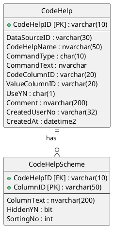

<style>
:root {
  font-family: Pretendard;
  --border-color: #303030;
  --text-color: #0a0a0a;
  --bg-color-alt: #dadada;
  --mark-background: #ffef92;
}

h1 {
  border-bottom: none;
  font-size: 1.6em;
}

h2 {
  border-bottom: none;
  font-size: 1.3em;
}

h3 {
  font-size: 1.1em;
}

h4 {
  font-size: 1.05em;
}

h5 {
  font-size: 1em;
}

h6 {
  font-size: 0.9em;
}

h1,
h2,
h3,
h4,
h5,
h6 {
  color: var(--text-color);
}

code:not([class*="language-"]) {
  font-family: D2Coding;
  color: #000;
  vertical-align: text-bottom;
  background-color: rgba(100, 100, 100, 0.2);
}

section {
  background-image: linear-gradient(to bottom right, #f7f7f7 0%, #d3d3d3 100%);
}

section table {
    margin: auto;
    font-size: 28px;
}

section::after {
  font-size: 0.75em;
  content: attr(data-marpit-pagination) " / " attr(data-marpit-pagination-total);
}

img[alt~="center"] {
  display: block;
  margin: 0 auto;
}

blockquote {
  font-size: 26px;
  border-left: 8px solid var(--border-color);
  background: var(--bg-color-alt);
  margin: 0.5em;
  padding: 0.5em;
}

blockquote::before,
blockquote::after {
    content: '';
}

mark {
  background-color: var(--mark-background);
  padding: 0 2px 2px;
  border-radius: 4px;
  margin: 0 2px;
}

section.tinytext>p,
section.tinytext>ul,
section.tinytext>blockquote {
  font-size: 0.65em;
}
</style>


# CSV 파일로 데이터 모델 관리하기

### LLM과 PlantUML을 활용한 ERD 생성

---

### 학습 목표

CSV(Comma-Separated Values) 형식의 파일을 사용하여 데이터베이스 모델을 간단하게 정의하고, 이 정보를 바탕으로 <mark>ERD(Entity-Relationship Diagram)</mark> 이미지를 생성하는 방법을 배웁니다.

-   CSV 파일 헤더를 특정 규칙에 맞게 구성하여 테이블 구조를 정의합니다.
-   정의된 모델 정보를 LLM Chat에 전달하여 PlantUML 코드를 생성합니다.
-   PlantUML 웹 에디터에서 ERD를 시각화하고 이미지로 저장합니다.

---

### 1. 데이터 모델 정의하기 (CSV)

테이블과 컬럼 정보를 CSV 형식으로 정의합니다. 헤더는 `TableName`, `ColumnName`, `DataType`, `Length`, `Nullable`, `ColumnDescription` 으로 구성합니다.

-   `CodeHelp` 테이블 정의 예시

```csv
"TableName","ColumnName","DataType","Length","Nullable","ColumnDescription"
CodeHelp,CodeHelpID,varchar,"10",NO,코드헬프ID
CodeHelp,DataSourceID,varchar,"30",NO,데이터원본ID
CodeHelp,CodeHelpName,nvarchar,"50",YES,코드헬프명
CodeHelp,CommandType,char,"10",YES,명령구분(기초코드: PGM002)
CodeHelp,CommandText,nvarchar,-1,YES,SQL 명령
CodeHelp,CodeColumnID,varchar,"20",YES,코드컬럼ID
CodeHelp,ValueColumnID,varchar,"20",YES,값컬럼ID
CodeHelp,UseYN,char,"1",YES,사용여부
CodeHelp,Comment,nvarchar,"200",YES,설명
CodeHelp,CreatedUserNo,varchar,"32",YES,작성자ID
CodeHelp,CreatedAt,datetime2,-1,YES,작성일시
```

---

### 1. 데이터 모델 정의하기 (CSV)

-   `CodeHelpScheme` 테이블 정의 예시

```csv
"TableName","ColumnName","DataType","Length","Nullable","ColumnDescription"
CodeHelpScheme,CodeHelpID,varchar,"10",NO,코드헬프ID
CodeHelpScheme,ColumnID,varchar,"50",NO,컬럼ID
CodeHelpScheme,ColumnText,nvarchar,"200",YES,컬럼명
CodeHelpScheme,HiddenYN,bit,-1,YES,숨김여부
CodeHelpScheme,SortingNo,int,-1,YES,정렬순서
```

---

### 2. 데이터 모델 관계 설정

PlantUML에서는 간단한 기호로 테이블 간의 관계를 표현할 수 있습니다. `CodeHelp`와 `CodeHelpScheme`는 1:N 관계를 가집니다.

-   관계 표현 방식
    -   `--` : 기본 관계선
    -   `..` : 점선 관계선
    -   `--o{` : N 관계 (Many)
    -   `||--` : 1 관계 (One)

-   관계 정의
    -   `CodeHelp ||--o{ CodeHelpScheme : "1:N 관계"`

---

### 3. LLM Chat을 이용한 PlantUML 코드 생성

정의한 CSV 데이터와 관계 정보를 LLM Chat에 전달하여 ERD 코드를 요청합니다.

-   질문 예시

> CSV 구조로 되어있는 데이터 모델 정보를 참고해서 CodeHelp 와 CodeHelpScheme 테이블의 간의 관계를 PlantUML ERD 로 만들어줘

---

### 4. PlantUML로 ERD 생성 및 확인

-   웹 브라우저에서 PlantUML 온라인 에디터로 이동합니다.
    -   URL: `https://editor.plantuml.com`

-   LLM이 생성해준 PlantUML 코드를 에디터에 붙여넣습니다.
-   실시간으로 생성된 ERD를 확인하고, 원하는 형식(PNG, SVG 등)의 이미지로 다운로드합니다.

---
<!-- _class: tinytext -->
### PlantUML 코드 결과 예시

아래는 LLM이 생성한 PlantUML 코드 예시입니다. 이 코드를 에디터에 입력하면 ERD가 그려집니다.



---

### 핸즈온 활동 요약

오늘 우리는 간단한 실습을 통해 데이터 모델을 효율적으로 관리하는 방법을 배웠습니다.

-   <mark>CSV 파일</mark>로 데이터 구조를 명확하게 정의했습니다.
-   <mark>간단한 표기법</mark>으로 테이블 간의 관계를 설정했습니다.
-   <mark>LLM과 PlantUML</mark>을 활용하여 ERD 이미지를 자동으로 생성했습니다.

---

### 데이터베이스 SQL 바이브 코딩

- 마이그레이션 실행 및 데이터베이스 테이블 확인
- 데이터 모델을 기반으로 실제 데이터베이스 테이블 생성
- 개발에 필요한 기본 SQL 쿼리 자동 생성

---

### SQL Server 테이블 스키마를 참고해서

```sql
SELECT C.TABLE_NAME AS TableName,
    C.COLUMN_NAME AS ColumnName,
    C.DATA_TYPE AS DataType,
    ISNULL(C.CHARACTER_MAXIMUM_LENGTH, '-1') AS Length,
    C.IS_NULLABLE AS Nullable,
    EP.value AS ColumnDescription
FROM 
    INFORMATION_SCHEMA.COLUMNS AS C
	LEFT JOIN sys.extended_properties AS EP ON EP.major_id = OBJECT_ID(C.TABLE_SCHEMA + '.' + C.TABLE_NAME)
        AND ep.minor_id = (
            SELECT column_id 
            FROM sys.columns 
            WHERE object_id = OBJECT_ID(C.TABLE_SCHEMA + '.' + C.TABLE_NAME)
                AND name = C.COLUMN_NAME
        )
        AND EP.name = 'MS_Description'
ORDER BY C.TABLE_NAME,
	C.ORDINAL_POSITION;
```

---

### LLM 질문 예시

- `시스템 지침에 정의된 데이터 모델 정보를 참고해서 프로그램을 개발하기 위한 SQL Server 데이터베이스 기반의 데이터의 구조(스키마)를 정의하는 SQL 과 데이터를 조작(조회, 삽입, 수정, 삭제)하는 데 사용하는 SQL 을 만들어줘`
- `사용자 로그인에 필요한 SELECT 쿼리를 만들어줘`
- `사용자 로그인 후에 권한 별로 메뉴 정보를 조회하는 SELECT 쿼리를 만들어줘`

---

## 자동 생성된 SQL: 데이터 조작 (DML)

- HandStack은 테이블 구조(DDL)를 만드는 것에서 그치지 않고, 개발에 필요한 데이터 조작(DML) SQL도 자동으로 생성하여 `~/business/sql` 경로에 저장합니다.

- 이를 통해 개발자는 반복적인 CRUD SQL 작성 시간을 줄이고 비즈니스 로직에 더 집중할 수 있습니다.

- 예를 들어, 사용자 정보를 다루기 위한 기본적인 조회, 삽입, 수정, 삭제 쿼리가 자동으로 만들어집니다.

---

## 자동 생성 쿼리 예시: 사용자 로그인

- 다음은 `handstack migrate` 실행 시 자동으로 생성될 수 있는 사용자 로그인 처리를 위한 `SELECT` 쿼리 예시입니다.

```sql
-- ~/business/sql/default/Users/SelectLogin.sql

SELECT
    UserID,
    UserName,
    Email
FROM Users
WHERE UserID = @UserID
  AND Password = @Password -- 실제 구현 시에는 해시된 비밀번호를 비교해야 합니다.
  AND UseYn = 'Y';
```

---

## 자동 생성 쿼리 예시: 권한별 메뉴 조회

- 로그인한 사용자의 권한에 따라 접근 가능한 메뉴 목록을 조회하는 `SELECT` 쿼리 예시입니다.

```sql
-- ~/business/sql/default/Menus/SelectByRole.sql

SELECT
    C.MenuID,
    C.MenuName,
    C.ParentMenuID,
    C.MenuUrl
FROM UserRoles AS A
INNER JOIN RoleMenus AS B
    ON A.RoleID = B.RoleID
INNER JOIN Menus AS C
    ON B.MenuID = C.MenuID
WHERE A.UserID = @UserID
ORDER BY C.SortOrder;
```

---

## HandStack 마이그레이션의 장점

> CLI 명령 하나로 DB 테이블이 뚝딱! HandStack의 마이그레이션 기능 덕분에 개발자는 복잡한 SQL 쿼리 없이도 DB 스키마를 쉽게 관리할 수 있습니다.

- 개발 초기 단계의 설정 시간을 대폭 단축시킵니다.
- 데이터베이스 스키마 관리를 체계적이고 간편하게 만들어줍니다.
- 자동 생성된 쿼리를 기반으로 빠르게 기능 개발을 시작할 수 있습니다.
```